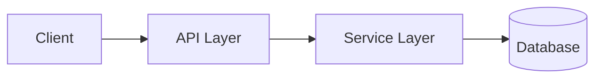

# Project Documentation System — AI-Agent Friendly

Creates a complete, production-grade documentation system where **documents are first-class citizens** and **AI agents can navigate, understand, and modify codebases safely**.

## Core Philosophy

**Three truths:**
1. **Repository is the single source of truth** — All architecture, constraints, and decisions live in the repo, not in someone's head or a wiki
2. **Documents are for AI agents first** — Write for agents who need to understand context before touching code
3. **Navigation > Content** — A well-organized doc system beats a comprehensive but scattered one

**Three-layer depth:** Hub → Guides → Reference (progressive disclosure)

**Lifecycle awareness:** Every doc has a home based on its stage (live/draft/archive)

---

## Skill Package Self-Containment

- Treat this directory as the complete portable skill package.
- Keep every required instruction, reference, script, and asset inside this directory and link it with a relative path.
- Never depend on the directory from which the skill was copied or on an undocumented machine-local file.
- Declare external tools only as explicit prerequisites, including installation and availability checks when a workflow needs them.
- Read `references/templates.md` when creating document scaffolds.
- Read `references/checklist.md` when auditing or validating a documentation system.

---

## Documentation System Structure

```
project/
├── AGENTS.md                          # P0: AI Agent navigation hub (≤120 lines)
├── README.md                          # P0: Human landing page
├── CONTRIBUTING.md                    # P0: Contribution guide (≤300 lines)
├── CHANGELOG.md                       # P1: Release history
├── docs/
│   ├── index.md                      # P1: Doc navigation hub + Mermaid tree
│   ├── ARCHITECTURE.md                # P1: System design + Mermaid diagrams
│   ├── DEVELOPMENT.md                 # P1: Dev setup + commands
│   ├── LAYERS.md                     # P1: Layer definitions + dependency matrix
│   ├── QUALITY.md                    # P1: Coding standards (auto-verifiable)
│   ├── HARNESS.md                    # P1: Verification pipeline
│   ├── GLOSSARY.md                   # P1: Business terms
│   ├── getting-started.md            # P2: Developer onboarding
│   ├── configuration.md              # P2: Config reference
│   ├── rest-api.md                   # P2: API documentation
│   ├── extension-guide.md            # P2: Extension development
│   ├── troubleshooting.md           # P2: Problem-solution pairs
│   ├── drafts/                       # Active design docs (iterated)
│   └── archive/                      # Historical snapshots (read-only)
│       └── README.md                 # Archive index
└── .agents/
    └── skills/                       # Shared AI agent skills (optional)
        └── <skill-name>/
            └── SKILL.md
```

---

## Priority Levels

| Priority | Documents | Target | Time |
|----------|-----------|--------|------|
| **P0** | AGENTS.md + README + CONTRIBUTING | ≤120/≤200/≤300 lines | 1-2 rounds |
| **P1** | ARCHITECTURE + DEVELOPMENT + LAYERS + QUALITY + HARNESS + index + CHANGELOG | 200-400 each | 1 round each |
| **P2** | getting-started + configuration + rest-api + extension + troubleshooting | 200-400 each | 1 round each |
| **P3** | archive management + GitHub templates | When needed | — |

---

## Root Directory Allowlist

Only these files may live at project root. Everything else → `docs/`:

| File | Status | Notes |
|------|--------|-------|
| `README.md` | Required | Human landing page |
| `CONTRIBUTING.md` | Optional | Contribution guide |
| `CHANGELOG.md` | Required | Release history (or use GitHub Releases) |
| `AGENTS.md` | Required | AI agent navigation (OpenClaw/Cursor) |
| `CLAUDE.md` | Compatibility | When `AGENTS.md` is authoritative, prefer a relative symlink to it; never maintain a duplicate agent-memory document |
| `SECURITY.md` | Optional | Security policy |
| `LICENSE` | Required | License file |
| `docker-compose.yml`, `Dockerfile` | Infra | Non-markdown OK |
| `.agents/skills/` | Optional | Shared, tool-neutral AI agent skills |

**Component-level READMEs are allowed:**
- `backend/README.md`, `frontend/README.md`, `sdk/README.md`

---

## Core Document Specifications

### README.md — Human Landing Page (P0)

**Target:** ≤200 lines.

```markdown
# {Project Name}

> {One-line description} | {Keywords} | {Tech stack}

[](LICENSE)

{2-3 sentences explaining value proposition.}

## Features

- ✨ **{Feature 1}**: {Brief}
- 🚀 **{Feature 2}**: {Brief}

## Quick Start

    # 1. Clone
    # 2. Configure
    # 3. Run

## Documentation

- [📖 English](docs/ARCHITECTURE.md) | [📖 中文](docs/ARCHITECTURE-zh-CN.md)
- [Getting Started](docs/getting-started.md)
- [API Reference](docs/rest-api.md)

## License

Apache 2.0
```

---

### AGENTS.md — AI Agent Navigation Hub (P0)

**Purpose:** Unified entry point for AI agents. Must answer: What is this? Where is everything? How do I safely modify code?

**Target:** ≤120 lines. "Map, not manual."

```markdown
# {Project Name} — Agent Navigation

## 1. Project Overview
- Type: (e.g., BFF API / SDK / Data pipeline)
- Tech stack: (languages, frameworks, key infra)
- Status: (PoC / dev / production)

## 2. Documentation Index
- [Architecture](docs/ARCHITECTURE.md)
- [Development Setup](docs/DEVELOPMENT.md)
- [Layer Constraints](docs/LAYERS.md)
- [Quality Standards](docs/QUALITY.md)
- [Verification Pipeline](docs/HARNESS.md)
- [Glossary](docs/GLOSSARY.md)

## 3. Quick Commands

    build:  <command>
    test:   <command>
    lint:   <command>
    verify: <command>

## 4. Module Overview

| Module | Path | Responsibility |
|--------|------|----------------|
| api | src/api/ | Interfaces + DTOs |
| core | src/core/ | Business logic |

## 5. Agent Constraints

- **DO NOT** modify: (critical paths)
- **ALWAYS** verify after: (database migrations, API changes)
- **BEFORE** changing: (read relevant ADR)

## 6. Maintenance

- New docs → update this file
- Doc issues → fix the doc, not this file
```

**Maintenance rule:** When adding new directories or core docs, update AGENTS.md immediately.

---

### docs/ARCHITECTURE.md — System Design (P1)

**Purpose:** Help agents understand "what does this change affect" without reading all code.

**Content:** System context, module responsibilities, data flow, key patterns.

```markdown
# Architecture Design

## System Context
Who uses this system? What external systems does it integrate with?

## Module Structure

| Module | Path | Responsibility |
|--------|------|----------------|

## Data Flow



## Core Patterns
Describe 2-4 key patterns with code examples.

## Key Design Decisions

| Decision | Choice | Rationale |
|----------|--------|-----------|
```

---

### docs/LAYERS.md — Layer Definitions + Dependency Matrix (P1)

**Purpose:** Explicit dependency rules. Enables future `lint-arch` tooling.

```markdown
# Layer Model

## Layer Definitions

| Layer | Content | Example Paths |
|-------|---------|---------------|
| L0: Types | Interfaces, DTOs, constants | types/, model/, api/ |
| L1: Utils | Pure functions, shared utilities | utils/, shared/ |
| L2: Infra | Config, external clients | config/, infra/ |
| L3: Domain | Business logic, services | domain/, service/, core/ |
| L4: Interface | API, CLI, UI | api/, controller/, cli/ |

## Dependency Rules

- ✅ L4 → L3 → L2 → L1 → L0
- ❌ No reverse dependencies
- ⚠️ Same-layer: minimize, document if needed

## Dependency Matrix

| From / To | L0 | L1 | L2 | L3 | L4 |
|-----------|----|----|----|----|-----|
| L0 (Types) | — | ❌ | ❌ | ❌ | ❌ |
| L1 (Utils) | ✅ | — | ❌ | ❌ | ❌ |
| L2 (Infra) | ✅ | ✅ | — | ❌ | ❌ |
| L3 (Domain) | ✅ | ✅ | ✅ | — | ❌ |
| L4 (Interface) | ✅ | ✅ | ✅ | ✅ | — |
```

---

### docs/QUALITY.md — Coding Standards (P1)

**Purpose:** Verifiable constraints. Write rules that can become linters/scripts.

```markdown
# Quality Standards

## Naming Conventions

| Type | Pattern | Example |
|------|---------|---------|
| Classes | PascalCase | `RagChatService` |
| Methods | camelCase | `embedDocument` |
| Constants | UPPER_SNAKE | `MAX_RETRY` |
| Files | kebab-case | `rag-service.go` |

## File Constraints

- Max lines per file: 500 (soft)
- Max function length: 50 lines (soft)
- Document public APIs with doc comments

## Logging Standards

- ✅ Use structured logging
- ❌ No bare `console.log`, `System.out.println`, `print()`

## Security

- No credentials in code → use env vars or secrets manager
- No API keys in git history (check with `git log --all -p | grep secret`)
```

---

### docs/HARNESS.md — Verification Pipeline (P1)

**Purpose:** "How do I know my change is correct?" Standard answer for agents.

```markdown
# Verification Pipeline

## Standard Sequence

    build      # Compile + package
    lint-arch  # (if exists) Check layer dependencies
    test       # Unit + integration
    verify     # E2E or final validation

## Per-Step Commands

| Step | Command | Pass Criteria |
|------|---------|---------------|
| build | `mvn clean package` | Exit 0 |
| test | `mvn test` | All green |
| verify | `./scripts/verify.sh` | Exit 0 |

## Pre-Change Checklist

- [ ] Code follows LAYERS.md constraints
- [ ] Tests pass locally
- [ ] New behavior documented

## Post-Change Checklist

- [ ] `build` succeeds
- [ ] `test` passes
- [ ] Manual verification (if applicable)
```

---

### docs/GLOSSARY.md — Business Terms (P1)

**Purpose:** Reduce semantic misunderstandings. Map terms to code modules.

```markdown
# Glossary

| Term | Definition | Related Module |
|------|------------|----------------|
| RAG | Retrieval-Augmented Generation | src/rag/ |
| Collection | Knowledge base grouping | src/collection/ |
```

---

## Lifecycle Management

### Document Types & Homes

| Type | Lifecycle | Location | Rule |
|------|-----------|----------|------|
| **Live** | Periodically updated | Appropriate dir | Must have purpose header |
| **Draft** | Actively iterated | `docs/drafts/` | Name describes content |
| **Historical** | Written once, never changed | `docs/archive/YYYY-MM-DD_<name>.md` | Add to archive README |
| **Reference** | Stable, released with versions | `docs/` | Version-controlled |
| **Component README** | Tied to a component | `<component>/README.md` | Allowed at root-level |

### Purpose Header (Mandatory for Live Docs)

```markdown
# Document Title

> **Purpose**: What this document tracks.
> **Updated by**: Who updates (cron ID, manual process).
> **Update rule**: How it changes (overwrite / append).
```

### Archive Rules

1. Copy to `docs/archive/YYYY-MM-DD_<descriptive-name>.md`
   - YYYY-MM-DD = last-relevant date (not today's date)
2. Add row to `docs/archive/README.md`
3. Remove original
4. Update any references to archived file

**Archive when:** Feature fully implemented + design stable for 2+ weeks without changes.

### Draft Naming Convention

| Pattern | When to use | Example |
|---------|-------------|---------|
| `<topic>-<type>.md` | General design/research | `go-sdk-design.md` |
| `<phase>-<N>-<topic>.md` | Phased implementation | `phase-3-extraction-design.md` |
| `<component>-<topic>.md` | Component-specific | `spring-ai-integration-plan.md` |

| ❌ Bad | ✅ Good | Why |
|--------|---------|-----|
| `TASK_PROGRESS.md` | `go-sdk-implementation.md` | Describes content, not function |
| `NOTES.md` | `phase-3-extraction-design.md` | Specific, searchable |
| `TEMP.md` | `mcp-transport-analysis.md` | Has a clear subject |

---

## Bilingual Strategy

**Primary:** English (`.md`) — source of truth
**Secondary:** Chinese (`-zh-CN.md`) — reference for non-English speakers

For each P0/P1 document:
```markdown
> 📖 English | 📖 中文
```

If project is Chinese-primary: reverse the order, mark Chinese as primary.

---

## Workflow: Build Documentation System

### Step 1: Audit Existing Docs

```bash
find . -name "*.md" \
  -not -path "*/node_modules/*" \
  -not -path "*/.git/*" \
  -not -path "*/target/*" \
  -not -path "*/memory/*" \
  | sort
```

Assess:
- What exists? What gaps?
- Any orphaned or outdated docs?
- Root-level docs that should move?

### Step 2: Plan with Priorities

1. Create `docs/drafts/DOCUMENTATION_PLAN.md`
2. List all needed docs with priority (P0→P3)
3. Identify dependencies between docs
4. Allocate time estimates

### Step 3: Build in Priority Order

**P0 first** (foundation for everything else):
- AGENTS.md — without this, AI agents have no guidance
- README.md — human landing page
- CONTRIBUTING.md — without this, contributors guess

**P1 second** (core engineering knowledge):
- ARCHITECTURE.md, DEVELOPMENT.md, LAYERS.md, QUALITY.md, HARNESS.md, index, CHANGELOG

**P2 third** (detailed guidance):
- getting-started, configuration, rest-api, extension-guide, troubleshooting

### Step 4: Validate

- All code examples compile
- All commands work on clean environment
- All links resolve (no dead links)
- Mermaid diagrams render at mermaid.live

---

## Quality Checklist

### For Each Document
- [ ] Follows template structure
- [ ] Code examples compile/run
- [ ] Commands tested
- [ ] No duplicate content
- [ ] Cross-links work

### For AGENTS.md
- [ ] ≤120 lines
- [ ] All P0/P1 docs indexed
- [ ] Quick commands listed
- [ ] Agent constraints clear

### For Archive
- [ ] Archive index (`docs/archive/README.md`) updated
- [ ] Original references updated
- [ ] Original file removed

---

## Common Mistakes & Prevention

| Mistake | Prevention |
|---------|------------|
| Giant README with everything | Hub → Guides → Reference分层 |
| No navigation (search everywhere) | Mermaid decision tree in index |
| Outdated docs after refactor | Code change = doc update in same PR |
| No troubleshooting guide | Add iteratively from real issues |
| Inconsistent naming | Use templates strictly |

---

## Reference Templates

See `references/templates.md` for:
- README.md template
- CONTRIBUTING.md template
- Architecture.md template
- Testing guide template
- Troubleshooting template

See `references/checklist.md` for:
- Per-document quality checklists
- Bilingual checklist
- Final validation checklist

---

## Integration with AI Agents

This documentation system is designed for AI agents:

1. **On project entry:** Agent reads AGENTS.md first
2. **Before modifying:** Agent checks LAYERS.md, QUALITY.md
3. **During change:** Agent updates relevant docs
4. **After change:** Agent runs HARNESS.md pipeline

**Rule:** When a change fails due to "knowledge gap" — fix the doc first, then the code.
