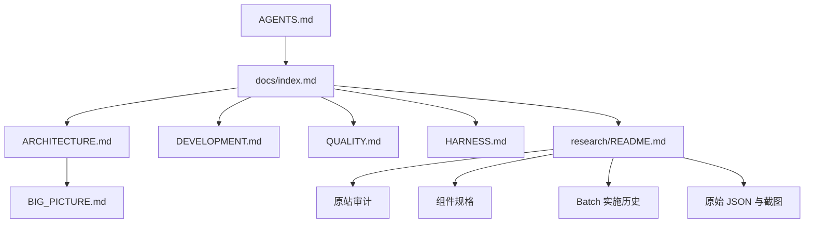

# Documentation Hub

> 当前项目的正式文档入口。先读本页，再按任务进入 Architecture、Development 或 Research。

## Start Here

| 任务 | 文档 |
|---|---|
| 让 agent 了解项目和红线 | [`../AGENTS.md`](../AGENTS.md) |
| 了解项目是什么 | [`../README.md`](../README.md) |
| 了解系统如何组织 | [`ARCHITECTURE.md`](ARCHITECTURE.md) |
| 启动、修改、运行验证 | [`DEVELOPMENT.md`](DEVELOPMENT.md) |
| 判断代码允许如何依赖 | [`LAYERS.md`](LAYERS.md) |
| 检查实现质量与证据纪律 | [`QUALITY.md`](QUALITY.md) |
| 运行完整验证 | [`HARNESS.md`](HARNESS.md) |
| 理解项目术语 | [`GLOSSARY.md`](GLOSSARY.md) |

## Progressive Disclosure

## Formal Guides

| Document | Purpose |
|---|---|
| [`ARCHITECTURE.md`](ARCHITECTURE.md) | 两条路线、路由、store、节点、浮层和数据流 |
| [`DEVELOPMENT.md`](DEVELOPMENT.md) | 安装、启动、代码修改路径、浏览器调试和常用命令 |
| [`LAYERS.md`](LAYERS.md) | `types → lib → store → components → route` 依赖边界 |
| [`QUALITY.md`](QUALITY.md) | TypeScript、React Flow、证据、截图和文档质量规则 |
| [`HARNESS.md`](HARNESS.md) | lint/typecheck/build、Batch Playwright 和文档链接检查 |
| [`GLOSSARY.md`](GLOSSARY.md) | 产品、画布、React Flow 和研究术语 |
| [`BIG_PICTURE.md`](BIG_PICTURE.md) | 当前系统的详细认知和原型边界 |
| [`DOCUMENTATION_PLAN.md`](DOCUMENTATION_PLAN.md) | 文档体系迁移和维护计划 |
| [`DOCUMENTATION_AUDIT.md`](DOCUMENTATION_AUDIT.md) | 文档事实漂移、验证范围和 agent 导航缺口审计 |
| [`DOCUMENT_LIFECYCLE.md`](DOCUMENT_LIFECYCLE.md) | 当前指引、历史合同、兼容入口、证据资产和替代关系登记 |
| [`AGENT_TASK_MAP.md`](AGENT_TASK_MAP.md) | 按任务选择最小证据集合、验证路径和停止条件 |
| [`DECISION_REGISTER.md`](DECISION_REGISTER.md) | 跨路由、研究、复刻和协作的长期有效决策登记 |
| [`CLONE_WEBSITE_ADAPTATION.md`](CLONE_WEBSITE_ADAPTATION.md) | 通用 clone-website 技能在本项目的权限、证据和协作适配 |
| [`../CHANGELOG.md`](../CHANGELOG.md) | 文档、研究和原型迭代的版本历史 |

## Research And Evidence

- [`research/README.md`](research/README.md)：研究总入口、路线索引、组件规格、Batch 历史、原始证据。
- [`research/liblib-live-2026-08-25/`](research/liblib-live-2026-08-25/)：LibTV 当前登录态原站审计。
- [`research/liblib-seedance-2.5-2026-08-25/`](research/liblib-seedance-2.5-2026-08-25/README.md)：Seedance 2.5 能力背景、原站复核和实现历史。
- [`research/liblib-seedance-2.5-2026-08-25/LIBTV_FEATURE_GAP_MATRIX.md`](research/liblib-seedance-2.5-2026-08-25/LIBTV_FEATURE_GAP_MATRIX.md)：以 LibTV 当前能力为中心的呈现/缺口/价值总矩阵。
- [`research/liblib-seedance-2.5-2026-08-25/LIBTV_VERIFICATION_COVERAGE.md`](research/liblib-seedance-2.5-2026-08-25/LIBTV_VERIFICATION_COVERAGE.md)：现有回归脚本与当前源站合同的覆盖及历史断言边界。
- [`research/liblib-seedance-2.5-2026-08-25/NEXT_RESEARCH_PLAN.md`](research/liblib-seedance-2.5-2026-08-25/NEXT_RESEARCH_PLAN.md)：获批的研究-only 执行计划、安全边界、产出顺序和授权门槛。
- [`research/liblib-seedance-2.5-2026-08-25/LIBTV_UI_STATE_HIERARCHY.md`](research/liblib-seedance-2.5-2026-08-25/LIBTV_UI_STATE_HIERARCHY.md)：LibTV UI 状态层级、浮层替换、预览和 graph mutation 转换合同。
- [`research/liblib-seedance-2.5-2026-08-25/LIBTV_DEPENDENCY_RISK_QUEUE.md`](research/liblib-seedance-2.5-2026-08-25/LIBTV_DEPENDENCY_RISK_QUEUE.md)：五项主推能力的共享底座、依赖关系、风险登记和研究优先级队列。
- [`research/liblib-seedance-2.5-2026-08-25/LIBTV_RESEARCH_GO_NO_GO.md`](research/liblib-seedance-2.5-2026-08-25/LIBTV_RESEARCH_GO_NO_GO.md)：编码授权前的继续研究、授权条件、fixture 规格和停止闸门。
- [`research/liblib-canvas-batch59-2026-08-27/`](research/liblib-canvas-batch59-2026-08-27/)：Director 资源库搜索、预览与显式加入场景的 clone-owned 实施、证据边界和 focused verifier。
- [`research/storyai-3d-director-desk-2026-08-27/`](research/storyai-3d-director-desk-2026-08-27/README.md)：StoryAI 固定上游、当前 Director 跨批次进展、借鉴决策、证据边界和下一阶段路线图。
- [`research/liblib-canvas-batch60-2026-08-26/`](research/liblib-canvas-batch60-2026-08-26/)：普通画布图片上下双浮层 owner 连续性、panel 命中边界、active-tool replacement 和 focused verifier。
- [`research/liblib-canvas-batch61-2026-08-27/`](research/liblib-canvas-batch61-2026-08-27/)：React Flow whole-batch change routing、current-snapshot transport、edge selection owner 和 `LIBTV-VR-016` 的实施、runtime audit 与截图成本台账。
- [`research/liblib-canvas-batch62-2026-08-27/`](research/liblib-canvas-batch62-2026-08-27/)：selection command snapshot、editable/IME guard、foreground shortcut suspension、单层 Escape 与 canvas focus fallback 的计划和实施历史。
- [`research/liblib-canvas-batch63-2026-08-27/`](research/liblib-canvas-batch63-2026-08-27/)：actual React Flow host 中心定位的计划、证据台账和实施历史。
- [`research/liblib-canvas-batch64-2026-08-27/`](research/liblib-canvas-batch64-2026-08-27/)：Asset drawer host-resize anchor preservation 的计划、DOM 复用台账、实施、runtime audit 与回归收口。
- [`research/liblib-canvas-batch65-2026-08-27/`](research/liblib-canvas-batch65-2026-08-27/)：responsive viewport bootstrap/stored ownership、A/B canvas restore、stale callback guard、runtime audit 与跨批回归收口。
- [`research/liblib-canvas-batch66-2026-08-27/`](research/liblib-canvas-batch66-2026-08-27/)：Director project/session、command/history/reference-aware delete 和 current verifier authority 的计划、证据边界与实施历史。
- [`research/liblib-canvas-batch67-2026-08-27/`](research/liblib-canvas-batch67-2026-08-27/)：Director Project Document V1、strict codec、snapshot adapter、invalid/future/reference corpus 与实施历史。
- [`research/liblib-canvas-batch68-2026-08-27/`](research/liblib-canvas-batch68-2026-08-27/)：Director owner registry、project/session/generation、A/B/cross-canvas 隔离、memory capture sidecar、worktree 清理与 `LIBTV-VR-024` focused runtime pass。
- [`research/liblib-canvas-batch69-2026-08-27/`](research/liblib-canvas-batch69-2026-08-27/)：Director `authoredObjects` baseline、`objects` runtime projection、seek/playback/path stability、authoring restore 与 `LIBTV-VR-024` focused pass。
- [`research/liblib-canvas-batch70-2026-08-27/`](research/liblib-canvas-batch70-2026-08-27/)：Director project-local command result/history、no-op/rejection、gesture coalescing、undo/redo、reopen continuity 与普通 graph/history isolation 的 focused pass。
- [`research/liblib-canvas-batch71-2026-08-27/`](research/liblib-canvas-batch71-2026-08-27/)：Director Inspector/pose/camera/path/free-draw pointer lifecycle、gesture cleanup 与 `LIBTV-VR-024` focused pass。
- [`research/liblib-canvas-batch72-2026-08-27/`](research/liblib-canvas-batch72-2026-08-27/)：Director reference-aware delete、关系闭包、相机/资源策略、runtime repair 与 exact delete/undo/redo focused pass。
- [`research/liblib-canvas-batch73-2026-08-27/`](research/liblib-canvas-batch73-2026-08-27/)：Director capture/export/phone async authority、attempt supersession、stale/duplicate/invalid convergence、graph projection、resource transfer/release 与 focused verifier。
- [`research/liblib-canvas-batch74-2026-08-27/`](research/liblib-canvas-batch74-2026-08-27/)：Director 版本化 Project Document 的 browser-local persistence、strict restore、storage failure 与 focused verifier。
- [`research/liblib-canvas-batch75-2026-08-27/`](research/liblib-canvas-batch75-2026-08-27/)：Director project-scoped session clipboard、typed closure、two-pass identity/reference remap、camera detach、resource alias、one-history 与 guarded keyboard focused pass。
- [`research/liblib-canvas-batch76-2026-08-27/`](research/liblib-canvas-batch76-2026-08-27/)：Director 全画布 owner reachability、inactive source/canvas tombstone、active runtime cleanup、幂等与 graph/persistence 边界实施计划。
- [`research/LIBTV_DIRECTOR_CURRENT_VERIFIER_MANIFEST.md`](research/LIBTV_DIRECTOR_CURRENT_VERIFIER_MANIFEST.md)：Director 17 个历史 browser verifier、Batch 67-75 current reliability gates、merge candidate/historical-only 分级与 `LIBTV-VR-024` 入口。
- [`research/TRACEABILITY_MATRIX.md`](research/TRACEABILITY_MATRIX.md)：从 LibTV/Open Canvas 主张反查证据、适用范围和不可推出的结论。
- [`research/VERIFICATION_LEDGER.md`](research/VERIFICATION_LEDGER.md)：Batch verifier、源站合同、clone fixture、fixture 阻塞和并行 WIP 的验证成熟度台账。
- [`research/LIBTV_SHORTCUT_RUNTIME_CROSSWALK.md`](research/LIBTV_SHORTCUT_RUNTIME_CROSSWALK.md)：源站快捷键文案、clone 帮助行、实际 handler、React Flow gesture 与局部上下文优先级对照。
- [`research/LIBTV_GRAPH_TRANSACTION_CATALOG.md`](research/LIBTV_GRAPH_TRANSACTION_CATALOG.md)：LibTV 用户动作、store transaction、nodes/edges/selection/history 副作用和证据成熟度目录。
- [`research/components/LibTVGraphConnection.contract.md`](research/components/LibTVGraphConnection.contract.md)：普通 graph connection 的方向归一化、校验结果、事务、fixture 和 verifier 设计权威。
- [`research/components/LibTVGraphDocument.contract.md`](research/components/LibTVGraphDocument.contract.md)：runtime/history/portable document/clipboard/persistence 分层、V1 schema、strict load 和 snapshot isolation 合同。
- [`research/components/LibTVSubgraphCopy.contract.md`](research/components/LibTVSubgraphCopy.contract.md)：selection/group/child copy 的 command、closure、ID/reference rewrite、edge policy、placement 和 atomic history 合同。
- [`research/LIBTV_NODE_DATA_STATIC_AUDIT_2026-08-27.md`](research/LIBTV_NODE_DATA_STATIC_AUDIT_2026-08-27.md)：11 类 runtime node、分散 data shape、cross-node/aggregate identity、media portability 和现有 copy/delete/history 风险的静态审计。
- [`research/components/LibTVNodeDataIdentity.contract.md`](research/components/LibTVNodeDataIdentity.contract.md)：runtime node data 的 type/version registry、field role、operation transform、aggregate integrity 和 portability 合同。
- [`research/LIBTV_GRAPH_DELETE_REFERENCE_REPAIR_MATRIX.md`](research/LIBTV_GRAPH_DELETE_REFERENCE_REPAIR_MATRIX.md)：graph 删除入口、relation inverse index、cascade/detach/reset 决策、UI/resource lifecycle、fixture 和 verifier 合同。
- [`research/LIBTV_GRAPH_MUTATION_ENTRYPOINT_TRUST_MATRIX.md`](research/LIBTV_GRAPH_MUTATION_ENTRYPOINT_TRUST_MATRIX.md)：Open Canvas 分层校验与 clone 全 graph 写入口审计、T0-T5 信任等级、command plan、fixture 和 `LIBTV-VR-014` 设计。
- [`research/LIBTV_ASYNC_RESULT_INGRESS_CONVERGENCE.md`](research/LIBTV_ASYNC_RESULT_INGRESS_CONVERGENCE.md)：Open Canvas run/poll/server-patch 深读、clone 延迟写图审计，以及 operation identity、stale disposition、field ownership、history/resource 收敛和 `LIBTV-VR-015` 设计。
- [`research/LIBTV_REACT_FLOW_CHANGE_ROUTING_CONTRACT.md`](research/LIBTV_REACT_FLOW_CHANGE_ROUTING_CONTRACT.md)：React Flow 12.11.1 精确 change taxonomy、T0/T1 transport whitelist、整批分类、当前快照、运行时字段/历史边界和 `LIBTV-VR-016` 设计。
- [`research/LIBTV_MULTI_CANVAS_LIFECYCLE_ISOLATION_CONTRACT.md`](research/LIBTV_MULTI_CANVAS_LIFECYCLE_ISOLATION_CONTRACT.md)：Open Canvas list/URL/hydrate/delete/save 生命周期与 clone 多画布 registry、viewport、history、UI/transient/async owner 隔离审计，含 switch manifest、fixture 和 `LIBTV-VR-017` 设计。
- [`research/LIBTV_COMMAND_OUTCOME_FEEDBACK_CONTRACT.md`](research/LIBTV_COMMAND_OUTCOME_FEEDBACK_CONTRACT.md)：Open Canvas toast/node/save/form feedback 正反面与 clone reason/string/timer/Director 审计，定义 typed outcome、primary surface、announcement owner、fixture 和 `LIBTV-VR-018`。
- [`research/LIBTV_SELECTION_FOCUS_COMMAND_CONTEXT_STATIC_AUDIT_2026-08-27.md`](research/LIBTV_SELECTION_FOCUS_COMMAND_CONTEXT_STATIC_AUDIT_2026-08-27.md)：Open Canvas selection/editable/Radix 正反面与 clone node/edge selection、listener phase、modal/Director focus 的固定静态审计及事实漂移清单。
- [`research/LIBTV_SELECTION_FOCUS_COMMAND_CONTEXT_CONTRACT.md`](research/LIBTV_SELECTION_FOCUS_COMMAND_CONTEXT_CONTRACT.md)：node/edge/primary selection、focus zone、surface command policy、dispatch result、one-Escape、focus return、fixture 和 `LIBTV-VR-019` 设计权威。
- [`research/LIBTV_VIEWPORT_COORDINATE_GESTURE_STATIC_AUDIT_2026-08-27.md`](research/LIBTV_VIEWPORT_COORDINATE_GESTURE_STATIC_AUDIT_2026-08-27.md)：Open Canvas dual-anchor/live viewport/placement 正反面与 clone host/window center、viewport projection、gesture/placement owner 的固定静态审计。
- [`research/LIBTV_VIEWPORT_COORDINATE_PLACEMENT_CONTRACT.md`](research/LIBTV_VIEWPORT_COORDINATE_PLACEMENT_CONTRACT.md)：普通 LibTV 的 client/host/flow/node/media 坐标域、live/stable/bootstrap/target viewport、gesture session、placement policy、fixture 和 `LIBTV-VR-020` 设计权威。
- [`research/LIBTV_MEDIA_INGRESS_RESOURCE_STATIC_AUDIT_2026-08-27.md`](research/LIBTV_MEDIA_INGRESS_RESOURCE_STATIC_AUDIT_2026-08-27.md)：Open Canvas file/drop/upload 正反面、clone mock/local-preview/data/blob 路径和 LibTV source upload/history/material/asset 分域的 dated audit。
- [`research/LIBTV_MEDIA_INGRESS_RESOURCE_LIFECYCLE_CONTRACT.md`](research/LIBTV_MEDIA_INGRESS_RESOURCE_LIFECYCLE_CONTRACT.md)：普通 LibTV entry profile、validation/probe/materialization、temporary lease、asset/reference、cohort commit、reachability/release、fixture 和 `LIBTV-VR-021` 设计权威。
- [`research/LIBTV_EDITOR_SESSION_HISTORY_STATIC_AUDIT_2026-08-27.md`](research/LIBTV_EDITOR_SESSION_HISTORY_STATIC_AUDIT_2026-08-27.md)：Open Canvas bitmap/text editor 正反面、clone draft/local-history/inert command/graph-history gateway 与 stale component spec 的 dated audit。
- [`research/LIBTV_EDITOR_SESSION_COMMIT_HISTORY_CONTRACT.md`](research/LIBTV_EDITOR_SESSION_COMMIT_HISTORY_CONTRACT.md)：普通 LibTV foreground editor profile、baseline/draft/local history、commit/cancel、graph/async handoff、fixture 和 `LIBTV-VR-022` 设计权威。
- [`research/open-canvas-2026-08-26/LIBTV_EDITOR_SESSION_COMMIT_HISTORY_RESEARCH_PLAN_2026-08-27.md`](research/open-canvas-2026-08-26/LIBTV_EDITOR_SESSION_COMMIT_HISTORY_RESEARCH_PLAN_2026-08-27.md)：editor session/commit/history 专题的历史计划、里程碑与完成记录。
- [`research/LIBTV_MEDIA_RENDITION_GEOMETRY_STATIC_AUDIT_2026-08-27.md`](research/LIBTV_MEDIA_RENDITION_GEOMETRY_STATIC_AUDIT_2026-08-27.md)：Open Canvas media/output/request/frame/rendition 正反面、clone dimension collision 与 LibTV source landscape node 的 dated audit。
- [`research/LIBTV_MEDIA_RENDITION_GEOMETRY_CONTRACT.md`](research/LIBTV_MEDIA_RENDITION_GEOMETRY_CONTRACT.md)：普通 LibTV intrinsic/output/request/frame/measured/editor/export 权威、fit transform、measurement freshness、fixture 和 `LIBTV-VR-023` 设计权威。
- [`research/open-canvas-2026-08-26/LIBTV_MEDIA_RENDITION_GEOMETRY_RESEARCH_PLAN_2026-08-27.md`](research/open-canvas-2026-08-26/LIBTV_MEDIA_RENDITION_GEOMETRY_RESEARCH_PLAN_2026-08-27.md)：media rendition/aspect/node geometry 专题的历史计划、里程碑与完成记录。
- [`research/LIBTV_UI_OVERLAY_RUNTIME_CATALOG.md`](research/LIBTV_UI_OVERLAY_RUNTIME_CATALOG.md)：LibTV page/route/node/Director 浮层的 state、mount owner、关闭路径、键盘和定位 ownership 目录。
- [`research/LIBTV_UIUX_PARITY_BACKLOG.md`](research/LIBTV_UIUX_PARITY_BACKLOG.md)：当前 LibTV UI/UX parity 缺口的价值、证据、验证准备度、风险、依赖和授权/fixture 队列。
- [`research/LIBTV_FIXTURE_CATALOG.md`](research/LIBTV_FIXTURE_CATALOG.md)：LibTV 本地/Director/源站 fixture 的身份、构造、隔离、reset、副作用和 parity backlog 映射。
- [`research/LIBTV_SOURCE_FRESHNESS_REINSPECTION.md`](research/LIBTV_SOURCE_FRESHNESS_REINSPECTION.md)：`PAR-005` 源站 freshness 只读复核顺序、viewport/zoom 采样、停止条件和证据模板。
- [`research/LIBTV_VERIFIER_REPLACEMENT_MAP.md`](research/LIBTV_VERIFIER_REPLACEMENT_MAP.md)：历史 verifier、当前 source contract、local fixture 和 replacement queue 的迁移边界。
- [`research/components/COVERAGE_MATRIX.md`](research/components/COVERAGE_MATRIX.md)：源码组件到合同、证据、验证和下一步文档缺口的反向索引。
- [`research/frameos/`](research/frameos/README.md)：FrameOS 原站抽取、组件、行为和运行手册。
- [`research/open-canvas-2026-08-26/`](research/open-canvas-2026-08-26/README.md)：ZeroLu/open-canvas 固定版本 submodule、官网运行态和深度源码调研。
- [`research/open-canvas-2026-08-26/OPEN_CANVAS_PATTERN_CARDS.md`](research/open-canvas-2026-08-26/OPEN_CANVAS_PATTERN_CARDS.md)：十三类可迁移模式卡，覆盖浮层几何、typed input、状态/身份、异步、framework change routing、多画布 lifecycle、command feedback、selection/focus/context、空间、media/resource、editor session 与 media rendition authority，并区分上游启发、LibTV 证据和 clone 验证闸门。
- [`research/open-canvas-2026-08-26/ADOPTION_DECISION_MATRIX.md`](research/open-canvas-2026-08-26/ADOPTION_DECISION_MATRIX.md)：上游机制到 LibTV parity、fixture、verifier 和授权边界的采纳决策总表。
- [`research/open-canvas-2026-08-26/LIBTV_IMPLEMENTATION_HANDOFF_BLUEPRINT.md`](research/open-canvas-2026-08-26/LIBTV_IMPLEMENTATION_HANDOFF_BLUEPRINT.md)：高价值上游启发转为 LibTV 单 slice 的证据、身份、事务、surface、fixture 和 verifier 交接蓝图。
- [`research/open-canvas-2026-08-26/LIBTV_PROCESS_RESULT_STATE_MATRIX.md`](research/open-canvas-2026-08-26/LIBTV_PROCESS_RESULT_STATE_MATRIX.md)：逐帧拉片、片段重拍和超长视频的正交状态、身份、fixture、stale/retry 与 `VR-007` 合同。
- [`research/open-canvas-2026-08-26/LIBTV_MODEL_CAPABILITY_PROJECTION_MATRIX.md`](research/open-canvas-2026-08-26/LIBTV_MODEL_CAPABILITY_PROJECTION_MATRIX.md)：模型目录、authoring controls、clone state、请求 descriptor 与真实 runner 的分层审计。
- [`research/open-canvas-2026-08-26/UPSTREAM_VERSION_IMPACT_PROTOCOL.md`](research/open-canvas-2026-08-26/UPSTREAM_VERSION_IMPACT_PROTOCOL.md)：比较上游新 commit、重审研究主张并决定是否移动 submodule 指针的版本影响协议。
- [`research/open-canvas-2026-08-26/NEXT_EVIDENCE_ACQUISITION_PLAN.md`](research/open-canvas-2026-08-26/NEXT_EVIDENCE_ACQUISITION_PLAN.md)：剩余 source/fixture/upstream 证据的可执行队列、安全动作、停止条件和交付模板。
- [`research/components/`](research/components/)：按组件查找实现合同。
- [`design-references/README.md`](design-references/README.md)：截图分类、命名、复用和证据边界。

## Lifecycle

- [`drafts/README.md`](drafts/README.md)：正在迭代的计划和设计。
- [`archive/README.md`](archive/README.md)：已废弃或仅保留历史的文档。
- 已完成的 Batch 研究保留在 `research/liblib-canvas-batchN-*`，因为它们同时承担实施历史、验证记录和接力上下文，不是无用废稿。

## Compatibility

[`docs/README.md`](README.md) 仍作为旧入口保留；正式索引以本页 `index.md` 为准。
