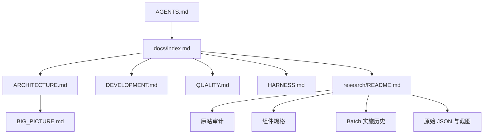

# Documentation Hub

> 当前项目的正式文档入口。先读本页，再按任务进入 Architecture、Development 或 Research。

## Start Here

| 任务 | 文档 |
|---|---|
| 让 agent 了解项目和红线 | [`../AGENTS.md`](../AGENTS.md) |
| 了解项目是什么 | [`../README.md`](../README.md) |
| 了解系统如何组织 | [`ARCHITECTURE.md`](ARCHITECTURE.md) |
| 启动、修改、运行验证 | [`DEVELOPMENT.md`](DEVELOPMENT.md) |
| 判断代码允许如何依赖 | [`LAYERS.md`](LAYERS.md) |
| 检查实现质量与证据纪律 | [`QUALITY.md`](QUALITY.md) |
| 运行完整验证 | [`HARNESS.md`](HARNESS.md) |
| 理解项目术语 | [`GLOSSARY.md`](GLOSSARY.md) |

## Progressive Disclosure

## Formal Guides

| Document | Purpose |
|---|---|
| [`ARCHITECTURE.md`](ARCHITECTURE.md) | 两条路线、路由、store、节点、浮层和数据流 |
| [`DEVELOPMENT.md`](DEVELOPMENT.md) | 安装、启动、代码修改路径、浏览器调试和常用命令 |
| [`LAYERS.md`](LAYERS.md) | `types → lib → store → components → route` 依赖边界 |
| [`QUALITY.md`](QUALITY.md) | TypeScript、React Flow、证据、截图和文档质量规则 |
| [`HARNESS.md`](HARNESS.md) | lint/typecheck/build、Batch Playwright 和文档链接检查 |
| [`GLOSSARY.md`](GLOSSARY.md) | 产品、画布、React Flow 和研究术语 |
| [`BIG_PICTURE.md`](BIG_PICTURE.md) | 当前系统的详细认知和原型边界 |
| [`DOCUMENTATION_PLAN.md`](DOCUMENTATION_PLAN.md) | 文档体系迁移和维护计划 |

## Research And Evidence

- [`research/README.md`](research/README.md)：研究总入口、路线索引、组件规格、Batch 历史、原始证据。
- [`research/liblib-live-2026-08-25/`](research/liblib-live-2026-08-25/)：LibTV 当前登录态原站审计。
- [`research/liblib-seedance-2.5-2026-08-25/`](research/liblib-seedance-2.5-2026-08-25/README.md)：Seedance 2.5 能力背景、原站复核和实现历史。
- [`research/liblib-seedance-2.5-2026-08-25/LIBTV_FEATURE_GAP_MATRIX.md`](research/liblib-seedance-2.5-2026-08-25/LIBTV_FEATURE_GAP_MATRIX.md)：以 LibTV 当前能力为中心的呈现/缺口/价值总矩阵。
- [`research/liblib-seedance-2.5-2026-08-25/LIBTV_VERIFICATION_COVERAGE.md`](research/liblib-seedance-2.5-2026-08-25/LIBTV_VERIFICATION_COVERAGE.md)：现有回归脚本与当前源站合同的覆盖及历史断言边界。
- [`research/frameos/`](research/frameos/README.md)：FrameOS 原站抽取、组件、行为和运行手册。
- [`research/open-canvas-2026-08-26/`](research/open-canvas-2026-08-26/README.md)：ZeroLu/open-canvas 固定版本 submodule、官网运行态和深度源码调研。
- [`research/components/`](research/components/)：按组件查找实现合同。
- [`design-references/README.md`](design-references/README.md)：截图分类、命名、复用和证据边界。

## Lifecycle

- [`drafts/README.md`](drafts/README.md)：正在迭代的计划和设计。
- [`archive/README.md`](archive/README.md)：已废弃或仅保留历史的文档。
- 已完成的 Batch 研究保留在 `research/liblib-canvas-batchN-*`，因为它们同时承担实施历史、验证记录和接力上下文，不是无用废稿。

## Compatibility

[`docs/README.md`](README.md) 仍作为旧入口保留；正式索引以本页 `index.md` 为准。
