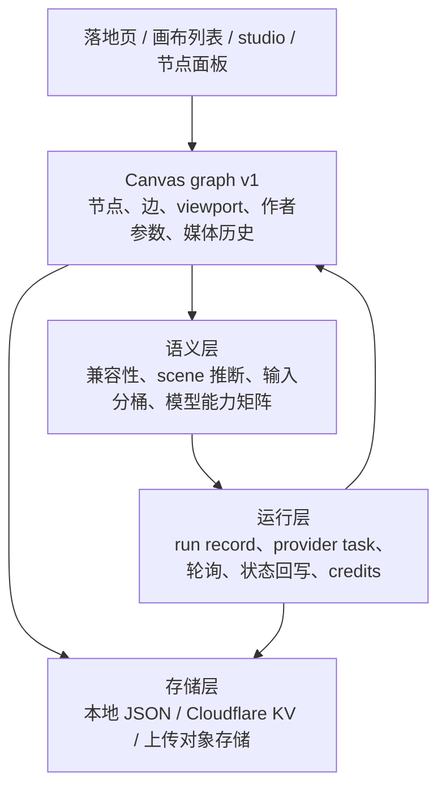
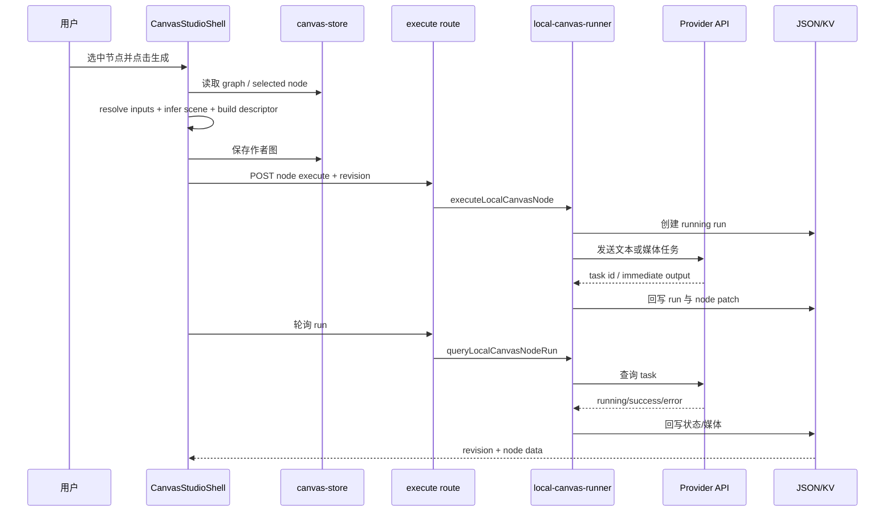

# Open Canvas 深度调研报告

## 结论摘要

Open Canvas 对当前 LibTV + FrameOS 项目的最大价值，不是提供一套可以直接搬进来的页面，而是展示了一种完整的“多模态节点工作流”内核：**版本化 DAG 图模型 + 类型化输入输出 + 模型能力矩阵 + 可轮询运行记录 + local-first 持久化 + BYOK provider 边界**。

它适合作为当前项目的研究对象和架构参照，不适合作为未经筛选的代码模板。固定版本存在明确的实现漂移：README/官网/模型注册表描述的 provider 能力比当前具体 studio 执行路径更宽；Audio 在数据模型中完整存在，但当前 OSS runner 明确未接通；legacy endpoint 与当前 shell 并存。当前克隆项目应优先借鉴其数据和交互合同，暂不应把其宣传面或旧代码当成“已验证功能”。

本次已完成：

- 在主工作区引入并固定 upstream submodule；
- 读取固定 commit 的路由、图模型、校验、store、持久化、执行、provider、上传和 studio 代码；
- 浏览官网中文落地页与中文画布空状态；
- 保存桌面/移动截图；
- 将源码事实、运行事实、风险和实施建议分文档落档。

本次没有修改当前项目的 `src/`、没有修改 upstream submodule 内容、没有输入密钥或触发官网副作用。任何编码实施必须等待用户明确授权。

本报告的声明索引见 [`EVIDENCE_MATRIX.md`](EVIDENCE_MATRIX.md)。正文中的“源码事实/官网运行事实/推断”仍需按该矩阵的 claim ID 复核；报告不能替代 LibTV 源站的视觉取证。

面向后续 LibTV UI/UX 复刻的转译队列见 [`UIUX_TRANSLATION.md`](UIUX_TRANSLATION.md)。该文档把 Open Canvas 的坐标、层级、状态和验证方法转化为 LibTV batch 的研究问题，但不改变 LibTV 的源站合同。

更细的交互模式、源码入口和后续 `LIBTV-UIX-09..16` 验证合同见 [`INTERACTION_CATALOG.md`](INTERACTION_CATALOG.md)。该目录把“节点选中后双浮层”放在更大的事件、坐标、graph mutation 和反馈链中，便于后续持续迭代时按批次推进。

## 0.1 研究成熟度

| 主题 | 本轮覆盖度 | 置信度 | 边界 |
|---|---|---|---|
| 固定 commit 的路由、图模型、校验、store、执行和持久化 | 高 | High | 静态源码考古，未执行 provider 任务 |
| 官网 landing 和 `/zh/canvas` 空状态 | 高 | High | 未登录、无 key、无远端写操作 |
| current studio 的 provider 实际可执行范围 | 中 | High（源码入口）/ Pending（live） | 已识别静态调用链，未做真实生成 |
| studio 选中节点上下浮层几何 | 低 | Pending | 本轮没有创建画布和节点操作 |
| 官网预览中的分享/模板/保存状态是否对应 alpha runtime | 低 | Low | 只能作为信息架构证据 |
| 对当前 LibTV/FrameOS 的借鉴建议 | 中 | Medium | 属于研究推断，必须服从当前项目源站证据 |

## 1. 对象与版本锁定

| 维度 | 记录 |
|---|---|
| 对象 | [ZeroLu/open-canvas](https://github.com/ZeroLu/open-canvas/) |
| submodule | `research/upstream/open-canvas` |
| 固定 commit | `cf3a906bb8c35bb940d3267497e7f394b8f42582` |
| 上游分支指针 | `main`，仅作为当时检出分支记录；分析以 commit 为准 |
| 上游状态 | alpha，package version `0.1.0` |
| 官网 | [open-canvas.cyberbara.com/zh](https://open-canvas.cyberbara.com/zh) |
| 研究文档入口 | [`README.md`](README.md) |

## 2. Big Picture：它到底是什么

### 2.1 一句话模型

Open Canvas 是一个以用户自己的 API key 为边界、以 React Flow DAG 为工作流载体、以本地 JSON/KV 为持久化层、以 AI provider adapter 为执行出口的多模态生成画布。

### 2.2 四个层次

真正可迁移的设计单位不是某个按钮，而是这五层之间的合同：节点如何表达输入，边如何携带语义，scene 如何被推断，运行结果如何落回节点，保存如何处理版本冲突。

### 2.3 它不是什么

- 不是拥有登录、credits、任务队列和多租户协作的完整 LibTV 替代品；
- 不是一个已验证所有 provider 的统一执行平台；
- 不是单纯的自由绘图白板，连接图被约束为 DAG；
- 不是可以不经审计就复制到当前业务代码的依赖包；
- 不是当前项目中 LibTV/FrameOS 的一个 route mode，应该保持研究隔离。

## 3. 端到端用户流程

### 3.1 首次使用

1. 从 landing page 通过 `开始创作` 进入 `/zh/canvas`；
2. 列表页展示空状态，并给出设置、导入 JSON、新建画布；
3. onboarding wizard 引导用户配置 OpenRouter、Replicate、Cyberbara Key 与可选存储；
4. 创建或导入一张画布；
5. 进入具体 canvas route，studio hydrate graph；
6. 添加节点、编辑参数、拖动/连接；
7. 自动保存 graph；
8. 选中可执行节点，构造 scene 和 provider descriptor，发起运行；
9. 记录 run、轮询异步 task，将输出媒体/文本 patch 回节点；
10. 输出作为下游节点输入继续串联。

### 3.2 源码支持的编辑能力

| 能力 | 机制 | 研究判断 |
|---|---|---|
| 添加节点 | 默认 data + 类型化初始位置 | 是核心交互，不只是 UI 菜单 |
| 拖拽/缩放/平移 | React Flow viewport/node changes | 适合当前 clone 继续保留 React Flow |
| 复制/粘贴 | 新 ID、内部边重建、位置 offset | 对工作流重复编排高价值 |
| 删除 | 节点连带删除 incident edges | 避免悬挂引用 |
| 连线 | handles、兼容性、去重、环检测 | 需要共享纯函数与 UI 反馈双保障 |
| 文本/富文本 | Text textarea；Note contentEditable + allow-list sanitizer | Note 是可视化上下文，不参与执行 |
| 媒体历史 | `imageOutputs`/`videoHistory` + selected index | 生成型工作流需要可回选历史输出 |
| 导入/导出 | graph version 1 + JSON 文件 | 可作为研究原型的可重复实验载体 |
| 保存冲突 | revision、dirty、rebase/conflict | 比最后写入覆盖更可靠 |

## 4. 运行时数据流

> 下面是由固定源码拼出的静态调用链，不是本次对真实 provider 任务的 live 运行记录。官网公开页的运行事实单独见 [`RUNTIME_AUDIT.md`](RUNTIME_AUDIT.md)。

### 4.1 关键合同

1. **输入不是直接复制字段**：边先按文字、普通图片、风格参考、omni reference、视频、音频分桶。
2. **场景由图决定**：文本/图片/视频节点在上游连接变化后，scene 和可见设置可能变化。
3. **模型能力由 registry/options 决定**：不同 Seedance、Midjourney、Gemini Omni 变体的 ratio、resolution、duration、reference 规则不同。
4. **结果是节点 patch**：运行记录用于审计/轮询，节点 data 用于画布呈现和下游输入。
5. **保存和执行共享 revision**：异步运行回写不能假定用户没有继续编辑。

对应声明：OC-003、OC-004、OC-005、OC-007、OC-010；逐条证据见 [`EVIDENCE_MATRIX.md`](EVIDENCE_MATRIX.md#2-核心声明)。

## 5. 视觉/交互研究重点

### 5.1 官网层

官网的首屏以真实工作台预览传达节点图、保存状态、分享、缩放和媒体播放；空画布入口以列表/空状态/设置向导降低首次进入门槛。这一层值得当前项目参考的是信息层级和入口编排，而不是直接复制品牌文案或图片。

### 5.2 Studio 层

源码显示 studio 采用固定的节点卡片 + React Flow handles + React Flow Panels：

- 节点承载内容和最小可编辑信息；
- 选中节点后，独立 panel 承载 prompt、model、引用和生成/上传控制；
- 顶部或视图 panel 承载画布级操作；
- 边自身有选中/hover 状态和操作入口；
- 预览、图片编辑、设置、模板等采用对话框或独立浮层。

对于当前用户已经指出的 LibTV clone 问题，“选中图片节点后上下出现不同弹出层，位置不能乱”可以从 Open Canvas 得到一个结构性参照：**节点内容层、节点操作层、节点参数层、画布级工具层必须有不同的 anchor contract 和 z-index contract**。这一结论只指导后续 clone 研究，不等于 Open Canvas 的官网已完成 LibTV 同款上下浮层。

### 5.3 移动端

官网落地页在 390px viewport 下仍保持品牌、CTA 和工作台预览的连续叙事；这只能证明营销页有移动布局。studio 移动端需要另外测量：节点拖拽、固定 Panel、面板滚动、视图缩放与键盘弹出后的关系，本轮未执行该交互。

### 5.4 交互模式的后续研究入口

Open Canvas 的源码还提供了几个与 LibTV 后续复刻直接相关、但不能直接替换 LibTV 行为的参照：选中浮层共用 measured node/live viewport 的 screen anchor；Quick Add 同时保存菜单屏幕位置和节点 flow position；悬空连线可以携带 pending connection 进入节点创建；复制粘贴以 versioned 子图、内部边和 ID map 为边界；媒体历史和保存状态是显式数据。完整证据和当前 clone 的差异见 [`INTERACTION_CATALOG.md`](INTERACTION_CATALOG.md)。

本项目当前的优先顺序保持不变：先完成 LibTV 源站双浮层的几何取证，再研究连接/视口，最后判断媒体历史、状态反馈和 onboarding 是否存在需要复刻的源站行为。Open Canvas 的实现只能帮助我们提出可测问题，不能把待取证项升级为 clone 规格。

## 6. 与当前 LibTV + FrameOS clone 的关系

当前项目的正式架构见 [`docs/ARCHITECTURE.md`](../../ARCHITECTURE.md) 和 [`docs/BIG_PICTURE.md`](../../BIG_PICTURE.md)：LibTV 与 FrameOS 是两条独立路线，LibTV 通过 `canvasStore` 组织画布，FrameOS 通过 `frameosStore` 组织独立 route。Open Canvas 是研究对象，不应引入 route `mode` flag，也不应把它的 store 合并进 FrameOS。

建议采用三层映射：

| Open Canvas 概念 | 当前项目对应物 | 可借鉴内容 | 不能直接假设 |
|---|---|---|---|
| Canvas graph | LibTV `canvasStore` 及节点 data | 版本化 graph、输入/输出分层、历史媒体 | 不要改变现有 LibTV edge flow effect，先以原站证据为准 |
| Studio selected panel | 当前 LibTV 选中节点上下浮层 | anchor、层级、选中态、参数与节点分离 | Open Canvas 不是 LibTV 的视觉源站 |
| Provider/model matrix | 当前 Seedance/图片/音频节点参数 | capability-driven controls | 不要把 Open Canvas provider 名称当成 LibTV API 合同 |
| Local persistence | 当前 prototype 的本地状态/模拟数据 | JSON snapshot、revision、冲突状态 | 当前项目是否需要持久化要先看产品目标 |
| FrameOS graph | `frameosStore` | 仅可借鉴纯图校验/descriptor 思路 | 绝不合并两条 store 或 route |

## 7. 高价值借鉴排序

### P0：交互合同与证据补齐

1. 继续在 LibTV 源站核对选中节点上下浮层的几何关系、定位基准、缩放/拖动行为和移动端退化策略；
2. 为 clone 写出“节点选中态浮层合同”，明确 node rect、canvas viewport、screen fixed panel、z-index、碰撞避让和关闭条件；
3. 记录每个状态的截图/DOM rect，先修视觉事实再抽象实现。

理由：这是当前用户已明确指出的可见缺陷，直接影响 clone 的可信度，比引入 Open Canvas 的 provider 代码更高价值。

### P1：纯逻辑层

1. 借鉴 `SerializedCanvasGraph` 的版本化序列化边界；
2. 借鉴输入分桶与 scene 推断，但按 LibTV/FrameOS 自己的产品合同重新命名；
3. 借鉴连接兼容性、边去重、DAG 校验和 copy/paste 内部边重建；
4. 把模型选项改为能力矩阵，减少节点 UI 中散落的模型判断。

理由：这些内容能改善一致性和可测试性，且不要求接真实后端。

### P2：运行与持久化

1. 只有在当前 clone 需要“刷新后恢复画布/运行状态”时，才设计本地 graph persistence；
2. 若引入运行记录，先定义状态机、重试、过期和输出 patch 的冲突规则；
3. provider adapter 应先固定接口，再逐个接模型，不复制当前 upstream 的声明/运行漂移。

理由：当前项目仍是前端原型验证，过早接 provider 会把研究事实和业务实现混在一起。

### P3：低优先级

- Open Canvas landing 的 provider marquee、BYOK FAQ、空状态文案结构；
- S3-compatible 上传抽象；
- Cloudflare KV 适配；
- 模板/分享相关接口。

这些能力对 Open Canvas 自身有价值，但不是当前 LibTV/FrameOS 画布视觉克隆的第一批工作。

## 8. 风险与决策

### R1：多 Provider 声明漂移（高）

固定源码同时存在多 provider README、丰富 registry/模型选项和 Cyberbara-only 的 current runner。实施时必须以当前实际调用链为准，建立“UI 可选、descriptor 可构造、runner 可执行、结果可回写”四项验收，而不是只检查下拉选项。

### R2：Audio 数据层领先执行层（高）

Audio 已有类型、默认模型、参数和 UI 方向，但当前 runner 明确报未接通。若当前 clone 只做视觉原型，应显示明确的 disabled/研究态；若要做真实执行，必须先获得后端/provider 合同。

### R3：密钥与身份（高）

provider key 写入非 HttpOnly cookie，client ID 只是 namespace 而非认证。当前项目在没有后端的情况下不要复制这一安全假设；研究 UI 可以保留 mock，但真实 API key 方案必须另行评审。

### R4：大组件维护风险（中）

约 7600 行的 `CanvasStudioShell` 同时承载画布、面板、运行和保存。后续借鉴时应只提取纯逻辑合同或小范围组件规格，不把整个组件复制到当前项目。

### R5：缺少自动化测试（中）

固定版本未发现 test/playwright/vitest/jest 目录或 package script。当前项目若吸收其交互，应补最小的 graph validator、浮层几何和关键 viewport 验证。

### R6：持久化并发（中）

JSON/KV 的 read-modify-write 适合 alpha/local-first，但不能直接推导为多用户协作方案。当前 clone 仍应把本地 mock 与真实协作边界写在文档中。

## 8.1 声明漂移的处理方式

遇到“README 说支持、UI 能选择、registry 有路由、current runner 未接通”的组合时，采用四层判定：

1. **可见**：页面是否展示入口或字段；
2. **可构造**：共享执行层能否生成合法 descriptor；
3. **可执行**：当前页面实际调用的 route/runner 是否分派到对应 provider；
4. **可回写**：异步结果是否能落入 run record 和节点 data。

只有四层都成立，才可以在当前版本报告为“已接通能力”。这条规则也是当前 clone 评估 LibTV 近期模型亮点时的建议审计标准。

## 9. 对当前项目的明确建议

### 现在可以做

- 保留 submodule 和本报告作为研究基线；
- 在当前 LibTV 研究文档中补充 Open Canvas 作为旁证对象；
- 继续用浏览器取证源站选中节点上下浮层；
- 设计并记录 clone-only 的浮层 anchor/层级合同；
- 在不修改业务代码的前提下为后续批次列出验证用例。

### 当前不要做

- 不要把 Open Canvas 的 provider registry 直接接到 LibTV；
- 不要因为官网出现 provider 名称就实现对应 API；
- 不要把 Open Canvas 的 `canvasStore` 合并进 FrameOS；
- 不要在没有用户授权时修改 `src/`；
- 不要为验证而输入第三方 key、上传真实素材或触发付费生成。

## 10. 研究完成定义

本轮研究达到以下完成标准：

- 固定版本可由 submodule 复现；
- 主要入口和真实 runtime route 已识别；
- 图模型、边合同、执行 descriptor、保存冲突和 provider 边界有源码证据；
- 官网公开页与空画布入口有 DOM/截图证据；
- 关键实现漂移和安全/并发风险已显式记录；
- 对当前 clone 的借鉴顺序和禁止事项已落档；
- 变更只包含研究文档、索引和审计截图，未改业务代码。

后续需要另行授权的内容见 [`IMPLEMENTATION_IMPLICATIONS.md`](IMPLEMENTATION_IMPLICATIONS.md)。
