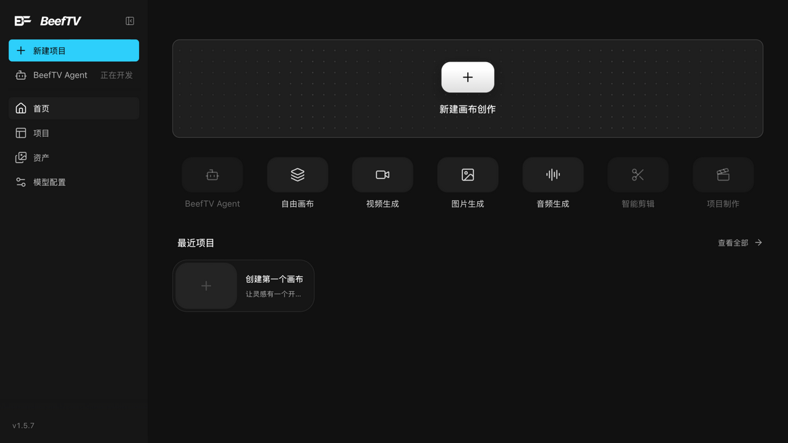

# 快速开始：从打开画布到第一组「素材 → 生成」

> 适用角色：所有用户 ｜ 预计耗时：约 2 分钟 ｜ 生成操作涉及按量计费，本页在付费边界前停止。

## 你将完成

在画布上放一个「文本」节点和一个「图片」节点，用连线把文本作为图片的生成参考——这是 BeefTV 一切创作流程的最小单元。

## 前置条件

- 已启动 BeefTV 并登录（Web 端自托管地址，或桌面客户端）。

## 步骤

1. **进入画布**。登录后从首页点击「新建画布创作」（或左侧「新建项目」）：

   

2. **打开「添加节点」菜单**。在画布空白处**双击**（空态也有「双击画布 · 自由生成节点」提示），或右键 → 「添加节点」，或点底部工具栏的「添加节点」按钮。菜单为列表形态、右上角可搜索，分「创作节点」与「导入资源」两段：

   

   创作节点：文本 / 图片 / 视频 / 音频，标「正在开发」的智能剪辑、逐帧拉片、脚本，以及**可用的「导演台」**（v1.6.7 起解禁，点击后进入镜头模板选择并创建镜头节点，见 [director-basics.md](10-tasks/director-basics.md)）；绘图、文件夹、批量创作表默认隐藏，搜索名称即可创建。导入资源：上传 / 从生成历史选择 / 素材库。
3. **放一个「文本」节点**。点击菜单中的「文本」，再在画布上点一下放置位置；节点标题可直接输入，留空会自动回退为默认名。
4. **放一个「图片」节点并导入素材**。再次打开菜单点「图片」；随后从菜单「导入资源」段选「上传」选择本地图片，或选「素材库」/「从生成历史选择」复用已有素材。
5. **连一条线**。把鼠标悬停在「文本」节点边缘，出现圆形「+」侧栏后按住拖出，拖到「图片」节点附近松手（有 56px 的圆形吸附范围，靠近即可吸上）。
6. **发起生成（涉及计费）**。选中「图片」节点，在提示词面板确认引用后点击生成。具体参数与费用见 [generate-images.md](10-tasks/generate-images.md)。

## 成功判据

- 画布上有一个「文本」节点和一个「图片」节点；
- 两者之间有一条从文本指向图片的连线；
- 图片节点的引用面板中出现该文本引用。

## 取消与恢复

- 删除连线：点击连线选中后按 Delete（优先删除连线而不是节点）。
- 误删节点：Ctrl/Cmd+Z 撤销；更早的状态见版本历史与回收站（见 [undo-history-versions.md](10-tasks/undo-history-versions.md)）。

## 下一步

- 熟悉缩放、平移与小地图：[navigate-canvas.md](10-tasks/navigate-canvas.md)
- 了解全部节点类型：[create-nodes.md](10-tasks/create-nodes.md)
