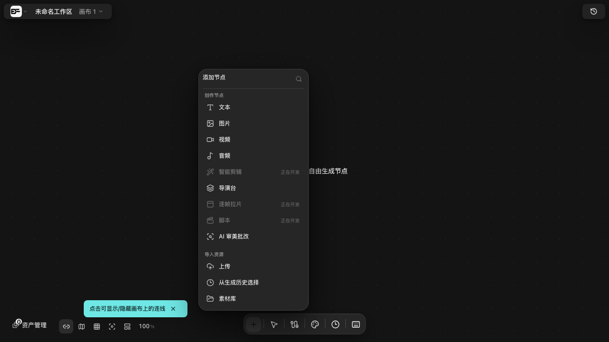
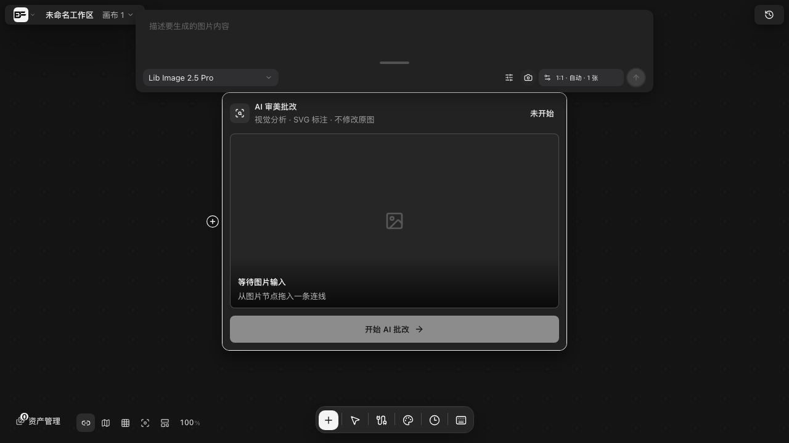

# AI 审美批改

> 适用角色：所有用户。
> **状态：节点是能建的——前提是先在插件中心把它打开。** 下面先说入口在哪，再说清「点下去最多花多少钱」，最后讲它产出什么。
> **本页两部分的证据等级不同，别把它们当成同一种**（Batch 220 补记）：**入口与节点本身有实拍截图**（`69-art-critique-add-node.png` / `70-art-critique-node.png`，v1.6.14 走查）；**而下面「报告长什么样」起的全部内容只有源码与界面文案证据，没有跑过一次真实批改**——一次批改最多触发 9 次模型调用，属付费边界，本手册的取证红线止于付费边界前一步。**所以那几节说的是「代码与文案表明它会这样」，不是「它确实这样」。**

## 入口：插件开关决定它出不出现

「AI 审美批改」不是写死在菜单里的内置节点，而是**按插件启用状态动态生成**的插件节点。所以插件没开时，菜单里就是没有它——**这不是入口藏得深，是开关还关着**。

两步就能建出来：

1. 进「**插件中心**」（侧栏底部），在「应用插件」里找到「**AI 审美批改**」。它**默认是停用**的，点右侧开关打开，开关旁会变成「当前已启用，点击停用」；
2. 回画布，点底部工具栏的「**+**」（添加节点）。在「**创作节点**」分区的**最末尾**（排在「脚本」之后）就是「**AI 审美批改**」。

> **⚠️ v1.7.3 起 `69-art-critique-add-node.png` 这一张图偏旧**：图上的「从生成历史选择」在 v1.7.3 的源码里**已经找不到那一行**——
> **所以如果你跑的是 v1.7.3 或更新，界面上看不到这几个字、不是你搞错了。**
> （本图拍于取证基线版本；2026-10-07 逐行比对上游 `origin/main` 实测。**图与你的版本不一致时请一律以界面为准**，同一份实测清单见 [参考：快捷键全表、路由与端点](../20-reference.md) 的「已经对不上的地方」。）

::: warning 只差一步时，最容易以为自己漏看了
默认状态下 5 个应用插件（Eagle 素材库 / AI 提示词优化器 / **AI 审美批改** / 媒体转换节点 / 剪辑工作台）**全是停用**，此时「添加节点」的创作节点分区只有八项：文本、图片、视频、音频、智能剪辑、导演台、逐帧拉片、脚本。

同一台机器、同一块空画布，**只改插件开关这一个变量**，实测：

| 插件开关 | 创作节点分区的最后一项 |
|---|---|
| 已停用（默认） | 脚本 |
| 已启用 | **AI 审美批改** |

所以搜「审美」「批改」搜不到时，先回去看开关，而不是再找一遍。
:::

建出来长这样——**没连图片时底部按钮是灰的**：

注意它**左侧只有一个输入连接点、右侧没有输出连接点**：它吃掉一张图、产出报告，**不会把素材再传给下游节点**。想留原图就用别的节点。

::: tip 顺带一提：它自己声明的动作里，有一个是空的
插件说明里写着「`canvas_start_art_critique` 准备并启动分析」，但这个名字**只出现在说明文字里，从未被注册成可调用动作**（源码中 `ai-art-critique.ts` 全文只有 description、execution 两处提到它）。真正注册的只有一个「准备节点」。这类「说明与实现不同步」在插件体系里不止一处。
:::

## 它本来是干什么的

一句话：给**一张图**做结构化审美体检，产出「问题 + 区域 + 可直接粘进下一轮提示词的修改建议」。

**输入要求很窄**：真正开始分析时，上游必须**恰好连 1 张图片**。连 0 张、或连 2 张以上，都跑不起来。

::: warning 但节点上会骗你一句
连了 3 张图时，**画布上的节点会显示「已连接 3 张，使用第一张」**——这句话不是骗人，它说的是节点**自己的预览**取的是第一张。

可一旦点开分析面板，**面板要的是恰好一张**：多张时「开始分析」按钮是**禁用**的，硬点也会报「**请连接且仅连接一张已有图片**」。

**两处行为不一致，是真的不一致**：节点按第一张取预览，面板按「只能一张」判输入。**看到「使用第一张」不代表能开始分析**——把多余的连线删到只剩 1 张才行。
:::

**评分体系**由 **4 个检查方向**组成，每个方向都带一段明确的关注点提示，避免把个人口味当缺陷：

| 检查方向 | 该方向盯什么 |
|---|---|
| 构图与叙事 | 主体位置、视觉平衡、留白与呼吸、视觉动线、构图模式、裁切与景深 |
| 色彩与调色 | 主辅色关系、冷暖、明度与饱和度、色彩分离 |
| 光线与曝光 | 光源方向、曝光与对比、体积与空间、主体光线分离 |
| 结构、比例、透视 | 人物比例、物体相对尺寸、透视与遮挡、细节一致性 |

::: tip 筛选栏有 **5 个**分类，不是 4 个
上表的 4 个方向对应 4 个「检查角色」，但**结果面板的筛选栏是 5 个**：`构图` `色彩` `光线` `比例` **`其他`**。

「其他」是兜底类——当问题确实存在、又落不进上面四类时（画风问题、素材本身的选择、任务意图与成图不符等），模型会归到它。**看到「其他」里有条目不必意外**，它不代表检查失败。
:::

::: warning 这不是一份 18 条的固定清单
上表的条目是**每个方向关注点的归纳说明**，帮助你知道它大概在找什么。**实际检查不是逐条打勾**：四个方向各自把一段关注点交给模型，模型自行判断哪些算问题、哪些只是风格选择，**同一张图两次跑出来的问题数量和内容都可能不同**。

所以别拿「18 项里它只报了 3 条」当 bug，也别指望每次结果能对齐上一轮。判据是「**有没有证据**」，不是「有没有凑够条目」。
:::

方法论上参考了 CADB / SAMP-Net（构图）、CG-IAA、AesExpert、HumanAesExpert（人物）、PhotoFramer（改图动作）、Grounding-IQA（问题区域定位）。它被明确要求**不把审美压成一个分数**。

## 一次批改要调用 9 次模型

::: danger 点一次「开始批改」，最多产生 9 次模型调用
这不是一次生成，而是**九个阶段各提交一个任务**，每阶段都可能计费。硬上限写死在代码里（`ART_CRITIQUE_MAX_MODEL_CALLS = 9`），同一阶段不会重复跑，但**四个维度的检查是并发发出的**：

| # | 阶段（界面显示） | 内部动作 |
|---|---|---|
| 1 | 准备图片 | 取图、算指纹 |
| 2 | 理解场景 | 识别图类型、主体、意图、光线、氛围 |
| 3 | 检查视觉维度 | 构图 / 色彩 / 光线 / 结构 **四个检查并行** |
| 4 | 整理重点问题 | 合并去重、排序，形成问题草案 |
| 5 | 定位问题区域 | 把每条问题绑到画面坐标上 |
| 6 | 复核批改结果 | 逐条判定「确认 / 不确定 / 驳回」 |
| 7 | 生成标注 | 为每条问题生成可用的局部修图提示词 |
| 8 | 分析完成 | 汇总 |

超过上限会直接中止并报「分析阶段重复或超过本次调用数量上限」。

**入口就摆在菜单里，所以别顺手点**——建节点本身不花钱，但「开始 AI 批改」一按就是最多 9 次计费调用。请先想清楚再点。
:::

## 报告长什么样

::: warning 这一节没有运行时证据
以下四块内容、字段名与提示文案逐字取自源码与界面文案，**但本手册从未真实跑完一次批改**（付费边界）。当它是「代码与文案表明的形态」来读，不要当实测结论。
:::

一次成功批改产出四块内容：

- **summary**：一句话总评（节点卡片上就显示这一句，没有报告时显示「已完成 N 项批改」）；
- **strengths**：做得好的地方，最多 8 条；
- **issues**：问题清单，**最多 5 条**，每条带
  - 分类（构图 / 色彩 / 光线 / 比例 / 其他）与严重度（**优先处理 / 建议处理 / 可选优化**）；
  - 画面上的**区域标注**（框 / 点 / 多点 / 多边形 / 全图），鼠标划过或点开会在图上高亮；
  - 复核结论（确认 / 不确定 / 驳回）与置信度；
  - 一份**建议**：目标 + 动作 + 保留项 + 预期效果；
  - 一段**局部修图提示词**，可一键复制。没有生成时会明说「AI 修改提示词未生成，请重新批改后重试」——**不会用拼接内容糊弄你**；
- **options**：可选的替代方案，最多 4 条（比 issue 更弱，不标为缺陷）。

顶部可用分类筛选：全部 / 构图 / 色彩 / 光线 / 比例 / 其他。

## 报告过期了会怎样

报告与它分析的那张图**绑定指纹**。你换图之后旧报告不会假装有效：

- 节点按钮变成「**重新批改**」，报告区提示「**当前报告针对旧图片生成，请重新批改。**」；
- 节点内的报告随时可以被其它窗口读到的那份旧报告**替换掉**；
- 点「继续上次分析」而图片或模型已变，会被拦下并提示「**原分析的图片或模型已变化，请开始新的分析**」。

## 三道门：还没开始就能看出能不能跑

| 情况 | 提示 |
|---|---|
| 上游不是恰好 1 张图片 | 请连接且仅连接一张已有图片 |
| 插件没启用 | 插件尚未启用，请先到插件管理中开启 AI 审美批改 |
| 没配文本/视觉理解模型 | 顶部显示「未配置文本/视觉理解模型」，开始按钮不可用 |

用的是**全局的文本模型设置**，不是这个节点自己挑模型。节点上的大按钮默认是灰的，只有「已有报告」或「插件已启用且已连图片」时才可点。

::: tip 还有一处：打开弹窗不会自动开始
源码里有一段「打开弹窗即自动开始/自动续跑」的逻辑，但它依赖一个**永远不会被写入**的状态，所以实际表现是：**每次都要你手动点「开始批改」**（或「重新批改」「继续上次分析」）。这是当前版本的实际行为，按手动点即可。
:::

## 相关页面

- 插件页与六个内置插件：[插件管理](plugins-management.md)
- 连接到图片的方法：[连线引用](connect-references.md)
- 生成类报错怎么读：[故障排查](../90-troubleshooting.md)
