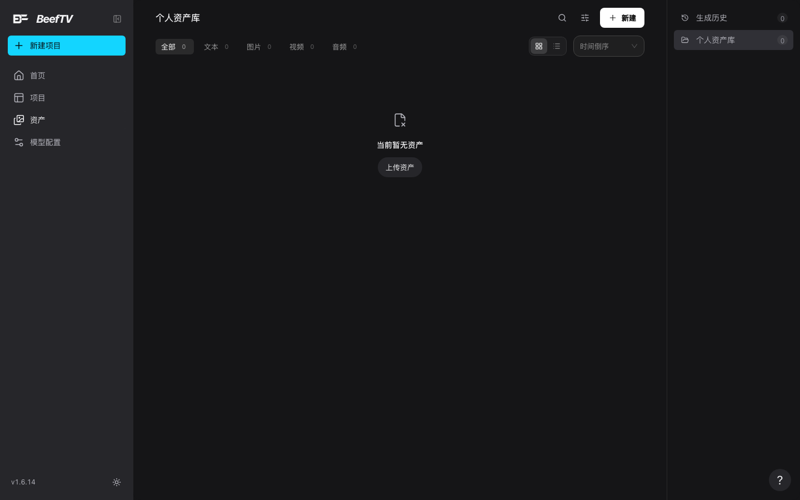
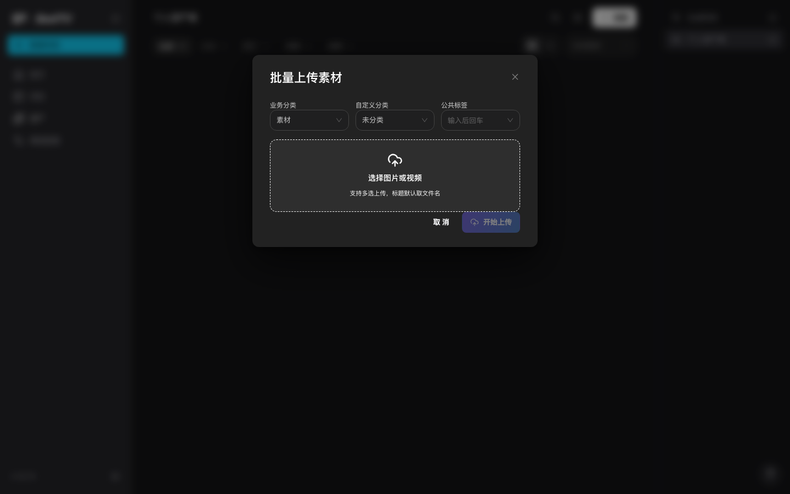
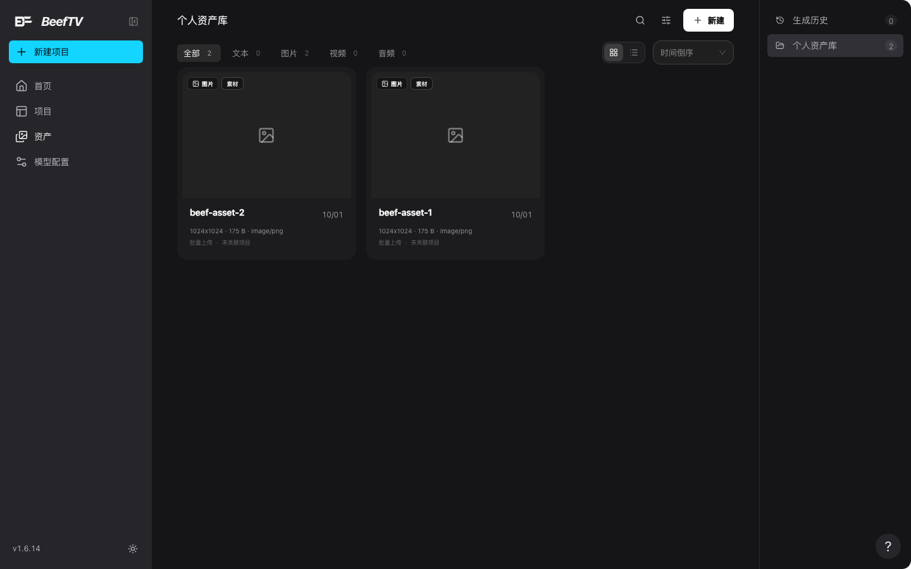

# 素材库（资产页）

> 适用角色：所有用户。
> **这是产品里代码量最大的一个界面页，而本手册此前对它的全部记录只有路由表里的一行「资产页」。** 下面先讲它长什么样、怎么用，再讲一件更要紧的事：**你手动传上去的素材，只存在这台电脑上。**

## 素材库长什么样

从左侧导航的「**资产**」进入，页头是「**个人资产库**」，右上角三个控件：搜索、筛选、「**+ 新建**」。

页头往下依次是：

- **类型页签五个**：全部 / 文本 / 图片 / 视频 / 音频，每个后面带数量；
- **视图切换**：网格视图 / 列表视图；
- **排序下拉**：时间倒序 / 时间正序 / 名称排序。

<figure>
  
  <figcaption>素材库空态：五个类型页签都带数量，右侧还有「生成历史」一栏</figcaption>
</figure>

::: tip 和画布库不一样：这里**有**排序
画布库翻遍页头也找不到排序（那是被写死成「最近更新」的，见 [manage-canvases.md](manage-canvases.md)），**素材库则有三种排序可选**。同样是「列表页」，行为并不一致。
:::

## 上传素材

点右上「**+ 新建**」→「**上传资产**」，弹出「**批量上传素材**」：

- 上方可设三个归属：**业务分类**（默认「素材」）、**自定义分类**（默认「未分类」）、**公共标签**（输入后回车，可多个）；
- 中间是虚线拖放区「**选择图片或视频**」，副标题「支持多选上传，标题默认取文件名」；
- 选中后逐个列出，每项有状态：**待上传 / 上传中 / 完成 / 失败**；失败项可以单独移除；
- 底部「取消」与「开始上传」；有失败项时后者变成「**重试失败项 (N)**」。

<figure>
  
  <figcaption>批量上传弹窗：一次能设分类、文件夹和标签，支持多选</figcaption>
</figure>

只收**图片和视频**（`accept="image/*,video/*"`）。标题默认取文件名（去掉扩展名）。

传完卡片上会显示尺寸、字节数、格式、来源与关联项目：

<figure>
  
  <figcaption>卡片带完整元数据：尺寸、体积、格式、来源、是否关联项目</figcaption>
</figure>

## 筛选面板

点页头那个漏斗图标（无障碍名「筛选资产」），展开一块标题为「筛选」的面板，里面**五组**：

| 分组 | 选项 |
|---|---|
| 资产来源 | **个人资产库**（带总数）/ **生成历史**（点了会跳到另一个网址 `/assets?tab=history`） |
| 素材类型 | 全部 / 文本 / 图片 / 视频 / 音频，**每一项都带数量** |
| 标签与分类 | 全部分类 / **角色 / 场景 / 道具 / 素材 / 其他**，同样各带数量 |
| 我的分类 | 全部 / 未分类 /（你自己建的），各带数量 |
| 项目来源 | 全部项目 /（各个项目名）——**只有素材关联过项目时这一组才出现** |
| 快捷筛选 | **最近使用**（近 30 天）/ **我的收藏**，各带数量 |

**「回收站」不在这五组里**，它是面板下方一个单独的入口（带警示色）。点进去是回收站视图，再点一次切回素材库。

::: tip 「最近使用」和「我的收藏」互斥
勾一个会自动取消另一个，而且点「项目来源」里的某个项目时也会取消这两个——**它们是同一个位置上的三种互斥筛选**，不是可以叠加的条件。
:::

## 管理「我的分类」

「我的分类」那一组的标题右边有个加号，点开是「新建分类」弹窗。**已有的分类每一行右边还有两个按钮**：

- **重命名**：弹窗标题会变成「重命名分类」；
- **删除**：确认框里写明「**分类删除后，其中的素材会移至未分类，素材文件会保留**」——**只清分类归属，不删素材文件**，这一点值得放心。

删除完成的提示是「已删除分类「名称」，其中素材已移至未分类」——**「名称」是占位，实际会显示你删掉的那个分类的名字**。新建/重命名分类成功的提示是「素材分类已创建」/「素材分类已重命名」。

::: warning 同一件事有三种叫法
「我的分类」里的这个东西，在同一个页面里就有三种叫法：右上角菜单里写「**新建文件夹**」，筛选区旁边的加号按钮和弹窗标题写「**新建分类**」，操作成功的提示又变成「**素材分类已创建**」。找功能时这三个词都得试一遍。

顺带一个**反直觉的行为**：**同名分类可以随便建，系统不会拦你，也不会提示。** 后端其实准备了一条「已存在同名素材分类」的重名拦截，但如后文所说那条路径当前走不到，这个提示你大概率永远见不到——建出两个同名分类之后，只能靠自己留意。
:::

素材卡片的「更多」菜单里有一组操作，**其中几项按素材类型决定出不出现**：

| 菜单项 | 出现条件 |
|---|---|
| 编辑 | 文本、图片 |
| 编辑标签 | 所有类型 |
| 复制文本 | 仅文本 |
| 下载 | 图片、视频、音频、模型 |
| 收藏 / 取消收藏 | 所有类型 |
| 移动到分类 | 所有类型（带二级菜单，列出各分类） |
| 移入回收站 | 所有类型 |
| 彻底删除 | 所有类型 |
| 还原到素材库 | **仅回收站视图**（此时只有它和「彻底删除」两项） |

::: tip 回收站里的素材会显示到期时间
切到回收站视图后，卡片上不再显示尺寸与体积，而是换成一条**带警示图标的保留期限提示**（默认 **30 天**，实际值随账号的运行时限制而定）。留底要在到期前做。
:::

## 要紧的事：手动上传的素材只存在这台电脑上

实测（v1.6.14）：在素材库批量上传两张图片后，**换用一个全新的浏览器（没有任何本地数据）打开 `/assets`，看到的是「当前暂无资产」**——刚才传的两张都不在了；服务端的素材表也是空的。

它们存在浏览器的 **localForage（IndexedDB）** 里。这和画布封面那种直接放 localStorage 的不太一样，但结论一样：**换设备就没有，清掉站点数据就没了。**

### 为什么没同步过去

::: warning 下面三条依据是**读源码推出来的**，不是运行时观测
上一段的「实测」来自真实浏览器：素材传完确实传不到别的设备去。而**这一节回答的是「为什么」，它的每一条依据都来自读源码**——那些写死的常量、那句 `return false`、那个闲置的接口。本机没有可用的远端账号，这三条无法在真实界面上复现成一次可观测的操作。**所以「同步代码写好了、只是被常量挡在门外」是源码结论，不是实测结论。**
:::

这里有个容易被误会的地方：**同步的代码是写好了的**，只是每一步都被一个写死的常量挡在门外。

1. **上传收尾确实调了同步函数**。批量上传全部完成后有一句 `persistWorkspaceAssetChanges()`——看起来该同步了。但它内部是「**有远端会话才同步**」，而这个判断函数在源码里**直接 `return false`**。那一步永远不执行。

2. **页面里有一条完整的「远端列表」分支**。它会去取一页素材，还专门做了「远端为空就回退本地」的兜底逻辑。但那个取数函数**名字和调用点都叫 remote，读的却是同一个本地 store**——只做本地过滤和本地分页，一个请求都不发。而它所在查询的开关是 `enabled: remoteMode`，`remoteMode` 由「是否本地工作区」决定，**那个值在代码里是写死的 `true`**，于是 `remoteMode` 恒为 false，整条分支根本不执行。

3. **服务端的素材列表接口是闲置的**。`GET /assets` 支持分页、类型、分类、文件夹、搜索，后端实现也完整，但**前端没有任何一处去调它**。

所以准确的说法不是「忘了做同步」，而是：**素材这一侧的每个同步出口都被一个写死的常量关上了**。注意这不等于「所有东西都不上传」——**画布内容确实会上传**（画布保存是无条件发出的写请求，见 [30-concepts.md](../30-concepts.md)），它那条路径上恰恰没有这道关卡。**同一个产品里，两条同步链路的待遇不一样。**

**这意味着**：

- 手动上传的素材**不会换设备、不会备份**；清掉站点数据就没了；
- 它也**不会计入账号的素材配额**——服务端根本没有这一行数据可统计（见 [storage-quota.md](storage-quota.md)）。

::: tip 「两套文件夹」现在其实「两套都在本机」
画布库有文件夹，素材库也有文件夹，界面上都叫「文件夹」，很容易以为素材那套会跟着账号走。**在当前版本里它不会**：服务端 `/asset-folders` 那组接口是注册好、能正常响应的，但页面只在「远端模式」下才去调它，而如上所述那个开关恒为关——实际写入的是浏览器本地存储。

两套文件夹、两个存储位置、两个名字，**但今天都换不了设备**。画布库那套还额外受限于「服务端压根没有画布文件夹这个概念」，见 [manage-canvases.md](manage-canvases.md)。
:::

## 相关页面

- 往画布里插素材、作为连线参考：[upload-materials.md](upload-materials.md) · [connect-references.md](connect-references.md)
- 画布库（另一套文件夹与归类）：[manage-canvases.md](manage-canvases.md)
- 什么会触发上传、什么只在本机：[../30-concepts.md](../30-concepts.md)
- 账号配额与容量：[storage-quota.md](storage-quota.md)
