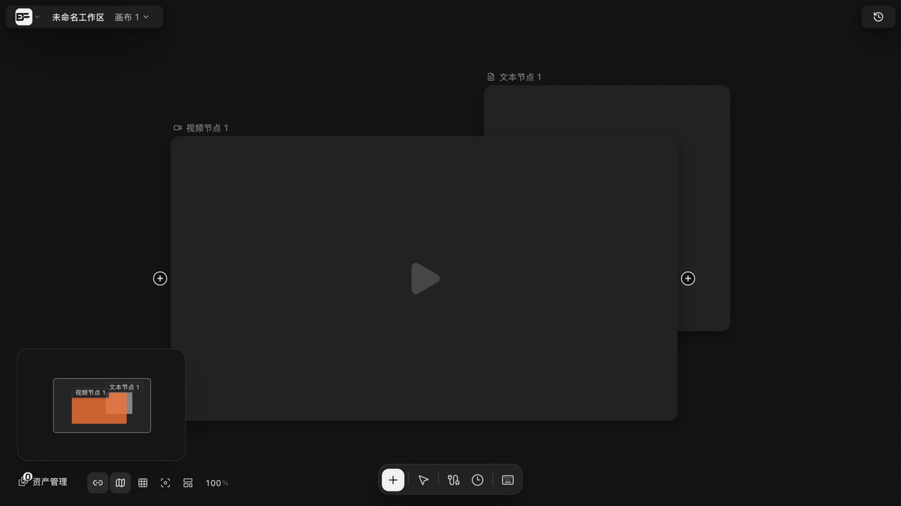
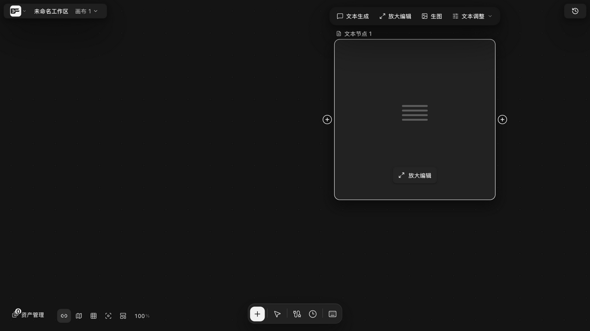
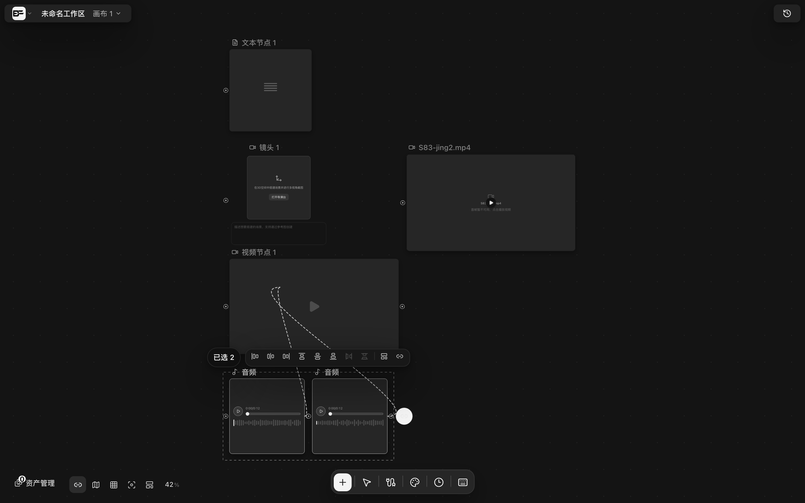

# 连线引用：拖线、吸附、快速创建与批量连线

> 适用角色：所有用户 ｜ 生成操作涉及按量计费。

## 目标

用连线表达「素材 → 生成」的引用关系；掌握快速创建与批量连线两个效率技巧。

## 基本拖线

1. 把鼠标悬停在节点边缘（或选中节点），左右两侧出现圆形「+」侧栏轨道；
2. 从「+」按住拖出，出现连线预览；
3. 拖近目标节点时有 **56px 圆形吸附**（按屏幕像素计算，任何缩放下手感一致）；靠近但方向不合法时显示「靠近但不吸附」状态；
4. 松手在合法目标上即建线。方向自动归一：生成配置（Config）恒为连线目标。

## 引用规则

- 上游资源自动成为下游生成节点的参考素材；上游文本自动拼入提示词；
- **连线顺序 = 引用编号顺序**（引用 1、引用 2……）；调整顺序只需调整连线左右槽位，不影响其他连线；
- 同端点重复连线只更新锚点比例，不会出现重复线。

## 快速创建（两个入口）

- **拖线松手在空白**：弹出「引用该节点生成」快速创建菜单，菜单位置跟随源节点；
- **点击「+」端口但位移 ≤5px**（视为点 pin）：同样弹出快速创建菜单；
- 从菜单选择要创建的下游节点类型，创建后自动建线、选中并打开提示词面板。

## 批量连线

1. 选中 **≥2 个**节点（实测：选中两个音频节点后状态栏显示「已选 2 / 连接 2 个节点」）；
2. 按 **Alt+L**，或点选区工具条上的「**批量连接**」按钮（选区工具条还有六向对齐、水平/垂直等距、创建分镜组等；等距需选中 ≥3 个才可用，完整清单见 [organize-canvas.md](organize-canvas.md)）；
3. 进入批量连接模式后，悬停到目标节点即可看到**连线规划预览**：系统按规则把有效/部分有效/无效连线一并规划，确认后批量创建并汇总跳过数。

### 哪些节点不能当批量连接的「源」

这三类节点会被**直接从源列表里剔除**（不是「连不上」，是根本不会进入规划）：

| 节点 | 原因 |
|---|---|
| **背板 / 文件夹** | 背板不能作为连接源 |
| **分镜脚本** | 分镜脚本需要按行连接 |
| **生成配置** | 生成配置不能作为聚合连接源 |

### 目标节点一侧的限制

- **不能连到绘图节点**——会直接报「批量连接暂不支持创建绘图，请先连接到普通节点」；
- **不能连到生成配置节点**（除非配了工作流插件且已启用，此时会提示「RunningHub 工作流插件未启用」）。

### 提示怎么读

批量连接的汇总提示形如「**已连接 N 个节点，跳过 M 个**：<原因>」：

- **M = 真正跳过 + 重复连线之和**——已经连过的算「跳过」但不算错误；
- ::: warning 原因只显示第一条
  如果同时有多种跳过原因，提示里**只出现第一条**。看到「跳过 3 个：目标节点不能连接到自身」并不意味着只有这一个原因——其余的要看规划预览逐条核对。
  :::
- 只有存在**真跳过**时才是黄色警告；若只是重复（没连错），提示走的是绿色成功样式，同样带「跳过 M 个」但**不带原因**。

## 换参考（不删线的重连替代）

 BeefTV **不支持拖动既有连线端点改接**。两种替代：

- 把线拖进提示词面板，松手在某个参考 chip 上即替换该参考；
- 删除连线后重新连接。

## 删除

- 点击连线选中（16px 透明命中区），按 Delete；
- 右键连线 → 「删除连接」。

## 相关页面

- 提示词与 @mention：[prompts-and-mentions.md](prompts-and-mentions.md)
