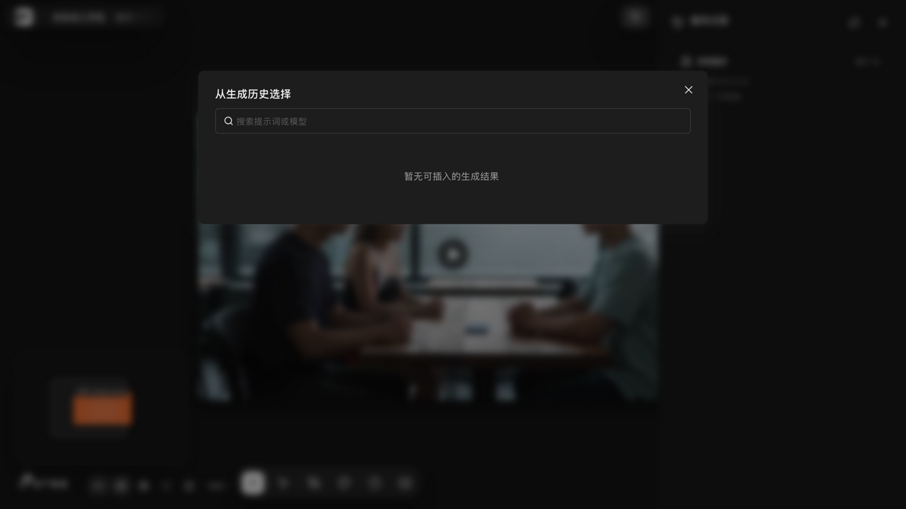
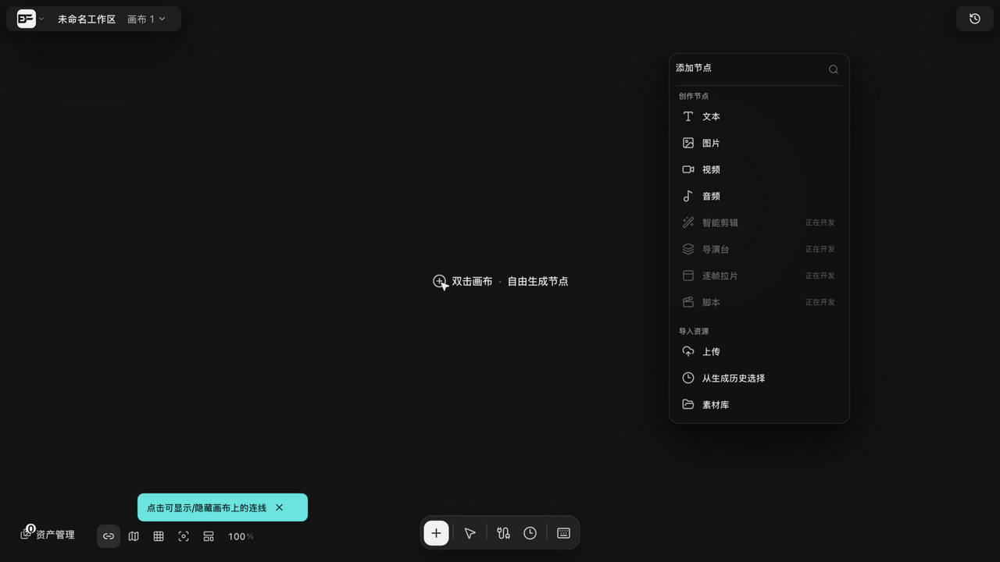
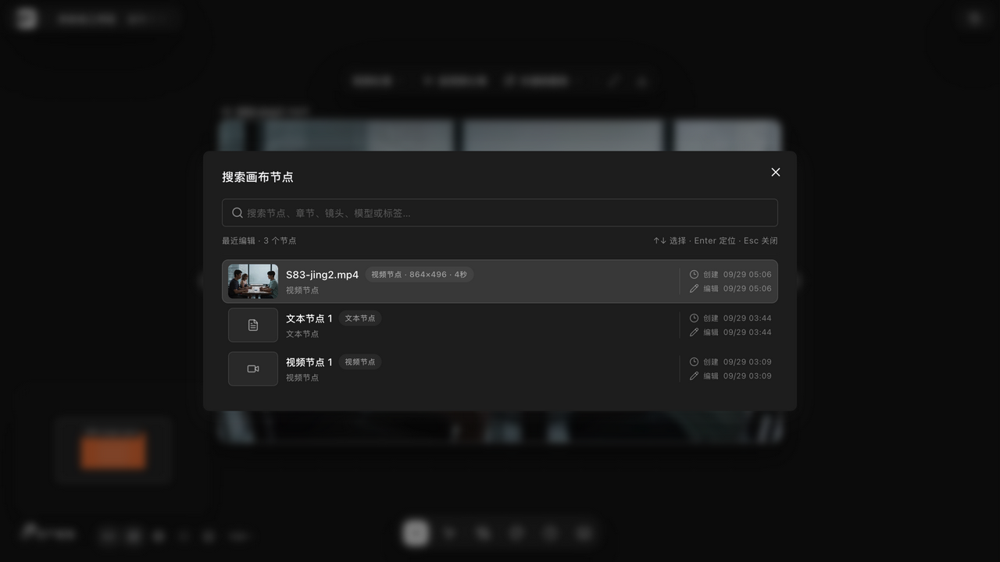

# 创建各类节点

> 适用角色：所有用户 ｜ 生成类节点操作涉及按量计费。

## 目标

在画布上创建任意类型的节点，并完成重命名、缩放与删除。

## 空画布只有一种样子（短剧引导那套进不去）

新建的画布中间是空的，写着「双击画布 · 自由生成节点」。**不管建几张画布，看到的都是这一种。**

源码里其实写了**四种**空画布形态，你在界面上只会遇到**两种**：

| 形态 | 界面上长什么样 | 你会遇到吗 |
|---|---|---|
| 普通空画布 | 中间一行「双击画布 · 自由生成节点」 | 会，这是默认形态 |
| 关联项目画布 | 标题是项目名，副标题「项目画布为空」，下面三个按钮：添加首章 / 项目资产 / 新建文本 | 会，但前提是这张画布真的关联着某个项目 |
| 短剧引导 | 标题「从哪里开始？」，两张卡片：创建短剧流水线 / 从空白画布开始 | **不会，没有任何入口** |
| 非空 | 不显示空状态 | 画布上有节点时 |

**短剧引导那一套值得单独说一句**：它的界面组件和「创建短剧流水线」的动作**都还在代码里**，渲染条件也写得清清楚楚——但**条件永远不成立**。让画布切到短剧引导靠的是 `starterMode` 字段，而**没有任何一处代码把它设成 `"guided"`**（能找到的赋值只写了 `"freeform"`，对应界面上那个「从空白画布开始」的按钮）。所以这套界面**进不去，不是被隐藏、也不是被删了**——它是入口被摘掉了，分支本身没坏。

**同一处还有第二件进不去的事**：普通空画布上原本有四个快捷入口——**故事脚本生成、角色三视图、全能参考生视频、音频生视频**（源码注释写着「实现都还在，等对应工作流就绪再放出」）。它们被一个写死的开关关着，**所以你看到的空画布真的只有那一行字**。要建这四类节点，走下面的「五个创建入口」。

::: warning 别和新建创作页的那四张卡片搞混
[新建创作（`/create`）](create-workspace.md) 页面下方也有**四张**快捷卡片，但**那是另一批、而且是正常可见的**：生成第一个镜头 / 从参考图开始 / 续写故事 / 引用技能增强。

**两处都叫「四张」，内容完全不同**：一批在**新建创作页**、点一下直接开始创作；另一批在**画布空状态**、被关着所以你根本看不到。**看到这个页面时别去找那四张——它们不在这儿。**
:::

**这和下面「『添加节点』菜单全项」那节里的「正在开发」项不一样**：那些是菜单里**看得见、点了没反应**；短剧引导和上面那四个快捷入口是**界面上根本不渲染**。两种都表现为「找不到」，但你该做的下一步完全不同。

## 五个创建入口

| 入口 | 操作 |
|---|---|
| 空白右键菜单 | 右键空白 → 「添加节点」子菜单（列表形态，带搜索） |
| 双击空白 | 直接弹出「添加节点」菜单，同时清空当前选择 |
| 底部工具栏 | 点击添加按钮打开面板（网格形态） |
| 连线快速创建 | 从节点「+」端口拖线松手到空白，弹「引用该节点生成」菜单 |
| 搜索 | Ctrl/Cmd+F 打开节点搜索 |

## 「添加节点」菜单全项（逐字）

**项目画风**（项目级设置，不产生节点）——它会改变生成时实际发生什么，见 [organize-canvas.md](organize-canvas.md)

**创作节点**：

| 菜单项 | 说明 |
|---|---|
| 文本 | 富文本提示词/便签 |
| 图片 | 图片素材或生成结果 |
| 视频 | 视频素材或生成结果 |
| 音频 | 音频素材或生成结果。**做配音/音效就走这个节点**（见 [generate-audio.md](generate-audio.md)） |
| 智能剪辑 | 正在开发：灰度 / Canny 边缘 / AI 线稿 / 深度图 / 姿态骨架 |
| 导演台 | **可用**（v1.6.7 起解禁）：点击弹出「选择镜头模板」，创建「镜头」节点后从节点打开 3D 导演工作台 |
| 逐帧拉片 | 正在开发。**注意它不创建背板**——触发的是「先选中一个视频节点，再打开逐帧拉片」的拉片分析弹窗 |
| 脚本 | 正在开发 |
| 绘图 | 手绘白板 |
| 文件夹 | **6 款样式**（玻璃 / 层叠 / 午夜 / 纸感 / 影院 / 紧凑）。底层是 Frame 节点，创建后默认折叠、标题「我的文件」；**没有**单独的「背板」菜单项，详见 [organize-canvas.md](organize-canvas.md) |
| 批量创作表 | 表格式批量编排（1280×560，参考列 ≤6 组，并发 10） |

**工作流**：创建的是**生成配置节点**（标题默认「生成配置」，480×390），选 RunningHub 提供方后标题变「RunningHub 工作流」——菜单叫「工作流」、节点叫「生成配置」，是同一个东西，详见 [30-concepts.md](../30-concepts.md)

**导入资源**：上传 / 添加角色卡 / 从生成历史选择 / 素材库

::: tip 「为什么我找不到某个菜单项」
部分菜单项**按条件显示**，不是一直都在：

| 菜单项 | 出现条件 |
|---|---|
| 项目画风 | 仅在**未**关联项目时出现 |
| 音频 / 导演台 / 逐帧拉片 / 工作流 | 恒显示——见下方说明 |
| 添加角色卡 | 仅在**已关联项目**时出现 |
| 素材库 | 仅在**未关联项目**时出现 |
:::

::: tip 源码里有「simple 模式」，但你切不到
这四项在代码里都带一个 `workspaceMode !== "simple"` 的条件，而应用把工作台模式**硬编码**为 `professional`（不是可切换的设置），设置页里也没有对应开关。
**实际效果：这四项恒显示。** 如果你按别处的介绍去找「简易模式」开关，找不到是正常的——当前版本没有这个切换。
:::

> 实测（v1.5.7）：双击弹出的**列表形态**菜单显示创作节点与导入资源两段；**绘图、文件夹、批量创作表**三项默认不显示，在搜索框输入名称即可创建。底部工具栏「添加节点」按钮打开的网格面板包含全部项。
>
> 实测（v1.6.13）：「导演台」已不再标「正在开发」，点击直接弹出**「选择镜头模板」**（空场景/单人对白/双人对话/人物走位/产品道具镜头），选定后在画布创建「镜头 N」节点；智能剪辑/逐帧拉片/脚本仍置灰。

> 实测（生成历史弹窗，运行时 DOM 取证）：点击「从生成历史选择」打开同名弹窗，含搜索框（占位文案「搜索提示词或模型」）；没有可复用结果时显示空态「暂无可插入的生成结果」。底栏工具条的「生成历史」按钮打开的是同一弹窗。

## 重命名

- 普通节点：鼠标悬停标题，点击标题（出现铅笔图标）进入编辑；Enter 提交、Esc 取消；**清空内容会自动回退为原标题**。
- Frame / 文件夹：双击标题进入编辑。

## 缩放

- 选中或悬停节点后拖四角手柄（热区 28px）；
- 图片/视频默认**锁定比例**；如需自由拉伸，用图片工具栏解除锁定比例（freeResize）；
- 图片导入后会按原始比例自适应到 420×236 ~ 720×520 之间；手动调过尺寸（manualSize）后系统不再自动调整。

选中文本节点后，上方出现快捷工具栏（文本生成 / 放大编辑 / 生图 / 文本调整），左右两侧是「+」连接轨道。

## 双击节点的行为

| 节点类型 | 双击效果 |
|---|---|
| 图片（有内容） | 打开大图查看 |
| 绘图 | 打开绘图白板 |
| 文本（角色卡） | 查看角色详情 |
| 文本 | 进入文本编辑 |

## 删除

- 选中后按 Delete / Backspace：**若当前选中的是连线则优先删连线**，否则删节点；
- 也可以用节点**右键菜单**的「删除节点」；
- ::: tip 节点工具条上没有删除按钮
  不少软件把删除放在工具条上，BeefTV 不是——工具条里只有该节点类型的处理动作（图片是替换/裁剪/下载，视频是视频处理/分离/截帧等）。删除统一走 `Delete` / `Backspace` 或右键菜单。
  :::
- 删除是不可逆操作前会进入回收站的项可在「版本历史/回收站」找回（见 [undo-history-versions.md](undo-history-versions.md)）。

## 相关页面

- 连线与引用：[connect-references.md](connect-references.md)
- 上传素材：[../10-tasks/upload-materials.md](upload-materials.md)
