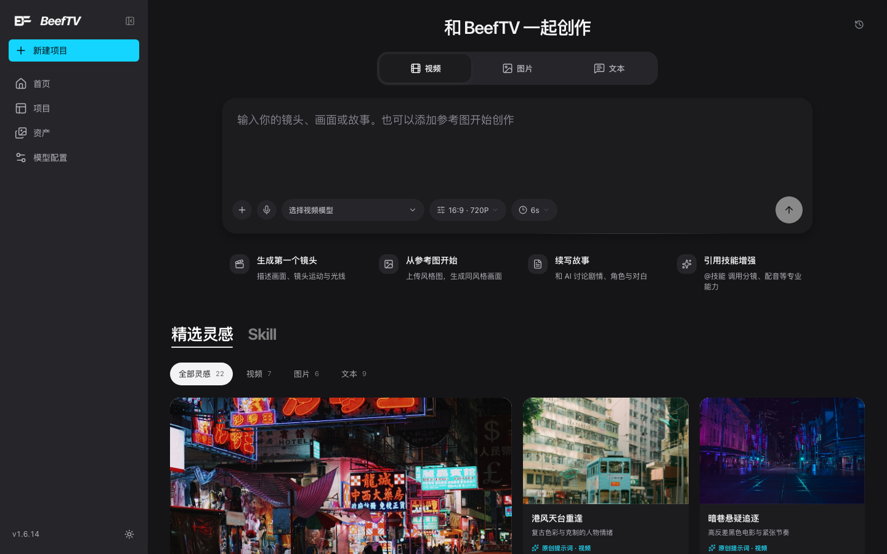
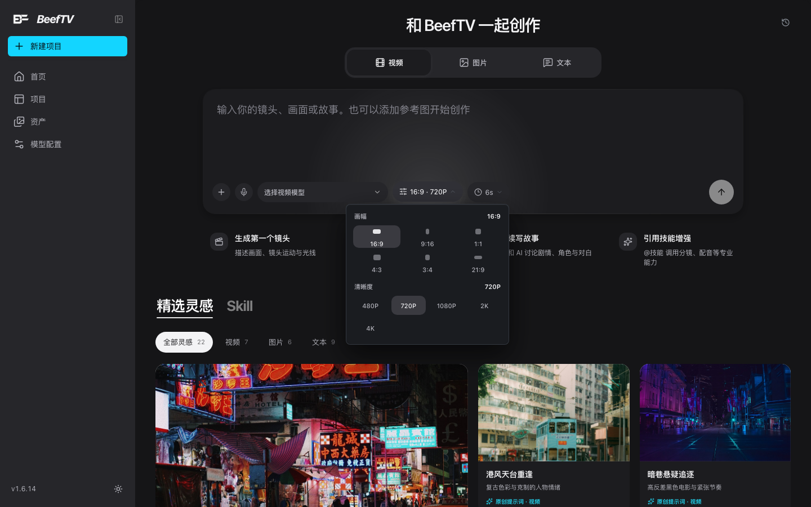
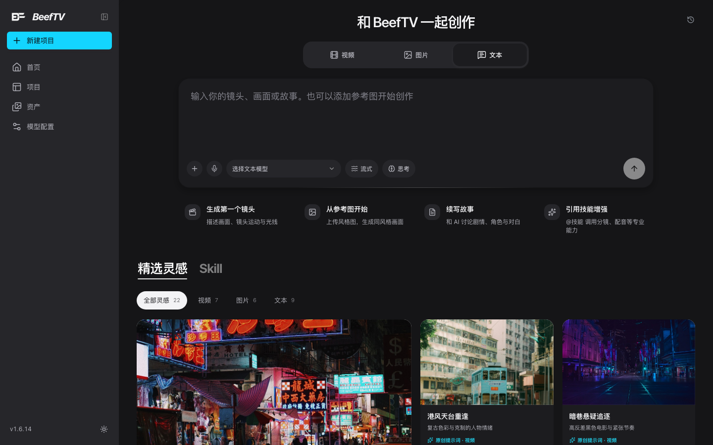
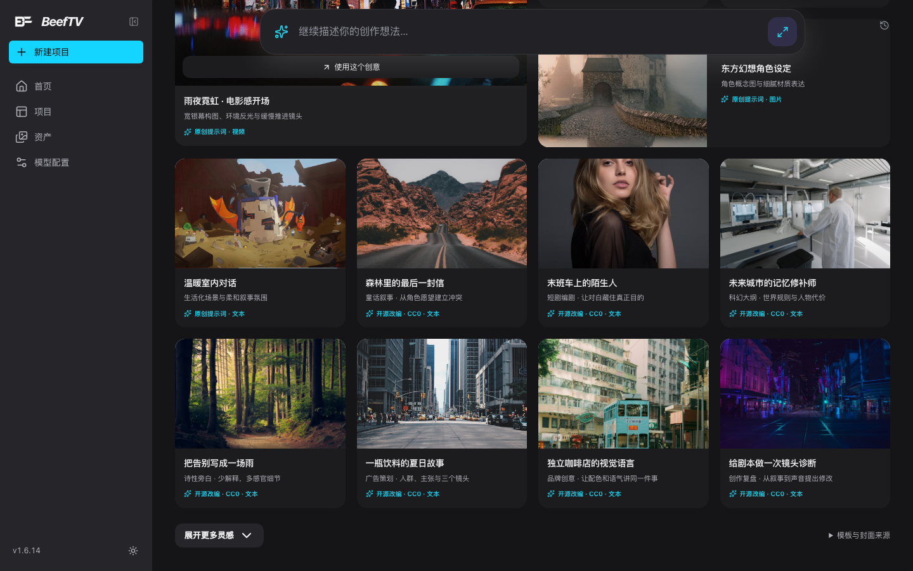

# 新建创作（`/create`）

> 适用角色：所有用户。
> **这是产品里体量第三大的页面目录**（`web/src/pages/create`，v1.6.16 实测 **2790** 行；前两名是画布工作区 `canvas` 与项目工作区 `projects`），而本手册此前对它只有路由表里的一行。页面本身是**免费的**——在这里选模式、调参数、翻灵感都不花钱；**只有真正按下发送开始生成才计费**。

## 页面长什么样

从左侧导航「**新建项目**」或直接访问 `/create` 进入。整页从上到下就四块：

1. 标题「**和 BeefTV 一起创作**」，右上角一个历史对话按钮；
2. **三个创作模式页签**：视频 / 图片 / 文本（分段控件，带图标）；
3. **输入区**：一个大文本框，底边一排工具；
4. **快捷入口四张卡** + **精选灵感 / Skill** 两个页签的创意墙。

输入区底边那排工具从左到右是：**加号**（添加参考内容）、**麦克风**（实时对话）、**模型下拉**、**参数下拉**、最右一个**发送箭头**。

<figure>
  
  <figcaption>默认停在「视频」模式；下方四张卡是快捷入口，创意墙按类型分栏</figcaption>
</figure>

## 三种模式的控件不一样

**这是这一页最需要先看懂的地方**：切模式不只是换个图标，**可调的参数会整体换掉**。

| | 视频 | 图片 | 文本 |
|---|---|---|---|
| 模型下拉 | 「选择视频模型」 | 「选择图片模型」 | 「选择文本模型」 |
| 参数下拉 | 「16:9 · 720P」 | 「1:1 · 自动 · 1」 | **没有** |
| 独立控件 | 时长「6s」 | — | **流式**、**思考** 两个开关（默认「流式」开） |

点开参数下拉，里面是**完全不同的两套设置**：

| 视频模式（画幅 / 清晰度） | 图片模式（分辨率 / 宽高比 / 质量 / 数量） |
|---|---|
| **画幅** 6 项：16:9 / 9:16 / 1:1 / 4:3 / 3:4 / 21:9 | **分辨率** 4 项：1K / 2K / 4K / 自动尺寸 |
| **清晰度** 5 项：480P / 720P / 1080P / 2K / 4K | **宽高比** 10 项：1:1 / 3:2 / 2:3 / 4:3 / 3:4 / 4:5 / 5:4 / 16:9 / 9:16 / 21:9 |
| — | **图片质量** 4 档：自动 / 低 / 中 / 高 |
| — | **生成数量**（仅当所选模型支持一次出多张时才有这一栏） |
| — | 另有可折叠的「自定义比例或尺寸」 |

<figure>
  
  <figcaption>视频模式的参数面板：只有画幅与清晰度，没有质量与数量</figcaption>
</figure>

<figure>
  
  <figcaption>文本模式没有参数面板，取而代之的是「流式」「思考」两个开关</figcaption>
</figure>

::: tip 两处容易记混
- **画幅**（视频）是 6 项，**宽高比**（图片）是 10 项——多出来的 3:2、2:3、4:5、5:4 只有图片模式有。
- **清晰度**用 480P/720P/1080P 起跳，**分辨率**用 1K/2K/4K 起跳。同一个「大小」概念，两套刻度。
:::

::: tip 「生成数量」这一栏不是固定 4 张
它**跟着你选的图片模型走**：能出几张，取决于那个模型本身的能力上限（一次性出不了多张的模型，这一整栏根本不出现）。自定义输入框的范围也是 1 到那个上限。换模型后回来再看，数量档位可能就变了。
:::

## 四张快捷入口卡

输入区下面四张卡，各自对应一套预置动作（点一下就帮你把提示词填好）：

| 卡片 | 副标题 | 点了会发生什么 |
|---|---|---|
| **生成第一个镜头** | 描述画面、镜头运动与光线 | 切到**视频**模式，填入一段现成的雨夜天台提示词 |
| **从参考图开始** | 上传风格图，生成同风格画面 | 切到**图片**模式，并**直接打开素材库选择器**让你挑参考图 |
| **续写故事** | 和 AI 讨论剧情、角色与对白 | 切到**文本**模式，填入「帮我续写一个短剧故事…」 |
| **引用技能增强** | @技能 调用分镜、配音等专业能力 | 切到**视频**模式，填入「调用分镜技能…」 |

注意有**两张卡都通向视频模式**（第一张和第四张），所以点了它们模式会从文本/图片跳回视频——这是设计如此，不是 bug。

## 精选灵感

创意墙有两个页签：**精选灵感** 和 **Skill**。

- 精选灵感共 **22 条**，按类型分栏：**文本 9 / 视频 7 / 图片 6**；
- 每条卡片有大图、标题、一句说明，右下角标注来源：**「原创提示词」** 或 **「开源改编 · CC0」**。22 条里 **8 条是 CC0 改编**（全部在文本栏），其余 14 条是原创；
- 底部有「**展开更多灵感**」（每次多放 12 条），当前类型全部放完后就变成「已展示全部 **N** 个创意」——**N 是当前筛选出的条数**，不是总数 22（筛到「视频」时它会写 7）；
- 最下面还有个「**模板与封面来源**」的折叠说明，指向 `awesome-chatgpt-prompts`（CC0 授权）。

点任意一条就会把它的提示词填进输入框——**整张卡片就是一个按钮**，鼠标移到图片上会浮出一层「**使用这个创意**」的遮罩作为提示。

::: warning 点创意会顺手把你的模式也切掉
每条创意自带一个类型，**点它等于同时做两件事：切到那个类型 + 填入它的提示词**。你正在写视频，突然点了一条文本创意，就会被切到文本模式——接着要点「视频」才能切回来。
:::

列表里**第一条总是排得最大**（不管当前筛选出的是什么类型），其余条目按四列网格排。

<figure>
  
  <figcaption>往下翻时会浮出一条精简输入条，创意卡片逐条标注「原创提示词」或「开源改编 · CC0」</figcaption>
</figure>

::: tip 往下翻时输入框不会消失
往下滑看创意时，顶部会浮出一条精简输入条「**继续描述你的创作想法…**」——照样能改提示词、照样能发。它右边还有个「**展开完整创作区**」按钮，点一下就滚回顶部拿回完整的大输入框。
:::

## 还没配模型时会看到什么

第一次用这页、模型还没配好时，点模型下拉会弹出一句：

> **当前没有可用模型，请联系管理员或检查模型配置**

**这句话在本地部署下有点误导**——BeefTV 跑在本地工作区时，模型是**你自己配**的，没有「管理员」可找。该做的是打开左侧导航的「**模型配置**」，新增一个渠道并填好 API 地址与密钥，保存后回来点「拉取全部」把模型列表拉下来。

模型选择器其实有三种空态文案，别混淆：

| 情况 | 提示 |
|---|---|
| 一个模型都没配 | 当前没有可用模型，请联系管理员或检查模型配置 |
| 有模型，但当前输入用不上 | 暂无支持当前输入的{生图/视频/文本/音频}模型 |
| 有模型，但当前筛选没匹配上 | 暂无匹配的{生图/视频/文本/音频}模型 |

## 关于计费

**这一页上所有操作都是免费的**：切模式、开参数面板、翻灵感、点「使用这个创意」都只改本地状态。**只有把提示词发出去、真的开始生成，才会按量计费**。本手册的所有实测都停在发送之前。

## 相关页面

- 生成结果在画布里怎么用：[发起视频生成与素材限制](generate-video.md) · [发起图片生成](generate-images.md)
- 模型与渠道怎么配：[参考：快捷键全表、路由与端点](../20-reference.md) · [账号存储、容量与配额](storage-quota.md)
- 素材（参考图）从哪来：[素材库（资产页）](asset-library.md)
- 首页的三张能力卡：[快速开始](../00-quickstart.md)
