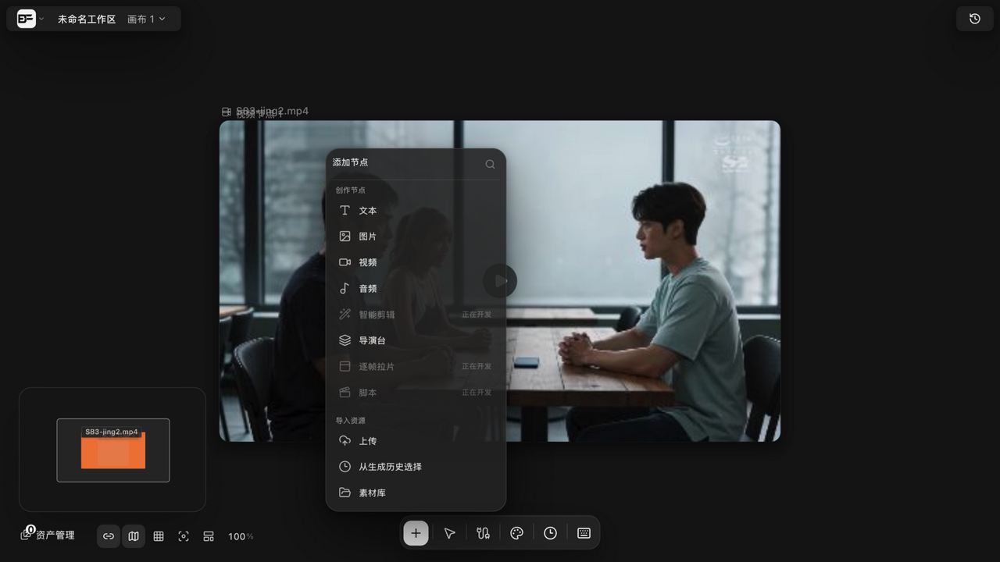
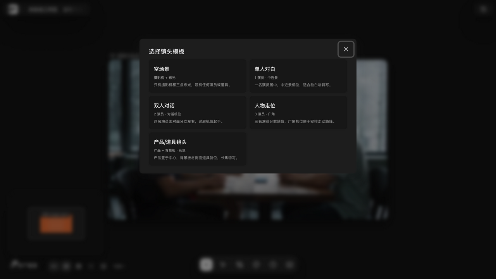
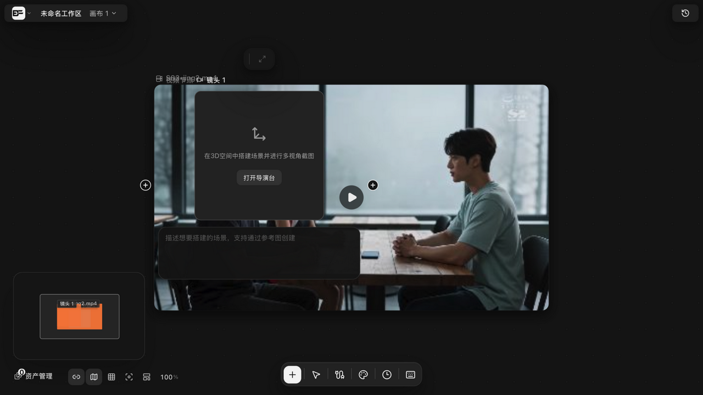
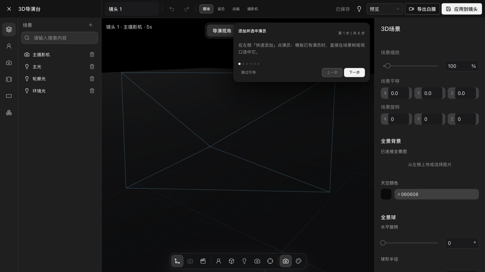
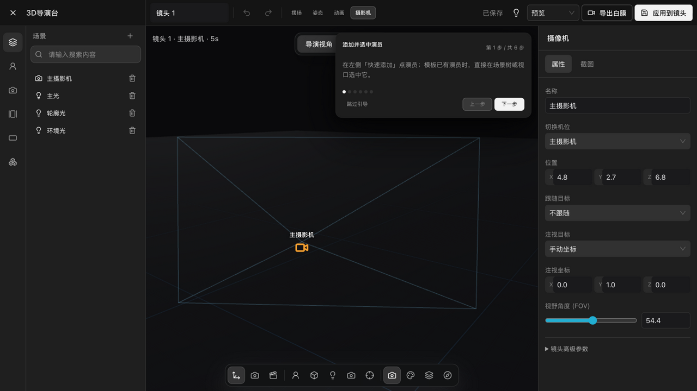

# 导演台入门：镜头、运镜与检查器

> 适用角色：所有用户 ｜ 白膜导出为本地渲染，不产生云端费用。

> 运行时实证（v1.6.13 构建实测）：入口已解禁（v1.6.7+ 移除「正在开发」），本篇流程与面板均经真实走查；旧版「焦距/光圈」检查器已重构为 FOV 直输（见下）。

## 目标

在三维导演台里摆放镜头、选择运镜，用检查器精确控制画面。

## 进入与就绪（v1.6.13 实测流程）

1. 「添加节点」菜单点「导演台」（v1.6.13 起无「正在开发」标）；
2. 弹出**「选择镜头模板」**：空场景（摄影机+布光）/ 单人对白（1 演员·中近景）/ 双人对话（2 演员·对话机位）/ 人物走位（3 演员·广角）/ 产品/道具镜头（产品+背景板·长焦）；
3. 选定后在画布创建**「镜头 N」节点**：空态卡提示「在3D空间中搭建场景并进行多视角截图」，带「打开导演台」按钮与「场景描述」输入（支持通过参考图创建）；
4. 点「打开导演台」进入 3D 工作台；模板可连续选择、一次创建多个镜头节点。

## 工作台总览

- 顶栏：场景名称（可直接改名）· 撤销/重做 · **摆场 / 姿态 / 动画 / 摄影机**四模式 · 已保存状态 · 预览画质 · **导出白膜** · **应用到镜头**；
- 左栏：场景树（主摄影机、主光/轮廓光/环境光三点布光，均带删除钮），底部快速添加（添加角色/添加机位/全景图/选择画幅比例/素材）；
- 视口：导演视角/机位视角切换、方向球正交视角（背/左/俯/右/正/重置）、底部工具条（移动/截图/动画时间轴/添加演员/添加立方体/添加灯光/添加摄影机/摄影机对齐当前视图/构图预览/彩色白膜/深度视图/法线视图等）；
- 右栏随模式切换：3D 场景（缩放/平移/旋转、全景背景、天空颜色、全景球水平旋转与半径）或对应检查器；
- 首次进入有 6 步上手引导（可跳过，可「重新开始引导」）。

## 摄影机模式与检查器（v1.6.13 重构后）

摄影机模式下右栏为**摄像机检查器**（属性/截图两个页签）：

| 参数 | 说明 |
|---|---|
| 名称 / 切换机位 | 机位命名与下拉切换（如主摄影机） |
| 位置 X/Y/Z | 数值直输 |
| 跟随目标 | 下拉选择跟随的角色或「不跟随」（v1.6.13 相机跟随） |
| 注视目标 | 下拉选择注视对象或「手动坐标」+ 注视坐标 X/Y/Z |
| 视野角度 (FOV) | 滑杆 + 数值直输（默认约 54.4） |
| 镜头高级参数 | 折叠面板（展开后为焦距/景深等高级项） |

> 旧版（≤v1.5.x）的「焦距 12–200mm / 光圈 f/0.7–32 / 景别 6 档 / 运镜 10 种」表已由上述 FOV+注视+跟随结构取代；运镜类预设现收敛在时间轴的关键帧与动作片段体系（见 [director-keyframes-record.md](director-keyframes-record.md)）。

## 三个关键按钮

| 按钮 | 行为 |
|---|---|
| 摄影机对齐当前视图 | 把镜头摆到你当前看到的视角 |
| 应用到镜头 | 把工作台状态写回画布上的镜头节点 |
| 导出白膜 | 本地渲染导出白模视频（不产生云端费用） |

## 其他

- **H 键**在导演台是「显隐切换」，与画布的抓手平移不同；
- 网格、地面与环境光自动就位；
- 会话中断（如页面刷新）后有恢复流程：能力恢复 → 重新注册 → 必要时提示重建场景。
