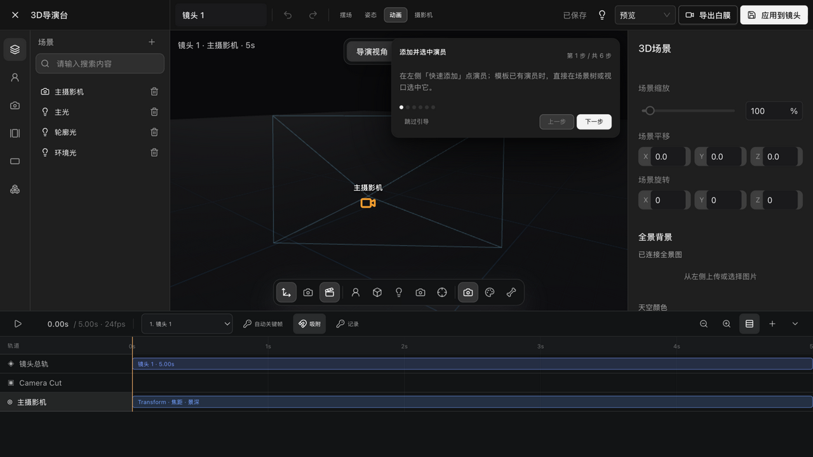
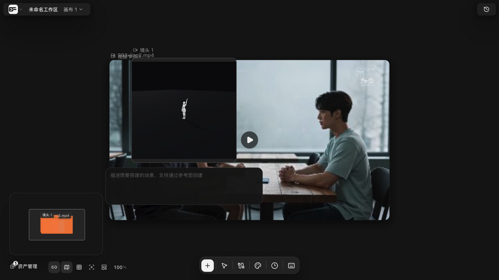

# 关键帧动画与白膜视频录制

> 适用角色：所有用户。

> 运行时实证（v1.6.13 构建实测）：动画模式时间轴与「记录」关键帧已真实走查。

## 目标

用关键帧做镜头与对象动画，并把动画录制成白膜预览视频。

## 动画模式与时间轴（v1.6.13 实测）

导演台顶栏切「动画」进入动画模式，底部时间轴包含：

- 播放控制与播放头读数（如 0.00s / 5.00s · 24fps）、**当前镜头**切换下拉、「新增镜头」；
- **自动关键帧 / 吸附 / 记录**三个开关式按钮（吸附默认开启）；
- 轨道区：**镜头总轨**（每个镜头一段，如「镜头 1 · 5.00s」）→ **Camera Cut** → 各摄影机子轨道（**Transform · 焦距 · 景深**）；添加角色后每个演员还有自己的**动作片段**轨；
- 「显示子轨道 / 隐藏时间轴 / 缩小 / 放大时间轴」视图控制。

## 关键帧

- 拖动播放头到目标时间，调整对象/镜头属性，系统自动落关键帧（AutoKey 语义）；也可选中轨道后点**「记录」**手动落帧——实测在主摄影机轨道 0.00s 生成可选关键帧（「选择 主摄影机 镜头 0.00s 的关键帧」）；
- **双播放头设计**：取值与显示用**未吸附的原始时间**，写入用**吸附到帧格的时间**——避免增量从错误起点计算产生漂移；
  - 时间轴工具条上那个**「吸附」**开关（磁铁图标，提示写「吸附到帧」）控制的就是这件事，**默认是开的**。**关掉它，播放头就不再对齐帧格**，落帧的时间会带小数——这时上面那条「写入用吸附值」也就不成立了。
  - 注意别和场景设置里的「**网格吸附**」搞混：那是视口里物体摆放的对齐，与时间轴无关。
  - 这两个中文说法是**机制名，不是界面上的字样**；界面上能看到的只有那个「吸附」按钮。
- 播放推进按帧格累积（帧率上限 **120fps**），不会随播放时长漂移。
  **注意这是导演台自己的实现**——多轨时间线的播放头是跟着预览视频的播放进度走的，两者机制不同，别互相套用（见 [时间线剪辑器](timeline-editing.md)）；
- 撤销栈为 **50 层**场景快照（重做栈同为 50），手势拖拽期间暂停记录。
  注意别和时间线混淆——**多轨时间线是 200 层**，导演台与画布一样是 50 层（见 [时间线剪辑器](timeline-editing.md)）。

## 骨骼动画

- 选中角色骨骼后可旋转摆姿势，姿势写入用吸附值；
- 骨骼控制器为屏幕恒定尺寸，共三态：**选中 5px / 常态 3.5px / 暗化 2.5px**（命中区更大），缩放时不变大变小。

## 白膜录制

顶栏「**导出白膜**」发起本地渲染导出（点击后按钮进入 loading 态，渲染在本地进行、不产生云端费用）；完成后产物进入画布**素材空间**（资产计数 +1），同时镜头节点的**场景封面**自动更新为白膜画面（v1.6.13 起封面保留，刷新画布不丢）。「应用到镜头」则把工作台状态写回画布镜头节点。录制细节见 [时间线导出 MP4 与白膜视频录制](timeline-export.md) 的「白膜视频录制」一节：两次快照时效校验、首错即停、时长探针。

## 常见问题

- 关键帧怎么删？→ 选中关键帧后删除（无效果的操作不会进入历史、不触发保存）；
- 为什么动画和预览对不上？→ 确认没有在两个帧格之间记录关键帧——写入始终落在吸附值上。
