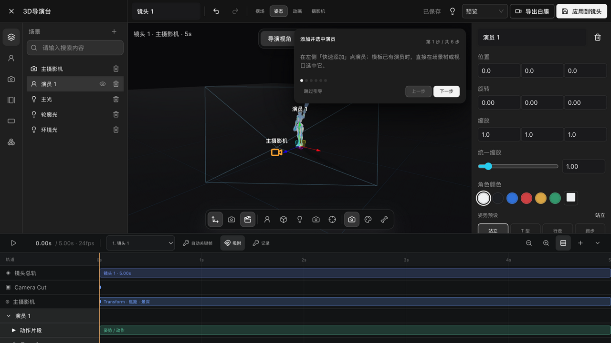

# 角色骨骼与姿势

> 适用角色：进阶用户。

> 运行时实证（v1.6.13 构建实测）：内置演员的 rig 面板已真实走查。

## 目标

给场景中的角色启用骨骼控制：自动识别骨骼、摆姿势、做骨骼动画。

## 添加演员（v1.6.13 实测）

导演台左侧「添加角色」或视口工具条「添加演员」即可在场景中心放入一名内置演员（如「演员 1」）：白模人偶带骨骼显示，场景树与时间轴同步出现对应条目（时间轴新增该演员的**动作片段**轨）。右栏「骨骼视图」按钮可切换骨骼可视化。

> **这张图拍于 v1.6.14，基线是 v1.6.22**：单选时「姿势预设」那一栏的**标题与取值都没变**，
> 所以**单选场景这张图仍然对得上**。但 v1.6.22 **新增了多选形态**——
> 同时选中多个对象时，这一栏右侧会显示「**混合**」而不是某一个姿势名。
> **图中拍的是单选，所以看不到这个差异。**

## 自动骨骼识别（rig 推断）

- 导入模型后，系统按骨骼**名称**自动识别人形骨架（兼容 mixamo、UE、通用命名与数字后缀等四套惯例，覆盖含手指在内约 40 个骨骼位）；
- 映射到 **≥8 根**骨骼即判定 rig 可用；识别不出的骨骼走占位处理；
- 完全无法识别时，模型退化为**占位人偶**（14 关节火柴人）而不是消失——选中时高亮，仍可做基础编排。

## 模型归一化

导入的角色模型自动归一化：按最大边缩放到标准尺寸、底部落地，并标记投影。

## 姿势与控制（v1.6.13 实测面板）

姿态模式下选中演员，右栏提供：

- 变换：位置 / 旋转 / 缩放（XYZ 数值）+ **统一缩放**滑杆；
- **角色颜色**：6 色快速切换（白/深灰/蓝/红/黄/绿）；
- **姿势预设 20 钮**（站立/T 型/行走/跑步/坐姿/蹲下/单膝跪/双膝跪/叉腰/倚靠/鞠躬/思考/格斗/踢球/投掷/推进/招手/伸手/抱臂/看手机）+「重置姿态」；
- **角色绑定**：显示推断结果（实测内置演员为「49 根骨骼」）+ **骨骼控制**下拉；
- **动作片段**下拉（静态姿势等）与 可见 / 投射阴影 开关；
- ::: warning 能不能当演员，取决于你从哪个入口加进来，**与模型带不带动画无关**
  - 左栏「**添加角色**」页签 →「**添加演员**」：建出的是**演员**，拿得到姿势预设与骨骼控制；
  - 「**上传模型**」或直接点模型资产：建出的是**普通模型**，**拿不到**姿势预设与骨骼控制。

  所以「我的模型明明有人形骨骼却没骨骼控制」，多半不是模型的问题，而是它是从上传入口进来的。**不需要为了当演员去剥掉模型里的动画**——两条入口是并列的，加错了就换一个方式加。
  :::
- 骨骼控制器按手指分组，未选中的同组手指会淡化显示，避免误点。

## 常见问题

- 导入后没有骨骼控制？→ 检查模型骨骼命名是否属于四种惯例之一，且可映射骨骼 ≥8 根；
- 模型变成了火柴人？→ rig 推断失败，请更换符合人形命名惯例的模型。

## 相关页面

- 导演台整体概念与四种工作模式：[导演台入门](director-basics.md)
- 同一工作台里的关键帧动画与白膜录制：[关键帧动画与白膜视频录制](director-keyframes-record.md)
- 成片导出：[时间线导出 MP4 与白膜视频录制](timeline-export.md)
