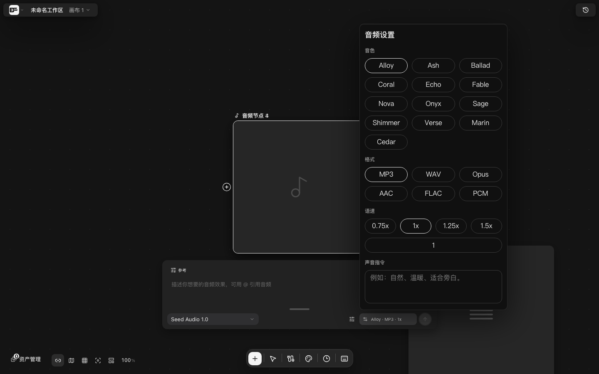

# 发起音频生成：音色、格式、语速与声音指令

> 适用角色：所有用户 ｜ **本页的「生成」动作按量计费**；打开与调整设置本身不产生费用。

> 运行时实证（v1.6.16 构建实测，2026-10-01）：添加节点菜单、音频节点、音频设置面板均经真实浏览器走查并截图；下述音色 13 项、格式 6 项、语速 4 预设、默认「Alloy · MP3 · 1x」为**运行时实测值**。「生成」提交未执行——触发生成需付费，故提交后的任务状态表现仅有源码证据。

## 目标

用音频节点把文字变成语音或音乐，并理解「为什么你看到的选项和别人的不一样」。

## 音频节点从哪来

「添加节点」菜单 → **创建节点** 分区 → **音频**（无「正在开发」标，可直接点）。

::: warning 别和「上传音频」搞混
| | 音频**生成**节点 | 上传的音频文件 |
|---|---|---|
| 入口 | 添加节点 → 音频 | 上传文件 / 拖入画布 |
| 内容 | 空态，填提示词后生成 | 已有播放器与波形 |
| 用途 | 配音、音效、音乐 | 作为参考素材或时间线音轨 |

上传的音频节点工具条是「进入剪辑 / 下载」；**生成**出来的音频才会出现在**媒体版本族**里，可以重试与选主版本（见 [media-versions.md](media-versions.md)）。
:::

## 打开音频设置

选中或新建音频节点，点节点底部的**「高级设置」胶囊**。胶囊上会实时显示当前摘要，形如 **`Alloy · MP3 · 1x`**——音色 · 格式 · 语速。改完参数，胶囊文字会跟着变。

## 面板里的四组设置

| 组 | 可选项 | 说明 |
|---|---|---|
| 音色 | **13 个**：Alloy / Ash / Ballad / Coral / Echo / Fable / Nova / Onyx / Sage / Shimmer / Verse / Marin / Cedar | 三列排布，点选即切换 |
| 格式 | **6 个**：MP3 / WAV / Opus / AAC / FLAC / PCM | 决定导出文件类型 |
| 语速 | 预设 **0.75x / 1x / 1.25x / 1.5x**，下方另有数值直输框 | 直输框范围 **0.25–4**，步长 0.05——预设里没有的语速可以直接输 |
| 声音指令 | 自由文本 | 占位提示为「例如：自然、温暖、适合旁白。」——可写语气、节奏、情绪 |

默认值是 **Alloy + MP3 + 1x**（实测）。

::: tip 面板里**没有**「声调」和「音量」
很多同类工具都有这两项，但 BeefTV 当前版本的面板**不提供**——不是被折叠了，也不是你漏看。源码里这两组控件仍在（声调 −12~+12、音量 0~1），但三套模型档案**全都**把它们关掉了，所以任何模型下都不会渲染。
:::

## 为什么你的选项和别人的不一样

音频设置**跟着你选的模型走**，一共三套档案。切换模型时面板会增删分组——这是设计，不是加载失败。

| | OpenAI 兼容类（默认） | MiniMax 语音 | MiniMax 音乐 |
|---|---|---|---|
| 音色 | 13 个英文名（Alloy…Cedar） | **14 个**中文音色（青涩青年 / 精英青年 / 霸道青年 / 青年大学生 / 少女 / 御姐 / 成熟女性 / 甜美女性 / 男主持人 / 女主持人 / 男有声书 1 / 男有声书 2 / 女有声书 1 / 女有声书 2） | **无**（纯音乐不需要选音色） |
| 格式 | 6 个（**含 Opus**） | 5 个（**不含 Opus**） | 5 个（不含 Opus） |
| 语速预设 | 0.75 / 1 / 1.25 / 1.5 | 0.5 / 0.75 / 1 / 1.25 / 1.5 / 2 | **无**（锁 1） |
| 声音指令 | **有** | 无 | 无 |
| 默认音色 | Alloy | 青涩青年 | — |

**Opus 只在 OpenAI 兼容类里出现**。MiniMax 那边不声明这个内容类型，所以面板直接不给你这个选项——不是被藏起来，是压根没列。

判定规则很简单：模型名里含 `minimax-speech` 走语音档案，含 `minimax-music` 走音乐档案，**其余一律按 OpenAI 兼容类处理**。所以你装的是自建/第三方语音接口，只要模型名不是上面两个，多半会落在第三列那套 13 个音色上。

## 能连什么、不能连什么（先看这条）

音频生成节点对输入**限制很紧**，这与图片、视频节点完全不同：

| 输入 | 能不能连 |
|---|---|
| 文本节点 | ✅ |
| **一张**角色卡 | ✅（一次只能一张） |
| 图片 / 视频 / 音频素材 | ❌ **一律不接受** |
| 第二张角色卡 | ❌ |

所以想在生成时参考某段已有音频，正确做法不是连线，而是把画布上已有的音频**用 @ 引用**写进提示词——这两条路不同，别混。

详见 [connect-references.md](connect-references.md) 的「角色卡」一节。

## 参考音频与提示词

音频节点同样有**参考**区，可以「描述你想要的音频效果，可用 @ 引用音频」——把画布上已有的音频拖进提示词，模型会照着它仿。

模型下拉在提示词面板左下角（如 `Seed Audio 1.0`）。**先选模型再看设置面板**，可以少走弯路。

## 发起生成

1. 填好提示词，按需调设置；
2. 点节点底部的**生成**（↑ 箭头）；
3. 任务状态看节点上的**状态徽章**。

::: danger 生成前先看一眼这三件事
- **计费**：音频生成按量计费，重复提交不会自动重试；
- **同样的提示词 + 同样的模型与参数**再次提交，会弹「可能再次消耗积分」的确认——这是防重复扣费的保护；
- 提交不确定（网关超时等）时，**先看状态徽章再决定要不要重发**（详见 [generate-images.md](generate-images.md)）。
:::

## 常见疑问

**Q：设置面板里没有声调/音量，是不是版本太老？**
不是，当前版本就没有，详见上面「面板里没有声调和音量」。

**Q：换了模型，之前的音色设置会丢吗？**
会。音色列表随模型切换，不同档案的音色 ID 不通用（OpenAI 侧的 `alloy` 在 MiniMax 侧不存在）。面板会自动回落到新模型的默认音色。

**Q：生成出来的音频在哪里？**
落在该音频节点的**媒体版本族**里，可以重试、切换主版本；也可以选中后点「进入剪辑」进时间线做后期（见 [timeline-editing.md](timeline-editing.md)）。

## 相关页面

- 同族： [发起图片生成：任务状态、批量与重试](generate-images.md) · [发起视频生成与素材限制](generate-video.md)
- 提示词与引用： [提示词与 @mention](prompts-and-mentions.md)
- 产物管理： [媒体版本族与重试](media-versions.md) · [时间线剪辑器：轨道、片段与预览](timeline-editing.md)
