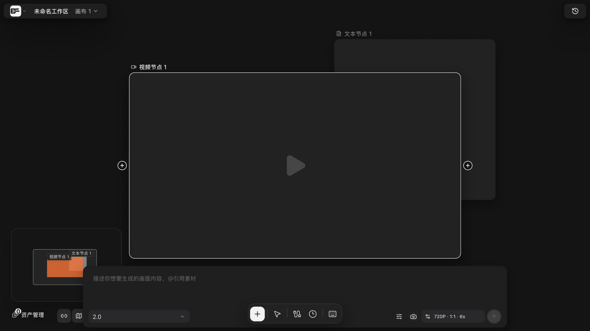

# 发起视频生成与素材限制

> 适用角色：所有用户 ｜ **视频生成计费显著高于图片**，提交前请确认参数。

## 目标

从视频节点发起生成，理解「素材限制」校验，避免提交后被拒。

## 前置条件

- 视频节点已连接参考素材并配置好渠道（不同渠道/模型能力不同）。

选中视频节点后，底部弹出生成 composer：输入「描述你想要生成的画面内容，@引用素材」，右侧选择模型与参数（如 720P·1:1·6s），点发送提交。

## 素材限制：提交前就会校验

点击生成时，系统会按**当前模型的能力配置**校验参考素材：

- 参考图片的**尺寸、宽高比、文件大小**；
- 音频/视频的**时长**；
- 参考素材的**数量上限**。

不符合限制的素材会在提交时得到明确错误提示（而不是静默丢弃或偷偷降级）。看到限制类报错时：更换/裁剪素材，或切换到能力匹配的模型。

## 提交后

- 任务进入与图片一致的徽章/耗时/浮层跟踪（见 [generate-images.md](generate-images.md)）；
- **网关超时（524）等「提交不确定」情形不会自动重试**——请先到任务中心确认实际结果，再决定是否重发，避免重复扣费。

## 相关页面

- 任务状态与对账：[generate-images.md](generate-images.md)
