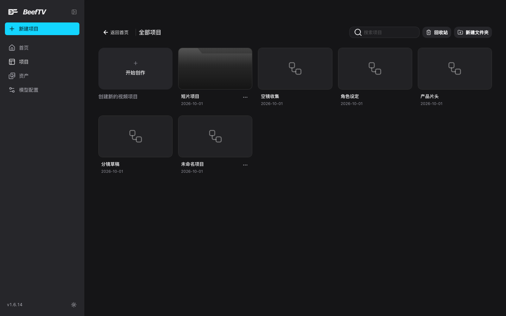
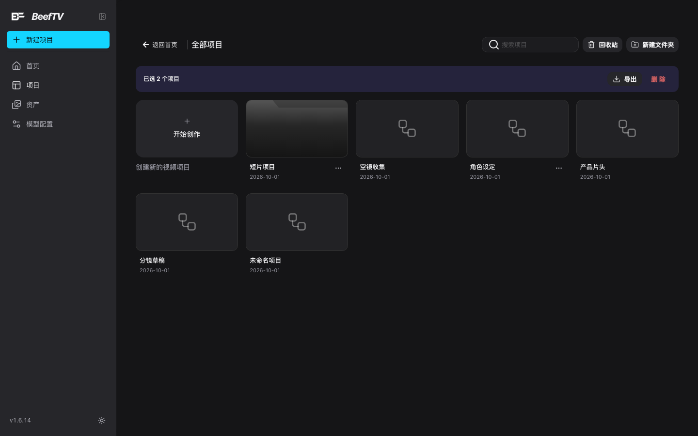

# 画布库：搜索、文件夹与导入导出

> 适用角色：所有用户。

## 目标

把画布当成「作品库」来管：找画布、分文件夹、备份与迁移。删除、版本历史与回收站见 [undo-history-versions.md](undo-history-versions.md)。

## 画布库长什么样

画布库就是标题写着「**全部项目**」的那一页。顶部只有四个控件：

| 位置 | 控件 | 作用 |
|---|---|---|
| 左上 | 返回首页 | 回首页 |
| 左上 | 面包屑 | 进入文件夹后变成「**全部项目 / 文件夹名**」，点左边那截退回根目录 |
| 右上 | **搜索项目** | 按名称过滤（见下节） |
| 右上 | **回收站** | 打开删除回收站（见 [undo-history-versions.md](undo-history-versions.md)） |
| 右上 | **新建文件夹** | 立刻建一个「未命名文件夹」，再重命名 |

网格的第一格固定是「**开始创作**」卡片，副标题「创建新的视频项目」——点它直接建画布并进入。每张画布卡下方是名称和**更新日期**。



## 搜索

右上角搜索框按**项目名称**过滤，**大小写不敏感**，输入**停止 250 毫秒**后才真正过滤（所以刚打完字的那一瞬列表还没变是正常的）。

- 只匹配**名称**。不搜节点内容、提示词、时间线片段、文件夹名；
- 输入框右侧有清除按钮，点一下恢复全部；
- 搜不到时显示「**没有匹配的项目** / 换一个名称或重置筛选条件。」

::: warning 画布库**没有**排序和筛选控件
**排序永远只有一种：最近更新。** 你翻遍整个页头也找不到「按名称」「按画布数量」「按项目筛选」——它们不存在。

这不是你漏看。画布库代码里确实写了三种排序（最近更新 / 名称 / 节点数）和一组筛选（全部画布 / 自由画布 / 按项目），但**没有任何控件去改动它们**，所以这两组能力恒定停在默认值，界面上也就一个入口都没有。v1.6.14 运行时核对同样确认：整页只有搜索框、回收站、新建文件夹三个可交互控件，没有任何下拉或分段控件。

需要按名称找画布时的替代办法：直接用搜索框（匹配的是名称，够用）。
:::

## 文件夹

文件夹是画布库的**一级分组**，没有嵌套。

| 操作 | 怎么做 | 结果 |
|---|---|---|
| 新建 | 右上「新建文件夹」 | 立刻出现一个「未命名文件夹」 |
| 重命名 | 文件夹卡「···」→ 重命名 | 弹窗输入，回车或点「保存」；留空则存成「未命名文件夹」 |
| 打开 | 点文件夹卡 | 标题变成文件夹名，网格显示其中画布；文件夹卡本身不再显示（否则空文件夹会看起来像包含自己） |
| 移动画布 | 画布卡「···」→ 移动至文件夹 | 子菜单里选「未分类」或某个文件夹 |
| 删除 | 文件夹卡「···」→ 删除文件夹 | **先把这个文件夹里的画布全部送进回收站**，再删文件夹本身 |

::: tip 移动是「核验过才报成功」的
移动画布后系统会重新读一次本地状态确认关系真的变了，**没变就报「项目移动未完成，请重试」**而不是假装成功。目标文件夹不存在时同样会拦下并提示「目标文件夹不存在」。
:::

画布卡菜单另有「移出文件夹」，把画布退回「未分类」。

## 封面

画布卡和文件夹卡都能换封面，但**两处的菜单文案不一样**：

| | 画布卡 | 文件夹卡 |
|---|---|---|
| 菜单项 | **修改封面** | **更换封面** |
| 超限提示 | 封面图片不能超过 12 **MB**（有空格） | 封面图片不能超过 12**MB**（无空格） |

两处规则完全相同：只收图片；超过 **12MB** 拒绝；上传后**长边缩到 1280 像素**、重新压成 **JPEG（质量 0.84）**再存。

- **画布封面**存在浏览器本地（按画布 id 存放），换设备不会跟着走；
- **文件夹封面**存在画布数据里，会跟着导出/导入一起迁移。

## 多选、导出与删除

鼠标移到画布卡左上角会出现**勾选框**（不是点卡片就选中——点卡片是打开画布）。勾选后网格上方出现一条紫色工具条：

- 左侧「**已选 N 个项目**」；
- 右侧「**导出**」与「**删除**」。



::: tip 工具条上还有两个按钮永远看不到
源码里还有「**加入项目**」「**移出项目**」，但它们只在云端项目模式下渲染，当前版本该模式**恒不开启**，所以这两个按钮不会出现——不是被禁用，是根本没渲染。相关 API（项目关系查询）也不会被调用。
:::

**删除**把勾选的画布送进回收站（不立即抹掉，可恢复），详见 [undo-history-versions.md](undo-history-versions.md)。画布卡「···」菜单的六项（打开 / 重命名 / 修改封面 / 创建副本 / 移动至文件夹 / 删除项目）也在那一页。

**创建副本**有个容易忽略的细节：一个「项目」可以包含**多张画布**，复制会**整组复制**，提示语是「项目副本已创建，共 N 张画布」——第一张沿用项目名加「 副本」后缀，其余各张保留原名，然后直接跳进副本。

## 导出

选中画布 → 「导出」，得到一个 ZIP：

- **文件名**：`<品牌名>画布-<张数>个画布.zip`（例如 `BeefTV画布-2个画布.zip`）；
- **只导你勾选的**（没勾选就没有导出按钮）；
- **文件夹一起带走**——ZIP 里会带上你所有文件夹的定义，导入时按名字重新建一遍。

包内结构：

```
projects.json                              ← 元数据：画布清单 + 每张画布的媒体文件清单 + 文件夹
projects/<画布id>/files/<媒体文件>.<扩展名>   ← 图片 / 视频 / 音频原文件
projects/<画布id>/drawings/<绘画id>.json     ← 绘图文档
```

## 导入

::: warning 画布库**没有导入入口**
页面上找不到「导入」按钮，不是你漏看——**当前版本确实没有**。导入所需的整套代码（ZIP 校验、媒体并发上传、进度提示）都还在，但触发它的那次「点击」没有被接到任何控件上，文件选择框因此永远打不开。v1.6.14 运行时核对：整页找不到含「导入」二字的元素，点遍所有按钮也不会拉起文件选择框。

所以**画布无法从 ZIP 迁入**。要在另一台机器上接着画，只能通过后端同步，或手工重建。下面这段讲的是导入逻辑本身，供了解与排障：
:::

导入只能吃 `.zip`（整包导入，不能只挑其中一张画布）。逻辑上会**逐项校验**，任何一项不过就整体中止并告诉你卡在哪：

| 你会看到 | 原因 |
|---|---|
| 缺少 projects.json 元数据文件 | 压缩包根目录没有 `projects.json`——不是画布导出包 |
| projects.json 中缺少画布列表 | `projects` 字段不是数组 |
| 画布「XXX」的媒体清单无效 | 某张画布的 `files` 字段不是数组 |
| 压缩包缺少媒体文件：<路径> | 清单里列出的文件在包里找不到——包不完整或被改动过 |
| 导入失败：<上述任意一条> | 上面几条的统一前缀 |

校验通过后的既定流程：按 ZIP 里的文件夹定义**重建文件夹**（新 id）→ 逐张画布导入、媒体文件**同时处理 4 个** → 进度显示「正在保存本地媒体」→「正在保存本地画布」→ 完成提示「**已导入 N 个画布并保存到本地**」。

即便入口恢复，导入仍有三个**已知损耗**：

- **绘图引擎只认 excalidraw**。ZIP 里 `engine` 标成别的引擎的绘图文档会被跳过；
- **`blob:` 开头的临时地址一律丢弃**。这是浏览器会话级的临时地址，跨机器本来就失效——从另一台机器导入时，那些媒体位置会变空，需要重新挂一次；
- **画布副本是新的**。导入不会覆盖同名画布，同名时你会多出一张。

## 滚动加载

画布库**首屏渲染 50 张**，向下滚动到底部前 **600 像素**就开始预加载，每次再加 50 张。全部加载完时底部显示「**已加载全部 N 个画布**」，未加载完显示「**继续下滑加载更多**」。

切换文件夹、改搜索词或改筛选条件会**重置回 50 张**。

## 可以直接用的地址参数

在画布库地址后面加参数可以直达某个状态：

| 参数 | 作用 |
|---|---|
| `?stay=1` | 建完新画布后**留在画布库**，不自动进入（平时不需要） |
| `?history=all` / `?history=deleted` | 进页面即打开回收站 |
| `?mode=new` | 进页面即自动建一张新画布并进入 |
| `?mode=recent` | 进页面即打开最近更新的一张画布 |
| `?mode=choose` | 供外部调用方进入选择模式：进画布时会把整串查询参数转发过去 |

`?mode=new`、`?mode=recent`、`?mode=handoff` 三个在数据还没恢复完时会先显示「**正在打开画布...**」，等一下自己跳进画布。`?stay=1` 和 `?history=` 不触发这个过程。

## 相关页面

- 删除、版本历史、回收站、画布卡六项菜单：[undo-history-versions.md](undo-history-versions.md)
- 画布内部整理（Frame 分组、节点排列）：[organize-canvas.md](organize-canvas.md)
- 路由与端点全表：[../20-reference.md](../20-reference.md)
