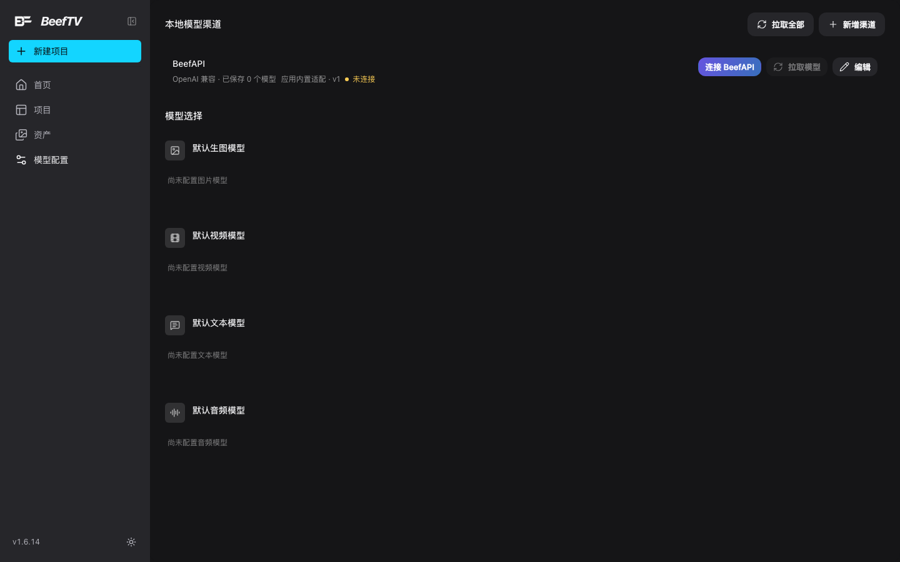
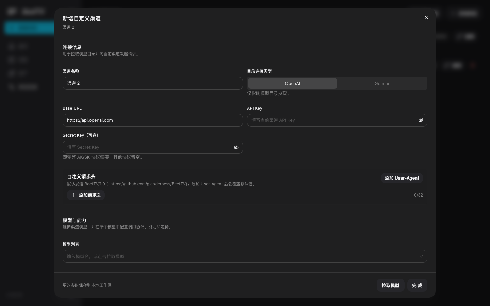
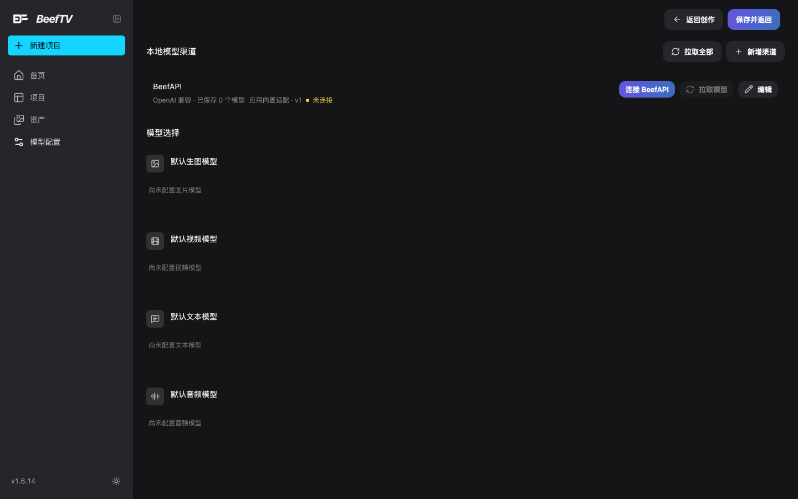

# 模型配置（`/settings`）

> 适用角色：所有用户。**没配模型，生成功能就用不了**——这是所有「点了没反应」的第一现场。
> **本页是产品里源码量第三大的界面页**（渠道设置 `channel-settings-pane.tsx` **738** 行 + RunningHub 设置 `runninghub-settings-pane.tsx` **357** 行，v1.6.16 实测；口径与全部行数见 [20-reference.md](../20-reference.md) 的「上游源码行数快照」表），而本手册此前对它只有路由表里的一行。

## 页面长什么样

从左侧导航「**模型配置**」进入。没有页签、没有侧边目录，一屏往下就是两块：

1. **本地模型渠道**——右上角两个按钮：「**拉取全部**」「**+ 新增渠道**」；
2. **模型选择**——四个默认模型槽位（默认生图 / 视频 / 文本 / 音频模型）。

<figure>
  
  <figcaption>刚装好时的样子：只有一个内置 BeefAPI 渠道，四个默认模型全部未配置</figcaption>
</figure>

## 内置的 BeefAPI 渠道

列表里那个 **BeefAPI** 是**内置的、不可删的**（界面上没有删除按钮），状态行是：

> OpenAI 兼容 · 已保存 **0** 个模型　应用内置适配 · **v1**　**未连接**

它旁边三个按钮：

| 按钮 | 作用 |
|---|---|
| **连接 BeefAPI** | 走一次授权式连接流程（唯一会带出「应用内置适配」标记的那个） |
| **拉取模型** | 从这个渠道拉一次模型目录回来 |
| **编辑** | 打开该渠道的配置弹窗 |

自己加的渠道则显示成「**请填写 API Key / Access Key**」，并且**也有删除按钮**。

## 新增一个渠道

点「**+ 新增渠道**」，弹窗标题是「新增自定义渠道」，分两大块。

**连接信息**（副标题：用于拉取模型目录并向当前渠道发起请求）：

| 字段 | 说明 |
|---|---|
| 渠道名称 | 默认给个「渠道 N」 |
| 目录连接类型 | **OpenAI / Gemini** 分段开关。副标题注明「**仅影响模型目录拉取**」——真正发请求用的协议不由它决定 |
| Base URL | 默认 `https://api.openai.com` |
| API Key | 带小眼睛可切换明文 |
| Secret Key（可选） | 副标题：「即等价 AK/SK 协议需要；其他协议留空」 |

**自定义请求头**：默认发送 `BeefTV/1.0 (+https://github.com/glanderness/BeefTV)`。点「**添加 User-Agent**」会覆盖这个默认值，另外还能「**+ 添加请求头**」自定义键值，右侧有个 `0/32` 的长度计数。

再往下是「**模型与能力**」：维护这个渠道的模型清单，并**在单个模型里配置调用协议、能力和定价**——模型列表是一个「输入模型名，或点击拉取模型」的下拉。

<figure>
  
  <figcaption>新增渠道弹窗：连接信息、自定义请求头、模型与能力三段</figcaption>
</figure>

::: warning 点完「新增渠道」，这个渠道就已经建出来了
**实测**：点「+ 新建渠道」的那一刻，列表里就多出一个「渠道 2」并立刻写进配置；**这时再点右上角 × 关掉弹窗，这个空渠道不会消失**，会带着「请填写 API Key / Access Key」留在列表里。

所以**中途不想弄了，要么把它删掉，要么老老实实点「完 成」**。删除是有确认框的，原文写着「**该渠道关联的模型选择会同时移除**」——删渠道会连带把它被选为默认的那些模型槽位清空。
:::

## 模型选择

页面下半部分。四个槽位：**默认生图模型 / 默认视频模型 / 默认文本模型 / 默认音频模型**。刚装好时四个都是「**尚未配置**」。

配好渠道并拉到模型后，从这里挑一个模型作为该类型的默认。**这一步不做的话，生成时会找不到可用模型**。

## 「?continue=1」：从画布里跳过来的那一次

地址栏里多一个 `continue=1` 时，页面顶部会多出一条操作栏，两个按钮：

- **返回创作**——退回你来的那一页；
- **保存并返回**——保存配置后也退回那一页。

<figure>
  
  <figcaption>带 continue=1 打开时，页面顶部多出「返回创作 / 保存并返回」</figcaption>
</figure>

**你正常点侧栏进来是看不到这条栏的。** 它是给「在画布里生成、结果发现没配模型」这个场景准备的：画布上十几个节点在缺模型时会把你送到 `/settings?section=channels&continue=1`，配好之后「保存并返回」直接把你送回刚才的画布，不用自己找路。

::: tip 「返回创作」走的是浏览器后退
它不是跳到某个固定页面，而是**退回历史里的上一页**。所以只有「从画布跳过来」时它才对得上；要是你自己手敲这个地址进来，它会退到你碰巧在看的上一页。
:::

::: warning 网址里的 `section` 目前只认一种
类型定义里列了 `channels / models / preferences / prompts / storage` 五种，但**页面上只实现了「渠道」这一种**。手敲 `?section=models` 之类不会报错，只会**静默退回渠道页**。别以为是自己没找对地方。
:::

## 整块内容由一个特性开关决定

设置页左侧的「**个人渠道**」这一整块受 `customChannelsEnabled` 开关控制。**开关关掉时，页面上这一个分区会直接消失**——而它目前是唯一分区，等于整页只剩「模型选择」。这时如果保存时报错，文案也会换成面向管理员的「当前没有可用的系统模型，请联系管理员配置系统渠道」。

> **别被三个名字绕晕**：侧栏入口叫「模型配置」，这一项叫「个人渠道」，点进去的大标题又叫「本地模型渠道」——**同一个东西的三种叫法**。日常口语里说哪个都能对上，但**在界面上找字样时**按上面这张表对。

## 相关页面

- 生成时提示「没有可用模型」怎么办：[create-workspace.md](create-workspace.md)
- 节点里生成、批量表格、脚本节点的配置缺失跳转：[generate-images.md](generate-images.md) · [generate-video.md](generate-video.md)
- 账号容量与配额：[storage-quota.md](storage-quota.md)
- 路由与参数清单：[../20-reference.md](../20-reference.md)
