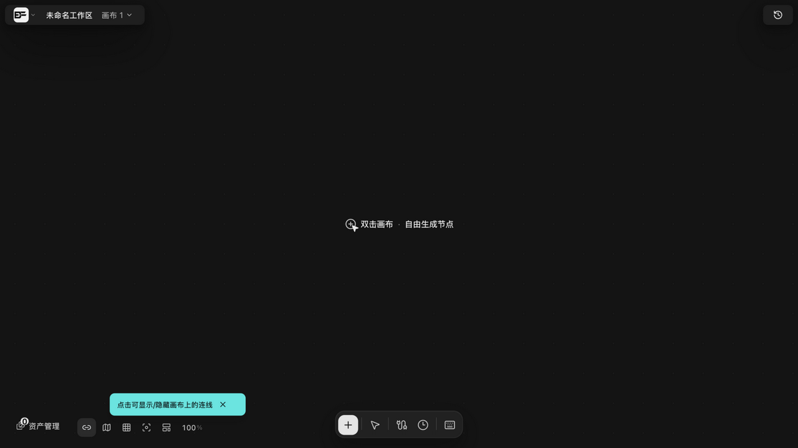
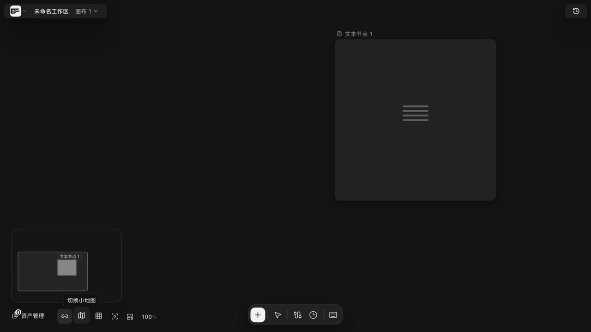

# 平移、缩放与小地图导航

> 适用角色：所有用户。

## 目标

在大画布上快速到达任何位置：缩放、平移、用小地图定位、用快捷键回到标准视角。

## 鼠标与触控板

| 操作 | 行为 |
|---|---|
| 鼠标滚轮 | 以光标为锚缩放（范围 **5%–800%**） |
| 触控板双指滚动 | 平移 |
| Ctrl/Cmd+滚轮（捏合） | 缩放（触控板与鼠标档位不同） |
| 触控板双指捏合 | 以两指中点为锚缩放 |
| 中键拖空白 | 平移 |
| Space 按住 + 拖 | 平移（输入框内不生效） |
| 触控板单指拖背景 | 平移 |
| 触控轻点背景 | 清空选择 |

## 工具模式

- **V**：框选工具（**默认工具**，空白左键拖 = 框选；Shift=加选、Ctrl=toggle、Alt=减选）；
- **H**：抓手工具（拖动 = 平移）。

## 快捷键

| 快捷键 | 行为 |
|---|---|
| Ctrl/Cmd + `+`/`=` / `-`/`_` | 步进缩放 ±10% |
| Ctrl/Cmd + `0` | 适应整个画布 |
| Ctrl/Cmd + `1` / `2` / `3` | 100% / 适应画布 / 适应选区（最大 125%） |
| 双击空白 | 打开「添加节点」菜单并清空选择 |

底部工具栏从左到右：素材空间、连线显隐、**小地图**、网格吸附、适合屏幕、自动整理节点、缩放百分比。

## 小地图

- 纯 DOM 实现，按需挂载；面板 240×160，每个可见节点一个色块；
- 图片节点缩略图最多显示 24 张；
- 在小地图上**拖动**为实时预览（画面跟随），**松手**才提交视口；
- 视口矩形实时跟随画布滚动/缩放。

## 相关页面

- 节点操作：[create-nodes.md](create-nodes.md)

## 画布菜单（左上角）

顶栏「未命名工作区」旁的画布菜单按钮展开四项：**回到主页**（/）、**全部项目**（/canvas）、**创建新项目**（/canvas?mode=new）、**删除项目**（进回收站，见撤销与版本页）。

> 实测（v1.6.14）：菜单逐字与路由核对无误。
