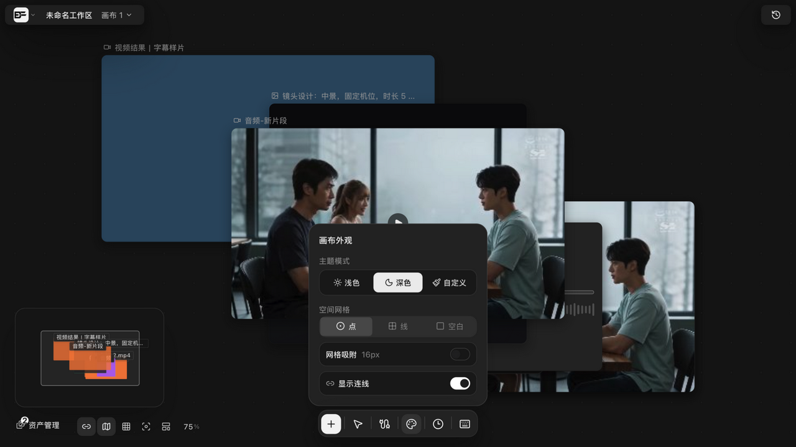
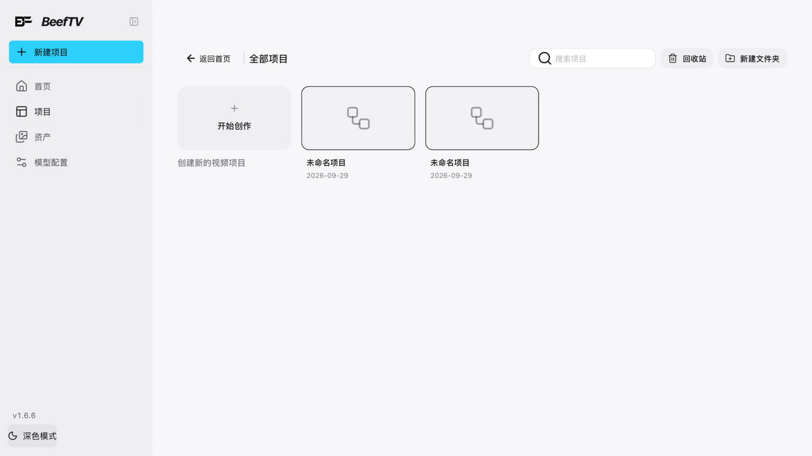

# 整理画布、Frame 分组与外观

> 适用角色：所有用户。

## 目标

让画布保持整洁：一键整理、用 Frame/文件夹分组、按喜好切换主题与网格。

## 底部工具条

底部居中的工具条是画布视图的操作中心，默认显示这六项，从左到右：

| 入口 | 作用 |
|---|---|
| 添加节点 | 在画布中心新建节点 |
| 抓手 / 框选 | 一个开关，切换**区域选择**与**抓手工具**两种模式（也可按 `V` 切移动工具） |
| 资产管理 | 打开素材管理抽屉（仅在**未关联项目**时显示） |
| 画布外观 | 打开外观面板（见下节） |
| 生成历史 | 打开生成历史弹窗，可复用历史结果 |
| 画布快捷键 | 打开快捷键中心 |

::: tip 还有 6 项默认收起来了
底部工具条另有 6 项**默认不显示**：人像造型室、工具栏设置、撤销、重做、删除选中节点、清空画布。开启它们要进「**工具栏设置**」面板——但「工具栏设置」自己默认也是收起的，所以**全新安装时底栏上没有开启入口**，需要从项目/资产界面或右键菜单走对应动作。

撤销/重做随时可以用 `⌘Z` / `⇧⌘Z`，不必等按钮；删除用 `Delete` 或右键菜单。工具条的显示偏好会存在本地，启用过一次之后就会一直显示。
:::

左下角一排是**视图开关**：资产管理入口、**隐藏节点连线**、**切换小地图**、**网格吸附**、**适合屏幕**、**自动整理节点**，以及缩放百分比。

## 选区工具条

选中节点后，节点上方会浮出选区工具条。**默认显示**的有 11 项：

| 分组 | 工具 | 生效条件 |
|---|---|---|
| 对齐 | 左对齐 / 水平居中 / 右对齐 / 顶对齐 / 垂直居中 / 底对齐 | 选中 ≥1 个 |
| 分布 | 水平等距 / 垂直等距 | **需选中 ≥3 个**，只选 2 个时按钮是灰的 |
| 组合 | 创建分镜组 | 需选中 ≥2 个 |
| 连线 | 批量连接 | 需选中 ≥2 个（也可按 `Alt+L`） |
| 视频 | 合并选中视频（N） | **仅当选中 ≥2 个视频节点时才出现**，标签里带视频数量 |

另有 5 项默认收起，可在工具栏设置里开启：横向排列、纵向排列、宫格排列、按连线整理、创建引用组。

> 批量连接的完整操作与连线规划预览见 [连线引用](connect-references.md)。

## 自动整理

| 操作 | 入口 | 行为 |
|---|---|---|
| 自适应整理画布 | 空白右键（多选时）→「自适应整理画布」 | 保持相对布局并加大边距 |
| 自动整理 | 底部工具条「自动整理节点」或 Alt+Shift+F | 有选区时只整理选中项；无选区整理全部顶层节点；至少需要两个可整理节点 |

整理按**媒体类型分类**排布——执行后会提示「已按媒体分类整理画布」。锁定（locked）的节点、frame 本体、隐藏的批量子节点不会参与整理。

::: tip 整理前先散开
节点互相重叠时，先点「自动整理节点」再点「适合屏幕」，才看得清每个节点的位置。
:::

## Frame 与文件夹

::: warning 现在只能建「文件夹」，建不了「背板」
添加节点菜单里**没有**「背板」这一项。它出现的那一项叫「**逐帧拉片**」，目前是**正在开发**（置灰点不动）；而且即使能点，触发的是「先选中一个视频节点，再打开逐帧拉片」——弹出的是拉片分析对话框，**不会创建背板**。

所以本节讲的行为，请以「**文件夹**」为准。手册早期版本说「从添加节点菜单创建背板（Frame，6 款样式）或文件夹」，那是把两者混为一谈了。
:::

- **能建的**：「添加节点」→「**文件夹**」（菜单项自带「6 款」角标）。6 款样式是**文件夹**的样式（玻璃 / 层叠 / 午夜 / 纸感 / 影院 / 紧凑），不是背板的。
- **内部实现**：文件夹在底层也是一种 Frame 节点，靠一段 `folder` 元数据区分（`isCanvasFolderNode` = 是 Frame **且**带 `folder` 元数据）。不带领路元数据的那个分支才叫「背板」，而它当前无法由用户创建。
- 把节点拖进文件夹即加入分组（显式成员关系，拖入即归属）；
- **折叠**：子节点随之隐藏，连线自动改道到容器边缘；
- **文件夹默认折叠**，折叠后显示为封面卡（内容缩略图）；创建后标题默认为「我的文件」；
- 折叠/展开按钮的无障碍标签写作「折叠背板 / 展开背板」——这串文案属于共用渲染逻辑，对用户而言看到的就是文件夹上的那个折叠按钮。

## 画布外观

底部工具条「**画布外观**」打开面板，四组设置。下面两张是**同一画布、同一面板**的两种主题状态，可直接对比「主题模式」的切换效果：

| 分组 | 选项 |
|---|---|
| **主题模式** | 浅色 / 深色 / 自定义；选「自定义」后可挑背景色，并显示基底是「浅色界面」还是「深色界面」 |
| **空间网格** | **点**（点阵）/ **线**（网格线）/ **空白**，三选一 |
| **网格吸附** | 开关，标注 **16px**——开启后拖动按 16px 对齐 |
| **显示连线** | 开关——节点多时关掉连线，视野更干净 |

> 切换主题是**即时生效**的：点「浅色」画布底色、节点卡片、网格点与面板配色整体换一套，点「深色」切回——素材本身、节点内容与已有生成结果都不受影响。自定义皮肤的具体色板由管理员配置；浅色模式自 v1.5.8 起可用。

## 项目画风与素材绑定

「项目画风」和上面的「画布外观」**是两回事**：画布外观只改你看到的配色，项目画风会**改变生成时实际发生什么**。

在画布的风格选择器里打开风格档案编辑，可以给画风**绑定素材**（LoRA、图片模板、参考图组、提示词模块），并为每个素材记录一份**许可快照**。

### 素材状态：这一项真的会被执行

| 状态 | 实际行为 |
|---|---|
| **待验证** | **不参与生成**，被跳过，原因「资产尚未验证」 |
| **已验证** | 正常参与 |
| **不可用** | **不参与生成**，原因「资产当前不可用」 |

另外素材若设了「仅兼容某些模型」，而当前模型不在其中，也会被挡住并提示「仅兼容 X、Y」。

### 执行策略：两档，差别很大

| | 兼容降级（默认） | 严格阻止 |
|---|---|---|
| 有素材被跳过/挡住 | 照常生成 | **直接报错中止**：「当前模型无法完整执行项目画风：…请切换模型，或在项目设置中停用对应画风资产」 |

选「严格阻止」等于要求「画风必须被完整执行，否则宁可不生成」——素材没验证好就早点失败，而不是悄悄少用几个素材出一张不对味的图。

::: warning 同一个开关，两个地方叫法不同
风格选择器里这一档显示为「**严格校验**」，在风格档案编辑器和素材绑定弹窗里显示为「**严格阻止**」。**是同一个设置。**
:::

### 许可快照：只记录，平台不拦

素材的「许可快照」有四个字段：**商业使用**（尚未确认 / 允许商用 / 不可商用）、**许可来源**、**许可说明**、记录时间。

::: danger 这一栏是给你自己看的备忘，不是护栏
标了「不可商用」**不会阻止**任何生成动作，也不会在生成时弹出提醒——它不会被检查、不会被拦截，纯粹是你为团队留的记录。
如果你需要硬性约束，用**执行策略 → 严格阻止**去卡素材是否可用；至于商用权利，只能靠自己或法务确认。
:::

> 这是合规话题，值得多说一句：平台记录的「允许商用」只是**你填的**，不构成任何授权证明。素材的商用权利以素材提供方的协议为准，重要项目请在「许可来源」里记下协议版本与页面地址。

### 几类素材当前的实际可用性

| 素材种类 | 能否真正生效 |
|---|---|
| **提示词模块** | ✅ 以「追加到项目画风提示词」的方式生效 |
| **图片模板** | ✅ 有提示词片段或触发词时，以触发词方式生效 |
| **参考图组** | ⚠️ 素材本身不生效，但**默认不会因此拦住生成**（见下） |
| **LoRA** | ⚠️ 同上 |

**后两类在界面里可以添加、验证、启用，但生成渠道没有原生适配器，所以素材本身起不了作用。**

**「素材不起作用」和「生成被拦住」是两回事**——这取决于画风档案的**执行策略**：

| 执行策略 | LoRA / 参考图组不可用时会发生什么 |
|---|---|
| **兼容降级**（默认） | **生成照常进行**，只是这两个素材被跳过，实际出图靠项目 Prompt |
| **严格阻止** | **生成前直接拦下任务**，不会带着「素材没生效」的结果继续跑 |

::: warning 默认是「兼容降级」，所以你**多半看不到报错**
新建的画风档案默认用兼容降级。**这意味着配了 LoRA 却没生效时，生成依然会成功、依然给你结果——只是那个结果里没有 LoRA 的贡献。**

很多人会在这里判断失误：看到生成成功就以为 LoRA 生效了；或者反过来，看到结果不对就以为哪里配错了，实际上是**适配器没启用、策略又放行了**。

想让它「不生效就当场报错」，把执行策略切成「**严格阻止**」（在风格档案编辑器的「策略」里）。切换位置：画布上的画风选择器 → 编辑档案。
:::

## 找东西

- **切换小地图**：左下角开关，打开后画布一角显示缩略图，节点密集时用来定位；
- **画布快捷键**：底部工具条进入快捷键中心，完整键位表见 [快捷键与帮助中心](shortcuts-help.md) 与 [参考：快捷键全表、路由与端点](../20-reference.md)；
- **搜索画布节点**：按 **⌘F**（Windows 为 Ctrl+F）打开，按名称或内容搜索并定位节点；
- **素材管理**：底部工具条「资产管理」打开抽屉，可按媒体类型浏览与插入（见 [上传本地图片、视频、音频](upload-materials.md)）。

## 相关页面

- 撤销与版本记录：[撤销重做、版本历史与回收站](undo-history-versions.md)
- [连线引用](connect-references.md)
