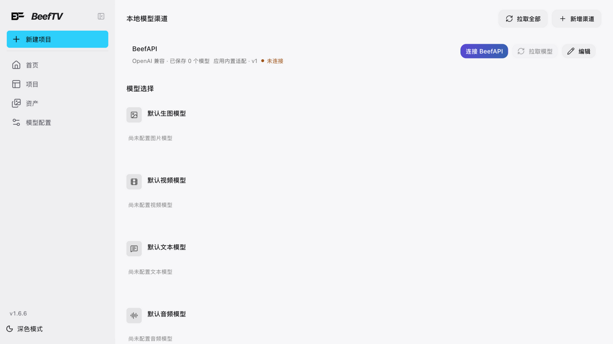
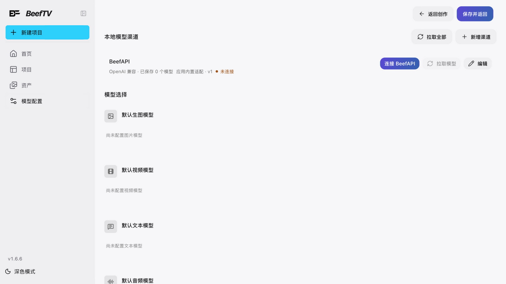

# 插件管理

> 适用角色：管理员与进阶用户。

## 六个内置插件

| 插件 | 能力 | 能否在插件页自主启停 |
|---|---|---|
| RunningHub 工作流 | 接入 RunningHub 工作流（图片/视频/音频三类能力） | ✅ 官方应用型 |
| AI 审美批改 | 画布节点，对图片给审美反馈 | ✅ 官方应用型（但**画布上建不出这个节点**，见 [art-critique.md](art-critique.md)） |
| AI 提示词优化器 | 提示词面板优化（五字段结构化输出） | ✅ 官方应用型 |
| Eagle 素材库 | 接入桌面 Eagle 资料库 | ✅ 官方应用型 |
| 剪辑工作台 | 时间线**八面板宿主**（详见下） | ✅ 官方应用型 |
| 媒体转换节点 | 灰度 / Canny 边缘 / AI 线稿 / 深度 / 姿态（本地模型，不加载 SD 重绘管线） | ❌ 不属官方应用型 |

### 剪辑工作台的「八面板」是哪八块

剪辑工作台本身**不实现**这些面板，它提供 8 个**插槽（slot）**由各功能填入：

| # | 插槽 | 承载的东西 |
|---|---|---|
| 1 | `timeline-panel` | 时间线面板 |
| 2 | `preview-renderer` | 预览与监看 |
| 3 | `inspector` | 检查器（属性/截图） |
| 4 | `asset-ingest` | 素材导入 |
| 5 | `subtitle-tool` | 字幕工具 |
| 6 | `transcription-provider` | 转写服务（接本机 whisper.cpp） |
| 7 | `export-renderer` | 导出渲染 |
| 8 | `ai-assistant` | AI 助手 |

这就是「宿主」的含义：**某个面板没出现，多半是对应插槽没有功能填入，而不是工作台坏了。**

::: tip 「官方应用型」是 5 个，不是 2 个
插件页把内置插件分成两类：**官方应用型**（RunningHub 工作流、Eagle 素材库、AI 提示词优化器、AI 审美批改、剪辑工作台）按**用户自主启停**处理，其余按**系统协议**处理。**媒体转换节点不在官方应用型之列**，所以你在插件页找不到它的启停开关——它的入口是画布节点，而「智能剪辑」节点当前仍是「正在开发」（见 [create-nodes.md](create-nodes.md)）。

上游已把这份清单收敛到唯一来源：此前管理页、用户插件页和后端各维护一份，管理页一度漏掉 AI 审美分析与剪辑工作台，导致两者被误判为系统协议、在管理页显示「已停用」。
:::

## 模型渠道配置（运行时实证）

侧栏「模型配置」（`/settings?section=channels`）打开渠道配置页：**新增渠道**按钮 + 渠道分区（如 BeefAPI：OpenAI 兼容 · 已保存 N 个模型）。生成渠道在此配置后，画布生成节点即可选用。

::: tip 同一页三个名字，指的是同一件事
| 位置 | 叫什么 |
|---|---|
| 侧栏入口 / 顶栏 | **模型配置** |
| 设置页左侧那一项 | **个人渠道** |
| 点进去之后的大标题 | **本地模型渠道** |

**「个人渠道」同时还是大标题的备选值**——源码里标题写的是「本地模式显示『本地模型渠道』，否则显示『个人渠道』」。**但那个「否则」分支在当前版本里渲染不出来**：判断用的本地模式标记在代码里写死为 `true`。所以你会看到左侧写着「个人渠道」、大标题却是「本地模型渠道」，**两个名字并存是正常的，不是哪里出错了**。

一个渠道都没有时，卡片区显示「暂无个人渠道」。
:::

::: warning 整个设置分区可能对你不可见
分区挂在 `customChannelsEnabled` 特性开关之后。开关关闭时分区列表为空，保存配置会报「当前没有可用的系统模型，请联系管理员配置系统渠道」。

**在本地部署下，你多半遇不到这一条。** 后端确实有「改功能开放配置」的方法，也能存进数据库，但**它没有对应的 HTTP 接口**——服务端只暴露了一个只读的 `GET /features`。所以就算本地用户本身是管理员角色，也没有界面、也没有 API 能把这个开关关掉或打开。它只会保持默认的开启状态。

真要遇到「分区不见了」，更可能的原因是别的（比如 `?section=` 指向了不存在的分区），而不是这个开关被关了。
:::

## 安全模型（了解即可）

- **前端永远不执行第三方代码**：上传的插件只能是**声明式协议**（JSON 模板 + 引擎执行）；
- 直连宿主 API 的绑定保留给随应用发布的插件；
- 插件节点创建受「插件是否已启用」的硬门禁——**这是机制说法，界面上并没有这五个字**，判断依据是插件页里那个启用开关。

::: warning 「沙箱渲染器」是个有分支、但没有实现的空壳
插件清单里每个画布节点都要写 `renderer` 字段，取值 `declarative`（声明式）或 `sandbox`（沙箱）。官方内置插件**全部**用 `declarative`。

`sandbox` 这条分支**代码是有的**——装了声明 `"renderer": "sandbox"` 的第三方插件，它的节点确实会在画布上出现，内容区显示占位文案「**插件节点等待隔离运行时**」，然后就停在那里：**没有任何隔离运行时去执行它**。所以「等待隔离运行时」是一句永久的等待，不是加载中。

换句话说：不是「界面里进不去」，而是「进去了也只有占位」。开发指南里那段 `"runtime": { "web": "sandbox" }` 的示例描述的是协议位，不代表当前版本能跑起来。
:::

## Eagle 素材库接入

1. 管理员在插件设置填写 Eagle Base URL（默认 `http://127.0.0.1:41595`）并读取文件夹；
2. **浏览器不直接访问 Eagle**：所有读取/搜索/下载/写入经站点后端转发（library / items / thumbnail / file 四个代理端点）；
3. 可把 Eagle 素材写回（POST items）或下载导入站点资源存储。

## 相关页面

- 发起生成前先确认模型可用：[发起图片生成](generate-images.md)、[发起视频生成与素材限制](generate-video.md)
- 插件不可用/插件报错：[故障排查](../90-troubleshooting.md)
- Agent 侧的扩展配置：[Agent 记忆与技能](agent-memory-skills.md)
