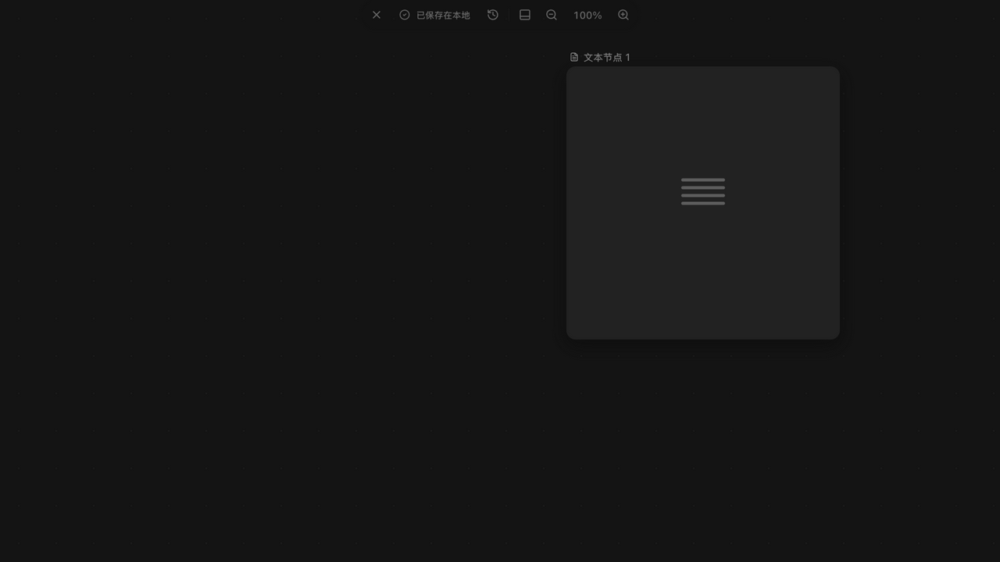
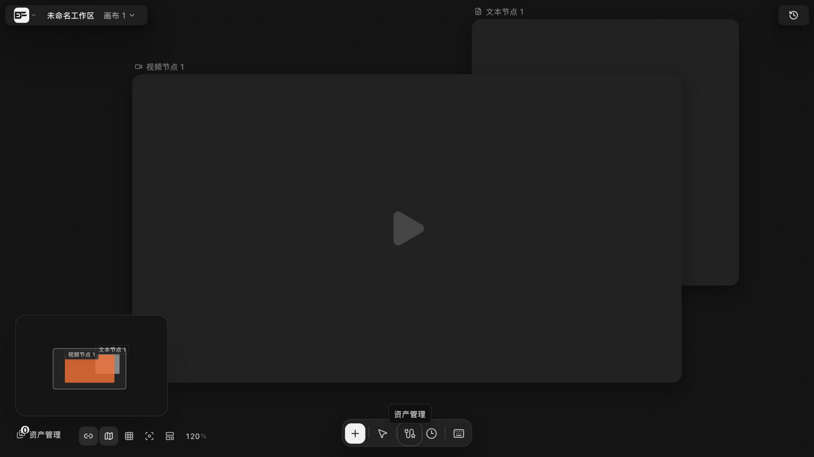

# 提示词与 @mention

> 适用角色：所有用户 ｜ 生成操作涉及按量计费。

## 目标

在生成节点上写好提示词，并用 @mention 精确控制哪些素材参与本次生成。

## 两种引用模式

| 模式 | 触发条件 | 行为 |
|---|---|---|
| 自动引用 | 提示词里**没有**可解析的 @mention | 所有连线的上游资源按**连线顺序**成为参考（连线顺序 = 引用编号顺序） |
| composer 模式 | 提示词中出现 `@图片1`、`@[node:节点id]` 这类可解析 mention | **只按 mention 集合取素材，忽略连线自动引用** |

进入 composer 模式的判定（源码 `canvas-node-generation.ts`）：满足任一即可——

- 该节点是「仅提示词」节点且**连着媒体**；
- 节点的 `composerContent` 非空，且节点是生成配置节点或工作流来源；
- 提示词里存在**能解析成功**的 mention。

::: warning 最容易踩的坑
本来想用连线自动带参考，结果提示词里不知道什么时候多了一个 `@图片1`，于是**连线上的参考全被忽略**了。写 `@` 之前先想清楚你要哪种模式。
:::

- mention 写法支持「@ + 节点显示名」；**无法解析的 mention 会直接报错**（`assertResolvableGenerationMentions`），不会静默忽略——所以打错名字你会立刻看到提示；
- `composerContent` 与 `prompt` 是两个独立字段，系统分别保存，不会互相覆盖；界面读取时优先取 `composerContent`，为空才回落到 `prompt`。

## 放大编辑

点击节点工具栏的「放大编辑」进入全屏编辑器，顶栏实时显示「已保存在本地」：

## 提示词优化器

在提示词面板点优化（AI 提示词优化器插件），会打开一个可拖动的优化面板。优化器调用文本模型，按固定结构返回**五个字段**，面板分块展示：

| 字段 | 面板上的呈现 | 空值约定 |
|---|---|---|
| `optimizedPrompt` | 优化后的提示词，**「采用」**按钮回填到当前输入框 | — |
| `negativePrompt` | 负向提示词段落 | 没有时返回**空字符串**，面板不显示该段 |
| `changes` | **「我做了什么」**——相较输入提示词的关键变化 | 数组，为空则不显示 |
| `assumptions` | **「需要你确认」**（黄色警示样式）——对模糊需求做出的假设 | 没有时返回**空数组** |
| `variants` | 候选变体，可切换选用 | 数组 |

点「采用」后提示「**提示词已采用并回填到当前输入框**」。

因为结构固定，空值都有明确约定，读结果时不用猜「这个字段是没返回还是返回了空」。**「需要你确认」那段是重点**——优化器替你做的假设，应当逐条过一遍再采用。

## 引用素材选择器

视频等生成节点的「参考内容」面板支持按媒体类型（图片/视频/音频/文本）与分类过滤素材，勾选后「插入已选素材」：

## 常见问题

- **为什么我的参考没有生效？** → 检查是否误写了 @mention：一旦进入 composer 模式，连线引用会被整体忽略；
- **提示词里的「图片1」字样失效了？** → 富引用依赖 mention 语法，直接手改文字不会更新引用，请用 mention 或重新连线；
- **打错 @ 名字会不会被悄悄跳过？** → 不会，无法解析的 mention 会直接报错；
- **想换掉某个参考又不想删线？** → 把线拖进提示词面板，松手在某个参考 chip 上即替换（见 [connect-references.md](connect-references.md)）。

## 相关页面

- 连线与引用：[connect-references.md](connect-references.md)
- 图片生成：[generate-images.md](generate-images.md)
- 视频生成：[generate-video.md](generate-video.md)
