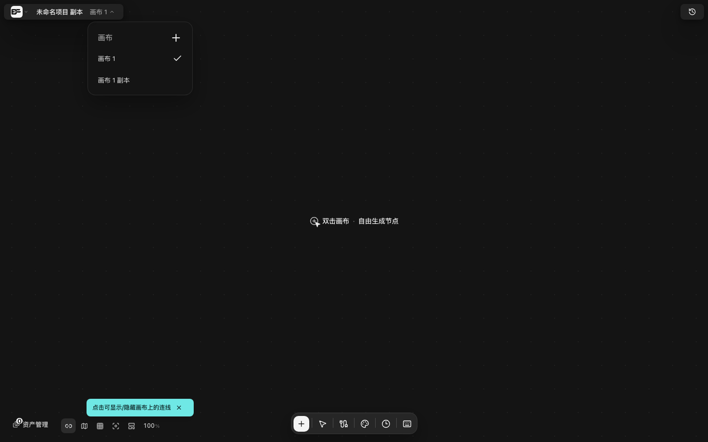

# 只读画布与画布副本

> 适用角色：所有用户。
> **状态：只读模式功能完整，但界面上没有任何入口。** 下面先说清「怎么进、进去是什么样」，再讲一个更要紧的问题——**只读模式唯一的出口「复制项目」，做出的副本不会上传到服务器**。

## 只读模式进不去——不是藏得深

在 BeefTV 的界面里翻遍，**没有任何按钮、菜单项或右键动作能切换到只读模式**。进入方式只有一个：**手动改网址**。

打开任意一张画布，把地址后面加上：

```
?readonly=1
```

或者等价的另一种写法（两种在代码里是同一个判断，结果完全相同）：

```
?mode=readonly
```

例如 `http://localhost:3001/canvas/xxxxxxxx?readonly=1`。

::: warning 为什么说「不是藏得深」
源码里对只读模式的判定只有一行，读两个查询参数、成立即为只读。全库**没有任何一处**会去写这两个参数——没有按钮会跳到这样的地址，菜单里也没有对应项。所以这不是「入口在某个二级菜单里」，而是**确实没有界面入口**。
:::

## 只读模式里是什么样子

进入后，界面同时发生这些变化（v1.6.14 实测，左为普通模式、右为只读模式）：

| | 普通模式 | 只读模式 |
|---|---|---|
| 顶部右侧 | 版本记录按钮 | 横幅「**只读模式，如需创建请点击**」+「**复制项目**」按钮 |
| 底部中间编辑坞 | 有，含「+」添加节点 | **整条消失** |
| 画布中央空态 | 「双击画布 · 自由生成节点」 | **不显示** |
| 滚轮缩放 / 拖拽平移 / 框选 | 可用 | **全部失效**（实测：滚轮后视口变换纹丝不动） |
| 底部「适合屏幕」按钮 | 可用 | **按了没反应** |
| 画布快捷键 | 可用 | **全部失效**（实测：⌘0 无效） |
| 视口位置 | 变化后保存 | **不保存**（你滚动了但下次打开回到原位） |

<figure>
  
  <figcaption>只读模式：右上角是只读横幅与「复制项目」，底部编辑坞与空态提示都不在</figcaption>
</figure>

还有一处容易踩：**只读模式下，所有演示数据都不会注入。** 网址里带 `?fixture=xxx`（`libtv-text`、`libtv-video`、`libtv-audio` 等十种）本应自动摆出示例画布，但只要同时是只读，这些数据**一个都不会加载**——你会看到一张空画布。原因在源码里写得很直接：十个注入函数开头都是 `if (!projectLoaded || readOnly || ...) return`。

::: tip 另一种只读顶栏长什么样
如果网址同时带 `?fixture=libtv-readonly-dense`，顶栏会换成另一种只读样式：左边是画布标题，中间两个图标按钮，右侧除了同样的提示与「复制项目」，还多一个 **✕ 关闭按钮**（点它回到画布库）。不带这个参数时是本文截图里的普通样式，**没有关闭按钮**——退出只读只能改网址或直接跳走。
:::

<figure>
  
  <figcaption>带 <code>?fixture=libtv-readonly-dense</code> 时的只读顶栏：多了标题与 ✕ 关闭按钮</figcaption>
</figure>

## 「复制项目」做了什么

只读模式下唯一能点的是右上角的「**复制项目**」。它会：

1. 用当前画布的**快照**建一张新画布，标题在原标题后加「 **副本**」；
2. 把版本号（revision）**归零**，并清掉远端内容哈希，让它成为一张独立的新画布；
3. 复制**节点、连线、对话记录、当前视口**；
4. **跳转到这张新画布，且地址里不带只读参数**——也就是直接落到一张**可以正常编辑**的副本上。

第 4 点实测确认：跳转后 `data-canvas-readonly` 从 `true` 变成 `false`，底部编辑坞回来了，原有节点也一并带了过去。

<figure>
  
  <figcaption>副本确实建出来了：画布切换面板里多出「画布 1 副本」</figcaption>
</figure>

## 要紧的问题：这个副本没有上传到服务器

副本**能用**——能打开、能编辑、刷新后内容还在。但它**只写进了你这台电脑的浏览器本地存储，从来没有上传**。

实测（v1.6.14，点顶栏「复制画布」后连续观测）：

- 界面弹出成功提示「**画布副本已创建**」；
- 但对后端接口 `/api/canvas-projects` 的**写请求数为 0**；
- 服务端画布列表**条数不变**。

源码上原因很清楚：

| 入口 | 走的函数 | 是否上传 |
|---|---|---|
| 画布库卡片菜单「**创建副本**」 | `createWorkspaceCanvasProject` → `createLocalCanvasProject` | **会**（内部有一句 `await syncLocalCanvasProjectToBackend(id)`） |
| 画布顶栏菜单「**复制画布**」 | `importProject` + 刷新本地缓存 | **不会** |
| 只读横幅「**复制项目**」 | 同上 | **不会** |

`importProject` 是一次纯内存写入，**没有任何网络调用**；后面的「刷新本地缓存」只写浏览器的 IndexedDB。讽刺的是，同一个文件里另一处创建画布的函数专门写了注释解释为什么**必须**上传：

> Creating a project only in IndexedDB leaves the runtime returning 404…

**这对你意味着什么**

- 副本在**这台电脑的这个浏览器**里一切正常，不会丢；
- **清掉站点数据、换浏览器、换电脑，副本就没了**；
- 它不会被备份，也无法通过任何分享或同步机制拿到。

**如果你要的是一份真正可靠的副本，请用画布库里卡片菜单里的「创建副本」**，那条路径实测确实会上传（服务端列表会多出一项）。

## 想要「只读分享」怎么办

当前版本没有可用的只读分享能力：进不去只读模式，唯一的出口做出的副本又只在本机。绕开的办法：

- **把画布内容截图或导出**给你要看的人——最稳，也最符合「只读」的直觉；
- 需要对方能继续编辑，就用**画布库卡片菜单的「创建副本」**做一份真副本再发链接。

## 相关页面

- 画布库与导入导出：[manage-canvases.md](manage-canvases.md)
- 撤销、版本历史与回收站（另一个也叫「回收站」的机制，存 200 条）：[undo-history-versions.md](undo-history-versions.md)
- 账号存储、容量与配额（解释副本为什么只在本机）：[storage-quota.md](storage-quota.md)
- 路由与端点全表：[../20-reference.md](../20-reference.md)
