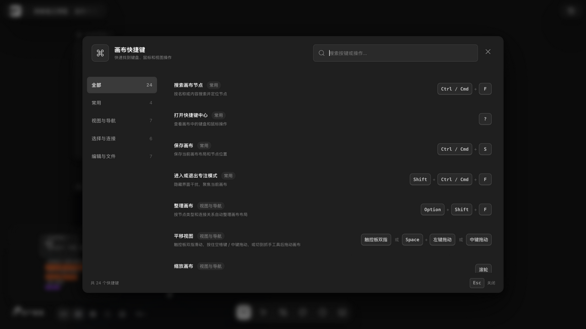

# 快捷键与帮助中心

> 适用角色：所有用户。

## 目标

用键盘少点几下：找到当前版本的完整键位，并知道哪些操作只能靠鼠标。

## 打开帮助中心

按 **?**（即 Shift+/）打开快捷键中心：支持**搜索**、按四个分类筛选（**常用 / 视图与导航 / 选择与连接 / 编辑与文件**），每类显示条目数。快捷键以 ⌘/⇧/⌥ 书写（Windows 对应 Ctrl/Shift/Alt）。

中心显示「共 24 个快捷键」，分类计数：常用 4 / 视图与导航 7 / 选择与连接 6 / 编辑与文件 7（实测自 v1.6.14 重摄的快捷键中心面板）。

> 底部工具条也有「画布快捷键」按钮，不记快捷键也能打开这个中心。

## 按场景速查

### 找东西 / 视图

| 快捷键 | 行为 |
|---|---|
| **⌘F** | 搜索画布节点（按名称或内容搜索并定位） |
| **⇧⌘F** | 进入 / 退出专注模式（隐藏界面干扰） |
| **⌘0** | 适应画布 |
| **⌘1** | 恢复 100% 缩放 |
| **⌘2** | 适应画布（与 0 同义） |
| **⌘3** | 适应当前选择 |
| **⌘+** / **⌘-** | 按固定步长放大 / 缩小 |
| **⇧⌥F** | 整理画布（按节点类型与连接关系自动排布） |

### 选择与连线

| 快捷键 | 行为 |
|---|---|
| **空白处左键拖动** | 框选多个节点 |
| **V** | 切换移动工具（在空白处拖动即框选） |
| **H** | 切换抓手工具（拖动平移画布） |
| **⇧ + 点击** | 追加选择节点 |
| **⌥ + 点击 / 框选** | 从当前选择中移除 |
| **⌘A** | 全选节点 |
| **⌥L** | 批量连接节点（需选中 ≥2 个） |

### 编辑与文件

| 快捷键 | 行为 |
|---|---|
| **⌘S** | 保存画布 |
| **⌘C** / **⌘V** | 复制 / 粘贴（节点、文本或图片） |
| **⌘Z** | 撤销 |
| **⇧⌘Z** 或 **⌘Y** | 重做 |
| **Delete** | 删除选中的节点或连线 |
| **Esc** | 取消选择、关闭浮层或退出专注模式 |
| **⌘D** | 创建参数变体（节点右键菜单里） |

## 只能用鼠标 / 触控板的操作

这些没有键盘键位，属于「鼠标区」：

| 操作 | 方式 |
|---|---|
| 平移视图 | 触控板双指滑动；或按住空格键 / 中键拖动；或切到抓手工具（H）后拖动 |
| 缩放画布 | **滚轮**，以鼠标所在位置为中心缩放 |
| 精确调整缩放 | 画布**缩放滑杆** |
| 导入媒体 | 把图片 / 视频 / 音频文件**拖入画布** |
| 框选 | 空白处左键拖动（⇧ 追加、⌘ 切换、⌥ 移除） |

## V 键语义说明

快捷键中心对 V 键的文案为「切换移动工具」——行为即：切到移动工具后，**空白处左键拖动默认就是框选**。旧版本曾存在面板文案与代码不一致的情况，v1.6.14 实测文案与行为一致。H 为抓手工具，用于拖动平移画布。

## 完整键位表

全表（含导演台键位、路由与端点）见 [20-reference.md](../20-reference.md)。

画布视图相关的按钮（自动整理、适合屏幕、网格吸附、切换小地图、画布外观等）见 [organize-canvas.md](organize-canvas.md)。

## 相关页面

- 撤销与版本记录：[undo-history-versions.md](undo-history-versions.md)
- 连线与批量连接：[connect-references.md](connect-references.md)
