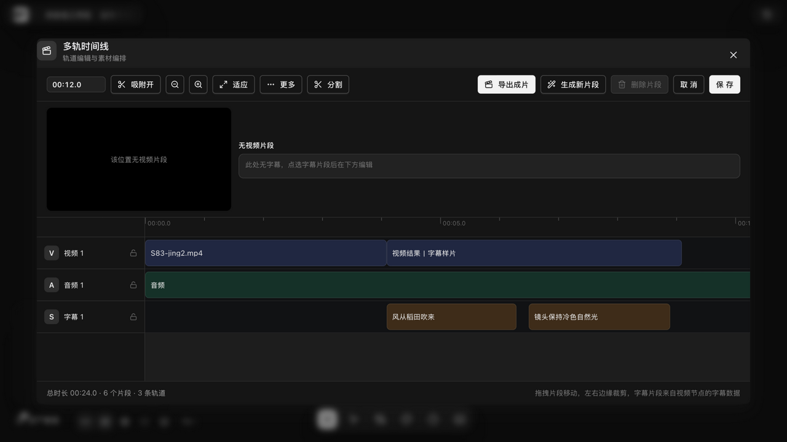

# 字幕关键词高亮与 SRT

> 状态注记（Batch 34 运行时核查，v1.6.14）：**S 轨字幕片段渲染已实证**——用官方夹具 `?fixture=libtv-video-subtitle` 注入带字幕数据的视频节点（视频结果｜字幕样片，两条字幕：风从稻田吹来 0–2.2s / 镜头保持冷色自然光 2.4–4.8s）后，多轨时间线 S 轨自动出现对应字幕片段（截图 40）。仍受阻的部分：字幕的**编辑弹窗**（新建/导入 SRT/关键词高亮设置）与视频节点的字幕工具同属未接线的 primary 组，普通 UI 无从创建字幕数据——本篇的关键词高亮与 SRT 导入导出细节维持源码证据，等字幕入口接入后回走。

> 适用角色：所有用户 ｜ 高亮判定调用 AI 模型（按量计费）。

## 目标

为字幕自动挑选关键词高亮，并掌握 SRT 的导入导出与重分段。

## 字幕关键词高亮

1. 在字幕面板对画布文本节点发起「字幕高亮」；
2. 系统按 **每批 30 条、并发 3 个** worker 分批请求模型；
3. 模型返回的高亮会经过**双重校验**：字段形状校验 + 「高亮文本必须是字幕原文的子串」自校验——模型幻觉坐标不会落地；
4. 字幕文本一旦修改，旧高亮自动失效（高亮存储的是与原文的自证关系，不是裸坐标）；
5. 未配置模型时功能不中断：按终止标点取首句作为高亮。

## SRT 导入导出

- 支持标准 SRT 解析：少于 3 行、非整数序号、无时间戳的坏块会被跳过而不是整体失败；
- 导出时序号自动归一（非法或缺失用当前行号）；
- 多行字幕正文在导入导出间完整保留。

## 重分段

把过长的字幕切分为较短的条目时：

- 断点优先级：**中文标点 > 英文标点 > 空格 > 硬切**，同一优先级内选最靠近目标长度的位置；
- 时长按字符数等比分配，并保证最小时长 300ms；
- 总时长不足时接受违规而不会崩溃；结果重新编号 1..N；
- 原有高亮按文本匹配重映射，找不到的显式标记为丢弃。
