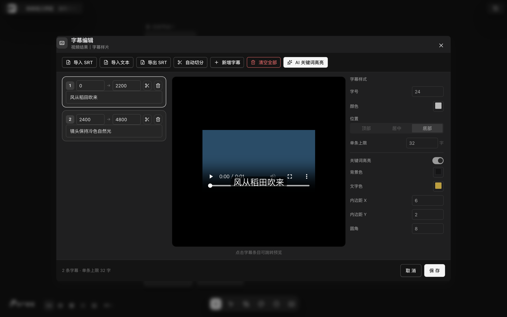
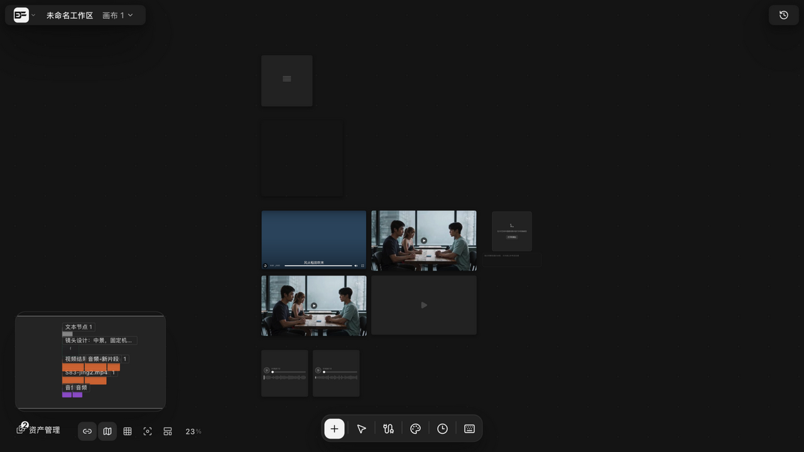
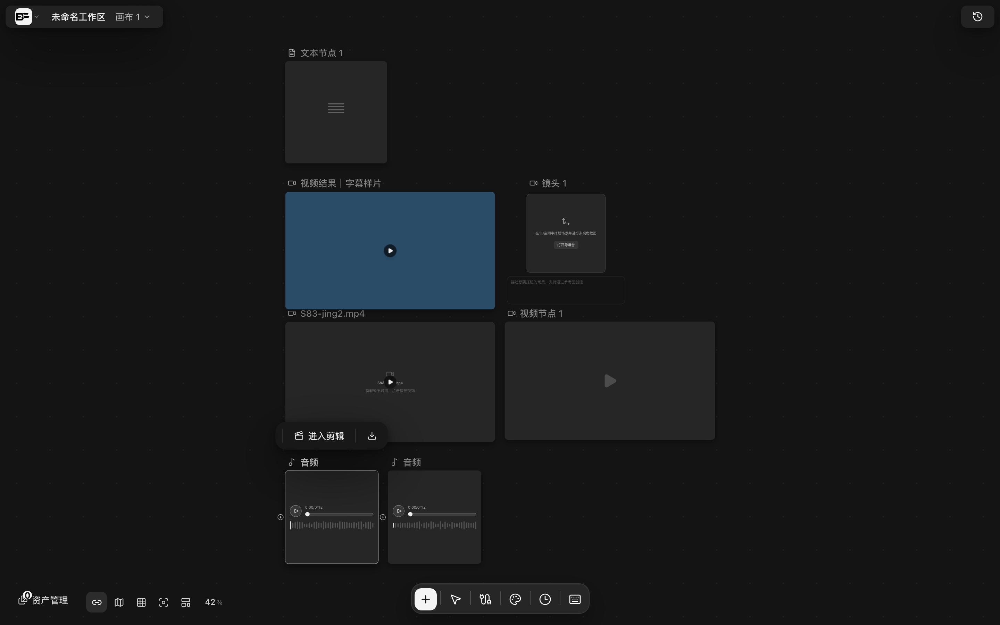
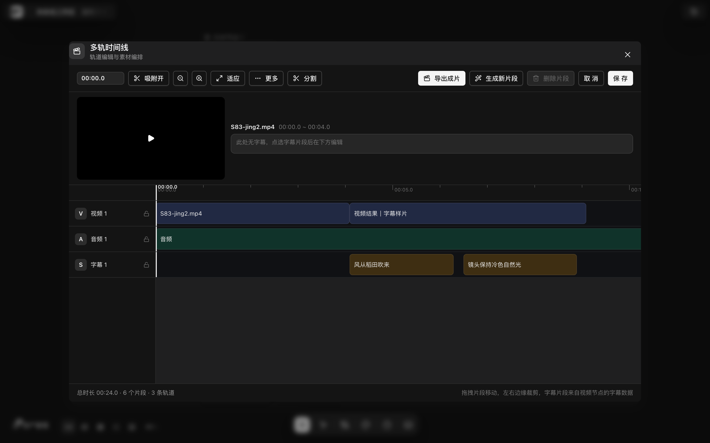

# 字幕关键词高亮与 SRT

> 适用角色：所有用户 ｜ 关键词高亮可调用 AI 模型（按量计费），未配置模型时自动降级为本地标点高亮。

> **本篇内容已在 v1.6.14 上完整走查验证。** 字幕编辑器**可用且入口明确**：从**多轨时间线弹窗**内点选 S 轨字幕片段，再点「精细编辑（SRT/高亮/样式）」即可打开，完整路径见下方「如何打开字幕编辑器」。需要留意的是，视频节点工具条上**没有**字幕按钮（这是界面布局如此，不是功能缺失——原因见文末「为什么视频节点上找不到字幕按钮」）。

## 目标

为字幕自动挑选关键词高亮，并掌握 SRT 的导入导出与重分段。

## 如何打开字幕编辑器

字幕数据挂在**视频节点**上，但视频节点工具条没有字幕入口。可达路径只有一条（v1.6.14 实测，全程四步）：

1. 选中画布上的**音频或视频节点**，在节点工具条点「**进入剪辑**」，打开「多轨时间线」弹窗；
2. 在 **S 字幕轨**上点选一条字幕片段——字幕片段来自视频节点的字幕数据，无数据的视频不会在 S 轨产生片段；
3. 弹窗底部出现「**字幕编辑**」面板，附提示「修改后保存将同步写回对应视频节点的字幕数据」；
4. 点面板上的「**精细编辑（SRT/高亮/样式）**」按钮，打开「字幕编辑」弹窗。

进入剪辑的工具条与弹窗布局见 [timeline-editing.md](timeline-editing.md)。

::: tip 字幕片段从哪来
S 轨片段是视频节点 `subtitleEntries` 的**只读快照**：时间线里改时间轴或文本后保存，会按视频节点回写 `subtitleEntries`；反之在字幕编辑器里保存，也会同步到时间线。删除全部字幕片段会把节点字幕一并清空。
:::

## 字幕编辑器能做什么

弹窗标题为「字幕编辑」，副标题是节点名（如「视频结果｜字幕样片」），三栏布局：

| 区域 | 内容 |
|---|---|
| 顶部工具条 | **导入 SRT / 导入文本 / 导出 SRT / 自动切分 / 新增字幕 / 清空全部 / AI 关键词高亮** |
| 左栏 | 字幕条目列表：序号、起止毫秒、文本框，每条带**切分**与**删除**按钮 |
| 中栏 | 视频预览，按当前时间渲染字幕条；底部提示「点击字幕条目可跳转预览」 |
| 右栏 | **字幕样式**（字号、颜色、位置、单条上限）与**关键词高亮**（开关、背景色、文字色、内边距 X、内边距 Y、圆角） |
| 底栏 | 「N 条字幕 · 单条上限 M 字」，**取消 / 保存** |

实测（示例视频「视频结果｜字幕样片」）：2 条字幕、单条上限 32 字、字号 24、位置「底部」、圆角 8——与弹窗显示逐字一致。

## 字幕关键词高亮

点「**AI 关键词高亮**」：

1. 系统按 **每批 30 条、并发 3 个** worker 分批请求文本模型；
2. 模型返回的高亮会经过**双重校验**：字段形状校验 + 「高亮文本必须是字幕原文的子串」自校验——模型幻觉坐标不会落地；
3. 字幕文本一旦修改，旧高亮自动失效（高亮存的是与原文的自证关系，不是裸坐标）；
4. **未配置模型时功能不中断**：按终止标点取首段作为高亮，界面提示「未配置可用的文本模型，已使用本地标点高亮」（v1.6.14 实测该降级路径触发，功能不中断）；
5. 重分段后原有高亮按文本匹配重映射，匹配不上的显式丢弃。

## SRT 导入导出

- **导入 SRT**：读取 `.srt` 文件；支持标准解析——少于 3 行、非整数序号、无时间戳的坏块会被跳过而不是整体失败；完全解析不到时提示「未解析到有效字幕：文件需为 SRT 格式（序号 + 时间码 + 正文），纯文本请用“导入文本”」；
- **导入文本**：纯文本一行一条，按视频时长平均分配起止时间；**视频时长未知时按每条 4 秒估算**；
- **导出 SRT**：把当前字幕序列化成 `.srt` 下载，序号自动归一（非法或缺失用当前行号）；
- 多行字幕正文在导入导出间完整保留。

## 重分段（自动切分 / 单条切分）

点「**自动切分**」或某条字幕的剪刀按钮，把过长的字幕切分为较短条目：

- 断点优先级：**中文标点 > 英文标点 > 空格 > 硬切**，同一优先级内选最靠近目标长度的位置；
- 时长按字符数等比分配，并保证最小时长 300ms；
- 总时长不足时接受违规而不会崩溃；结果重新编号 1..N；
- 全部字幕都没超过上限时提示「所有字幕均未超过单条上限 M 字，无需切分；可在「字幕样式」中调低上限后重试」；
- 原有高亮按文本匹配重映射，找不到的显式标记为丢弃。

## 字幕样式与叠加效果

| 设置 | 说明 |
|---|---|
| 字号 | 字幕文字大小 |
| 颜色 | 字幕文字颜色 |
| 位置 | **顶部 / 居中 / 底部** 三选一 |
| 单条上限 | 单条字幕最大字数，超过可用「自动切分」再切 |
| 关键词高亮 | 总开关；关闭则不显示高亮 |
| 背景色 / 文字色 | 高亮块的底色与文字色 |
| 内边距 X / Y、圆角 | 高亮块的内边距与圆角 |

播放叠加机制：视频节点内容组件读取 `subtitleEntries` 与 `subtitleStyle`，播放时经 video 的 `timeupdate` 事件按当前时间渲染对应字幕条——示例视频播放中「风从稻田吹来」字幕条渲染于画面底部的实拍见下图。字幕编辑器中栏的预览使用同一套渲染。

## 为什么视频节点上找不到字幕按钮

源码实证（`canvas-node-toolbar.tsx`）：工具注册表里 `subtitles` 工具**已注册**（label「编辑字幕」、displayLabel「字幕」、`defaultVisible: true`、分区 primary、`applicable: hasVideo`），但工具条的 JSX 对视频节点走的是独立分支，只渲染「视频处理 / 音视频分离 / 关键帧截取 / 预览 / 下载」与 `videoGlobalTools`，**从不渲染 primary 组**——该按钮因此在 v1.6.14 视频节点上不出现。

同一文件的 `onTimeline` 也把视频节点的时间线入口路由到内联修剪，只有非视频节点才打开多轨时间线弹窗。所以字幕编辑必须经由上文四步路径抵达。

## 相关截图

- 
- 
