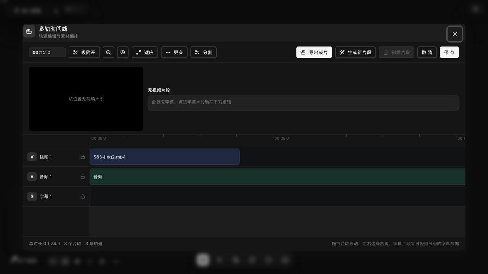
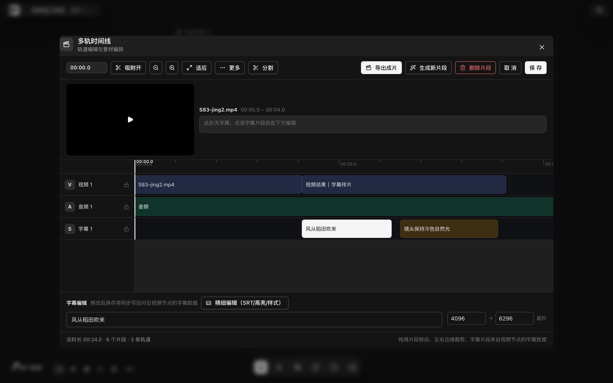
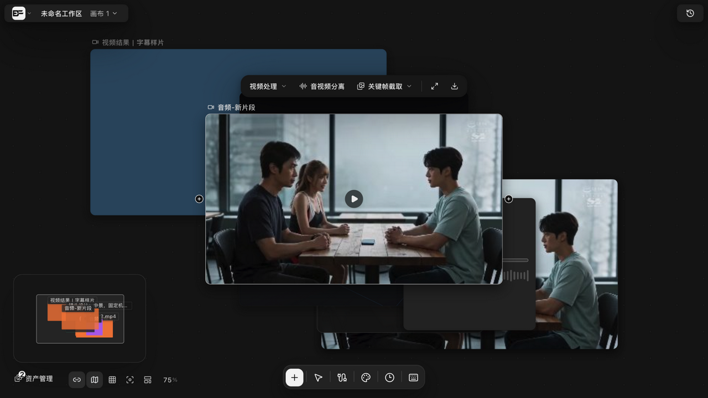

# 时间线剪辑器：轨道、片段与预览

> 适用角色：所有用户。

> 运行时实证（v1.6.14 构建实测）：多轨时间线弹窗已真实走查（经音频节点进入）。

## 目标

把画布上生成的片段搬上时间线轨道，完成裁剪、排序与预览。

## 进入入口（v1.6.14 实测）

- **音频节点**：选中音频节点，节点工具条点「**进入剪辑**」（v1.6.7+ 注册，分区「项目剪辑」）→ 打开「多轨时间线」弹窗，自动把画布上的视频/音频素材铺到对应轨道；
- **视频节点**：视频处理工具条不含「进入剪辑」（视频节点的时间线入口路由到内联修剪「视频剪辑」）；
- 弹窗右上「取消/保存」退出，保存才会把编排写回。

## 弹窗实测布局

- 顶栏：播放头读数、**吸附开**、缩放/适应、更多、分割；动作区 **导出成片 / 生成新片段 / 删除片段（选中前禁用）/ 取消 / 保存**；
- 左上预览区（无视频片段时显示占位提示）与字幕提示行「此处无字幕，点选字幕片段后在下方编辑」；
- 轨道区：**V 视频 1 / A 音频 1 / S 字幕 1** 三轨（各带锁定钮）+ 时间标尺；
- 素材自动铺轨：画布上的视频与音频节点片段自动入轨（实测 S83-jing2.mp4 0–4s 入 V 轨、音频铺满 A 轨），底部统计「总时长 · N 个片段 · N 条轨道」；
- **点选片段出现「片段编辑」面板**：在播放头分割、起点/时长（数值微调）、源内起点/源内结束，微调提示「数值微调精确裁剪」。

## 点选字幕片段（S 轨）

- **点选 S 轨字幕片段**，底部面板由「此处无字幕，点选字幕片段后在下方编辑」切换为「**字幕编辑**」面板：显示字幕文本、起止毫秒数（实测 4096 → 6296）与「修改后保存将同步写回对应视频节点的字幕数据」提示；
- 面板上的「**精细编辑（SRT/高亮/样式）**」按钮打开完整的字幕编辑器（导入/导出 SRT、AI 关键词高亮、字幕样式）——完整操作见 [subtitle-highlights.md](subtitle-highlights.md)；
- S 轨片段来自视频节点的字幕数据，视频节点没有字幕数据时 S 轨为空。

## 工作台布局

时间线编辑器由八个面板插槽组成：**时间线、预览、检查器、素材、字幕、转写、导出、AI 编辑**——可按需启停对应插件面板。

## 轨道与片段

- 新时间线默认三条轨道：**视频（video-1）/ 音频（audio-1）/ 字幕（subtitle-1）**；
- 基准比例 96 像素/秒；缩放范围 2%–400%，步进 1.25 倍；
- 片段从画布媒体节点同步而来；字幕轨道与画布文本双向同步。

## 移动与裁剪

- 拖动片段改变时间位置（可跨轨）；拖边缘裁剪时长与源内起点；
- 放置时有**碰撞检测**：重叠会被拒绝或提示，可列出冲突项；
- **吸附**：拖动时按距离吸附到附近片段边缘，同一毫秒的多个吸附点会全部参与候选；
- 撤销/重做的**键位**与画布一致（Ctrl/Cmd+Z / Shift+Z / Y），但**深度不同**：时间线有界 **200 层**（`lib/timeline/editor-history.ts` 的 `HISTORY_LIMIT`），画布只有 **50 层**（见 [undo-history-versions.md](undo-history-versions.md)）。**别把 200 当成通用值**——导演台工作台同样是 50 层。

## 预览与播放

- 播放头按帧格累积推进（帧率上限 120fps，不随播放时长漂移）；
- 取值与显示用「原始播放头」，写入关键帧用「吸附值」——避免帧间增量从错误起点计算。

## AI 编辑

AI 编辑面板一次最多接受 **8 条**编辑命令（防止一次模型输出造成大范围变更）；每条命令有 LLM 可读的参数契约。

## 生成新片段（组装回写画布，已运行时实证）

「生成新片段」与「导出成片」共用同一组装逻辑（ffmpeg.wasm 本地合成），但结果**不下载**：合成 MP4 会作为**新视频节点放回画布**，可继续编辑字幕与样式。成功提示「已生成新视频片段并放到画布，可继续编辑字幕与样式」；同样要求时间线内有视频片段。

- **命名规则（实测修正）**：新节点名 =「**打开时间线的节点标题** + -新片段」——从音频节点进入时生成「音频-新片段」（即使画面内容来自其他节点的视频片段）；早前按源码推断的「<镜头标题>-新片段」据此修正。
- **补充素材**：「添加素材」按钮列出**尚未入轨的有内容视频/音频节点**，可随时补入。

## 相关页面

- 字幕高亮与 SRT：[subtitle-highlights.md](subtitle-highlights.md)
- 导出成片：[timeline-export.md](timeline-export.md)
