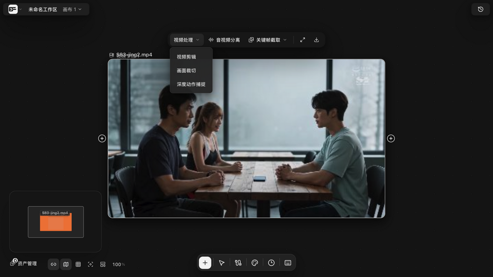

# 时间线导出 MP4 与白膜视频录制

> 适用角色：所有用户。

## 目标

把剪好的时间线导出为 MP4 成片；在导演台录制白膜（Clay）预览视频。

## 入口：视频处理下拉

选中**有内容的视频节点**，顶部工具条点「视频处理 ∨」展开三项：**视频剪辑**（进入剪辑台）、**画面裁切**、**深度动作捕捉**（v1.6.0 新增）：

## 时间线导出 MP4（本地处理，不经云端）

1. 在导出面板点击导出；
2. 系统用**内置 ffmpeg.wasm**（随应用同源发布，不依赖第三方 CDN）在浏览器本地完成裁剪与拼接；
3. 每段裁剪使用输出 seek 精确定位（重编码，切点帧精确）；
4. 导出轮询最长 62 分钟、每 3 秒查询进度；失败会显示阶段与错误详情。

**产物校验**：导出完成后系统会手工解析 MP4 容器结构（ftyp/mdat/trak 等），确保产物不是空壳文件——「流程成功但产物不可用」会被当场拦截。

## 白膜视频录制（导演台）

1. 在导演台点击「导出白膜」；
2. 系统回到 0 帧 → 播放 → 录制画布 → 恢复播放状态与播放头；
3. 录制前会做**两次快照时效校验**（确认场景未被同时编辑）；
4. 渲染循环内任何错误会**立即中止录制**并提示「白膜视频录制期间发生渲染错误，请重试」——不会静默产出残缺视频；
5. 录制完成后校验时长 ≥ max(0.25 秒, 设定时长的 50%)，异常会提示「白膜视频时长异常，录制可能不完整，请重试」。
