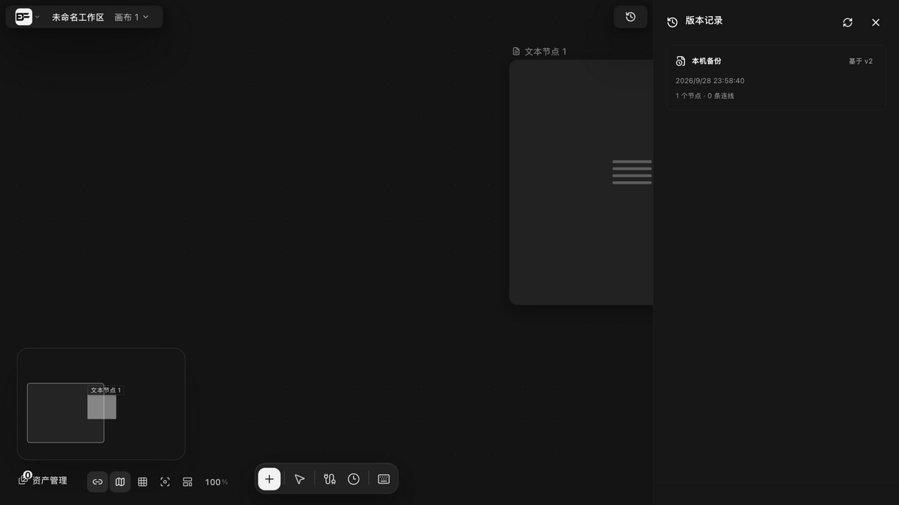
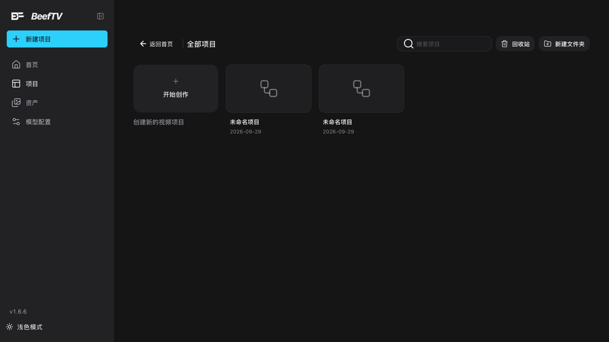
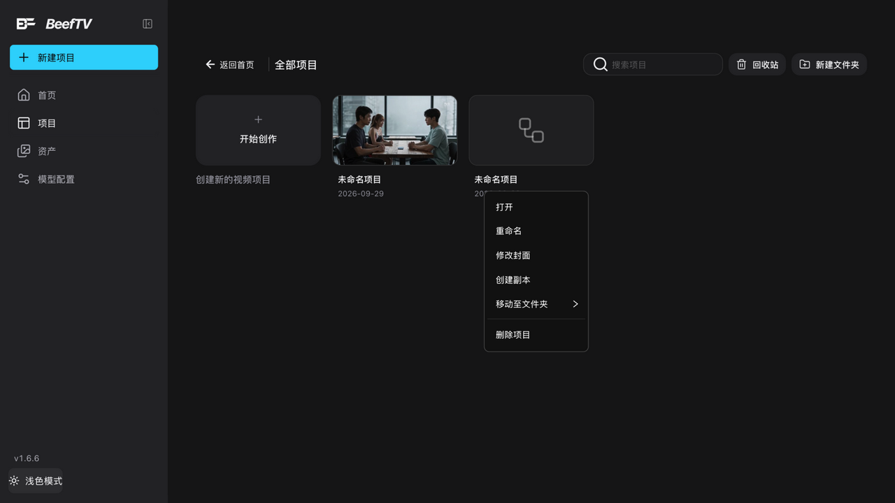
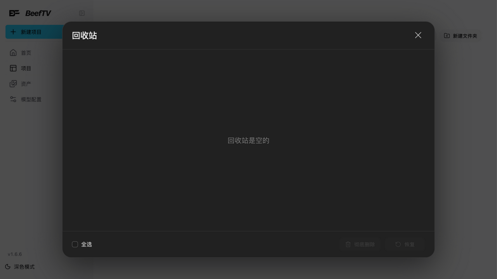
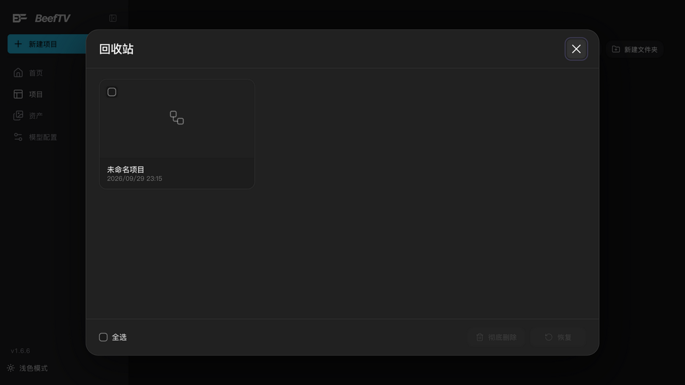

# 撤销重做、版本历史与回收站

> 适用角色：所有用户。

## 目标

放心地改：弄错的操作能撤销，重要的状态有版本可回，删除的项目能找回。

## 撤销与重做

| 快捷键 | 行为 |
|---|---|
| Ctrl/Cmd + Z | 撤销 |
| Ctrl/Cmd + Shift + Z 或 Ctrl/Cmd + Y | 重做 |

- 撤销栈按**实体差异**记录（哪个节点/连线改了什么），连续的小改动会在 180ms 内自动合并成一步；
- 拖动节点过程中暂停记录——拖完算一步；
- 注意：**画布撤销不会取消已经提交的生成任务**（提交审批时的警告文案已明示）。要停止任务请用任务取消。

## 版本历史

入口：画布顶栏 → 版本记录。

- **云端 / 本地** 双标签页——本地标签在云端部署下叫「**本地草稿**」，纯本地项目下叫「**本地历史**」；
- 纯本地项目的条目显示为「**本机备份**」，带「基于 vX」角标与「N 个节点 · M 条连线」计数（云端版本条目同样显示节点/连线计数）；
- ::: tip 含绘图的历史只剩预览
  预览旧版本时若有绘图节点，会提示「**绘图仅保留已上传的预览，不含本机历史笔画**」——手绘笔迹不会进历史，需要的话请单独保存。
  :::
- 每条历史可**只读预览整张画布**，确认后再恢复；
- **恢复前自动备份**：点恢复时会先备份当前云端内容（版本原因标记为「恢复前备份」，区别于「自动保存」），**并保留本地草稿**；恢复本身会生成一个新版本，画布的项目归属保持当前设置——所以恢复操作本身也可撤销。

## 项目操作菜单

项目卡「···」按钮展开六项操作：**打开 / 重命名 / 修改封面 / 创建副本 / 移动至文件夹 ＞ / 删除项目**（删除进入回收站）：

> 端到端实测（v1.6.14 运行时走查）：「删除项目」→ 项目立即从列表消失并进入回收站（无二次确认弹窗）；「回收站」中条目带删除时间，勾选前「恢复 / 彻底删除」均为禁用态；勾选后点「恢复」→ 弹窗关闭、项目回到列表。全链路与源码行为一致。

## 回收站

入口：项目列表页右上角「回收站」按钮。

- 删除的项目进入回收站，保留**最近 200 条完整快照**；
- **恢复**：勾选后点「恢复」（图标 ↩，恢复到项目列表）；恢复是幂等的——同名项目已存在时不会产生副本；
- **彻底删除**：点「彻底删除」（红色）→ 弹出「确认彻底删除？」二次确认 → 确认后不可恢复；
- 支持「全选」与「已选择 N 项」批量操作；确认弹窗点击遮罩即可取消。

## 相关页面

- 任务提交与撤销边界：[generate-images.md](generate-images.md)
