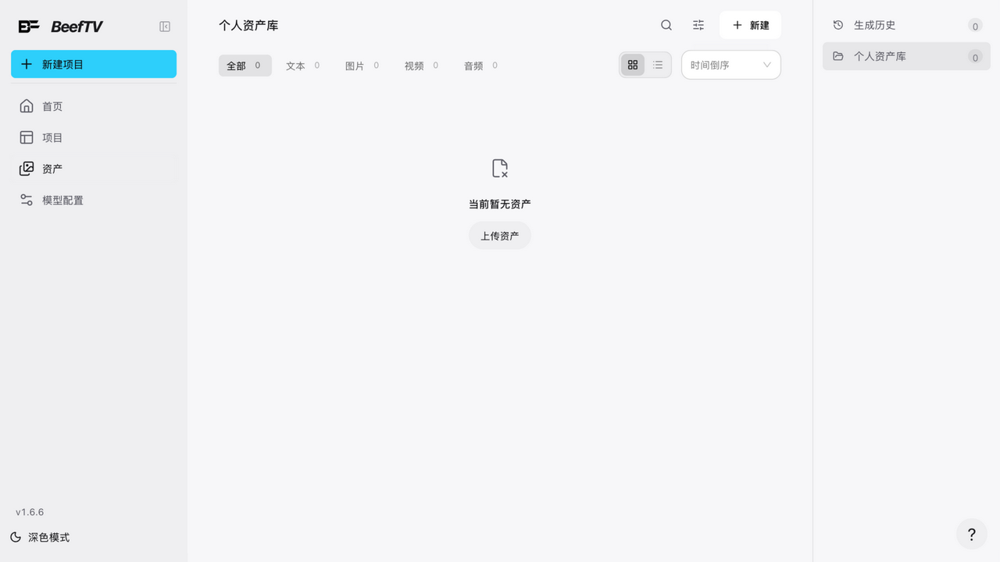
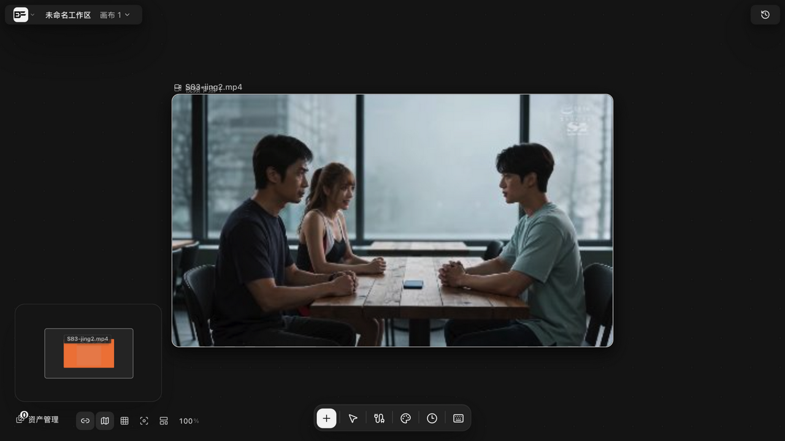
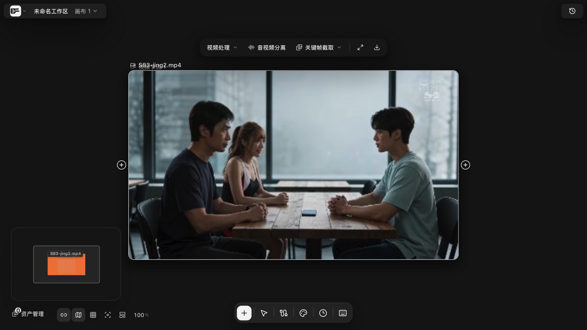
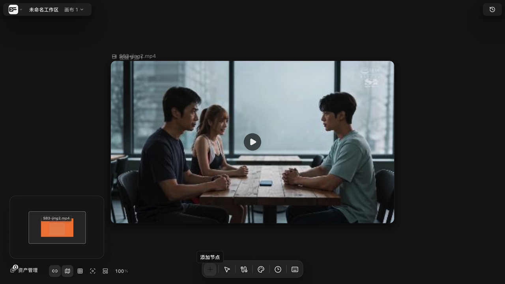
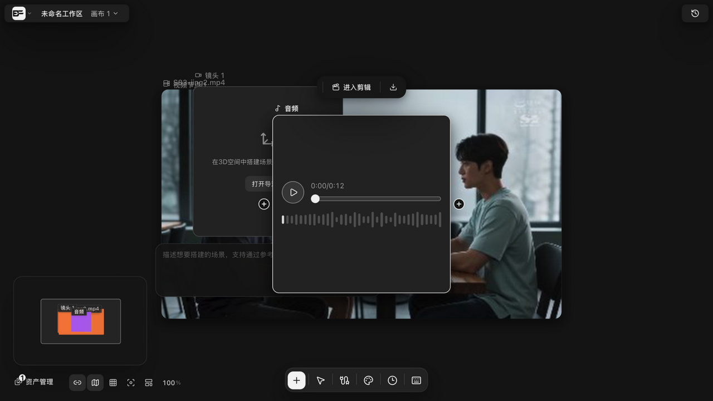
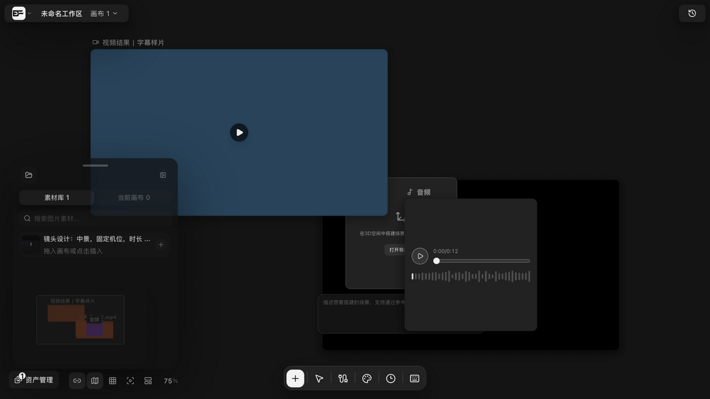
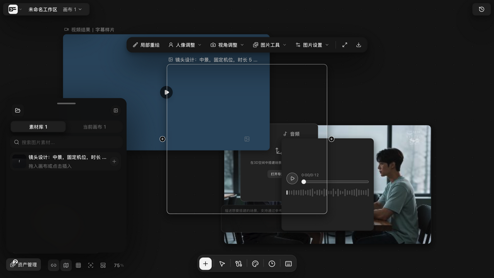

# 上传本地图片、视频、音频

> 适用角色：所有用户。

## 目标

把本地媒体文件导入画布成为可用素材节点。

## 入口

1. 「添加节点」菜单 → **导入资源 → 上传**；
2. 空白右键菜单 → **上传到这里**（导入到点击位置附近）。

## 支持的文件类型

`image/*`、`video/*`、`audio/mpeg`、`audio/wav`、`audio/x-wav`、`.mp3`、`.wav`、`.txt`、`.md`、`.markdown`，可多选。

素材也可从侧栏「资产」页（个人资产库）统一管理，再经「添加节点 → 素材库」放入画布。

## 存储行为（了解即可，系统自动处理）

- **小文件（≤50MB）**：单请求直传；
- **大文件（>50MB）**：自动走分片上传——先开上传会话，再按每片 8MB 逐片上传，最后合并入库；
- 每次上传携带客户端预生成的幂等键，网络重试不会造成重复资源；
- 视频封面与时长等元数据提取失败时**不会阻断上传**，会提示后继续上传原文件。

## 上传完成后

- 上传的视频节点标题 = **文件名去扩展名**（如 S83-jing2.mp4 → 「S83-jing2.mp4」）；
- 系统自动抽取**视频首帧**作为节点画面（「正在生成帧」片刻后完成）；
- 选中节点出现**视频处理工具条**：视频处理 ∨（视频剪辑 / 画面裁切 / 深度动作捕捉）/ 音视频分离 / 关键帧截取 ∨ / 放大 / 下载——均为本地处理，不经云端。

> 增量注记（v1.6.13）：画面裁切的尺寸标签与视频剪辑的时长标签在**画布缩得很小时仍保持可读**（标签反向跟随缩放；修剪选区过窄时时长标签自动浮到选区中央），控件行为不变。

> 音频上传实测（v1.6.14）：音频节点标题保持默认「音频」（**不取文件名**，与视频节点不同）；内容态带播放器（时长 + **波形可视化**），选中后工具条为「进入剪辑 / 下载」。

## 素材空间与插入（v1.6.14 实测）

画布左下「资产管理」打开**素材空间**抽屉：**素材库 / 当前画布**两个页签（计数）、素材搜索框；资产卡操作**随页签语境切换**——素材库页签为「拖入画布或点击插入」（插入新节点），当前画布页签为「**点击定位到画布**」（定位到已插入的节点）。点击「+」插入后资产转为画布节点（当前画布计数 +1）——插入的图片节点选中即展示完整图片工具条（局部重绘 / 人像调整 / 视角调整 / 图片工具 / 图片设置 / 放大 / 下载）。白膜导出等本地产物也落在素材库中。

## 注意事项

- **同一文件上传两次会产生两份独立资源**（系统不按内容去重）——如需避免重复，请从「素材库」或「从生成历史选择」复用；
- 浏览器本地模式下素材保存在本机 IndexedDB；托管模式上传到服务器；
- 上传完成的素材会成为画布节点，可直接参与连线与生成。

## 相关页面

- 素材复用：[connect-references.md](connect-references.md)
