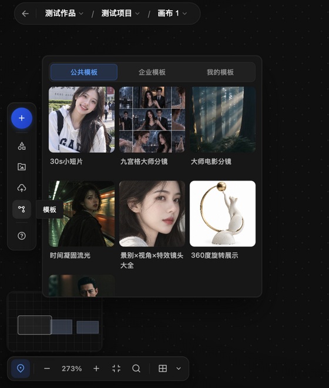

# 认识画布上下文与素材入口

了解画布顶部的作品 / 项目 / 画布三级面包屑，以及左栏的项目资产、素材库与上传入口。本页只涉及查看与入口位置；切换层级、新建 / 重命名 / 删除画布等会改动项目结构的操作请谨慎执行。

## 适用角色

已登录的画布创作者。

## 前置条件

已登录并打开一个画布。

## 面包屑：作品 / 项目 / 画布

画布左上角依次显示当前**作品**、**项目**、**画布**（例如“测试作品 / 测试项目 / 画布 1”）。

1. 点击任意一级，向下弹出对应列表；当前项高亮并带勾标。
2. “画布”层级列表中：每项右侧显示该画布的节点数量；面板顶部有“+”（新建画布）入口，底部提供“重命名”“删除”操作。
3. 按 `Esc` 或点击别处可关闭下拉，不会发生切换。

注意：切换作品 / 项目、新建、重命名、删除画布会改变项目结构，本手册未逐项验证这些操作的结果，执行前请确认。

## 查看项目资产

点击左栏**查看项目资产**，画布左侧滑出“项目资产”面板：

- 分类页签：**角色**、**物品**、**环境**；
- 顶部搜索框：占位文字“搜索资产名称...”；
- 面板无内容时显示“暂无已生成的资产图”。

点击面板右上角 × 关闭。

## 模板面板

点击左栏**模板**，画布左侧滑出模板面板：

- 页签：**公共模板**、**企业模板**、**我的模板**；
- 以卡片展示模板（如“30s小说切片”“九宫格大师分镜”“大师电影分镜”等），点击卡片即可按模板创建内容。

注意：本手册只记录了面板入口与结构；“点击模板卡片后创建内容”的结果未验证，使用前请以实际预览为准。

## 从素材库选择 / 本地上传

左栏的**从素材库选择**与**本地上传**都会打开“选择素材”对话框（副标题“从素材库选择图片或视频作为生成参考”）：

- 左侧为目录树：当前项目下有“工具箱素材”“画布素材”“上传素材”等目录，也可进入你账户下的其他目录；
- 顶部：搜索框“搜索当前文件夹”；
- 筛选行：**全部 / 图片 / 视频 / 音频 / 3D**、**收藏**、**创建者**、**创建时间**；
- 操作：**批量操作**、**+ 本地上传**；
- 目录为空时显示“暂无数据”；
- 底部：已选数量、“取消”、“添加参考素材”。

上传支持的文件类型以对话框内隐藏的文件选择限制为准：图片、视频、音频，另支持 .txt、.docx、.pdf（可多选）。实际上传结果未在本手册验证范围内；把素材选入画布后即可按 [edit-selected-node.md](edit-selected-node.md) 引用。

## 恢复

- 所有面板与对话框都可以通过 ×、“取消”或 `Esc` 关闭，不会改动画布内容。

## 相关任务

- [创建节点](create-first-node.md)
- [编辑选中节点](edit-selected-node.md)
