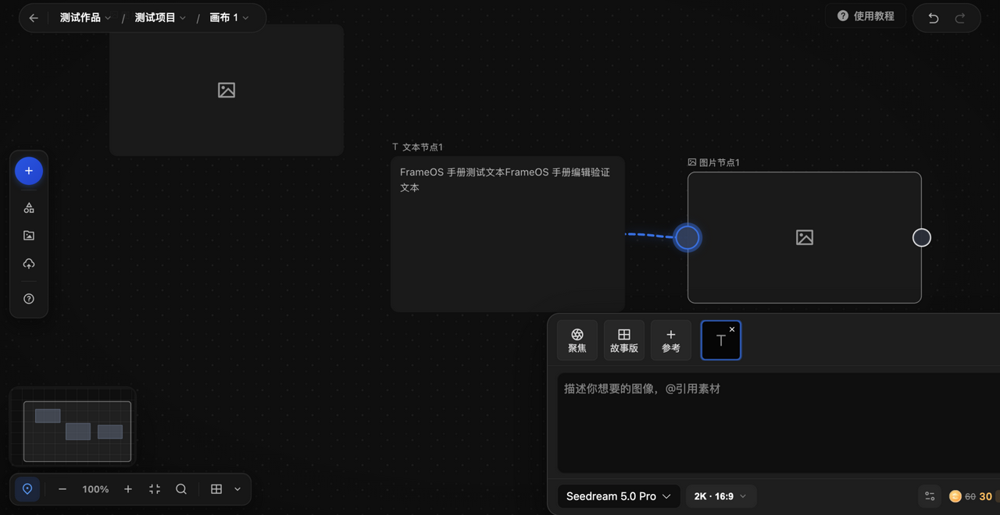
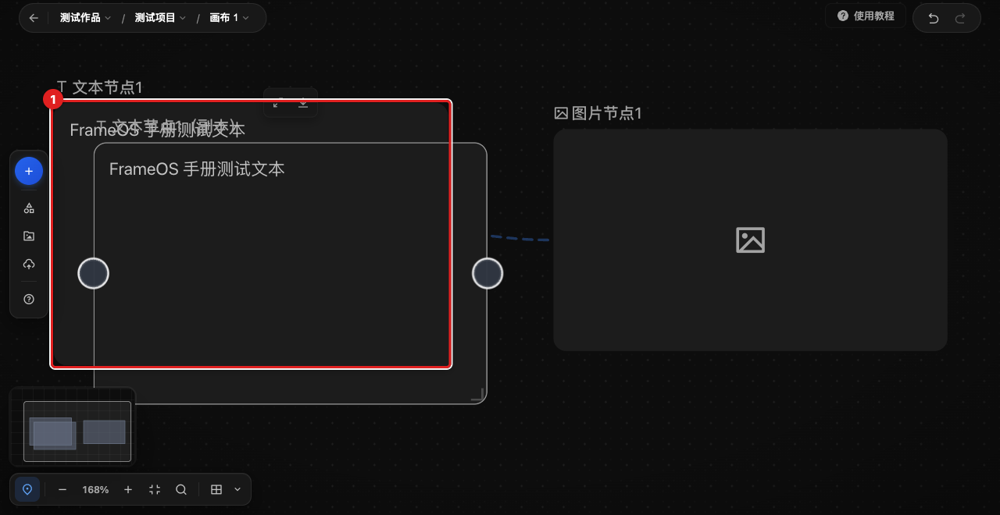

# 连接两个节点

用连线把两个节点串起来（例如把文本节点接到图片节点，让文字成为画面的描述输入），以及删除不需要的连线。

## 适用角色

已登录的画布创作者。

## 前置条件

画布中已有两个节点（见 [create-first-node.md](create-first-node.md)）。节点左右两侧只有在选中或悬停时才清晰可见圆形连接点。

## 入口

直接在画布上操作：源节点右侧的圆形连接点 → 目标节点左侧的圆形连接点。

## 建立连线

1. 把鼠标移到源节点（例如文本节点）**右侧的圆形连接点**上。
2. **按住并拖动**到目标节点（例如图片节点）**左侧的圆形连接点**上松开。
3. 两个节点之间出现连线（默认视图下为虚线），连接完成。

成功判据：两个节点之间出现连线；顶栏“撤销”变为可用。

注意：

- 拖动过程中如果在画布空白处松开鼠标，本次连接直接取消，不会产生连线，也不会有残留的半截线。
- 本手册验证过的连接方向是“文本节点右侧 → 图片节点左侧”；其余节点类型之间的可连规则以产品实际响应为准。

## 删除连线

1. **单击**选中连线另一端的图片节点。
2. 在其上方工具行中点击**删除连线**图标。与该节点相关的连线即被移除。
3. 需要恢复时，按顶栏**撤销**或 `⌘Z`。

成功判据：连线从画布上消失；“撤销”可用。

## 恢复

- 删除连线、建立连线都是历史操作：顶栏**撤销** / **重做**或对应快捷键可来回切换。
- 撤销“删除节点”时，节点连同它上面的连线会一起恢复（已验证）。

## 相关任务

- [编辑选中节点](edit-selected-node.md)
- [复制、删除并恢复节点](duplicate-delete-history.md)
