# FrameOS 源站观察台账

> 本文件是源站证据的权威接力记录。重新打开截图前先读本文件；不要把本地 clone、
> 旧研究文档或截图印象当作源站事实。本文件区分 DOM 事实、交互事实、网络事实、
> 截图事实、帮助面板声明和待验证事项。

## 0. 采集上下文

- 采集日期：2026-09-22（第一轮 readiness smoke 与连接取证）、2026-09-23（第二轮
  逐任务回走取证，见第 13 节）。
- 源站 URL：
  `https://www.frameos.cn/#/canvas/01M34E48BEEVEQXR93Y8N70Y5N/01M34E4AKBTXT72KFD3MCYZ6NV`。
- 角色：用户已登录的普通画布创作者。
- 画布上下文：面包屑显示“测试作品 / 测试项目 / 画布 1”。
- 正式桌面视口：`1280x720`；locale：`zh-CN`。
- 本轮安全边界：只创建/编辑节点、连接、打开菜单和上传准备；不触发图片生成、
  视频生成或其他可能扣费的 Provider。
- 当前 Git 项目是复刻项目；本文件中的事实只适用于上述 FrameOS 源站会话，不代表
  `/frameos/*` 本地 clone 已经对齐。

## 1. Readiness smoke：空态与一级入口

### 1.1 DOM 事实

- 空画布显示“选择一种方式开始创作”。
- 空态六个可见 CTA 逐字为：“文本”“图片”“视频”“音频”“3D导演台”“上传文件”。
- 页面可见导航和工具文字包括：
  - “展开菜单”；
  - 面包屑“测试作品 / 测试项目 / 画布 1”；
  - “使用教程”“撤销”“重做”；
  - 左栏“添加节点”“查看项目资产”“从素材库选择”“本地上传”“帮助”；
  - 左下“画布小地图”“缩小”“100%”“放大”“适应画布”“搜索节点”
    “一键整理 · 网格整理”“选择整理方式”。
- 空态初始的“撤销”和“重做”均为 disabled。
- 早期记录中出现的 `.react-flow__node` / `.react-flow__edge` 是错误表述；
  当前源站实际使用 Vue Flow 类名 `.vue-flow__node` / `.vue-flow__edge`。不要把本地
  React Flow 选择器复制进源站手册事实。

### 1.2 交互事实

- 点击空态“文本”后，空态消失，画布出现“文本节点1”和“（双击编辑文本）”。
- 创建后“撤销”变为 enabled，“重做”仍为 disabled。
- 创建文本节点后，选中态周围出现编辑相关界面；readiness smoke 阶段观察到
  `contenteditable=true` 的编辑面，以及“参考”“CO 5”“全屏编辑”“高级设置”和
  disabled 的图片提交按钮。
- 该阶段没有点击生成/提交按钮，不产生付费 Provider 调用。
- 以上是创建入口和初始反馈证据；在用户手册 Gate B 回走前，不把它单独视为
  `create-first-node` 已验证。

### 1.3 截图事实

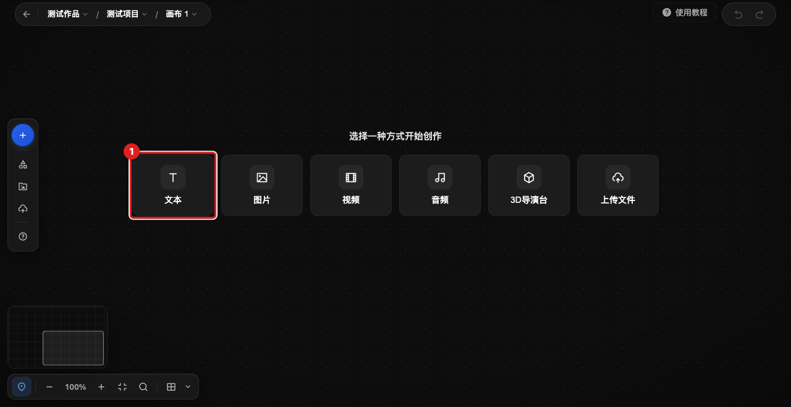

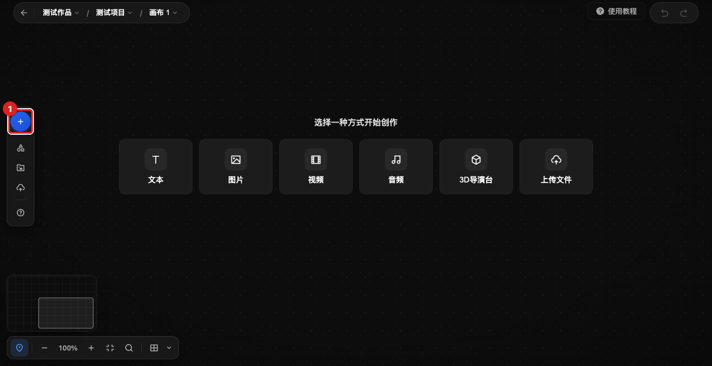

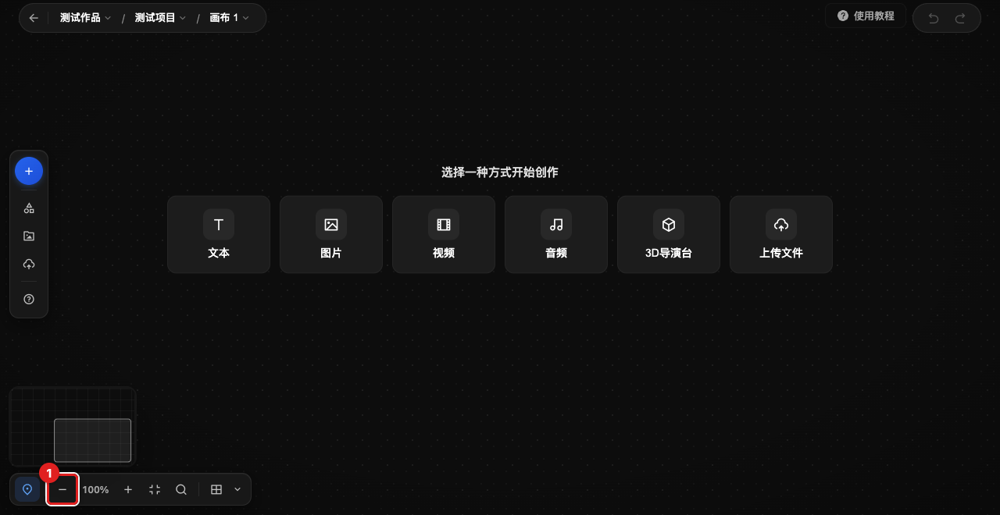

- 01-03 均为 `1280x660`，已裁掉 y=0-60 的账户区域。
- 高亮由实时 DOM bounding box 注入，截图后已移除 overlay。
- 01 证明空态“文本”入口位置和可见上下文，不证明点击后的持久化结果。
- 02 证明左栏“添加节点”位置，不证明菜单动作已经完成。
- 03 证明左下缩放工具条和“缩小”入口，不证明触摸板/鼠标手势语义。

## 2. 文本节点：编辑、失焦提交和选中态

### 2.1 DOM 与状态事实

- 源站节点容器类为 `.vue-flow__node`。
- 文本节点选中后，该节点增加 `selected` 状态。
- 选中节点时存在节点上方工具条和下方 Prompt 面板。
- 双击 `.text-display` 后，文本显示面替换为聚焦的
  `textarea.text-edit.nowheel.nodrag.nopan`。
- 创建后的编辑表面曾观察到 `contenteditable=true`；双击文本进入的最终文本编辑
  控件则是上述 textarea。后续手册应按具体入口分别描述，不能把两种状态合并为一个
  未经解释的控件。

### 2.2 交互事实

- 在 textarea 输入 `FrameOS 手册测试文本` 后，textarea 的值立即变为该字符串；
  节点外部显示文本仍为“文本节点1”，历史仍 disabled，说明输入尚未提交。
- 按 `Escape` 后，textarea、输入值、焦点和节点文本均未变化；本版本不能把
  `Escape` 写成取消或提交快捷键。
- 点击画布空白区域坐标 `(1100, 500)` 后，textarea 消失，节点外部文本更新为
  “文本节点1 FrameOS 手册测试文本”，“撤销”变为 enabled，“重做”仍 disabled。
- 可写入用户手册的候选成功判据是：编辑控件消失、节点文本更新、撤销可用。
- 文本编辑未点击图片/视频生成按钮。

### 2.3 手册含义

当前最可靠的操作描述是：

1. 双击节点中的文本进入编辑；
2. 输入内容；
3. 点击画布空白处让编辑控件失焦；
4. 以节点文本更新和“撤销”可用作为提交结果。

Gate B 仍需从手册入口重新执行并记录，不能仅凭本节旧操作结果标记 `verified`。

## 3. 图片节点：选中态和 Prompt 面板

### 3.1 已观察的可见控件

选中图片节点后观察到以下文本/控件：

- 节点上方工具条：“聚焦”“故事版”“参考”“删除连线”“替换参考”；
- 下方 Prompt 面板：“描述你想要的图像，@引用素材”“全屏编辑”；
- 模型/参数区域：“Seedream 5.0 Pro”“2K · 16:9”“高级设置”“60”“30”“5 折”。

### 3.2 证据边界

- 本节只证明图片节点选中态及其面板文字存在。
- 没有证明模型价格、模型能力、积分扣除、生成结果或真实提交行为。
- “替换参考”可以作为后续上传/参考图任务的入口线索，但后续探索必须使用已登记的
  测试媒体，并在生成/计费边界前停止。

## 4. 节点连接

### 4.1 可重复的成功连接观察

- 场景中有一个文本节点和一个图片节点。
- 将文本节点右侧 Handle 拖到图片节点左侧 Handle。
- 连接前 `.vue-flow__edge` 数量为 0；连接后数量为 1。
- 观察到可访问性边组名：
  `Edge from 635585ae-c096-4599-aaac-4ab447153bc6 to 7544ea6e-ad68-44a1-ad96-207f392981fd`。
- 连接后的当前节点可见文本为“文本节点1 FrameOS 手册测试文本”和“图片节点1”。
- 当前浏览器基线曾记录为：2 个节点、1 条边；缩放显示 `168%`；没有残留弹层/菜单；
  “撤销” enabled，“重做” disabled。

### 4.2 未验证边界

- 尚未独立验证连接失败、非法连接、循环连接、删除连线和连接后的持久化请求。
- 不要把 Handle 方向规则、边类型或业务语义从本地 React Flow 实现推导到源站。
- `05-connect-nodes.png` 目前只是候选截图，不是连接成功的唯一证据。

## 5. 画布导航、缩放、搜索和整理

### 5.1 已观察控件

左下工具条包含：

- “画布小地图”
- “缩小”
- 当前缩放显示“100%”
- “放大”
- “适应画布”
- “搜索节点”
- “一键整理 · 网格整理”
- “选择整理方式”

### 5.2 已观察交互

- 通过缩放按钮观察到显示值经历 `100% -> 87% -> 100%`。
- 源站 `.vue-flow__viewport` 的 `transform` 字段曾为空，不能把这个字段当作缩放
  成功判据；应使用可见缩放文本、节点屏幕位置/尺寸或其他稳定 DOM 状态。
- 搜索入口的 placeholder 为“搜索节点名称”。
- 输入“图片”后，结果区域仅显示“图片节点1”。
- 整理菜单逐字包含：
  - “按连线横向 沿连线从左到右分层”
  - “按连线纵向 沿连线从上到下分层”
  - “网格整理 保持相对位置去重叠对齐”

### 5.3 尚未独立回走

- 鼠标滚轮、`⌘ + 滚轮`、中键/右键拖动、空格拖动、左键拖动的确切优先级和结果；
- macOS 触摸板双指捏合缩放和双指平移；
- “适应画布”、小地图点击、三个整理方式执行后的节点坐标变化；
- 搜索清空、无匹配、搜索结果点击聚焦和整理后的撤销边界。

帮助面板中的手势是产品声明，不能在本节当作已独立执行的手势证据。

## 6. 右键菜单、帮助和外部教程

### 6.1 节点右键菜单

观察到菜单项：

- “复制 ⌘ C”
- “创建副本 ⌘ D”
- “删除 ⌫”

### 6.2 画布空白处右键菜单

观察到菜单项：

- “添加节点”
- “上传文件”
- “粘贴 ⌘ V”
- “整理”
- “重置 ⌘ 0”

### 6.3 帮助对话框

- 打开后标题为“快捷键”。
- 内容分组为“创作”“缩放”“移动画布”“其他”。
- 帮助文本声明：
  - 创作：双击空白处添加节点、复制、剪切、粘贴、原地复制、拖拽复制、保存；
  - 缩放：双击节点聚焦填满视口、放大、缩小、重置视图、触控板双指捏合、
    鼠标滚轮/`⌘`滚轮；
  - 移动画布：空格拖动、左键拖动、触控板双指平移、鼠标中键/右键拖动、滚轮平移；
  - 其他：撤销、重做、删除、搜索节点、小地图、帮助、取消选中。
- 以上是“帮助面板声明”，不是本轮全部独立执行的事实；后续手册必须显式区分两者。

### 6.4 外部教程和 breadcrumb

- 点击/打开“使用教程”后，外部标签页标题观察为“FrameOS使用手册 - 飞书云文档”。
- 画布内 breadcrumb 为“测试作品 / 测试项目 / 画布 1”。
- breadcrumb 各级下拉、切换和返回行为尚未完整回走。

## 7. 历史、复制和删除

- 已观察到创建副本、删除、撤销/重做的入口或状态变化。
- 创建节点后“撤销”变为 enabled、“重做”保持 disabled。
- 当前资料没有足够证据证明：
  - “复制”和“创建副本”的结果差异；
  - 删除后节点/边如何修复；
  - undo/redo 是否覆盖文本编辑、节点位置和连线；
  - 刷新或重新打开画布后的持久化。
- 这些内容必须在 `duplicate-delete-history` Gate B 中逐项回走，不得只从菜单文字
  推导结论。

## 8. 网络事实

在本轮安全观察中看到以下请求返回 HTTP 200：

- `/api/canvas/ops`
- `/api/canvas/detail`
- `/api/canvas/realtime/connect_token`
- `/api/asset/list`

网络记录只保留 method/path/status 这一层，不读取、不输出 token 或 cookie，也没有把
响应内部字段当作已验证的产品合同。后续若要记录请求业务结果，应只记录去敏后的状态
和与用户动作直接相关的字段。

## 9. 截图登记与识图结果

### 9.1 已登记候选正式图

manifest 当前登记 01-03：

| 文件 | 尺寸 | SHA-256 | 识图结论 |
|---|---:|---|---|
| `01-create-first-node-empty-state.png` | 1280x660 | `618404c81447bd390c2975203f0a6f9019d498ec242a4083b3399ea99e11768e` | 空态中央“文本”入口及周围画布上下文 |
| `02-canvas-context-left-rail.png` | 1280x660 | `4e9e182f5f74aa626f7f275427e508d8dac44348fc3b0540aaeedd6af85d262e` | 左侧“添加节点”入口及上下文 |
| `03-navigate-canvas-toolbar.png` | 1280x660 | `1917f85ddb19a7e94ec166cdfa96b03f7132b7f9cfe05ad96792633eab595a35` | 左下工具条“缩小”入口及上下文 |

三张图均裁掉 y=0-60 的账户区域，并使用实时 DOM bounding box 高亮目标。图像只
辅助定位 UI，不替代 DOM/ARIA/交互证据。

### 9.2 已产生、已清理但尚未登记的图

| 文件 | 尺寸 | SHA-256 | 当前处理 |
|---|---:|---|---|
| `04-edit-selected-node.png` | 1280x660 | `339e23ce009730d72a3d081f96e3ebe38af8d6a02b834bc12bbd9f2e2a162653` | 已裁掉顶部 60px 账户区域并目视确认；待正文引用和 manifest 登记 |
| `05-connect-nodes.png` | 1280x660 | `73e9a044d845fcb03344438b64259e50d70f3f19ea84458fc6955e37f8360706` | 已裁掉顶部 60px 账户区域并目视确认；待正文引用和 manifest 登记 |

04/05 原始截图曾包含右上账户/积分数值；当前文件已经清除该区域，保留节点、边、
小地图、缩放条和实时高亮。它们仍未进入 manifest，也没有被正文引用。不要重复识别
01-03；以上哈希和清理结果是可复用记录。只有再次裁剪或重拍，才需要重新检查并更新
hash、manifest 和正文引用。

## 10. 待验证矩阵

| 主题 | 当前证据 | 仍需验证 |
|---|---|---|
| 创建文本节点 | 空态入口、创建后节点和撤销状态 | 从清洁入口回走、持久化、取消路径 |
| 创建图片/视频/音频/导演台 | 菜单文字线索 | 安全创建结果、节点结构、上传/生成边界 |
| 文本编辑 | textarea、失焦提交、Escape 不改变状态 | Gate B 重走、刷新/历史恢复 |
| 图片 Prompt 面板 | 可见控件文字 | 参考图上传、参数编辑、取消路径，不触发生成 |
| 节点连接 | 0 边到 1 边，Handle 成功 | 删除、失败、非法/循环、持久化 |
| 导航缩放 | 按钮显示值变化 | 鼠标、触摸板、快捷键及焦点/边界 |
| 搜索整理 | placeholder、命中结果、整理菜单 | 清空/无匹配、布局变化、撤销 |
| 右键/帮助 | 菜单与帮助文字 | 各快捷键实际事件和恢复路径 |
| breadcrumb/教程 | 文字与外链标题 | 下拉切换和外链行为的完整记录 |
| 网络 | 4 个 endpoint 返回 200 | 各动作对应关系和去敏业务结果 |

## 11. 下一次探索的顺序

1. 先读取本文件和 `PROGRESS.md`，修正任何新旧事实冲突。
2. 确认已清理的截图 04/05 与 Gate B 当前状态一致；不重复识别已经有哈希记录的 01-03。
3. 使用同一登录画布，先完成 `create-first-node`、`edit-selected-node` 的 Gate B 回走。
4. 再完成 `connect-nodes`、`duplicate-delete-history`、`organize-and-search`。
5. 单独记录导航：按钮缩放、鼠标输入、macOS 触摸板输入、帮助声明和实际事件必须分栏。
6. 最后回走 `canvas-context`、`help-and-shortcuts`，再开始写正文。
7. 任何触及真实生成、计费、发布或不可逆删除的动作，在副作用前停止。

## 12. 证据等级约定

- `DOM fact`：当前浏览器 DOM/ARIA 可直接读出的事实。
- `interaction fact`：已在当前源站执行动作，并观察到前后状态差异。
- `network fact`：只读 method/path/status 或去敏业务状态。
- `screenshot fact`：截图中可见的布局/文字，必须配套 manifest。
- `product declaration`：帮助面板或教程的声明，未独立执行前不等于行为证据。
- `inference`：由多条事实推断出的解释；正文必须标明推断。
- `unverified`：当前没有足够证据，不得写成用户可依赖的操作。

## 13. 2026-09-23 第二轮：逐任务回走取证

本轮在用户登录态下对同一画布逐任务回走。取证方式为真实键鼠事件（坐标点击、
拖拽、键盘），DOM/ARIA 状态与可见缩放文本为成功判据。所有截图已登记
`manifest.yml`（01-19）；04/05 为上一轮遗留已清理图，本轮确认哈希一致后登记。
本轮结束时画布已恢复为会话前基线：文本节点1（文本“FrameOS 手册测试文本”）、
图片节点1、1 条连线。

### 13.1 持久化与历史边界（interaction fact）

- 刷新/重开画布后，图内容（节点、连线、文本）持久存在；但“撤销/重做”均回到
  disabled。即：**内容持久化，撤销历史不跨会话**。
- 撤销可恢复被删除的节点，并连带恢复其连线（本轮一次自动化误删即经“撤销”完整
  恢复，含边）；撤销后“重做”变为可用。
- 自动化事故记录：一轮中断的定位器点击与一次误触 Backspace 曾删除测试节点，均
  通过“撤销”按钮或 ⌘Z 恢复。这是自动化操作事故，不构成产品缺陷结论。

### 13.2 添加节点菜单与创建（interaction fact）

- 左栏“添加节点”按钮打开菜单，含两组：**添加节点**（文本、图片、视频、音频、
  3D模型、3D导演台、视频剪辑台）与**添加资源**（上传文件）。见截图 06。
- 点击“图片”后：菜单自动关闭，新节点“图片节点2”出现并**自动选中**，下方图片
  Prompt 面板随即展开；“撤销”变为可用、“重做”保持禁用。见截图 07。
- 拖动节点主体可移动节点位置，拖后保持选中态。
- **双击画布空白处**会打开同一套添加节点菜单，标题为“**选择节点类型**”，锚定在
  双击位置（帮助面板“双击空白处添加节点”声明成立）。见截图 19 右下与下方说明。

### 13.3 文本节点选中态与编辑（DOM fact + interaction fact）

- 选中文本节点：节点出现蓝色边框，左右各一个圆形连接点；上方浮动工具条仅两个
  图标按钮，aria-label 为“**全屏查看**”“**下载**”。文本节点**没有**下方
  Prompt 面板（第 1.2/5.3 节中的 Prompt 面板属于图片节点，此前表述已在本节
  修正）。见截图 08。
- 双击文本进入编辑：控件为聚焦的 `textarea.text-edit.nowheel.nodrag.nopan`，
  值为当前文本。
- 在 textarea 中输入后：textarea 值即时变化，节点显示文本不变（未提交）；点击
  画布空白处后：textarea 消失、节点文本更新、“撤销”可用——提交成功。见截图 04
  （上一轮编辑态）与本轮重复验证。
- `Escape` 在编辑态仍未提交也未取消（本轮再次确认）。
- 环境限制记录：自动化合成键盘事件中 ⌘A 未产生全选（输入呈追加行为）、粘贴类
  快捷键不可验证；这些不写成产品结论，正文涉及全选/粘贴时标注“待验证”。

### 13.4 图片节点选中态与参数面板（DOM fact）

- 选中图片节点：面板顶部工具含 **聚焦**、**故事版**、**参考** 三个按钮，右侧还有
  aria-label 为“**删除连线**”“**替换参考**”的小图标；已连接的文本节点以引用芯片
  （“T”图标 + 移除按钮）显示在工具行内。
- 面板提示词 placeholder 逐字为“描述你想要的图像，@引用素材”；模型下拉当前值
  “Seedream 5.0 Pro”，尺寸/比例“2K · 16:9”，另有“高级设置”、积分消耗显示
  （金币图标 + "60"、"30"、"5 折"）与蓝色生成按钮。本轮未点击生成。见截图 09。
- “聚焦”按钮点击后进入**聚焦模式**：节点浮层显示“聚焦模式 / 请选择一张图像进行
  「局部框选」操作 / 按 ESC 键可退出当前模式”，顶部条含“请在图片上框选聚焦区域 /
  返回节点 / 退出”。聚焦模式是图片局部框选流程，**不是**视口缩放。见截图 19。

### 13.5 连线：删除、重建与取消（interaction fact）

- 初始边 ID 形如 `<源节点>:text_out:<目标节点>:prompt_in`，即文本节点右侧输出
  Handle 名为 `text_out`，图片节点左侧输入 Handle 名为 `prompt_in`。
- 点击图片节点工具条“删除连线”：边数量 1→0，“撤销”可用。
- 从文本节点右侧 Handle 拖到图片节点左侧 Handle：边数量 0→1；新边是新实例
  （ID 变化），aria 标签仍为 `Edge from <文本节点> to <图片节点>`。见截图 10。
- 从 Handle 拖出连线并在空白处释放：不产生新边、无残留连接线（释放即取消）。
  本轮两次观察一致。

### 13.6 右键菜单、创建副本与删除（interaction fact）

- 图片节点右键菜单逐字为：**复制 ⌘C**、**复制图片**（禁用）、**创建副本 ⌘D**、
  **重新生成**（禁用）、**删除 ⌫**（红色）。较第一轮多出“复制图片”“重新生成”
  两个禁用项。菜单经真实右键事件触发；菜单锚定在事件坐标处。见截图 11。
- 点击“创建副本”：新节点命名为 `<原名>（副本）`，位置相对源节点偏移约
  (+30, +30)，自动选中；连线不会被复制；“撤销”可用。
- 对已名为“（副本）”的节点再执行创建副本/⌘D，名称继续追加“（副本）”。
- 选中节点按 `⌫` 删除节点；按 `⌘D` 原地复制；`⌘Z`/`⌘⇧Z` 撤销/重做（均实测生效，
  撤销删除时节点与边一并恢复）。
- `⌘C`/`⌘V`：⌘V 在本自动化环境未产生新节点（合成事件不携带系统剪贴板数据），
  复制/粘贴链路保持“帮助声明、实测未通过（环境限制）”分类。

### 13.7 搜索与整理（interaction fact）

- 点击左下“搜索节点”（或按 `⌘F`）在工具条上方弹出搜索输入框，placeholder 逐字
  “搜索节点名称”。查询“图片”列出全部图片节点（本轮 3 个，含副本）；无匹配时
  显示“**无匹配节点**”。见截图 12。
- 点击搜索结果：**选中该节点并把视口缩放聚焦到它**（实测 100% → 273%）。
- “一键整理 · 网格整理”点击后执行：节点位置小幅归位、视口自动适配（实测缩放
  100% → 112%），“撤销”可用。见截图 13。
- “选择整理方式”菜单逐字：**按连线横向（沿连线从左到右分层）**、**按连线纵向
  （沿连线从上到下分层）**、**网格整理（保持相对位置去重叠对齐）**；当前方式带
  勾标。见截图 14。

### 13.8 导航、缩放与小地图（interaction fact）

- “缩小/放大”按钮每次约变化 13%（实测 112% → 98% → 85% → 98% → 112%）。
- “适应画布”：实测把 273% 重置回 100% 并让全部内容入画。
- `⌘0` 重置视图：实测把 98% 恢复为 100%（帮助声明成立）。
- “画布小地图”按钮：点击隐藏小地图（DOM 元素卸载），再点击恢复。
- **左键拖动空白处不平移画布**（节点屏幕坐标完全不变）——与帮助面板“左键拖动”
  声明不一致，正文须按“声明与实测分离”记录。
- 滚轮缩放/平移、触控板双指捏合/平移、空格拖动、中键/右键拖动：本轮自动化环境
  无法产生可观察结果（滚动命令超时且状态无变化），全部保持“帮助声明、未独立
  验证”分类。

### 13.9 帮助面板与快捷键声明全量（DOM fact）

- 帮助面板（`aside.shortcuts-panel`）标题“快捷键”，分组与条目逐字（较第一轮更
  完整）：
  - **创作**：双击空白（双击空白处添加节点）、复制 ⌘C、剪切 ⌘X、粘贴 ⌘V、
    原地复制 ⌘D、拖拽复制（⌥ 拖动节点）、保存 ⌘S；
  - **缩放**：双击节点（双击节点聚焦填满视口）、放大 ⌘+、缩小 ⌘−、重置视图 ⌘0、
    触控板（双指捏合）、鼠标滚轮（⌘ 滚轮）；
  - **移动画布**：空格拖动（Space）、左键拖动、触控板双指平移、鼠标中键 / 右键
    拖动、滚轮（滚轮平移）；
  - **其他**：撤销 ⌘Z、重做 ⌘⇧Z、删除 ⌫、搜索节点 ⌘F、小地图 M、帮助 ?、
    取消选中 Esc。
  见截图 18。
- 本轮实测生效的快捷键：⌘D、⌫、⌘Z、⌘⇧Z、⌘F、⌘0、Esc（取消选中）。
- 实测未生效或无法验证（自动化环境限制，保持声明分类）：⌘V、M、?、双击节点聚焦、
  鼠标滚轮、触控板手势、空格拖动。
- 环境注意：Esc 关闭帮助面板时，面板离场动画曾在内嵌浏览器中滞留并继续拦截画布
  点击（移除后恢复）。属环境表现，正文不写为产品行为，但排障页可提示“点击 ×
  关闭”。

### 13.10 面包屑、项目资产与素材库（DOM fact + interaction fact）

- 面包屑“测试作品 / 测试项目 / 画布 1”三级均可点击打开下拉，Escape 可关闭：
  - “画布 1”下拉：标题“画布”与“+”（新建画布）入口、画布列表（当前画布高亮带
    勾，右侧显示节点计数）、操作行“重命名 | 删除”。本轮只观察未执行。见截图 15。
  - “测试项目”下拉：项目列表（结构同上）。
  - “测试作品”下拉：作品列表，每项带项目数徽标。下拉中出现用户真实作品/项目
    名称，按去敏规则本台账不记录具体名称，正文截图亦不得包含。
- 左栏“查看项目资产”：左侧滑出“**项目资产**”面板（`project-assets-view-panel`，
  约 320px 宽），分类页签 **角色 / 物品 / 环境**，搜索框 placeholder“搜索资产名称...”，
  空态文字“暂无已生成的资产图”。见截图 16。
- 左栏“从素材库选择”与“本地上传”均打开全屏“**选择素材**”对话框（副标题“从素材
  库选择图片或视频作为生成参考”）：左侧目录树（当前项目含 工具箱素材/画布素材/
  上传素材 子目录，其余为用户自有目录——截图中已模糊处理）、“搜索当前文件夹”、
  类型筛选（全部/图片/视频/音频/3D）、收藏、创建者、创建时间、“批量操作”“本地上传”
  按钮，底部“已选 0 个 / 取消 / 添加参考素材”。见截图 17。
- 对话框 DOM 内含隐藏文件输入：`accept="image/*,video/*,audio/*,.txt,.docx,.pdf"`
  （multiple）与 `accept="image/*,video/*,audio/*"`（单个）。实际上传未执行
  （自动化环境不支持文件选择器），正文只写入口与类型限制来源，标注“实际上传
  未验证”。

### 13.11 截图登记（screenshot fact）

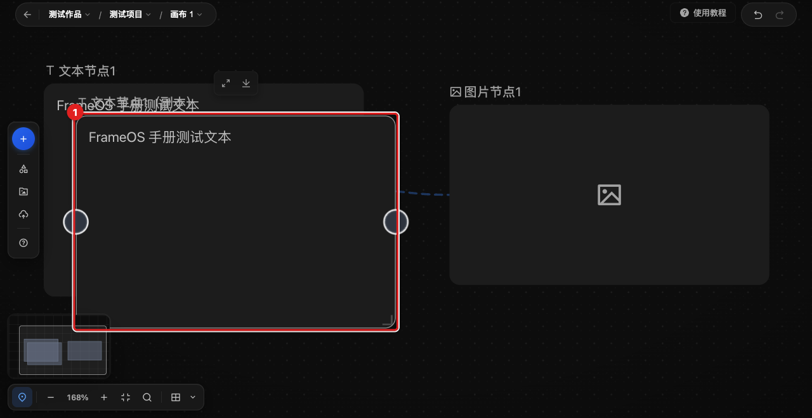

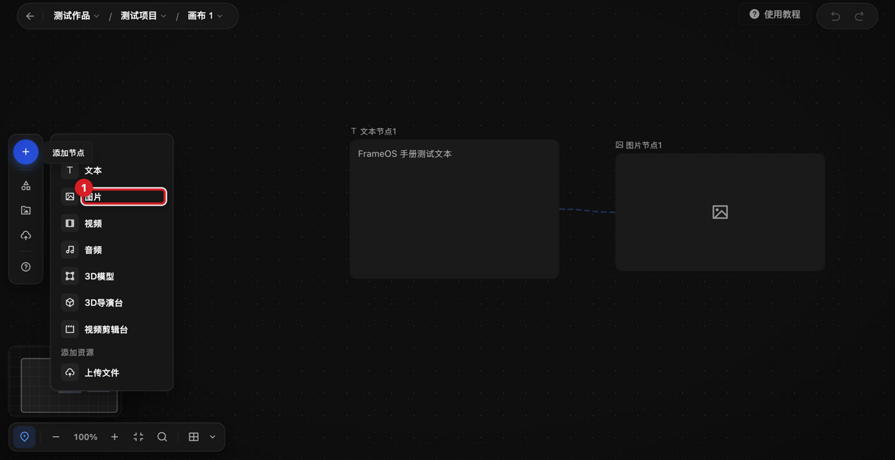

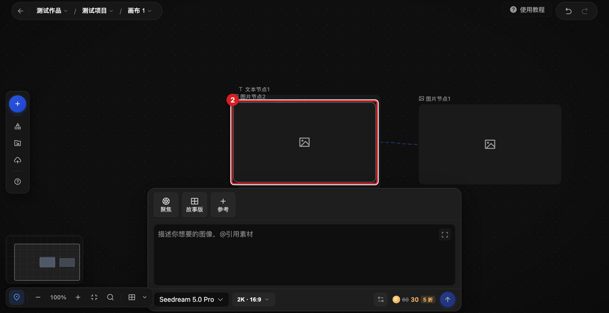

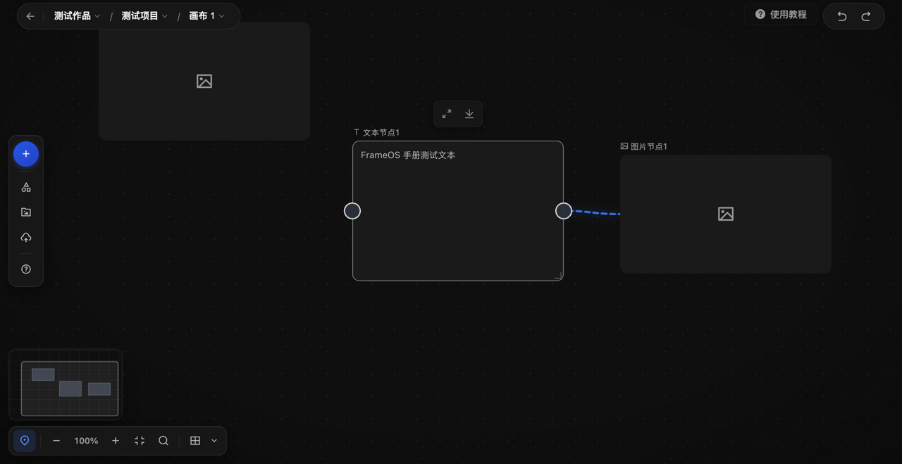

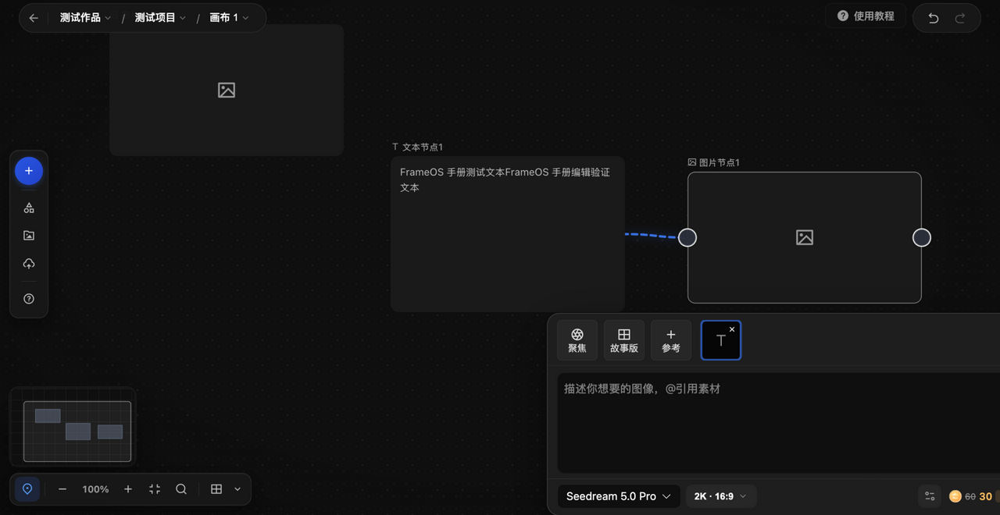

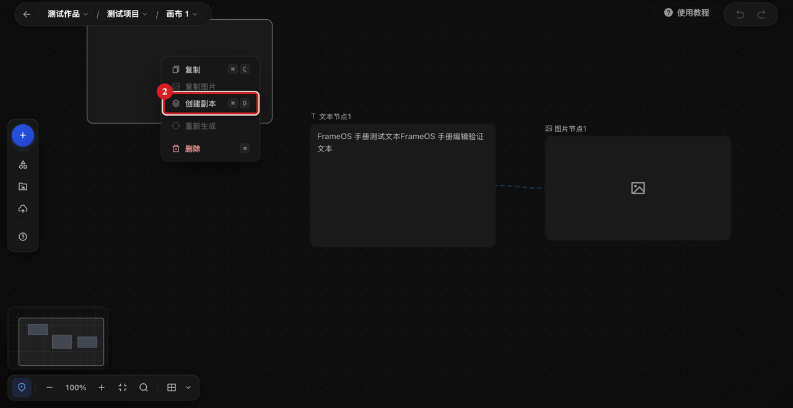

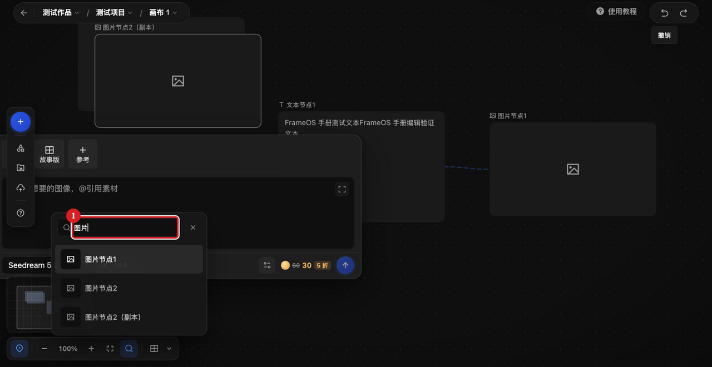

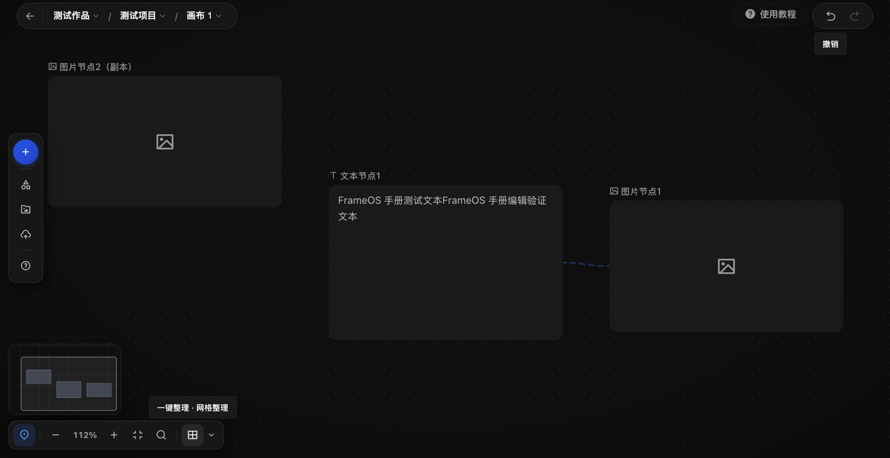

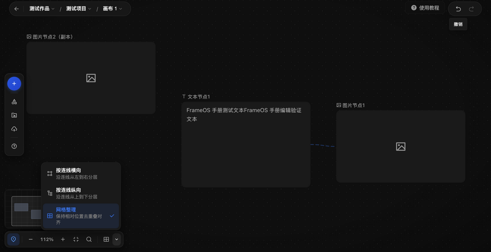

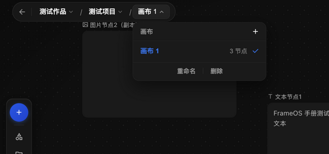

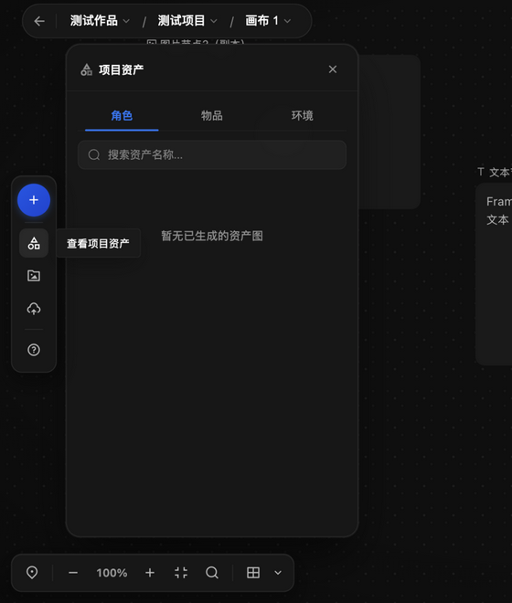

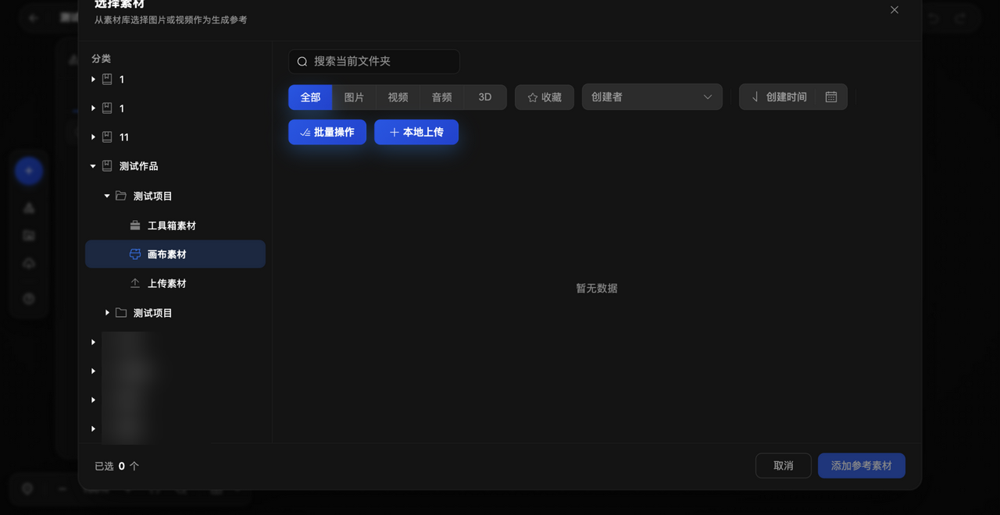

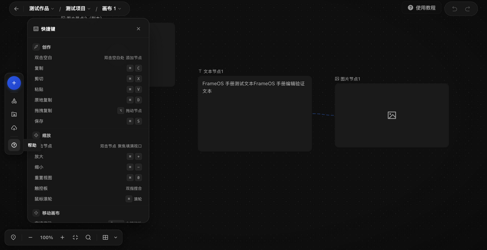

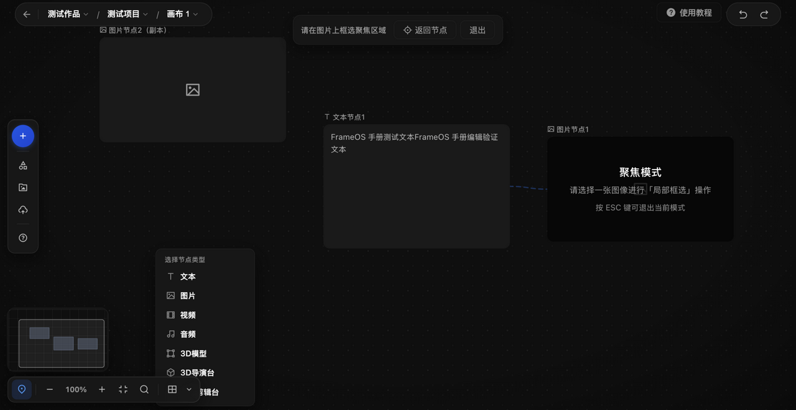

- 04-19 均为 1280x660（裁掉 y=0-60 账户区域）；15 为 640x300 局部裁剪。
- 17 中目录树内用户自有项目名称已做模糊遮蔽（仅遮蔽敏感名称，不改变产品含义）。
- 全部 19 张的 SHA-256 见 `screenshots/manifest.yml`。

### 13.12 自动化环境备忘（供下一轮复用）

- 本应用对 Playwright 定位器 click（含 force）会长时间挂起：统一改用坐标点击
  （`cua.click`），目标坐标用 `evaluate` 读 bounding box 后计算。
- `locator.evaluate` 运行在隔离世界，页面 `evaluate` 设置的全局不可见；高亮
  overlay 必须在 `locator.evaluate` 内自包含绘制（DOM 共享，绘制可保留到截图后）。
- `cua.drag`/`cua.scroll` 可能命令超时但实际已生效：以 DOM 状态为准判断，不重放。
- `cua` 不支持右键：用 `evaluate` 派发带坐标的 `MouseEvent("contextmenu")`。
- 画布存在节点虚拟化：视口外或被遮挡的节点可能不在 DOM 中，节点计数以搜索/整理
  等业务反馈为准。
- 合成键盘事件不携带剪贴板数据、⌘A 行为不定：涉及剪贴板与全选的交互只能标注
  “待验证”。

## 14. 2026-09-23 Gate B 回走补充观察

- 左栏出现新入口“**模板**”（aria-label 逐字），位于“本地上传”与“帮助”之间；
  点击打开模板面板：页签“公共模板 / 企业模板 / 我的模板”，卡片含“30s小说切片”
  “九宫格大师分镜”“大师电影分镜”“时间凝固流光”“暂别×视角×特效镜头大全”
  “360度旋转展示”等；再次点击按钮可关闭。模板卡片应用结果未验证。（DOM fact）
- 搜索结果点击的缩放聚焦存在**数秒动画延迟**：点击后 1.2 秒读取缩放仍为 100%，
  随后完成 100% → 273% 聚焦。此前 §13.7 的即时观察结论按此修正。（interaction fact）
- 本轮“添加节点”按钮的自动化点击未能弹出菜单（tooltip 疑似拦截），双击空白入口
  正常；上一会话按钮入口曾验证成功。属自动化环境问题，不写成产品缺陷。（备注）

## 15. 2026-09-24 新版本漂移重扫 (Batch 183)

源站于 2026-09-24 部署新版本（画布内出现“发现新版本！刷新”提示）。刷新后重扫：

- **已移除**：双击空白处打开「选择节点类型」菜单（多种双击间隔均无法再现，
  刷新加载新 bundle 后仍无）。克隆 Batch 168 的对应功能已同步移除（Batch 182）。
- **无漂移**（重扫与克隆一致）：左栏/顶栏/底部工具条集合与顺序；文本节点选中
  工具条（全屏查看/下载）；图片节点面板头部（聚焦/故事版/参考 + 引用芯片 +
  删除连线/替换参考）与占位文案；面包屑画布下拉（画布 头 + 节点计数 + 重命名/
  删除）；帮助面板 26 行快捷键逐字；整理方式三选项逐字；右键菜单五行。
- **修正**：上一轮“图片节点1 被误删且无法恢复”的结论**有误**——图片节点1 一直
  存在于数据中，只是位置被移到视野外（节点虚拟化导致 DOM 中不可见）。当前画布
  数据：文本节点1、图片节点1（视野外）、图片节点2（本轮新建测试节点）及两条连线。
- **仍不可采样**：⌘V 粘贴链路（剪贴板权限）、对齐辅助线吸附（自动化拖拽限制）、
  触控板手势。
- **参考按钮行为 (2026-09-24 采样)**：面板头部「参考」进入参考选择模式——蓝色顶栏
  「从画布选择参考 / 返回节点 / ×」，点击画布上其他节点即加为参考；Esc/返回节点/×
  退出。克隆已实现同款 (Batch 197)。
- **本地上传注入尝试 (2026-09-24, Batch 218 探索→成功确认)**：通过 DataTransfer
  合成事件向素材库隐藏 input 注入真实 PNG 字节并派发 change——应用接收事件并
  清空输入（标准上传模式）。当时“暂无数据”的判断**有误**：重新打开对话框后
  画布素材文件夹中出现 **2 张“生成蓝色手机图片-2”**（两次注入各上传一份），
  上传已持久化到服务器。结论：**合成 DataTransfer 注入可完成真实上传**，
  “实际上传流程未验证”结论修正为“上传链路已验证可用”。
- **素材库对话框克隆对齐 (Batch 212)**：克隆素材库按源站结构重建——标题/副标题、
  左侧目录树（测试作品 > 测试项目 > 工具箱素材/画布素材/上传素材 + 泛化同级目录）、
  搜索框、筛选行（全部/图片/视频/音频/3D）、批量操作/+ 本地上传、底部
  已选 N 个/取消/添加参考素材；mock 素材卡片可多选。真实上传/添加流程未验证。
- **故事版按钮行为 (2026-09-24 采样)**：面板头部「故事版」磁贴切换分镜模式——占位
  文案变为分镜模板（描述一个 10-15 秒内能演完的小剧情片段…整理为 4-8 个连续分镜…），
  模型切为「帧界 O2.5」，积分显示 100；再点恢复标准模式。克隆已实现同款 (Batch 198)。
  注意：分镜生成的真实执行涉及积分，永远不在采样范围内。
- **3D导演台节点卡片 (2026-09-24 采样)**：立方体图标居中 + 「进入导演台」按钮
  (胶囊形)；标题 3D导演台。视频剪辑台节点卡片同形态（剪辑图标 + 进入剪辑台）。
  克隆渲染器待实现 (Batch 217 候选)。
- **双击节点聚焦**：新版本实测无效（100%→100%，多次尝试）——帮助面板仍声明该
  行为，属源站自身文本滞后。克隆无需实现。
- **节点计数快照**：面包屑“画布 1”下拉当前显示“3 节点”（文本节点1 + 图片节点1
  [位于视野外] + 图片节点2[本轮新建测试节点]）。
