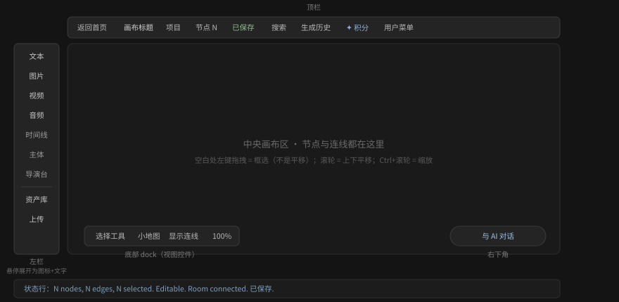

# 即梦智能画布快速上手

> 本手册覆盖 `jimeng.jianying.com` 智能画布（`/ai-tool/ai-canvas/:projectId`）内的
> 画布操作。账户、充值、订阅、积分购买不在本手册范围内。
> 所有涉及积分（✦）的生成按钮，本手册只讲到「点击前一步」；执行生成会消耗积分。

## 你将完成

在 5 分钟内：打开画布 → 创建一个文本节点 → 移动视角 → 用连线把参考内容接到
生成节点上，理解即梦画布「节点 + 连线」的创作方式。

## 前置条件

- 已登录即梦，会员与积分状态不限（不点生成就不消耗积分）。
- **已经打开了一个画布页面**（形如 `jimeng.jianying.com/ai-tool/ai-canvas/<项目ID>`）。
  打开画布涉及**登录流程与画布之外的首页**，不在本手册范围；
  画布内顶栏的 **项目** 按钮可以在**你已有的项目**之间切换
  （见 [管理画布上下文](10-tasks/canvas-context.md)）。

## 界面分区速览

## 五步上手

1. **认识画布**：左侧一栏是节点入口（**文本**/**图片**/**视频**/**音频**/
   **时间线**/**主体**/**导演台**/**资产库**/**上传**）；底部是视图控件
   （**工具切换**/**小地图**/**显示连线**/缩放值）；右下是**与 AI 对话**。
2. **创建第一个节点**：点击左栏 **文本**，画布中央出现「文本 1」并自动选中，
   顶栏节点计数加一。见 [创建节点](10-tasks/create-first-node.md)。
3. **移动视角**：默认的**选择工具**下，在空白处**按住左键拖拽是框选**；
   **滚动滚轮是上下平移**（注意方向与直觉相反）；**Ctrl+滚轮是缩放**；
   底部缩放值按钮里有 **适配画布 ⇧1**。
   想直接拖动画布，把 dock 第一个按钮切成 **抓手工具**（它的名字就是当前模式）。
   见 [平移缩放与视图](10-tasks/navigate-canvas.md)。
4. **连接节点**：把鼠标悬停在节点边缘，出现 **+** 圆钮；按住一个节点的边缘
   拖到另一个节点上松开，即生成参考连线（状态行显示 `1 edge`）。
   见 [连接节点](10-tasks/connect-nodes.md)。
5. **准备生成**：选中一个空节点，下方弹出生成面板；写提示词、选模型/比例/时长，
   确认 ✦ 积分价格后，由你决定是否点击 **生成**（点击即消耗积分）。
   见 [准备生成](10-tasks/prepare-generation.md)。

## 不花积分的三个常用操作

带 ✦ 标记的生成按钮会扣积分，但下面这些**本地加工不消耗积分**，可以放心试：

- **裁掉视频不要的部分**：选中视频节点 → 工具条 **视频修剪** → 拖两端把手 →
  **确认**；
- **把视频某一帧变成图片**：**截取帧∨** → 首帧/尾帧（直接出图）或 自定义（选帧后
  截取）；产出的图片节点可继续用于生成参考；
- **给图片去背景**：选中图片节点 → 工具条 **抠图**。

做错了按 **⌘Z** 撤销。详见 [使用节点工具条](10-tasks/use-node-toolbar.md)。

## 快速排错

- 工具条里找不到「视频修剪」：它只在**视频**节点上；图片节点是另一套工具条
  （智能改图/扩图/抠图/多角度）。见
  [使用节点工具条](10-tasks/use-node-toolbar.md)。
- 节点选中了却**删不掉**：按的是 **Delete** 吗？请改按 **⌫（Backspace）** ——
  实测按 Delete 完全没反应。见
  [复制、删除与撤销](10-tasks/duplicate-delete-history.md)。
- 空白处怎么拖都**框不出选框**：dock 第一个按钮现在是 **抓手工具**（拖动=平移）。
  点一次切回 **选择工具**。见 [平移缩放与视图](10-tasks/navigate-canvas.md)。
- 误建了节点：**⌘Z** 撤销。见
  [复制、删除与撤销](10-tasks/duplicate-delete-history.md)。
- 画布「乱了」：框选多个节点 → **布局** → **宫格布局/智能布局**。
  ⚠️ 布局**不会自动缩放视口**，节点可能被排到视野外 —— 按 **⌘0 / ⇧1** 适配画布找回。
  见 [编组、排列与整理](10-tasks/organize-group-layout.md)。
- 忘记快捷键：顶栏头像 → **用户菜单** → **快捷键**。见
  [帮助与快捷键](10-tasks/help-and-shortcuts.md)。

## 术语约定

本手册统一使用：节点、连线（参考连线）、画布、编组、生成面板、积分（✦）。
与界面用词保持逐字一致，不使用近义替换。
