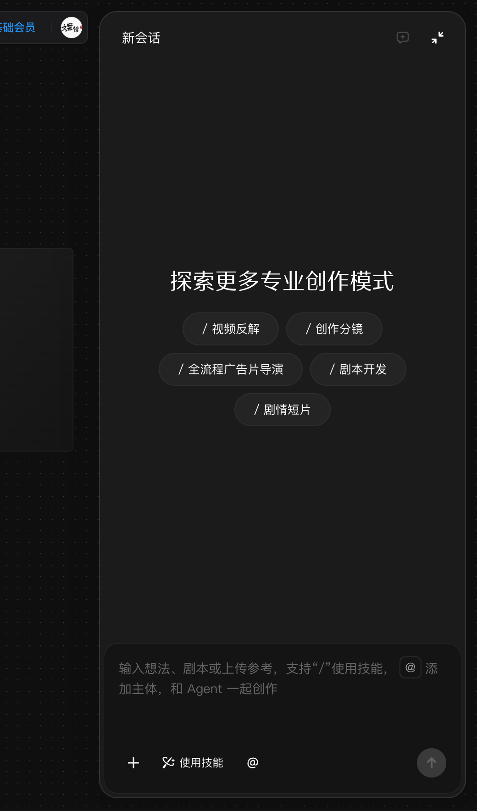

# 使用「与 AI 对话」智能体抽屉

## 适用角色

已登录的即梦画布创作者。

## 目标

打开画布右侧的 Agent 对话抽屉，了解技能入口与输入方式（发送消息可能触发
生成并消耗积分，本手册只讲到发送前）。

## 前置条件

已打开画布。

## 入口

画布右下角 **与 AI 对话** 按钮（**⌘/** 可开关 Agent，见快捷键面板）。

## 抽屉结构（2026-09-23 实测逐字）

- 头部：**新会话**（旁注「仅支持新建一个空会话」）+ 收起钮。
- 空态：「探索更多专业创作模式」+ 技能 chips：
  **/视频反解** ／ **/创作分镜** ／ **/全流程广告片导演** ／ **/剧本开发** ／
  **/剧情短片**
- 底部输入卡：占位「输入想法、剧本或上传参考，支持"/"使用技能，@添加主体，
  和 Agent 一起创作」+ **使用技能** 按钮。

## 原子步骤（只到发送前）

1. 点击 **与 AI 对话** → 右侧全高抽屉展开。
2. 点击任意技能 chip（如 **/创作分镜**）查看其输入引导。
3. 在输入卡输入想法（`/` 唤起技能、`@` 引用主体）。
4. **不点击发送**：发送给 Agent 的消息可能触发生成类任务并消耗积分，请自行
   评估后操作。
5. 点击头部 **收起** 关闭抽屉（实测）。

## 取消 / 恢复

- 关闭抽屉不影响画布内容；「新会话」仅新建空会话。

## 相关任务

[准备生成](prepare-generation.md) ｜ [帮助与快捷键](help-and-shortcuts.md)

## 已验证说明

抽屉结构、技能 chips 逐字、输入占位、收起关闭为 2026-09-23 实测；未发送任何
消息，Agent 的回复与任务执行行为不在本手册范围。

## 步骤图

