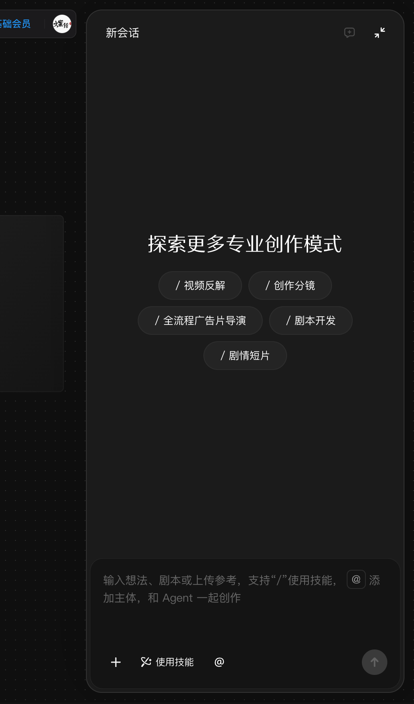
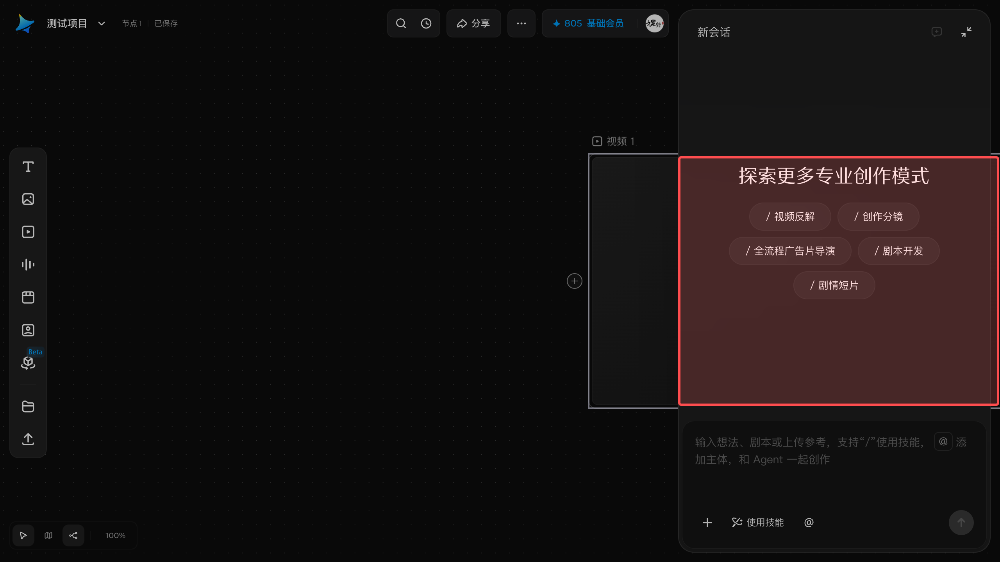
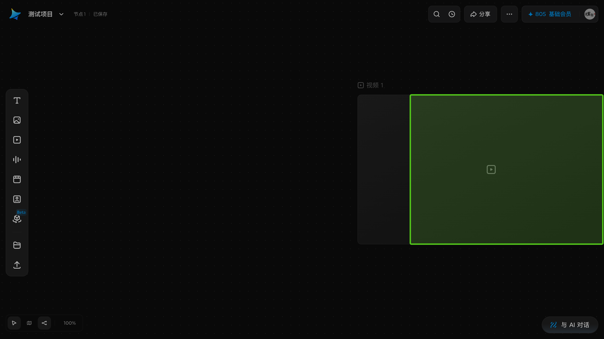
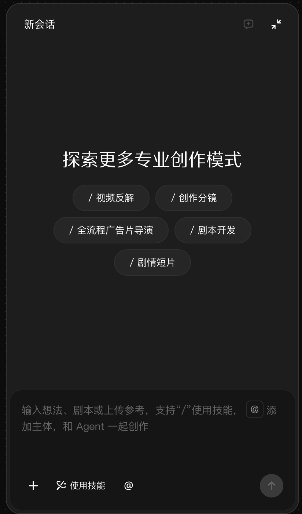
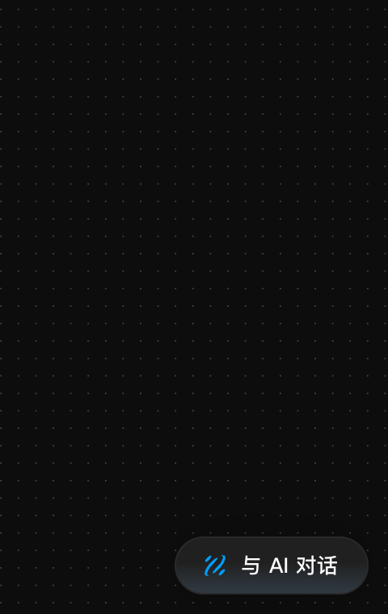
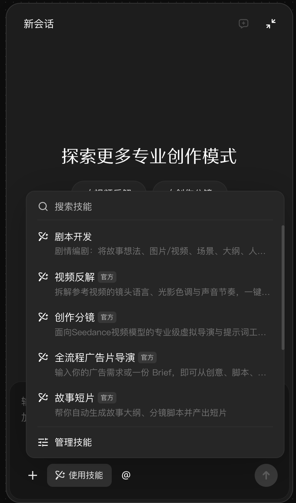
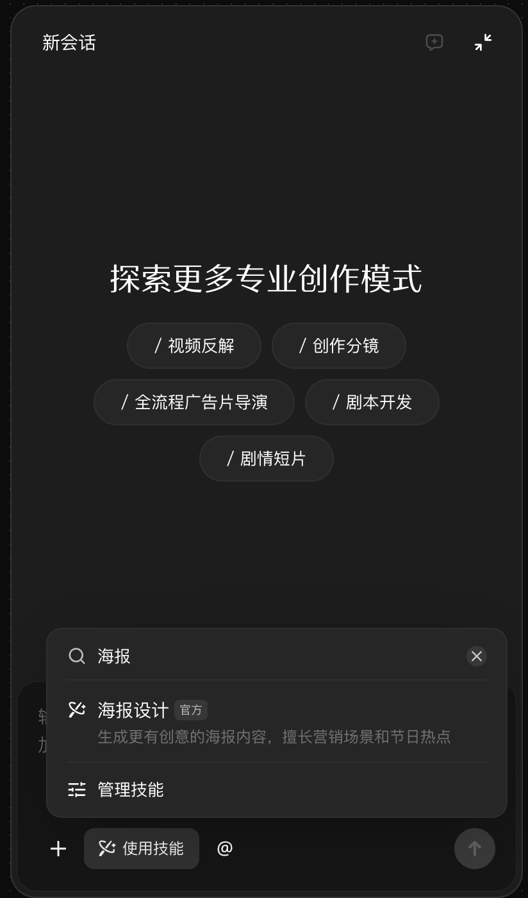
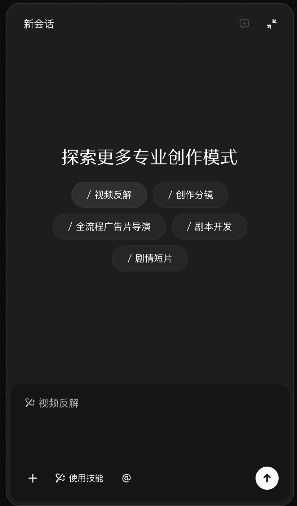
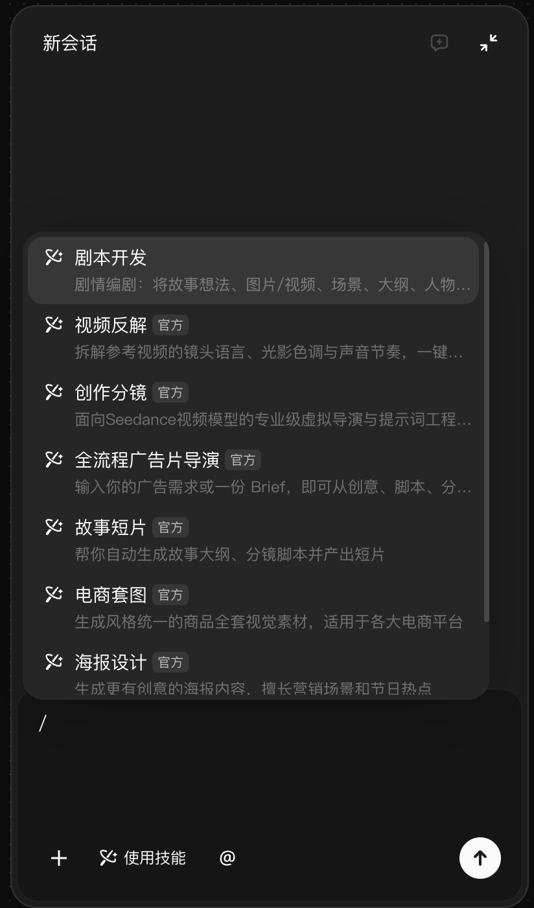
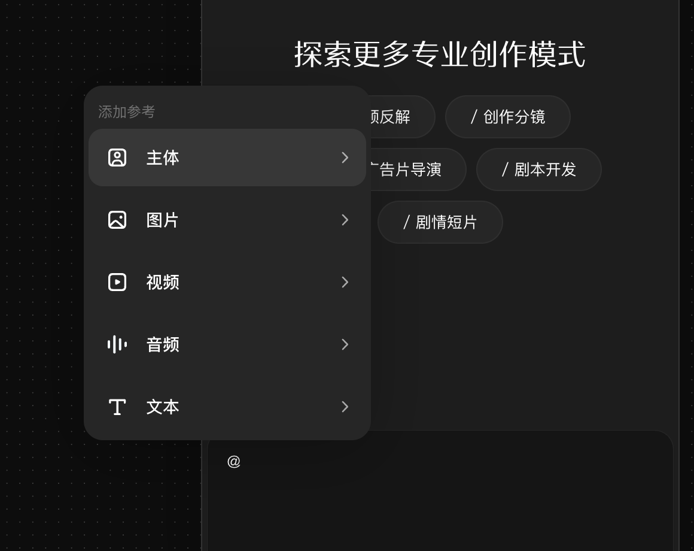

# 使用「与 AI 对话」智能体抽屉

## 适用角色

已登录的即梦画布创作者。

## 目标

打开画布右侧的 Agent 对话抽屉，了解技能入口与输入方式（发送消息可能触发
生成并消耗积分，本手册只讲到发送前）。

## 前置条件

已打开画布。

## 入口

画布右下角 **与 AI 对话** 按钮，或按 **⌘/**（**2026-10-01 实测两按两态**：
`关闭 → 打开 → 关闭`，确认可开关）。

> 🔴 **2026-10-02 批次 84 补一条本页此前没写的**：
> **⌘/ 同时也是「让画布快捷键全部失效」的那一下。**
> 抽屉一开，键盘焦点就进了抽屉，你按的 G / F / ⌘Z **全都不会到达画布**。
> 而且**两种失效的表现完全一样：屏幕上什么都不发生**。
> 详见下面「抽屉开着，画布快捷键全部失效」一节——**这是本任务最容易被误判成「快捷键坏了」的地方**。

## 🔴 抽屉开着，画布快捷键**全部失效**（2026-10-02 批次 84 四格实测）

本批把「选中」和「焦点」两个因子交叉，各测一格，**每格都断言两个因子各自的值**。
四个格子里只有**焦点**在变：

| 格 | 有节点选中 | 键盘焦点落在 | 按 **G** 的结果 |
|---|---|---|---|
| **A** | ✅ 1 个 | `DIV[rf__wrapper] aria="Canvas"` | ✅ **300ms** 弹「此快捷键当前不可用」**`360×44@460,32`** |
| **B** | ✅ 1 个 | **抽屉输入框**（`aria` 逐字「说说你的想法或任务，上传参考、输入文字或」） | 🔴 字母 **`g` 被输入框吃掉**，画布无提示 |
| **C** | ✅ 1 个 | **抽屉侧栏容器**（`ASIDE[canvas-feature-sidecar] aria="Agent"`，点标题处） | 🔴 字母**完全消失**，画布无提示 |
| **D** | ✅ 1 个 | 收起抽屉后重新框选 → 回到画布 | ✅ **恢复**，同样 300ms 弹同样的提示 |

- 🔑 **A 与 B/C 的唯一差别就是焦点。** 选中数四格全是 1，变量只有焦点。
- 🔴 **B 和 C 又是两种不同的失效**：
  **B** 的字母进了输入框（最容易误判——看起来像「快捷键坏了」，其实字打进去了）；
  **C** 的字母**凭空消失**（输入框没变、画布也没反应）。
- ✅ **D 排除了「开一次就把快捷键弄坏了」**：关掉抽屉、重新在画布上操作，**完全恢复**。

### 💡 怎么看出来「这次是焦点跑了」

按 G 之后**看 Agent 输入框**：

- 输入框里**多了字母** ⇒ 焦点在输入框（格 B）。
- 输入框**没变**、画布**也没反应** ⇒ 焦点在抽屉别处（格 C）。
- 画布**弹了提示** ⇒ 焦点在画布，一切正常（格 A / D）。

### ⚠️ 点「收起」之后焦点也**不在画布上**

| 怎么关的 | 关完焦点落在 | 画布快捷键能用吗 |
|---|---|---|
| 点头部 **收起** 钮 | `BUTTON[canvas-sidecar-launcher] aria="与 AI 对话"`（右下角启动钮） | ❌ **仍然不能用** |
| 按 **⌘/** | `SECTION[canvas-main-region] aria="Canvas editing area"`（批次 82 实测） | ✅ 可以 |

⇒ **「收起」只是把画布还给鼠标，键盘焦点还留在界面按钮上。**
想立刻用画布快捷键，**再点一下画布空白处**（落点要在画布网格上，不是节点），
或者用 **⌘/** 而不是「收起」钮来关。

> 📖 打开抽屉后的焦点落点全表（批次 82/84 实测）：
> | 操作 | 焦点落在 |
> |---|---|
> | 点「与 AI 对话」/ 按 ⌘/ **展开** | `ASIDE[canvas-feature-sidecar] aria="Agent"` |
> | 点抽屉里的输入框 | `DIV aria="说说你的想法或任务，上传参考、输入文字或"` |
> | 点「收起」**折叠** | `BUTTON[canvas-sidecar-launcher] aria="与 AI 对话"` |
> | 按 ⌘/ **关闭**（从展开态） | `SECTION[canvas-main-region] aria="Canvas editing area"` |

## ⚠️ 抽屉会盖住画布右侧的节点

**这是本任务最需要先知道的一件事。** 抽屉不是把画布挤窄，而是**覆盖在画布之上**：
实测宽 **400**、从屏幕 **x=868** 起铺满右侧，与画布重叠。

后果是**画布右侧约三分之一被挡住，落在那一带的节点点不中**：

| 状态 | 同一坐标的命中 | 点下去的结果 |
|---|---|---|
| 抽屉展开 | 落到抽屉内部（标题、技能 chips 等） | **节点选不中**，选中数不变 |
| 抽屉收起 | 落到节点卡片 | **正常选中** |

2026-10-01 对照实测：把「视频 1」拖到右侧使其与抽屉重叠，点节点上 `(957, 218)`
这个位置 —— 抽屉打开时命中 `H2`（抽屉标题）且选中数仍为 0；点抽屉头部 **收起** 后，
同一坐标命中节点卡片、选中数变 1。**节点位置没变，变的只是抽屉开合。**

> 💡 **要么先把节点拖出来，要么点「收起」/ 按 ⌘/**，再操作节点。
> 被盖住的节点**可以用左侧露出的一条点中**（实测节点左侧 111px 仍可正常点选），
> 但看不到全貌时很容易以为节点「失灵了」。

## 🔴 抽屉只有**两态**：展开 与 折叠 —— 没有「关闭」态

（**2026-10-01 批次 62 实测，推翻本手册此前「点收起 = 关闭抽屉」的说法**）

| | 展开 | 折叠（点「收起」之后） |
|---|---|---|
| 尺寸 | `400×696` @`(868,12)` | `200×348` @`(1068,360)` |
| `pointer-events` | `auto` | **`none`** |
| 内部可见元素 | **53 个**（2026-10-02 复核；2026-10-01 记的是 49 个） | **0 个** |
| 内部 `canvas-agent-panel` | 在（**52 个**可见元素） | **不在 DOM 里** |
| 焦点落点 | `ASIDE[canvas-feature-sidecar] aria="Agent"` | `BUTTON[canvas-sidecar-launcher] aria="与 AI 对话"` |
| 画面 | 完整抽屉 | **什么都看不见**（截图已验证：只剩画布网格） |

> ⚠️ **「49 个 → 53 个」是 2026-10-01 到 2026-10-02 之间抽屉里多了 4 个可见元素**，
> 机制未查明，**如实记为读数变化**。
> 另注意**三个计数口径互不相等**，引用时别混：
> **53** = 侧栏 `ASIDE` 内全部有面积元素；**52** = 其中 `canvas-agent-panel` 内的；
> **20** = `[data-testid^="canvas-agent-"]` 前缀匹配且有面积的（批次 82 的口径）。
> 折叠态这三个数分别是 **0 / 不存在 / 1**。

**「收起」是折叠，不是关闭。** 折叠后那个 `200×348` 的框仍留在页面上，
只是它**内部空无一物、并且 `pointer-events: none`**，因此：

- ✅ **不再遮挡画布** —— 但机制**不是**「它消失了」，而是**它不接收点击**。
  零成本对照实测：取侧栏内 5 个坐标，`elementFromPoint` 在展开态 **5/5** 命中侧栏内，
  折叠态 **0/5**。
- ⚠️ **别把「画布上什么都没有」当成「元素不存在」** —— 它一直在 DOM 里。
- ⌘/ 是**切换**：折叠态按 ⌘/ **直接重新展开**（不是先「打开」再「打开」）。

> 🔑 这条也是一条读数纪律：**「读数没变」既可能是产品没反应，
> 也可能是我的尺子量错了量程。** 本批一开始用「宽度 340–460」当「抽屉开着」的判据，
> 折叠态的 200 宽不满足 ⇒ 被判成「已关闭」——
> **和批次 58 给质量门做阳性对照是同一个错，只是这次尺子在我脑子里。**

💡 想彻底不占位置：点「收起」即可（视觉与命中都已恢复）。
想重新打开：点右下角 **与 AI 对话** 按钮，或按 **⌘/**。

### ✅ 2026-10-03 批次 132 独立复现：两态读数逐字一致，并补上 17 个 testid 的具体矩形

用 **`⌘/`** 连按四次做「关→开→关→开→归位关」，**两个矩形的读数与上表逐字一致**：

| 步骤 | 侧栏矩形 | `data-state` | 侧栏**子元素数** | 全文档 testid 种类 | `pointer-events` |
|---|---|---|---|---|---|
| 起点（折叠/基线） | **`200×348@1068,360`** | `closed` | **0** | **174** | `none` |
| 第 1 次 `⌘/`（展开） | **`400×696@868,12`** | `open` | 1 | **191**（**+17**） | `auto` |
| 第 2 次（回折叠） | `200×348@1068,360` | `closed` | **0** | **174**（增量 0 / 减量 0） | `none` |
| 第 3 次（再展开） | `400×696@868,12` | `open` | 1 | 191（与第 1 次**逐个相同**） | `auto` |

✅ **独立证实了上表三件事**：① 两态的矩形；② 折叠态 `canvas-agent-panel` **不在 DOM 里**；
③ `⌘/` 是**切换**而非「开→开」。

🆕 **本批的增量：展开态多出 17 个 testid**（批次 82 只记了
「`[data-testid^="canvas-agent-"]` 前缀匹配且有面积的 **20** 个」这个计数，没有逐个矩形）：

| testid | 矩形 | aria / 逐字 |
|---|---|---|
| `canvas-agent-panel` | `398×694@869,13` | 面板本体 |
| `canvas-agent-session-menu-trigger` | `58×32@885,25` | `会话列表` / `新会话`（⚠️ **自身 `pointer-events: none`，鼠标点不到**，见下） |
| `canvas-agent-session-title` | `42×22@893,30` | 逐字 `新会话` |
| `canvas-agent-session-create` | `32×32@1183,25` | `新建会话` |
| `canvas-agent-session-collapse` | `36×36@1219,23` | `收起` |
| `canvas-agent-session-heading` | `338×27@899,213`（`<H2>`） | 逐字 `探索更多专业创作模式` |
| `canvas-agent-session-modes` | `338×140@899,252` | 五个模式所在 |
| `canvas-agent-mode-action` ×5 | `105×36@959,260`、`105×36@1072,260`、`157×36@933,304`、`105×36@1098,304`、`105×36@1016,348` | 逐字 `/ 视频反解`、`/ 创作分镜`、`/ 全流程广告片导演`、`/ 剧本开发`、`/ 剧情短片` |
| `canvas-agent-session-composer` | `390×164@873,539` | 输入区 |
| `prompt-composer` | `357×84@890,554` | |
| `canvas-agent-composer-placeholder-mention` | `24×24@1196,554` | `引用参考`，**逐字是 `@`** |
| `canvas-agent-composer-action-row` | `357×32@890,654` | 动作行 |
| `canvas-agent-composer-add` | `32×32@890,654` | `从本地、画布或资产库添加` |
| `canvas-agent-skill-trigger` | `90×32@926,654` | `使用技能` |
| `canvas-agent-composer-mention` | `32×32@1020,654` | `引用参考`（**图标，逐字空**） |
| `canvas-agent-send` | `32×32@1215,654` | `发送消息` |
| `canvas-sidecar-resize-handle` | — | 面板缩放手柄 |

⚠️ **两个「引用参考」按钮光看 aria 分不出来**（逐字都是 `引用参考`）：
输入框**内**那个 `24×24`、**逐字是 `@`**；动作行里那个 `32×32`、**逐字为空**。
⇒ 靠 **testid + 尺寸**分，不要靠 aria。

📌 **本批补的另一个数**：折叠态侧栏本体的 `opacity` 是 **`0`**（上表只记了
`pointer-events: none`）。这让「有面积 ≠ 可见」多了一个干净的正例 ——
**`200×348` 的非零矩形、`opacity:0`、`pointer-events:none`、内部 0 个元素**。

📌 **`data-state` 在侧栏上是可靠的**（本批 5 次读数全部跟随 `closed↔open`），
**与批次 129/130 的小地图正相反**（小地图的 `data-state` **恒为 `closed`**，
而 `aria-pressed` 正常翻转）⇒ **同一个属性名、两处可靠性相反**。

### 🆕 2026-10-03 批次 133：技能选择器全层建档 + 「会话列表」按钮**鼠标点不到**

点面板里的 **`使用技能`**（`canvas-agent-skill-trigger`）⇒ 弹出
**`360×372@896,274`** 的对话框 `canvas-agent-skill-picker`（`role="dialog"`，**portal 到 `BODY`**）。
里面是 **8 个技能**（剧本开发 / 视频反解 / 创作分镜 / 全流程广告片导演 / 故事短片 / 电商套图 /
海报设计 / 品牌设计，**除剧本开发外都带 `官方` 标记**），
**每个技能 4 个带 id 的 testid**（`canvas-agent-skill-row/title/official/description-<技能id>`）。
逐个 testid 与矩形见 [20-reference](../20-reference.md)。关闭后**完全归零**。

⚠️ **「会话列表」按钮从鼠标上点不到**：

| testid | 自身 `pointer-events` | 命中自身的采样点 |
|---|---|---|
| `canvas-agent-session-menu-trigger`（`会话列表`） | **`none`** | **0 / 304** |
| `canvas-agent-session-title`（`新会话` 文字） | **`none`** | **0 / 154** |
| `canvas-agent-session-create`（`新建会话`） | `auto` | 168 / 176 |
| `canvas-agent-session-collapse`（`收起`） | `auto` | 211 / 216 |

👉 **想切换/查看会话，请用 `⌘/` 或右下角 `与 AI 对话` 按钮**（`canvas-sidecar-launcher`
`59×17@1209,691`），**别去点「会话列表」**。
⚠️ 「它是不是有意设计成不可点」本手册**无法判断** —— 手册此前从未提过这个按钮，
所以也没有「它该可点」的依据。**如实记为待产品侧确认的疑点，不写成缺陷。**

🆑 **顺带：侧栏展开时顶栏右侧被压缩** —— 折叠态顶栏 `1256×40@12,10`，
**展开态变成 `844×40@12,10`**；两种状态下顶栏本体 `pointer-events` **都是 `none`**。

## 抽屉结构（2026-09-23 实测逐字，2026-10-01 批次 62 补 DOM 契约）

- 头部：**新会话**（旁注「仅支持新建一个空会话」）+ 收起钮。
- 空态：「探索更多专业创作模式」+ 技能 chips：
  **/视频反解** ／ **/创作分镜** ／ **/全流程广告片导演** ／ **/剧本开发** ／
  **/剧情短片**
- 底部输入卡：占位「输入想法、剧本或上传参考，支持「/」使用技能，@添加主体，
  和 Agent 一起创作」+ **使用技能** 按钮。

**批次 62 补的定位契约**（稳定选择器，不必再靠几何猜）：

| 元素 | 契约 | 2026-10-02 复核 |
|---|---|---|
| 侧栏本体 | `ASIDE[data-testid="canvas-feature-sidecar"]`，aria 逐字 **`Agent`**，`z-index: 40`。**全文档唯一**（实测 `querySelectorAll` 只命中 1 个） | ✅ `400×696@868,12` 逐字一致 |
| 抽屉内容 | `canvas-agent-panel` **398×694 @ (869,13)** | ✅ 逐字一致 |
| 空态标题 | `canvas-agent-session-heading` **338×27 @ (899,213)**，逐字「探索更多专业创作模式」 | — |
| 5 个推荐 chip 的容器 | `canvas-agent-session-modes` **338×140 @ (899,252)** | — |
| 输入卡 | `canvas-agent-session-composer` **390×164 @ (873,539)** | ✅ 逐字一致 |
| 编辑器 | `prompt-composer` **357×84 @ (890,554)**，aria 逐字「说说你的想法或任务，上传参考、输入文字或」 | ✅ 逐字一致 |
| 底部操作行 | `canvas-agent-composer-action-row` **357×32 @ (890,654)**，四项：`从本地、画布或资产库添加` 32×32 / `使用技能` 90×32 / `引用参考` 32×32 / `发送消息` 32×32 | — |

### 🔑 2026-10-02：这层 `prompt-composer` 就是「污染全文档判据」的那个元素

批次 82 在别处撞见过一个**来历不明的** `.ProseMirror[contenteditable="true"]`，
恒定停在 `357×84@890,554`、坐标与画布节点完全无关，一度不知道它是谁。
批次 84 查实了归属：

| 读数 | 值 |
|---|---|
| 在侧栏内？ | ✅ **是**（`canvas-feature-sidecar .ProseMirror` 命中） |
| 在任何画布节点内？ | ❌ **否**（`.react-flow__node .ProseMirror` 命中 **0**） |
| 几何 | **`357×84@890,554`** —— 与上表 `prompt-composer` **逐字相同** |

⇒ **它就是 Agent 抽屉的输入框。** 抽屉一开它就在、抽屉一收它就消失
（实测 `pmAnywhere`：折叠态 **0** / 展开态 **1**）。

🔑 **对读者有什么用**：如果你（或任何一个自动化脚本）用
「页面上有没有 `contenteditable`」来判断「画布节点是不是在编辑态」，
**只要 Agent 抽屉开着，这个判断就永远为真**。
⇒ 判断画布节点是否在编辑，要**限定在该节点内部**去找，不能搜整个页面。

### ⚠️ 输入框里有**两层**同尺寸的 DIV，`elementFromPoint` 命中的不是编辑器

```
prompt-composer 357×84@890,554
└ DIV (relative w-full …) 357×84@890,554
  └ DIV.contents 0×0@0,0
    ├ DIV.tiptap.ProseMirror              357×84@890,554   ← contenteditable=true，能打字的那层
    └ DIV.relative.col-start-1.row-start-1 357×84@890,554 ← 占位符层，叠在它**上面**
```

输入框内**任意**坐标，`elementFromPoint` 命中的都是**占位符层**。
⇒ 想确认「点到了输入框」，判据是**落点在 `canvas-agent-session-composer` 之内**，
**不是**「落点在 `[contenteditable]` 之内」—— 那是**兄弟关系**，永远不成立。

## 原子步骤

**已实测**：打开与折叠抽屉。

1. 点击画布右下 **与 AI 对话** → 右侧全高抽屉展开（实测）。
2. 浏览空态技能 chips（**/视频反解**、**/创作分镜** 等）与底部输入卡的占位文案
   （实测逐项读过结构）。
3. 点击头部 **收起** → 抽屉**折叠**成看不见的空壳，画布右侧恢复可点（见上）。

**已实测（批次 62，全程未发送、积分 805 → 805 不变）**：

4. **点空态的技能 chip** —— 不是「展开引导」，而是**把该技能插成输入框里的一个 chip**。
   点 `/ 视频反解` 后输入框内容变成 `视频反解`，编辑器 HTML 是
   `<p><span class="react-renderer node-composerChip …">`，可见 chip **84×20 @ (890,556)**。
   **抽屉面板本身一点没变**（仍 `400×696@868,12`）。
5. **点底部「使用技能」** —— 弹出**技能选择器对话框**（见下表）。
6. **在输入框按 `/`** —— 弹出**技能下拉菜单**。
7. **在输入框按 `@`** —— 弹出**「添加参考」菜单**。

**仍未执行（属扣费边界，永久不在本手册范围）**：

8. **发送**：发送给 Agent 的消息可能触发生成类任务并消耗积分。本手册不描述
   发送后的行为，请自行评估后再操作。

## 技能：两个入口、四种落点，别把它们当成同一个东西

（**批次 62 实测。🔑 最容易踩的坑：`/` 唤起的浮层与「使用技能」按钮弹的
对话框是**两个不同的元素**。** 拿后者当前者，会得到一个「`/` 什么都没弹出」的
**假阴性** —— 而且读数干干净净（`no` / `no` / `no`），看不出任何异常。）

| 入口 | 浮层 | 几何 | `role` | 在抽屉内？ |
|---|---|---|---|---|
| 空态 5 个推荐 chip | **不弹浮层**，技能插成输入框内的 chip | — | — | — |
| 底部 **使用技能** | `canvas-agent-skill-picker` | `360×372 @ (896,274)` | **`dialog`** | **否**（挂在侧栏之外） |
| 输入框按 **`/`** | `agent-skill-menu` | `360×361 @ (878,187)` | `listbox` | **否** |
| 输入框按 **`@`** | 「添加参考」菜单（**无 `data-testid`**） | `240×296 @ (770,252)` | `listbox` | **否**（且**向左溢出到抽屉之外**） |

### 「使用技能」→ 技能选择器对话框

- 搜索框 `352×36 @ (900,278)`，占位逐字「**搜索技能**」。
- 列表 `356×284 @ (900,318)`，**可滚动**（`scrollHeight 452` / `clientHeight 284`），
  共 **8 行**、每行 `348×52`、行距 56。
- 底部固定 footer「**管理技能**」`352×44 @ (900,602)`（点它会跳到技能管理，**本手册未点**）。
- **只有「剧本开发」没有「官方」标签**，其余七项都有。

**搜索过滤已实测**：输入「海报」→ 8 行变 **1 行**（海报设计），搜索框右侧出现 **✕** 清空钮；
退格两下 → 恢复 8 行。

### 八个技能逐字（名称 · 一句话说明）

| 技能 | 官方 | 说明 |
|---|---|---|
| **剧本开发** | — | 剧情编剧：将故事想法、图片/视频、场景、大纲、人物或剧本草稿转为剧作要素、单节点或完整分场剧本；写剧情时调用。 |
| **视频反解** | ✅ | 拆解参考视频的镜头语言、光影色调与声音节奏，一键生成可用于拉片复刻、元素替换和再创作的视频 Prompt，覆盖广告、MV、剧情片、AI 视频、短视频、产品展示等多类内容。 |
| **创作分镜** | ✅ | 面向Seedance视频模型的专业级虚拟导演与提示词工程师。将模糊创意转化为电影级美学视频分镜Prompt，内置运镜词典与导演风格库，支持各类内容题材，超15秒长叙事自动分段。 |
| **全流程广告片导演** | ✅ | 输入你的广告需求或一份 Brief，即可从创意、脚本、分镜到镜头、配乐分阶段生成，串成一支结构完整的商业广告片，不限品类与风格。 |
| **故事短片** | ✅ | 帮你自动生成故事大纲、分镜脚本并产出短片 |
| **电商套图** | ✅ | 生成风格统一的商品全套视觉素材，适用于各大电商平台 |
| **海报设计** | ✅ | 生成更有创意的海报内容，擅长营销场景和节日热点 |
| **品牌设计** | ✅ | 根据公司名称、业务与客群，生成品牌 Logo 与视觉方案 |

🔴 **同一个技能在两处的名字不一样**：空态推荐 chip 逐字是「**/ 剧情短片**」，
选择器里逐字是「**故事短片**」（`data-testid` 尾缀 `web_agent_skill_story`）。
**按名字搜的时候两个都要试。**

### 按 `/` → 技能下拉菜单

- t=0 时内容是逐字「**加载中 加载中**」，约 **300ms** 后换成 8 条技能。
  ⇒ 截图或读数太早会拍到加载态。
- 菜单 `360×361`，**盖住空态推荐区**。

### 按 `@` → 「添加参考」菜单

- 标题逐字「**添加参考**」`232×32 @ (774,256)`，下面是 **5 个选项**
  （**不是 6 个** —— 标题不是选项，按 `innerText` 行数数会多数一项）：

| # | 选项 | 几何 | `aria-selected` |
|---|---|---|---|
| 1 | **主体** | `232×48 @ (774,288)` | **`true`**（默认高亮第一项） |
| 2 | 图片 | `232×48 @ (774,340)` | `false` |
| 3 | 视频 | `232×48 @ (774,392)` | `false` |
| 4 | 音频 | `232×48 @ (774,444)` | `false` |
| 5 | 文本 | `232×48 @ (774,496)` | `false` |

- 每项右侧有一个 `32×32` 的 **`›`** 箭头（说明每类还有下一级）。
- 🔴 **菜单向左溢出到抽屉之外**（`x=770` < 抽屉左沿 `868`），
  会盖住画布右侧一块区域 —— 截图时别按抽屉边界裁切。

### 💡 输入卡一旦有内容，空态推荐区整块消失

点过 chip、或者输入了 `/`、`@` 之后，「探索更多专业创作模式」标题与 5 个推荐 chip
**同时不在 DOM 里**了（面板高度不变，只是那块内容被输入内容顶掉）。

## 取消 / 恢复

- **折叠**抽屉不影响画布内容；「新会话」仅新建空会话。
- **折叠同时解除对画布右侧的遮挡** —— 机制是 `pointer-events: none`
  让点击穿透，**不是**因为它被关掉了（见「只有两态」一节）。
- 技能 chip 是插在输入框里的，**删掉它即可撤销**（清空输入卡）。

## 相关任务

[准备生成](prepare-generation.md) ｜ [帮助与快捷键](help-and-shortcuts.md) ｜
[平移、缩放与控制画布视图](navigate-canvas.md)

## 已验证说明

**当日实测（2026-10-01）**：打开与折叠抽屉（按钮与 **⌘/** 两条路径）、
抽屉覆盖画布右侧导致节点点不中的对照实验、抽屉结构、头部「新会话」与收起钮、
技能 chips 逐字、输入卡占位文案、**两态矩阵与 `pointer-events` 穿透对照（5/5 vs 0/5）**、
点 chip 插入 inline chip、「使用技能」对话框全量（8 技能逐字 + 搜索过滤实测）、
`/` 菜单、`@` 的「添加参考」菜单（5 项 + `aria-selected`）、
输入卡有内容时空态推荐区消失。**积分全程 805 → 805 未变。**

**复刻研究源站采样**：2026-09-23 的抽屉结构首测。

**未执行（扣费边界）**：发送消息后的 Agent 回复与任务执行行为。

**2026-10-02 批次 84 复核（20 节点的画布上，全程未发送、积分 805 → 805 不变）**：

- ✅ **几何逐字全部复核通过**：`canvas-feature-sidecar` `400×696@868,12`（`ASIDE`、
  aria `Agent`、`z-index: 40`、`pointer-events: auto`、**全文档唯一**）／
  `canvas-agent-panel` `398×694@869,13`／`canvas-agent-session-composer` `390×164@873,539`／
  `prompt-composer` `357×84@890,554`。
  折叠态 `200×348@1068,360`、内部可见元素 **0**、`pointer-events: none`、
  `canvas-agent-panel` **不在 DOM 里** —— **两态矩阵逐字仍然成立**。
- 🔴 **内部可见元素 49 → 53**（机制未查明，如实记为读数变化）；
  并**首次厘清三个计数口径**：侧栏内 53 ／ panel 内 52 ／ `canvas-agent-*` 前缀 20，
  折叠态分别为 0 ／ 不存在 ／ 1。**引用时必须指明口径。**
- 🔴 **新增结论：抽屉开着 = 画布快捷键全部失效**（四格交叉实测，见上）。
  A/B/C/D 四格里选中数恒为 1，**唯一变量是焦点**；
  两种失效（字母进输入框 / 字母凭空消失）**都不给任何提示**。
- 🔑 **`prompt-composer` 拿到了跨批次归因**：批次 82 撞见的那个
  「来历不明的 `357×84@890,554` 的 `contenteditable`」就是它
  （`inAgent: true` / `inNode: false`）。批次 82 当时不知道它是谁。
- 🔴 **点「收起」之后焦点回到右下角启动钮，不在画布上** ⇒ 画布快捷键**仍然不生效**；
  按 **⌘/** 关则焦点回 `SECTION[canvas-main-region] aria="Canvas editing area"`，可以用。
  **「收起」与「⌘/ 关闭」不是同一件事，键盘可用性也不同。**
- ⚠️ **本批的一处自伤，如实记录**：为了观测「键去了哪」而**故意绕过按键守卫**，
  结果 `g`、`f` 两个字母真的打进了 Agent 输入框；
  更要紧的是，那次按键把输入框里**原本就有的一个引用 chip 替换掉了**——
  逐字「**音频 6**」，HTML 是
  `<span class="react-renderer node-composerChip …">音频 6</span>`，
  指向画布上他人建的「音频 6」节点。
  经 e 轮查实：**该 chip 在我点输入框之前就存在**（展开抽屉后不做任何点击，读到的就是它），
  它的 `SPAN` 宿主 `69×24@890,554` 恰好落在我点的坐标 `(910,574)` 上。
  **我的 G 替换了它，随后收尾清空时把它彻底清掉了。**
  影响范围：Agent 输入框是**本地草稿态**、不是画布数据
  （画布 `20 nodes`、积分 `805` 全程未变），**但这是别人的草稿，被我破坏了**。
  ⚠️ **教训：观测「按键去了哪」本身就会改变按键的对象**，
  绕守卫不是免费的——**代价必须当场读出来并记录**，不能默认它无害。

## 步骤图



### 抽屉覆盖画布（同一节点位置的开关对照）





### 批次 62 · 四态配图

**空态**（输入卡为空）—— 标题 + 5 个推荐 chip + 占位文案齐全，
底部操作行 `+` ／ `使用技能` ／ `@` ／ 发送钮（此时发送钮是**灰的**，因为没内容）：



**点「收起」之后** —— 那个 `200×348` 的框**在页面上，但完全看不见**，
画面上只剩画布网格和右下角「与 AI 对话」按钮：



**点「使用技能」** —— 技能选择器对话框浮起，盖住空态推荐区，
底部「使用技能」钮高亮为按下态：



**搜索过滤** —— 搜「海报」后 8 行只剩 1 行：



**点推荐 chip 之后** —— 技能被插成输入框里的一个 chip，
空态推荐区**整块消失**（面板没变高，只是那块内容没了）：



**按 `/`** —— 技能下拉菜单（此时推荐区也被输入内容顶掉了）：



**按 `@`** —— 「添加参考」菜单，并且**向左溢出到抽屉之外**：


