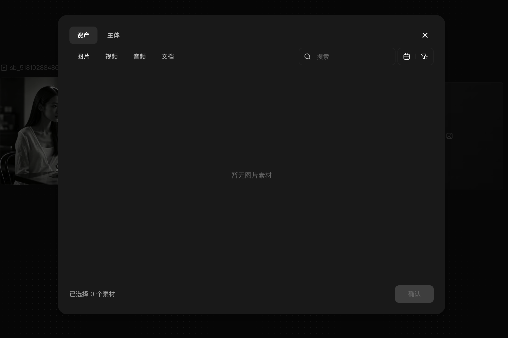

# 使用资产库并上传素材

## 适用角色

已登录的即梦画布创作者。

## 目标

从资产库选择素材插入画布，或把本地图片/音频/视频上传为节点。

## 前置条件

- 已登录并打开画布。
- 本地上传仅使用你自己的文件。

## 入口

- 左栏 **资产库**（悬停左栏可见文字标签）。
- 左栏 **上传**（悬停展开后可见）。
- 空白右键 → **新建节点** 子菜单 → **从资产库添加** / **本地上传**。

## 原子步骤

### 资产库（模态实测）

1. 点击左栏 **资产库**。
2. 居中模态「**Import assets**」打开：说明「Choose assets from Dreamina and
   import them into this canvas.」。
3. 顶部页签：**资产 ｜ 主体 ｜ 图片 ｜ 视频 ｜ 音频 ｜ 文档 ｜ 时间 ｜ 筛选**。
4. 选择素材（底部显示「已选择 N 个素材」）→ 点击 **确认** 插入画布。
   - 成功判据：模态关闭，画布出现对应素材节点。
   - 无素材的页签显示「暂无图片素材」等空态；未选择时确认钮提示
     「请先选择素材」。
5. **Esc** 关闭模态（实测）。

### 本地上传（入口已验证）

1. 悬停左栏 → 点击 **上传**（或空白右键子菜单 **本地上传**）。
2. 系统文件选择器打开（支持一次多选）。
3. 选择文件 → 生成媒体节点，节点标题取自文件名。
   - 提示：上传免费；上传后的 **智能超清/补帧** 等加工是付费功能。
   - 本轮取证未实际执行上传（避免原生对话框阻塞会话），上传完成态待验证。

### 保存到主体库

- 媒体节点右键菜单含 **保存到主体库**（按节点类型出现），可把素材沉淀为可复用
  主体。（入口观察自菜单结构；保存动作未执行。）

## 取消 / 恢复

- 资产库误选：清空选择或直接 **Esc**，不产生画布变更。
- 上传的节点可 **⌫** 删除 / **⌘Z** 撤销。

## 常见错误与恢复

| 现象 | 处理 |
|---|---|
| 确认钮提示「请先选择素材」 | 先在网格中点选至少一个素材 |
| 上传后找不到节点 | 底部缩放按钮 → 适配画布 ⇧1；新节点在视口中央附近 |

## 相关任务

[创建节点](create-first-node.md) ｜ [准备生成](prepare-generation.md)

## 已验证说明

资产库模态结构、页签、空态、Esc 关闭为 2026-09-23 实测；素材插入与实际上传
未执行，按「待验证」标注。

## 步骤图

