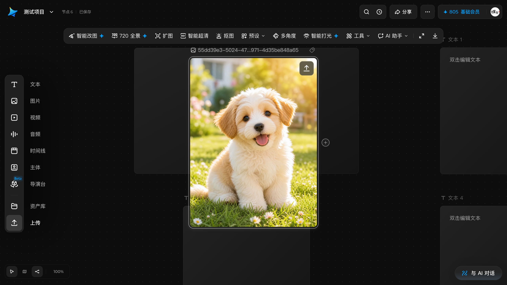
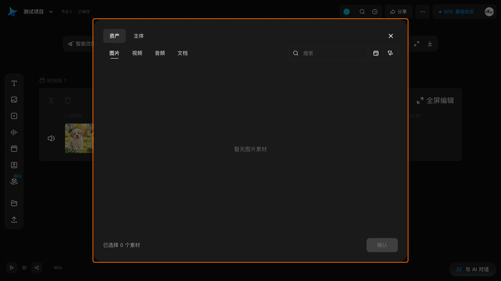
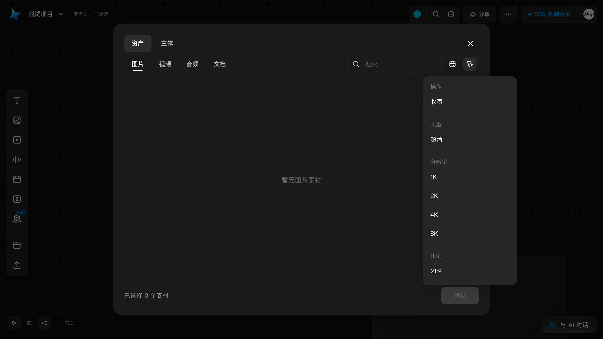
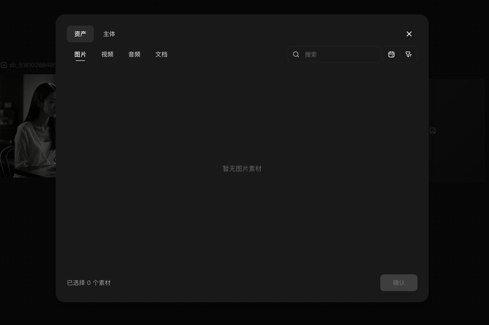

# 使用资产库并上传素材

## 适用角色

已登录的即梦画布创作者。

## 目标

从资产库选择素材插入画布，或把本地图片/音频/视频上传为节点。

## 前置条件

- 已登录并打开画布。
- 本地上传仅使用你自己的文件。

## 入口

- 左栏 **资产库**（悬停左栏可见文字标签）。
- 左栏 **上传**（悬停展开后可见）。
- 空白右键 → **新建节点** 子菜单 → **从资产库添加** / **本地上传**。

## 原子步骤

### 资产库（模态实测）

1. 点击左栏 **资产库**。
2. 居中模态「**Import assets**」打开：说明「Choose assets from Dreamina and
   import them into this canvas.」。
3. 顶部两级页签：第一级 **资产 ｜ 主体**；第二级（资产下）**图片 ｜ 视频 ｜ 音频
   ｜ 文档**。右侧另有两个小按钮：**时间**（28×28，按时间筛选）与 **筛选**（28×28）。
4. **搜索**：面板右上搜索框，aria 逐字 `Search Dreamina assets`，占位「搜索」（200×36）。
5. **筛选**：点漏斗图标展开右侧浮层，**四组**逐字为：
   - **操作** → **收藏**
   - **类型** → **超清**
   - **分辨率** → **1K ｜ 2K ｜ 4K ｜ 8K**
   - **比例** → **21:9**
6. 选择素材（底部显示「已选择 N 个素材」）→ 点击 **确认** 插入画布。
   - 成功判据：模态关闭，画布出现对应素材节点。
   - 无素材的页签显示空态（实测**视频**页逐字「**暂无视频素材**」，
     **图片**页逐字「**暂无图片素材**」）。
5. **Esc** 关闭模态（实测，aria 为 `Close asset library` 的 ✕ 亦可）。

> ⚠️ **画布上的节点不会出现在资产库里**（2026-10-01 实测，可能与你预期不同）：
> 先用「上传」把一张 PNG 放进画布（画布变成 3 个节点、图片正常显示），
> 再打开资产库切到**图片**页 —— 依然逐字显示「**暂无图片素材**」，
> 底部「已选择 0 个素材」，**确认**按钮保持**灰色禁用**。
>
> 也就是说：**资产库 ≠ 画布节点清单**。从画布上已有的图片回用，
> 请走「右键 → 新建节点 → **从画布选择**」或时间线里的「**从画布选择**」，
> 不要指望资产库。
>
> 未选中任何素材时「确认」是禁用的，此时点击无任何反应（实测点了也不关面板），
> 不必反复尝试 —— 先选素材，或直接 **Esc** 退出。

### 本地上传（2026-10-01 完成态实测）

1. 点击左栏 **上传**（aria `上传`；或空白右键子菜单 **本地上传**）。
2. 系统文件选择器打开（支持一次多选）。
3. 选择文件 → 画布上**直接生成一个图片节点**并自动选中，节点标题取自文件名
   （过长时中间省略，如 `55dd39e3–5024–…971–4d35be848a65`）。
4. **完成态（实测逐字）**：状态串出现 `<文件名>.png: Upload complete`；
   顶栏「已保存」随后点亮。
   - 成功判据：节点数 +1；节点内图片正常渲染；状态串出现 `Upload complete`。
5. 提示：**上传本身免费**；上传后的 **智能改图 / 智能超清 / 智能打光** 等加工
   按钮才会扣积分，详见[使用节点工具条](use-node-toolbar.md)。

### 保存到主体库

- 媒体节点右键菜单含 **保存到主体库**（按节点类型出现），可把素材沉淀为可复用
  主体。（入口观察自菜单结构；保存动作未执行。）

## 取消 / 恢复

- 资产库误选：清空选择或直接 **Esc**，不产生画布变更。
- 上传的节点可 **⌫** 删除 / **⌘Z** 撤销。

## 常见错误与恢复

| 现象 | 处理 |
|---|---|
| 确认钮提示「请先选择素材」 | 先在网格中点选至少一个素材 |
| 上传后找不到节点 | 底部缩放按钮 → 适配画布 ⇧1；新节点在视口中央附近 |
| 状态串一直停在 `processing` | 等素材处理完；此时部分入口会提示「素材信息仍在加载中，请稍后重试。」 |
| 节点标题不是你想要的名字 | 标题取自文件名，**不能改**；需要区分就在节点上 **Add tags** 打标记 |

## 相关任务

[创建节点](create-first-node.md) ｜ [准备生成](prepare-generation.md) ｜
[使用节点工具条](use-node-toolbar.md) ｜ [时间线节点](timeline-node.md)

## 已验证说明

资产库模态结构、页签、空态、Esc 关闭为 2026-09-23 实测。

**2026-10-01 补测**：资产库两级页签结构逐字复核（第一级 资产/主体，第二级
图片/视频/音频/文档），**视频页空态逐字「暂无视频素材」**、
**图片页空态逐字「暂无图片素材」**；**搜索框**（aria `Search Dreamina assets`）
与**筛选浮层四组**（操作/收藏、类型/超清、分辨率 1K·2K·4K·8K、比例 21:9）
逐字抓取；**资产库与画布节点相互隔离**（见正文）；
**本地上传完成全链路已执行**——选一个 PNG 后画布生成图片节点（节点数 +1）、
标题为文件名、状态串逐字 `<文件名>.png: Upload complete`、顶栏「已保存」点亮，
并抓到图片节点专属工具条截图。

**仍未实测**：资产库内**点选素材 → 确认** 的插入动作 —— 原因是**该画布的资产库
确实没有任何素材**（视频页、图片页均为空态），没有可点选的卡片。
**不是没做，是无从做**：上传 PNG 到画布后资产库仍为空，见正文说明。
**保存到主体库**同样未执行。

## 步骤图

