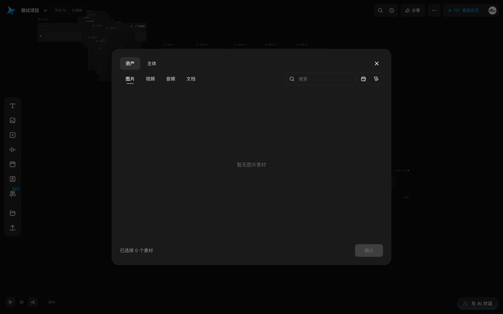
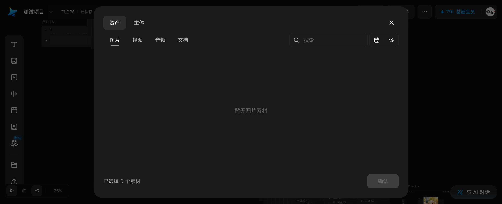
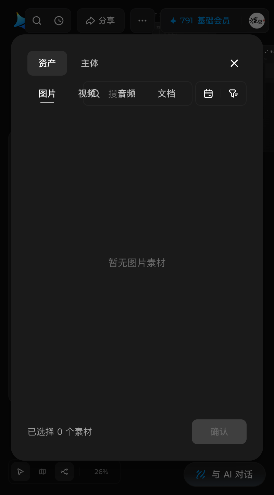
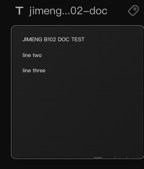
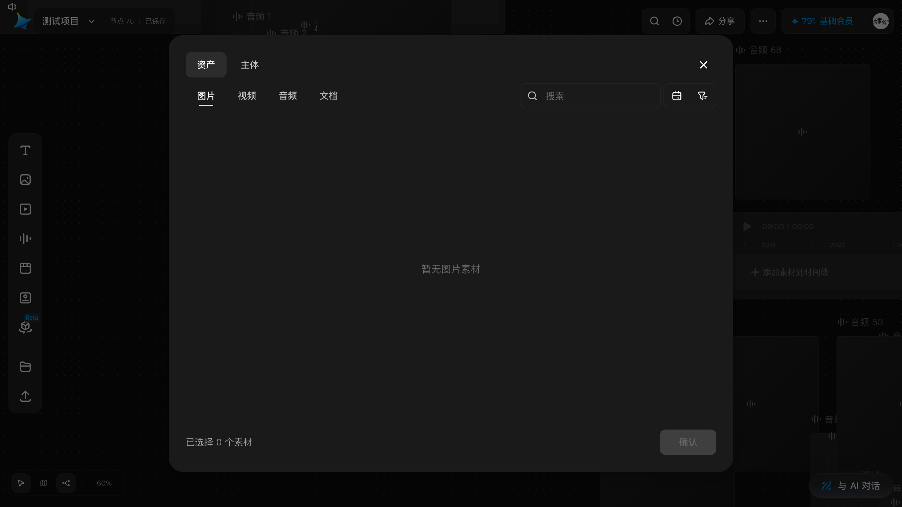

# 使用资产库并上传素材

## 适用角色

已登录的即梦画布创作者。

## 目标

从资产库选择素材插入画布，或把本地图片/音频/视频上传为节点。

## 前置条件

- 已登录并打开画布。
- 本地上传仅使用你自己的文件。

## 入口

- 左栏 **资产库**（悬停左栏可见文字标签）。
- 左栏 **上传**（悬停展开后可见）。
- 空白右键 → **新建节点** → **从资产库添加** / **本地上传**。

> 📌 **2026-10-04 批次 153 把左栏整条栏普查了**（此前只记过「上传」一个按钮）：
> 七个**建节点**按钮全在 `40×40@16,y`，`y` 依次 `193 / 235 / 277 / 319 / 361 / 403 / 445`（**步长 42**），
> 随后 `资产库` `40×40@16,501`、`上传` `40×40@16,543`。
> 底部工具条：`选择工具` `28×28@16,672`、`小地图` `28×28@48,672`、`显示连线` `28×28@80,672`、
> `60%` `48×28@124,672`、`与 AI 对话` `118×34@1149,673`。
> ⚠️ **前七个都会建节点** —— 只读排查时别拿它们当面板入口点。

> 🔎 **「新建节点」子菜单一共 9 项**（2026-10-02 实测，之前只记了其中 2 项）：
> **文本 ｜ 图片 ｜ 视频 ｜ 音频 ｜ 时间线 ｜ 主体 ｜ 导演台 ｜ 从资产库添加 ｜ 本地上传**，
> 每项 `192×36`，逐字如上。
>
> 📌 **「几何非零」不代表「菜单开着」**：这个子菜单**在 DOM 里一直存在**，
> `getBoundingClientRect()` 恒为 `200×404` 非零、`display:flex`、`opacity:1`，
> 但**没悬停时 `visibility:hidden`** —— 那个位置命中的是**画布上的别的节点**。
> 可靠的判据是触发项的 **`aria-expanded`**（`false` ⇄ `true`），
> 或元素本身的 `visibility`。

## 支持哪些格式（2026-10-02 从页面上直接读出来的白名单）

不用试 —— 页面上那个文件选择框**自带一张完整白名单**。

📌 **一共有两个文件选择框，白名单不一样**，别拿错：

| 入口 | 白名单 | 能多选 | 在哪儿 |
|---|---|---|---|
| **左栏「上传」** ＋ 右键「本地上传」 | **111 条 / 48 个扩展名 / 4 类** | ✅ `multiple` | 左栏那个挂在 `#canvas-fixed-toolbar` 下；子菜单那个挂在 `#context-menu-submenu-add-node` 下 |
| 节点内的 **「替换媒体」** | **23 条 / 10 个扩展名 / 只有图片** | ❌ 单选 | 挂在**该节点自己的 DOM 里**（本轮读到的是某个图片节点内的那个） |

**左栏上传的 48 个扩展名**（按族）：

| 族 | 数量 | 扩展名 |
|---|---|---|
| **图片** | 10 | `jpg` `jpeg` `png` `webp` `bmp` `tif` `tiff` `gif` `heif` `heic` |
| **视频** | 19 | `mp4` `m4v` `webm` `mov` `flv` `mkv` `avi` `wmv` `rm` `rmvb` `3gp` `m2ts` `mt2s` `m2t` `ts` `mxf` `mpg` `mpeg` `mpe` |
| **音频** | 17 | `mp3` `mpa` `mp2` `wav` `m4a` `flac` `aac` `acc` `oga` `ogg` `wma` `amr` `aif` `aiff` `ac3` `ape` `mac` |
| **文档** | 2 | `md` `txt` |

（除这 48 个扩展名外还有 63 条 MIME 类型，二者一一对应，无重复。）

> ⚠️ **拿「文档里的第一个文件选择框」去读白名单会读错**：
> 文档里第一个是**某个图片节点内部**那个（只有 23 条、只图片、不能多选）。
> 要读对，就得读**「这次点上传时真正弹出来的那个」**。
> 这就是为什么自动化里应该从「文件选择事件」本身去拿那个元素，而不是去 DOM 里搜。

> ✅ **2026-10-04 批次 153 逐字复核**：
> 左栏那个 `input[type=file]` 的 `accept` 共 **111 项**（48 个 `.ext` + 63 个 MIME），
> 去重后 **48 个扩展名**与本页第 47–50 行写的 48 个**一一对应，缺 0 多 0**；
> 节点内那个共 **23 项 / 10 个扩展名 / 全是图片 / `multiple=false`**（单选）—— 四项全对。
> 📌 **左栏那个 input 是常驻的**（点击前后 `accept` 逐字不变）⇒ 它不是点出来的，是一直挂在
> `canvas-fixed-toolbar` 下的。
> 📌 **左栏「上传」不经过任何页面内对话框**：点开后轮询 10 秒（3/3 次），
> `[role=dialog]` 恒 0、新增 testid 恒 0。**它直接交给系统文件选择器** ——
> 👉 **上传没反应时先确认是不是系统对话框被拦了，而不是页面坏了。**
> 🆕 节点内那枚按钮：aria 逐字 `替换媒体`，屏上 **`21.6×21.6`**（该节点 canvas `320×320`，`21.6 = 36 × 0.6`）。

> ⚠️ **节点内的「替换媒体」和左栏上传不是一回事**：
> 它**只收图片、而且一次只能换一个**。
> 想给视频/音频节点换素材时，别指望它能换视频。

## 原子步骤

### 资产库（模态实测）

1. 点击左栏 **资产库**。
2. 居中模态「**Import assets**」打开：说明「Choose assets from Dreamina and
   import them into this canvas.」。

**模态整体尺寸**（**批次 52 逐项实测，批次 86 全量复核通过；2026-10-05 批次 165 补齐分辨率维度**）：
`[data-testid="canvas-asset-library-dialog"]`（`role="dialog"`、`data-state="open"`）
**`801×620@240,50`**，在 **1280×720** 视口下**水平垂直都居中**
（右侧余 1280−1041 = 239，与左侧 240 差 1 属亚像素舍入；上下各余 50）。

> ✅ **2026-10-05 批次 165 结清**：~~「宽 = 视口−480、高 = 视口−100」（当时标注为待验猜测）~~ **已被推翻**。
> 换三个视口实测后真实规律见下方「窗口不够大时模态会怎么变」——
> **1280×720 下的「差 480 / 差 100」纯属这一个分辨率的巧合**，不要当公式用。

### 窗口不够大时模态会怎么变（2026-10-05 批次 165 实测）

模态**不会**跟着窗口变大，但也**不会**一直保持原尺寸：窗口不够大时它会被压小，
**始终与窗口边缘留 16px**。规律在 1280×720 以上完全用不上（一直是 `801×620`）。

| 窗口宽 | 模态宽 | 窗口高 | 模态高 | 说明 |
|---|---|---|---|---|
| ≥ **833** | **801**（定尺） | ≥ **652** | **620**（定尺） | 窗口够大，两条都用定尺 |
| 832 px 宽 | 800 | 651 px 高 | 619 | 刚好越过门槛，各少 1px |
| 700 px 宽 | 668 | 600 px 高 | 568 | 已被压小 |
| 400 px 宽 | 368 | 520 px 高 | 488 | 压到最狠 |

- 换算式：**宽 = min(801, 窗口宽 − 32)、高 = min(620, 窗口高 − 32)**。
  32 = 两侧各留 16px；因此被压小后左右余量必然各是 16。
- 门槛是**实测夹出来的**：高度侧 652 仍是 620、651 读出 619；宽度侧 833 仍是 801、832 读出 800。
- 📌 **这不是猜的，是源站样式里的声明**：该模态的 class 逐字是
  `w-[min(801px,calc(100vw-32px))]`、`h-[min(620px,calc(100vh-32px))]`（批次 165 直接读到了这两个类名）。

⚠️ **窗口很窄时，顶部的搜索框会压住二级页签，那几个页签点不动**（批次 165 实测 15 档）：

| 窗口宽 | 模态宽 | 搜索框宽 | 图片 | 视频 | 音频 | 文档 |
|---|---|---|---|---|---|---|
| ≥ 580 | 定尺/按公式 | 200 | 可点 | 可点 | 可点 | 可点 |
| 560 – 520 | 按公式 | 200 | 可点 | 可点 | 可点 | **点不动** |
| 500 – 420 | 按公式 | 200→168 | 可点 | 可点 | **点不动** | **点不动** |
| 400 – 380 | 按公式 | 160→152 | 可点 | **点不动** | **点不动** | **点不动** |
| 360 px 宽 | 328 | 144 | 可点 | **点不动** | **点不动** | ✅ **又能点了** |

- 判据是**命中测试**：在每个页签正中心调 `elementFromPoint`，读到的不是页签自己、
  而是那个 `aria="Search Dreamina assets"` 的输入框 ⇒ 那个位置点下去落在搜索框上。
- ⇒ **越靠右的页签越早点不动**（文档最早 560，音频 500，视频 400，图片到 360 都没事）。
- 📌 **「点不动的区间」不是从宽到窄单调的**：**文档**在 360 宽时**又恢复可点** ——
  因为窗口再窄时**搜索框自己先开始收缩**（200 → 144），左边缘退回到页签左边去了。
  读数如实照抄，不把它写成一条更整齐的规律。
- **给用户的做法**：窗口太窄时想切页签，**先把窗口拉宽**（≥600 最稳），
  否则点多少次都没反应，而界面上**不会给任何提示**。

**完整结构**（自上而下，testid 均可直接定位；批次 52 建立、批次 86 复核）：

| 层 | testid | 屏上 | 内容 |
|---|---|---|---|
| 对话框 | `canvas-asset-library-dialog` | `801×620@240,50` | `role="dialog"`、`data-state="open"` |
| 外壳 | `canvas-asset-library-surface` | `801×620@240,50` | 与对话框同尺寸 |
| 顶部区 | `canvas-asset-library-operation-area` | `801×104@240,50` | 标题 + 两级页签 + 搜索 + 时间/筛选 |
| 页签条 | `canvas-asset-library-navigation-controls` | `232×36@264,118` | 二级页签 |
| 右上按钮组 | `canvas-asset-library-query-action-group` | `75×36@942,118` | **时间** + **筛选** |
| 内容区 | `canvas-asset-library-viewport` | `801×440@240,154` | `role="tabpanel"` |
| 页脚 | `canvas-asset-library-footer`（`<FOOTER>`） | `801×76@240,594` | 已选计数 + **确认** + 隐藏原因 |
| 状态位 | `canvas-asset-library-import-status`（`<OUTPUT>`） | `1×1@357,616` | 空 |
| 框选层 | `canvas-asset-library-box-selection` | `0×0@0,0` | 常驻空壳 |

> ✅ **2026-10-04 批次 153 复测：九层 9/9 逐字复现**（`x` 差 0.5px 是取整写法）。
> 🆕 **本页此前没记的读数**：
>
> | 元件 | 逐字 | 屏上 |
> |---|---|---|
> | 一级页签 `资产`（`aria-selected=true`） | 资产 | `58×36@263.5,74` |
> | 一级页签 `主体`（`false`） | 主体 | `58×36@325.5,74` |
> | 二级页签 `图片`（选中）／`视频`／`音频`／`文档` | 图片 视频 音频 文档 | **各 `58×36`**，x 依次 `263.5 / 321.5 / 379.5 / 437.5`，y 均 `118` |
> | `时间` | 时间 | `28×28@946.5,122` |
> | `筛选` | 筛选 | `28×28@983.5,122` |
> | `确认` | 确认 | `80×36@936.5,610` |
>
> 页脚三段逐字：`已选择 0 个素材 确认 请先选择素材`；
> 内容区逐字：`暂无图片素材`；顶部逐字：
> `Import assets Choose assets from Dreamina and import them into this canvas.`。
> 🔴 `display` 也补齐了：对话框 `flex`、外壳 `grid`、顶部区 `block`、页签条/按钮组/页脚 `flex`、
> 内容区 `block`、状态位 `block`、框选层 `none` + `pointer-events:none`。

3. 顶部两级页签：第一级 **资产 ｜ 主体**；第二级（资产下）**图片 ｜ 视频 ｜ 音频
   ｜ 文档**。右侧另有两个小按钮：**时间**（28×28，按时间筛选）与 **筛选**（28×28）。

   🔑 **两级页签有一个定位差异**（批次 52 已记、批次 86 复核）：
   - 一级页签（资产 / 主体）**没有** `aria-label`，只有 `aria-selected`；
     尺寸 `58×36@264,74` / `58×36@326,74`，**步长 62**。
   - 二级页签**都带 `aria-label`**（逐字就是「图片」「视频」「音频」「文档」）；
     尺寸各 `58×36@264/322/380/438,118`，**步长 58**（无间隙）。
   ⇒ **两级步长不同（62 vs 58）**，要按坐标推算页签位置的话别用同一套公式。

4. **搜索**：面板右上搜索框，aria 逐字 `Search Dreamina assets`，占位「搜索」（`200×36@738,118`）。
5. **筛选**：点漏斗图标展开右侧浮层，**四组**逐字为：
   - **操作** → **收藏**
   - **类型** → **超清**
   - **分辨率** → **1K ｜ 2K ｜ 4K ｜ 8K**
   - **比例** → **21:9**
6. 选择素材（底部显示「已选择 N 个素材」）→ 点击 **确认** 插入画布。
   - 成功判据：模态关闭，画布出现对应素材节点。
   - **空态是平行的一族**（2026-10-01 批次 52 逐个点过，**2026-10-02 批次 86 四个逐字复现**）
     **图片**「暂无图片素材」 ｜ **视频**「暂无视频素材」 ｜
     **音频**「暂无音频素材」 ｜ **文档**「暂无文档素材」。
     四次的 `canvas-asset-library-viewport` 都是 **`801×440@240,154`**（不随页签变），
     `footer` 都是 `801×76@240,594`、都是「已选择 0 个素材 / 确认 / 请先选择素材」。
   - ⚠️ **「主体」页签是另一套结构**：切过去后**第二级只剩「全部」一个页签**，
     空态逐字是「**没有可用主体**」（不是「暂无…素材」），
     而且**内容区不再有 `canvas-asset-library-viewport` 这个元素**。
     2026-10-02 复核：切过去后 `role="tab"` 只剩 3 个（资产 / 主体 / 全部），
     `aria-selected="true"` 的两个是**「主体」和「全部」**（两级同时高亮）。
7. **Esc** 关闭模态（实测，`aria` 逐字 `Close asset library` 的 ✕ 亦可，**`36×36@981,74`**）。

> 💡 **想知道一个按钮是不是禁用的，别看它灰不灰**（2026-10-01 批次 52 阳性对照，
> **2026-10-02 批次 86 逐项复现**）。
> 这个弹窗里未选素材时的 **「确认」** 就是真的禁用实例：
> **`80×36@937,610`**，`aria-disabled="true"` + `data-disabled="true"` +
> `cursor: not-allowed` + 文字色 **`rgba(255,255,255,0.2)`**；
> 而 `opacity` **仍然是 1**、**原生 `disabled` 属性也没有**（实测 `disabled === false`）。
> 同一弹窗里的页签按钮则是 `cursor: pointer`、无 `aria-disabled`。
> —— 这张表就是判断「下载」之类按钮是否禁用的**基准**。

> ⚠️ **画布上的节点不会出现在资产库里**（2026-10-01 实测，可能与你预期不同）：
> 先用「上传」把一张 PNG 放进画布（画布变成 3 个节点、图片正常显示），
> 再打开资产库切到**图片**页 —— 依然逐字显示「**暂无图片素材**」，
> 底部「已选择 0 个素材」，**确认**按钮保持**灰色禁用**。
>
> 也就是说：**资产库 ≠ 画布节点清单**。从画布上已有的图片回用，
> 请走「右键 → 新建节点 → **从画布选择**」或时间线里的「**从画布选择**」，
> 不要指望资产库。
>
> 未选中任何素材时「确认」是禁用的，此时点击无任何反应（实测点了也不关面板），
> 不必反复尝试 —— 先选素材，或直接 **Esc** 退出。
>
> ⚠️ **而且你看不到那句原因**：「请先选择素材」是 `class="sr-only"` 的**隐藏文本**，
> 屏上实测只有 **1×1 像素 @ (263,628)**，住在**页脚**（`canvas-asset-library-footer`）里、
> 是「确认」按钮的**兄弟节点**而不是按钮的子节点。
> 也就是说：它读屏能播报，**肉眼看不着** —— 别指望从界面里读出「为什么灰着」。
>
> 🔴 **2026-10-02 批次 86 补一条会坑到自动化的话**：
> **`.sr-only` 在这块画布上到处都是** —— 同一个模态打开时，
> 全页有 **30 个** `.sr-only` 元素，绝大多数是画布节点的状态描述
> （`No resources: 0 ready, 0 processing…`、`时间线: 1 visual track…`、
> `20 nodes, 0 edges, 0 selected.`、`b22-upload.png: Upload complete` 等等），
> 它们的尺寸**全都是 `1×1`**，而且**大多被放在视口外**
> （`@(-405,-238)`、`@(-901,-256)` 这类负坐标）。
> ⇒ **「数 `.sr-only` 有几个」或「按 `1×1` 找 sr-only」都不可靠** ——
> 必须**按文字内容**定位（`innerText` 逐字等于「请先选择素材」）**并限定在
> `canvas-asset-library-footer` 之内**。

### 本地上传（2026-10-01 完成态实测；2026-10-02 补测视频与文本文件）

1. 点击左栏 **上传**（aria `上传`，`40×40@16,543`），或空白右键 → **新建节点** →
   **本地上传**（两条入口**都能用**，实测都能拉起文件选择器，且用的是**同一张 111 条白名单**）。
2. 系统文件选择器打开，**支持一次多选**。
3. 选择文件 → 画布上**直接生成节点**并自动选中，节点标题取自
   **去掉扩展名后的文件名**（2026-10-01 批次 64 实测：`b22-upload.png` → 标题 `b22-upload`；
   过长时中间省略，如 `55dd39e3–5024–…971–4d35be848a65`）。
4. **上传什么文件，就生成什么节点**（2026-10-02 实测）：

   | 上传的文件 | 生成的节点 | 说明 |
   |---|---|---|
   | 图片（`png` / `jpg` / …） | **图片节点** | 批次 64 实测 |
   | 视频（`mp4` / …，共 19 种扩展名） | **视频节点** | 本轮实测：6 秒 H.264 测试片 → 视频节点，卡片里是封面图 |
   | **文本文件（`txt` / `md`）** | **文本节点**，**文件内容被灌进节点正文** | 🆕 本轮实测，见下 |
   | 音频（`mp3` / …，共 17 种扩展名） | 音频节点 | 结构见[音频节点](audio-node-voice.md)；**2026-10-03 批次 109 实测上传**：`.wav` → 音频节点，`1 resource: 1 ready, 0 processing, 0 failed.`，时长读数 `00:00:04` 与素材真实时长一致，**805 → 805** |

5. **完成态（实测逐字）**：见下方「`Upload complete` 那条状态串」小节 ——
   **图片 / 视频 / 音频会上报，文本文件不上报**；顶栏「已保存」随后点亮。
   - 成功判据：节点数 +1；节点内媒体正常渲染；
     媒体类再叠加「全局播报区多出一条 `<文件名>: Upload complete`」。
   - ⚠️ **「节点出现了」不等于「上传处理完了」**：前 2 秒多显示的是**本地原图**，
     之后才换成服务端缩略图（实测 t=0…2200ms 为 `2560×1440` 的 `blob:` 图，
     t≈3200ms 换 `360×203` 远程图，t≈4500ms 换 `720×405`）。
     判定「完成」要等 5 秒以上，详见[创建节点 · 方式 D](create-first-node.md)。
6. 提示：**上传本身免费**。
   - 已验过 **PNG 805 → 805**、**视频 805 → 805**、**文本 805 → 805**、
     **音频 805 → 805**、**MP3 805 → 805**（本批 2026-10-03 补上音频一格）。
   - 上传后的 **智能改图 / 智能超清 / 智能打光** 等加工按钮才会扣积分，
     详见[使用节点工具条](use-node-toolbar.md)。

#### `Upload complete` 那条状态串：追加式日志，屏幕上根本看不到

这一条挂了很久（2026-10-01 批次 102 记成「未定」，理由是判据把祖先节点排掉了）。
2026-10-03 批次 109 用**同一个判据、同一次会话**把五种文件类型并排测完，结论如下。

**它长什么样**：一个 `role="status"` 区域，里面**每条上报一个 `SPAN`**：

| 观测量 | 读数 |
|---|---|
| 区域 | `[role=status]`，class `sr-only`，`1×1 @(-1,-1)`，`clip: rect(0px,0px,0px,0px)`、`overflow:hidden` |
| 每条 | 一个 `SPAN`，盒高 **23**，宽 = 文字宽度（`256` / `300` / `343` 都有），x 起点 **-1**、步长 = 自身宽度 ⇒ **无缝横排** |
| 它动吗 | ❌ 1.2 秒连采两次，x **一模一样**（`-1`）⇒ 不是动画 |
| 屏上可见吗 | ❌ 容器被 `clip` 成 0、`overflow:hidden`，顶部 40px 截图里**没有任何这条文案** |

⇒ 📌 **它是给读屏软件用的播报，不是给眼睛看的提示。**
你在界面上**永远看不到** `<文件名>: Upload complete` ——
**肉眼能看到的只有顶栏那句「已保存」**。
所以「传完了没有」别去找那条状态串，**看顶栏的「已保存」**。

**它是追加的，不是替换的**：同一张画布上同时挂着多条，历史全在。

**⚠️ 这一页上有两个 `role="status"` 都不在节点里** ——
一个是上面这条播报日志，另一个是底部 dock 里那个**空的** `P`（`1×1 @123,699`、**0 个子元素**）。
另外，**节点自己也会冒 `role="status"`**（上传中的 `<类型>-node-uploading`）。
⇒ 自动化里**不能**用 `document.querySelector('[role=status]')` 取第一条 ——
那取到的是**文档顺序第一个**，上传期间会变成节点内部那个，读数就成了「0 个条目」的假象。
正确口径：**逐个读 `[role=status]`，取「不在任何 `.react-flow__node` 里、且自己至少有一个子元素」的那一个。**

##### 按文件类型并排测（2026-10-03 批次 109，同一会话、同一个判据）

| 文件类型 | 素材 | 全局播报条目 | 读数 |
|---|---|---|---|
| **图片 `.png`** | `jimeng-b102-tiny.png` | ✅ **有** | 条目 `28 → 29`，第 **2** 次采样 / **3286ms** 出现 |
| **视频 `.mp4`** | `jimeng-b101-test-avc1.mp4` | ✅ **有** | 批次 101、105 各传过一次，条目 ×2 |
| **音频 `.wav`** | `jimeng-b104-test.wav` | ✅ **有** | 批次 104 与本批三次，条目 **3 → 4**（第 3 次采样 / 4486ms） |
| **文档 `.md`** | `jimeng-b107-h3.md` | ❌ **没有** | 条目 `28 → 28`，连采 **26 次 / 32.9s**，全程零净变 |
| **文档 `.txt`** | `jimeng-b102-doc.txt` | ❌ **没有** | 条目 `28 → 28`，连采 **26 次 / 32.4s**，全程零净变 |

⇒ ✅ **规则：图片 / 视频 / 音频上报，文档（`.md` / `.txt`）不上报。**
- 这**不是**「媒体 vs 非媒体」的差别 —— 图片/视频/音频三类都上报了，
  分界线落在**文件类型**上，文档单独一边。
- 也**不是**「条目来得晚」—— 两个负例各连采 **26 次 / 32 秒以上**，
  而正例都在 **2–3 次采样 / 2–5 秒**内就出现。
- 负例**自带阳性对照**：同一次运行里 wav 先传、全局条目 `27 → 28`，
  紧接着 md、txt 各连采 26 次都是 `0`。判据在**那一刻确实能抓到新增**。
- 三种「文档」格子里的节点都**确实建出来了**（差集各恰好 1 个且同时 `.selected`），
  ⇒ 「没有上报」不是因为「根本没上传」。

### 🆕 上传一个 `.txt` 会发生什么（2026-10-02 实测）

白名单里有 `text/plain,.txt` 与 `text/markdown,.md`，而「新建节点」子菜单里
**并没有「文档」这一类** —— 实测的答案是：**它生成的是一个「文本」节点，
并且把文件内容灌进了节点正文**。

| 观测量 | 读数 |
|---|---|
| 节点类型 | `react-flow__node-text`，aria 逐字 `文本 node: jimeng-b102-doc` |
| 标题 | `jimeng-b102-doc`（仍是「去扩展名的文件名」） |
| 正文 | 逐字含文件里的三行 `JIMENG B102 DOC TEST` / `line two` / `line three` |
| 积分 | **805 → 805**（免费） |
| 节点尺寸 | canvas `320×320`（与其他文本节点一致） |

⇒ **所以「上传一个文稿」不是「插入一个文档对象」，而是「新建一个内容已经填好的文本节点」** ——
它和左栏「文本」按钮建的节点**是同一种东西**，区别只在于正文已经替你填好了、可以直接改。

> ✅ **已于 2026-10-03 批次 109 结清**：文本文件上传**不会**产生 `<文件名>: Upload complete` 那条播报条目。
> `.md` 与 `.txt` 各连采 **26 次 / 32 秒以上**，全局播报条目**一条都没多**；
> 而同一会话里 wav（`27 → 28`）与 png（`28 → 29`）都当场追加了。
> ⇒ **判断文稿有没有传成功，只能看节点本身与顶栏「已保存」，不能等这条状态串。**
> 完整机制与五种文件类型的并排读数见上方「`Upload complete` 那条状态串」。
>
> 🔧 **顺手订正一条旧判据**：批次 102 当初的结论是「读数 `[]` **不能**支持任何结论，照实记未定」——
> **这个自我怀疑是对的**，但原因不是产品。本批定位到真因有两条，都出在判据上：
> ① 批次 102 的取法**把祖先节点一并排除了**，真正的承载者（`role=status` 里那个 `SPAN`）被自己滤掉；
> ② 改用 `querySelector('[role=status]')` 之后**又取错了宿主** ——
> 上传期间节点内部会先冒出一个 `role="status"`（`audio-node-uploading`），
> 排在全局那条**前面**，读出来就成了「0 个条目」。

### 保存到主体库

- 媒体节点右键菜单含 **保存到主体库**（按节点类型出现），可把素材沉淀为可复用
  主体。（入口观察自菜单结构；保存动作未执行。）

## 取消 / 恢复

- 资产库误选：清空选择或直接 **Esc**，不产生画布变更。
- 上传的节点可 **⌫** 删除 / **⌘Z** 撤销。

## 常见错误与恢复

| 现象 | 处理 |
|---|---|
| 确认钮提示「请先选择素材」 | 先在网格中点选至少一个素材 |
| 上传后找不到节点 | 底部缩放按钮 → 适配画布 ⇧1；新节点在视口中央附近 |
| 状态串一直停在 `processing` | 等素材处理完；此时部分入口会提示「素材信息仍在加载中，请稍后重试。」 |
| 节点标题不是你想要的名字 | 标题取自**去掉扩展名后**的文件名，**不能改**；需要区分就在节点上 **Add tags** 打标记 |

## 相关任务

[创建节点](create-first-node.md) ｜ [准备生成](prepare-generation.md) ｜
[使用节点工具条](use-node-toolbar.md) ｜ [时间线节点](timeline-node.md) ｜
[预览与播放视频节点](media-playback.md) ｜ [音频节点](audio-node-voice.md)

## 已验证说明

资产库模态结构、页签、空态、Esc 关闭为 2026-09-23 实测。

**2026-10-01 补测**：资产库两级页签结构逐字复核（第一级 资产/主体，第二级
图片/视频/音频/文档），**视频页空态逐字「暂无视频素材」**、
**图片页空态逐字「暂无图片素材」**；**搜索框**（aria `Search Dreamina assets`）
与**筛选浮层四组**（操作/收藏、类型/超清、分辨率 1K·2K·4K·8K、比例 21:9）
逐字抓取；**资产库与画布节点相互隔离**（见正文）；
**本地上传完成全链路已执行**——选一个 PNG 后画布生成图片节点（节点数 +1）、
标题为文件名（2026-10-01 批次 64 进一步测出是**去扩展名**的名字）、状态串逐字 `<文件名>.png: Upload complete`、顶栏「已保存」点亮，
并抓到图片节点专属工具条截图。

**仍未实测**：资产库内**点选素材 → 确认** 的插入动作 —— 原因是**该画布的资产库

**2026-10-05 批次 162 再复核一次（结论不变，但理由要更准）**：
左栏「资产库」面板实测 **`753×424@264,170`**，逐字 **`暂无图片素材`**、`img` **0 个**、
`video` **0 个**、卡片类名 **0 个** ⇒ 资产库**仍然为空**。

🔧 但**「为什么为空」的说法本轮被订正**：原文写「上传 PNG 到画布后资产库仍为空」，
读起来像「上传会进资产库但没成功」。实测是：**画布节点与资产库是两套东西** ——
批次 158 已经证明**上传是持久的**（重载页面后自建节点仍在画布上），
可这些上传件**从来没有进过资产库**。
⇒ 📌 所以阻塞理由应该写成「**资产库是账号级素材库，画布上传不进这里**」，
而不是「上传没成功」。这个区别很重要：前者说明**换素材类型也没用**，
后者会让人一直想「换个格式再传一次」。
⇒ 因此「资产库内点选素材 → 确认」这条在本画布上**依然无从做**，条目保留。

确实没有任何素材**（图片/视频/音频/文档四页均为空态，「主体」页为「没有可用主体」），
没有可点选的卡片。**不是没做，是无从做**：上传 PNG 到画布后资产库仍为空，见正文说明。
**保存到主体库**同样未执行。

**2026-10-02 批次 86 复核（只读，未点任何素材、未点「确认」）**：

本轮**几乎全是复现**——页面第 179-183 行（批次 52）早已记下
`801×620@(240,50)`、完整 testid 链、两级页签的 `aria-label` 差异，
本轮逐项复核**全部通过**。**如实记：本轮没有推翻任何既有结论。**

✅ 逐字/逐项复现通过：
- 模态 `801×620@240,50`（`role="dialog"`、`data-state="open"`）与
  `-surface` → `-operation-area` `801×104` → `-viewport` `801×440@240,154`（`role="tabpanel"`）
  → `-footer` `801×76@240,594`；
- 四个空态逐字「暂无图片素材 / 暂无视频素材 / 暂无音频素材 / 暂无文档素材」，
  且**四次的 viewport 与 footer 尺寸一字不变**；
- 「主体」页签：二级只剩「全部」、空态「没有可用主体」、`canvas-asset-library-viewport` 消失 ——
  全部一致。**新增一条**：`aria-selected="true"` 的有**两个**（「主体」和「全部」，两级同时高亮）；
- 「确认」钮禁用契约：`80×36@937,610`、`aria-disabled="true"`、`data-disabled="true"`、
  `cursor: not-allowed`、`color: rgba(255,255,255,0.2)`、`opacity: 1`、
  **原生 `disabled === false`** —— 全部一致；
- `sr-only` 那句「请先选择素材」实测仍是 **`1×1@263,628`**、父级 `canvas-asset-library-footer`、
  是「确认」的兄弟节点 —— 逐字一致。

🔴 **本轮唯一的新发现（会坑到自动化）**：**`.sr-only` 在这块画布上到处都是**。
模态打开时全页有 **30 个** `.sr-only`，绝大多数是画布节点的状态描述
（`No resources: 0 ready…`、`时间线: 1 visual track…`、`20 nodes, 0 edges, 0 selected.`、
`b22-upload.png: Upload complete`），尺寸**全都是 `1×1`**，且**大多被放在视口外**
（`@(-405,-238)`、`@(-901,-256)` 这类负坐标）。
⇒ 「数 `.sr-only` 有几个」或「按 `1×1` 找 sr-only」都不可靠，
必须**按文字内容**定位**并限定在 `canvas-asset-library-footer` 之内**。

⚠️ 模态尺寸公式~~只有一个视口样本，「宽 = 视口−480、高 = 视口−100」~~ —— **2026-10-05 批次 165 已推翻**：
原文这两句在同页上方那处也已就地订正；真实规律是
**宽 = min(801, 窗口宽−32)、高 = min(620, 窗口高−32)**，见上文「窗口不够大时模态会怎么变」。
本轮当时写的理由「换视口会污染共享会话的钉死状态」**部分不成立**：换一个**新页签**去换分辨率即可，
代价只是**收尾要把共享窗口的分辨率复位**（实测：不复位的话共享页签会掉到 `800×873`）。
⛔ **本轮未测**：资产库内「点选素材 → 确认」的插入动作（资产库确实为空，无卡片可点，
与批次 52/64 同一限制）、**保存到主体库**。
📌 **订正（批次 102）**：这一行末尾原本还写着「**本地上传**（文件选择器在
`connectOverCDP` 下会挂住，摘要已记该坑）」——**这句话需要收窄**：
挂住的是 `page.waitForEvent('filechooser')` **那一种等待方式**，
换成全局 `page.on('filechooser', …)` 就完全正常。批次 101/102 用后者
连续两次成功拉起选择器并完成上传。⇒ **是等待方式的问题，不是「这条路上传不了」。**

**2026-10-02 批次 102（普查 86 之后）**：

✅ **模态第三次全量对账，逐字一致**（结论只认当次输出，前两轮一致不代表现在还对）：

| 层 | 本轮读数 | 与 52 / 86 |
|---|---|---|
| `canvas-asset-library-dialog` | `801×620@240,50`、`role=dialog`、`data-state=open` | ✅ |
| `-surface` / `-operation-area` | `801×620@240,50` / `801×104@240,50` | ✅ |
| `-navigation-controls` / `-query-action-group` | `232×36@264,118` / `75×36@942,118` | ✅ |
| `-viewport` / `-footer` / `-import-status` | `801×440@240,154` / `801×76@240,594` / `1×1@357,616` | ✅ |
| 两级页签 | 一级 资产/主体（**无 `aria-label`**，各 `58×36`，步长 62）／二级 图片·视频·音频·文档（**都有 `aria-label`**，各 `58×36`，步长 58） | ✅ |
| 四个空态 | 暂无图片素材 / 暂无视频素材 / 暂无音频素材 / 暂无文档素材，**四次的 viewport 与 footer 尺寸一字不变** | ✅ |
| 「主体」页 | 二级只剩「全部」、**`canvas-asset-library-viewport` 元素消失**、`aria-selected=true` 的**两个**是「主体」和「全部」 | ✅ |
| 「确认」禁用契约 | `80×36@937,610`、`aria-disabled=true`、`data-disabled=true`、`cursor:not-allowed`、`color: rgba(255,255,255,0.2)`、`opacity:1`、**原生 `disabled === false`** | ✅ |
| 「请先选择素材」 | 仍是 `1×1@263,628`、父级 `canvas-asset-library-footer`、是「确认」的**兄弟**不是子节点 | ✅ |
| `Esc` 关闭 | ✅ | ✅ |

⚠️ **一处小漂移**：`canvas-asset-library-box-selection`（批次 52 记为「`0×0@0,0` 常驻空壳」）
**本轮已不在 DOM 里**（查不到该元素）。不影响使用，但「常驻空壳」这句要打个问号。

📊 **全页 `.sr-only` 计数从 30（批次 86）涨到 64** —— 画布节点数同期从 20 涨到 55。
⇒ 再次印证批次 86 那条：**这个数字跟着节点数走，拿它当判据必然失准。**

🆕 **本轮新增的三块内容**：

1. 🔑 **支持格式的权威白名单**（见正文「支持哪些格式」一节）：48 个扩展名分四族，
   以及「**页面上有两个文件选择框、白名单不同**」这条坑。
   批次 64 当初是**逐个格式试**出来的 20 种视频扩展名 —— 现在有机器可读的答案了。
2. 🔑 **上传 `.txt` 会生成「文本」节点并把文件内容灌进正文**（见正文专节）。
   这是产品声明支持、而全册手册从未提过的一条路径。
3. ✅ **「本地上传」这条入口验过了**（手册一直列着却从没写「验过」）：
   它和左栏「上传」用的是**同一张 111 条白名单**，只是 input 挂在子菜单里。

🔴 **本批的判据失败与修正**（三条）：

| 判据 | 假结论 | 正路 |
|---|---|---|
| `document.querySelector('input[type=file]')` 读白名单 | 读到 **23 条 / 只图片 / 不能多选** —— 那是**某个图片节点内部**那个「替换媒体」的输入框 | 读**「这次点上传真正弹出来的那个」**（`filechooser` 事件自带的元素句柄）。**「取第一个 X」≠「取触发这次动作的那个 X」** |
| 「在 DOM 里」+「几何非零」⇒ 子菜单已打开 | 没悬停时子菜单 `200×404` 非零、`display:flex`、`opacity:1`，**但 `visibility:hidden`**，落点命中的是**画布上别的节点** | 判可见要看 `visibility` / `aria-expanded`。**几何非零 ≠ 可见**（与批次 98「要判非零高度的真身」互为镜像） |
| 状态串按「叶子元素」取 | 取到 `[]`，连**早就在页面上的** `b22-upload.png: Upload complete` 都没取到 | 判据过严 ⇒ **读数不能支持任何结论**。本轮因此把「文本上传有没有完成态状态串」记为**未定**，而不是「没有」 |

⛔ **本轮仍未测**：资产库内「点选素材 → 确认」的插入动作（资产库确实为空）、
**保存到主体库**、**音频文件上传**、**多选一次传多个文件**。

**2026-10-01 批次 52 补测（只读，2026-10-02 批次 86 复核通过）**：弹窗 DOM 契约逐个量到 ——
`canvas-asset-library-dialog`（`role="dialog"`）**801×620@(240,50)**，
其下 `-surface`（同尺寸）→ `-operation-area`（801×104，两级页签 + ✕ + 搜索/时间/筛选）
→ `-viewport`（`role="tabpanel"` 801×440，空态在这）→ `-footer`（801×76，已选计数 + 确认 + 原因）。
两级页签逐项：

| 层级 | 逐字 | 角色 / 尺寸 |
|---|---|---|
| 第一级 y=74 | 资产 / 主体 | `role="tab"`，各 58×36，`aria-selected` 标当前 |
| — | `Close asset library` ✕ | 普通 button，36×36@(981,74) |
| 第二级 y=118 | 图片 / 视频 / 音频 / 文档 | `role="tab"`，各 58×36，**aria-label 与文案同字** |
| 第二级右侧 | 时间 / 筛选 | 普通 button，各 **28×28**（@(947,122) / @(984,122)） |

⇒ 「时间」**不是页签**（无 `role="tab"`、无 `aria-selected`），是 28×28 的图标按钮 ——
早前把它写成「第二级页签之一」不够准确，现已按实测分开。

## 步骤图

