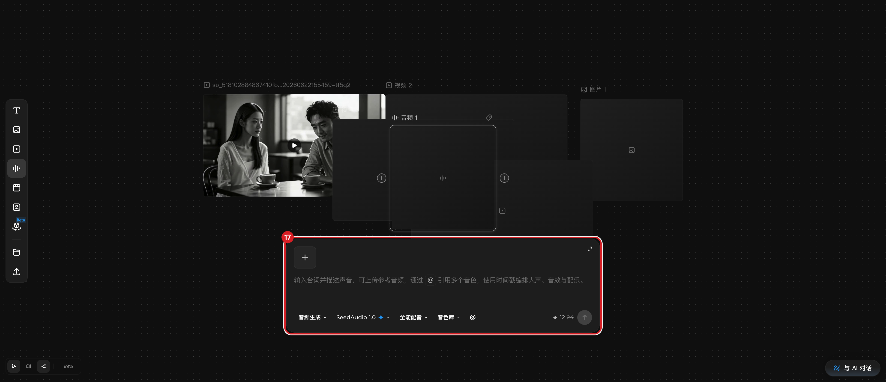

# 配置音频节点（配音与声音库）

## 适用角色

已登录的即梦画布创作者。

## 目标

创建音频节点，了解配音/音频生成的面板参数与价格显示，为台词配音做准备
（执行生成会消耗积分）。

## 前置条件

已打开画布；建议先想好台词文本。

## 入口

左栏 **音频**（点击即在画布中央新建「音频 N」空节点，自动选中并弹出音频生成面板）。

## 面板要素（2026-09-23 实测逐字）

- 说明文字：输入台词并描述声音，可上传参考音频，通过 引用多个音色，
  使用时间戳编排人声、音效与配乐。
- **创作类型**：音频生成
- **选择模型**：SeedAudio 1.0（带 New 标）
- **音频生成（模式）**：全能配音
- **音色**：音色库
- **价格**：Current price 12. Original price 24. Discount 12. 积分5折.
  （即 ✦12，原价 ✦24，当前积分 5 折）
- **生成**：空提示词时禁用

## 原子步骤

1. 点击左栏 **音频** → 新建音频节点并打开面板。
2. 在提示词区输入台词/声音描述。
3. 按需切换 模型 / 全能配音 / 音色库 各选项。
4. 核对折扣后价格（示例 ✦12/原价 ✦24）。
5. **停在发送前**：是否点击 **生成** 由你决定（消耗积分）。

## 有内容的音频节点

生成/上传音频后，节点显示波形与播放控件（播放/时间/静音），交互与视频卡片
同类（见 [预览与播放](media-playback.md)）。

## 取消 / 恢复

- 放弃：点击空白关闭面板；节点可 **⌫** 删除（注意先让焦点离开输入框）。

## 相关任务

[准备生成](prepare-generation.md) ｜ [创建节点](create-first-node.md)

## 已验证说明

面板全部要素与价格折扣读数为 2026-09-23 实测（空节点形态）；音色库内选音色、
参考音频上传、生成执行未验证。

## 步骤图

