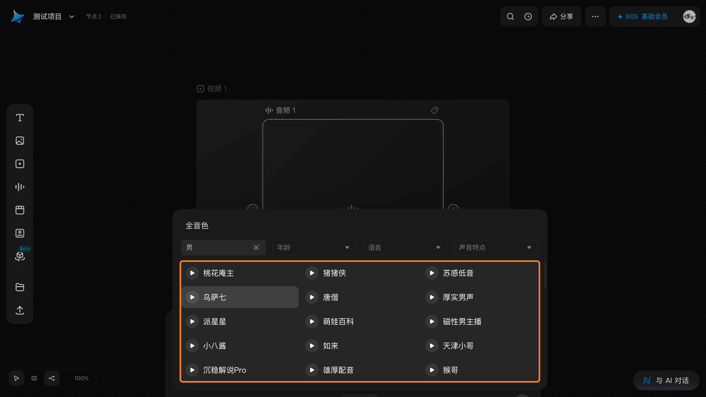
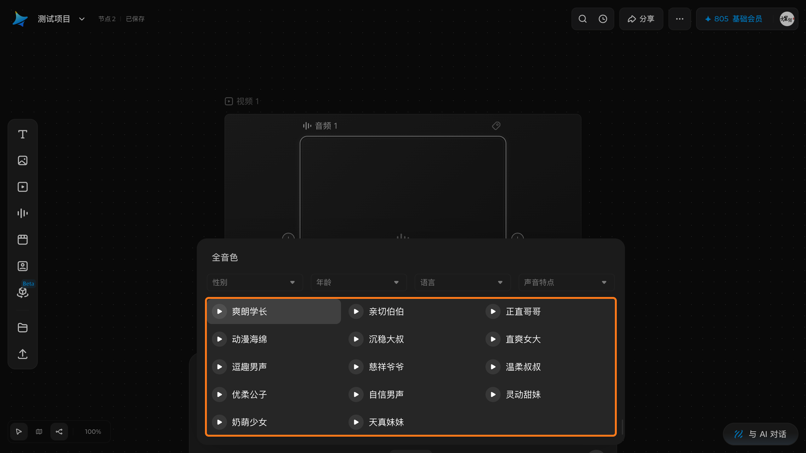
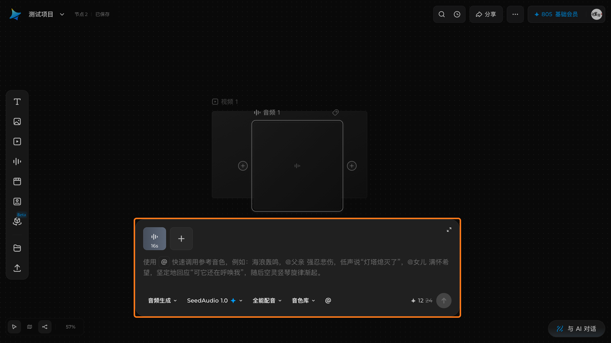

# 配置音频节点（配音、声音库与音乐模式）

## 适用角色

已登录的即梦画布创作者。

## 目标

创建音频节点，了解配音/音频生成的面板参数、音色库与价格显示，为台词配音做准备
（执行生成会消耗积分）。

## 前置条件

已打开画布；建议先想好台词文本。

## 入口

左栏 **音频**（点击即在画布中央新建「音频 N」空节点，自动选中并弹出音频生成面板）。

## 节点结构（2026-10-02 批次 97，用画布上 **31 个**音频节点清点）

> 🔑 **31 个节点是别的会话建的**，本轮**只读**清点，未改任何节点内容。
> 样本量大，所以这一节的读数比「两个实例对照」更硬。

| 观察项 | 读数 |
|---|---|
| **卡片尺寸** | canvas 恒 **`320×320`**（31/31 一致；本批第三次确认，批次 79 曾用两实例复核） |
| 节点内部 testid | **6 个，每个节点都有**：`flow-node-title`（标题）、`flow-node-selected-tag`（`Add tags` 角标）、`audio-node-empty`（空态）、`audio-node-status-icon`（状态图标）、`flow-node-target-handle`（左侧入边手柄）、`flow-node-source-handle`（右侧**出边**手柄） |
| 空态文案 | aria 逐字 **`暂无音频. No resources: 0 ready, 0 processing, 0 failed. Selected.`**；未选中时末句是 **`Not selected.`** —— 前面三个计数恒为 `0`，**只有末句随选中态变** |
| 播放器元素 | **没有** `<audio>` / `<video>` / `<canvas>`（31/31 都没有）⇒ 空节点**不存在播放控件** |
| 按钮数 | 每个节点 **1 个**（就是 `Add tags` 角标） |

### 连接手柄：音频节点**能**当连线的起点

音频节点**左右两侧的手柄都在**（`source` 31/31、`target` 31/31）——
这与**时间线节点形成对照**（时间线**没有**出边手柄，见[时间线节点](timeline-node.md)）。

⚠️ **有手柄 ≠ 能拖**。真正的可拖热区在**伪元素**上：

| 部位 | 读数 |
|---|---|
| 手柄元素本体 | `pointer-events: none`、`opacity: 0`、屏上 `14×28` |
| **`::before`** | **`pointer-events: auto`、`40px×80px`** ← **这才是热区** |
| `::after` | `20×20`，`opacity: 0`（圆形字形，**鼠标悬停或选中时**才显形） |

⇒ 想判断「这个节点能不能发起连线」，**要读 `getComputedStyle(手柄, '::before').pointerEvents`，
不是看元素本体在不在、看不看得到。**

## 面板要素（2026-10-01 批次 29 全量复测，空节点 680×204）

面板 DOM 为 `data-testid="node-toolbar"`，实测 **680×204**，内含 **11 个 svg**。

- 说明文字：输入台词并描述声音，可上传参考音频，通过 引用多个音色，
  使用时间戳编排人声、音效与配乐。
- **创作类型**：音频生成
- **选择模型**：SeedAudio 1.0（带 New 标）
- **音频生成（模式）**：全能配音
- **音色**：音色库
- **价格**：Current price 12. Original price 24. Discount 12. 积分5折.
  （即 ✦12，原价 ✦24，当前积分 5 折）
- **生成**：空提示词时禁用

### 逐个控件（aria 逐字，2026-10-01 实测）

| 控件 | aria 逐字 | 尺寸 | 备注 |
|---|---|---|---|
| 折叠面板 | `展开音频生成器` | 40×40 | 面板左上角 |
| 加参考 | `添加参考` | 48×48 | |
| 提示词输入区 | `提示词` | 646×28 | `aria-disabled=false`，**可输入** |
| 提示词内引用 | `引用参考` | 24×24 | ⚠️ **与下面那个同名** |
| 创作类型 | `创作类型: 音频生成` | 80×32 | 下拉，`aria-expanded` 可判 |
| 选择模型 | `选择模型: SeedAudio 1.0, New` | 135×32 | ⚠️ **aria 里带 `, New`** |
| 音频生成模式 | `音频生成: 全能配音` | 80×32 | 下拉 |
| 音色 | `音色: 音色库` | 68×32 | 下拉，展开见下节 |
| 底部引用 | `引用参考` | 32×32 | ⚠️ **与提示词内那个同名，但尺寸不同** |
| 折扣详情 | `显示折扣详情` | 46×20 | 显示 `12` 与 `24` |
| 生成 | `生成` | 32×32 | **空提示词时 `aria-disabled=true`** + 逐字「请输入提示词」 |

> 💡 **aria 判据速记**：`创作类型: X` / `选择模型: X` / `音频生成: X` /
> `音色: X` —— **冒号后是当前值**，冒号前是控件名。改值后 aria 会跟着变。
> ⚠️ **别用 `innerText` 找这些控件**：它们的可见文字只有 `音频生成` 之类，
> **要按 `aria-label` 前缀找**。另外 `引用参考` **有两个同名控件**（24×24 与 32×32），
> 必须靠尺寸或位置区分。

### 三个下拉（2026-10-01 全部只读展开，未选任何一项）

**这三个下拉都渲染在 `node-toolbar` 内部**（不是外部浮层），
容器一律 `role="listbox"`，选项一律 `role="option"`，当前项 `aria-selected="true"`。

| 下拉 | 容器 aria / 尺寸 | 逐字选项 |
|---|---|---|
| **创作类型** | `创作类型 options` **200×84** | **音频生成**（当前，2 个 svg）｜**音乐生成**（1 个 svg） |
| **选择模型** | `选择模型 options` **400×180** | **SeedAudio 1.0, 通过文字描述或参考音频，创作人声、音效与配乐**（当前，文案含 **New**）｜**Seed TTS, 上百个预设音色，让你玩转人声配音**（**灰字，本节点不可选**） |
| **音频生成（模式）** | `音频生成 options` **200×44** | **只有「全能配音」一项**（当前）——即目前**没有第二种模式** |

- 💡 **禁用判据**：模型下拉里的 `Seed TTS` 是 `rgba(255,255,255,0.x)` 灰字，
  同样只能**看颜色**（它也没有 `aria-disabled`）。
- ⚠️ **Esc 的代价**：对这三个下拉按 **Esc**，**整个生成面板会一起消失**
  （实测 `node-toolbar` 可见数 1 → 0）。**想只关下拉，请点面板外空白处。**

## 音色库（2026-10-01 批次 29 枚举 + 批次 32 补测筛选/试听/选用）

这是本页此前最大的空白 —— 旧记录只写「音色库内选音色未验证」。

- 点 `音色: 音色库` → 按钮 **`aria-expanded` 由 `false` 变 `true`**，
  面板上方浮出标题为「**全音色**」的浮层，区域实测 **608×260**。
  ⚠️ **面板本体尺寸不变**（仍 680×204）—— 音色库是**浮在面板上方**的，不是把面板撑高。
- 浮层里首屏渲染 **40 个元素**：4 个筛选器 + **18 个**音色 × 2 个按钮。
- ⚠️ **结构澄清（批次 32）**：四个筛选器与 `[aria-label="全音色"]` 音色网格
  是**兄弟节点**，筛选器**不在** `[aria-label="全音色"]` 内部
  （筛选器 `y=435`，网格 `y=475`）。按 `[aria-label="全音色"] button` 找筛选器会落空。
- 🟢 音频生成面板另有 4 个 `data-testid`（此前未记录）：
  **`node-toolbar-feature-host`**、**`audio-generation-form`**、
  **`generation-prompt-editor`**（提示词编辑器）、**`generation-submit-icon`**。

### 四个筛选器（各 153×28，文字色 `rgba(255,255,255,0.6)`）

aria 格式为 `分类: 当前值 分类名`，当前值初始都是「全部」：

| 筛选器 aria 逐字 | 选项逐字（首项为「全部 …」且 `aria-selected="true"`） |
|---|---|
| `性别: 全部 性别` | 全部 性别 ｜ **男** ｜ **女** |
| `年龄: 全部 年龄` | 全部 年龄 ｜ **幼儿** ｜ **少年** ｜ **青年** ｜ **中年** ｜ **老年** |
| `语言: 全部 语言` | 全部 语言 ｜ **普通话** ｜ **中文方言** ｜ **英文** |
| `声音特点: 全部 声音特点` | 全部 声音特点 ｜ **适合旁白** ｜ **情景演绎** ｜ **多情感** ｜ **适合口播** ｜ **知名 IP** |

- 各筛选器展开后容器均为 `role="listbox"`（aria 逐字 `性别 options` 等），
  宽 **161**、选项各 **153**。
- ⚠️ **对筛选器按 Esc 只关筛选器，面板还在**（实测可见 `node-toolbar` 仍为 1）——
  这与上面三个下拉**行为不同**，别混。

### 音色列表：三列网格、**可滚动、实测共 35 个**

每个音色有两个按钮：

| 按钮 | aria 逐字 | 尺寸 | 作用 |
|---|---|---|---|
| 试听 | `Play <音色名>` | 24×24 | 播放样音 |
| 选用 | `Add <音色名>` | 173×40 | 加入本次配音 |

网格容器是 `[aria-label="全音色"]`，实测 **648×216**，`class` 含
`overflow-y-auto` —— **它是可滚动的**：`scrollHeight = 1932`、`clientHeight = 216`。
把 `scrollTop` 拉到最底再数，**去重后共 35 个音色**（首屏渲染 18 个 + 滚到底后
17 个）。⚠️ **「18 个」只是首屏渲染数，不是总数**。

> 🔧 **订正**：本手册早前（批次 29）写「音色库共 18 个音色」，那是**只数了首屏**。
> **2026-10-01 批次 32 实测总数为 35**。

**首屏 18 个（DOM 顺序）**：生动解说、精品有声书、桃花庵主、猪猪侠、灵动女声、
苏感低音、乌萨七、唐僧、厚实男声、阳光美眉、和蔼奶奶、派星星、佩奇猪、萌娃百科、
磁性男主播、清醒语录、甜美软妹、小八酱。

**滚到底后新增的 17 个**：清亮男声Pro、乖巧男孩、乖巧萌妹、爽朗学长、亲切伯伯、
正直哥哥、动漫海绵、沉稳大叔、直爽女大、逗趣男声、慈祥爷爷、温柔叔叔、优柔公子、
自信男声、灵动甜妹、奶萌少女、天真妹妹。

### 筛选真的生效（2026-10-01 批次 32 实测）

筛选器**不在** `[aria-label="全音色"]` 里面 —— 两者是**兄弟节点**：
四个筛选器在浮层上行（各 153×28，`y=435`），音色网格在下行（`y=475`）。
所以按 `[aria-label="全音色"] button` 去找筛选器会**一个都找不到**。

选中某项后，筛选器按钮的 aria 会从 `性别: 全部 性别` 变成 **`性别: 男`**，
即「**分类名: 当前值 分类名**」格式。实测三个取值：

| 筛选值 | 网格内音色数 | 音色逐字 |
|---|---|---|
| 全部（默认） | 18（首屏） | 见上表 |
| **男** | 18 | 桃花庵主、猪猪侠、苏感低音、乌萨七、唐僧、厚实男声、派星星、萌娃百科、磁性男主播、小八酱、如来、天津小哥、沉稳解说Pro、雄厚配音、猴哥、开朗学长、熊爸爸讲故事、皇上 |
| **女** | 18 | 灵动女声、阳光美眉、和蔼奶奶、佩奇猪、清醒语录、甜美软妹、文静学姐、做作夹子音、暖心学姐、端庄女声、调皮公主、温柔女声、流畅女声、活泼女孩、春日部姐姐、台湾腔甜妹、知性熟女、超萌小奶音 |

→ **筛选确实换掉了整张列表**（与「全部」的重叠很少），且**网格高度恒为 216 不变**。
筛选下拉本身是 `[role="listbox"][aria-label="性别 options"]`（161×124），
三项各 153×36：`全部 性别`（`aria-selected="true"`）/ `男` / `女`。
点回「全部 性别」即恢复默认列表。

### 试听 `Play`（2026-10-01 批次 32 首次实测）

- 按钮 aria 逐字 `Play 生动解说`（24×24）；~~**播放中 aria 变成 `Pause 生动解说`**——
  同一个按钮就地翻转，可再次点击停止。~~
  🔴 **批次 97 未能复现这个翻转**（详见下方「批次 97 的复现尝试」）⇒
  **这一条现在只能当「待复核」，不要拿它当判断样音是否在播的可靠判据。**
- 时序实测（批次 32）：点下后 **0.9s 仍是 `Play`**，**3.4s 已变成 `Pause`**（样音在播）。
- 页面上**没有 `<audio>` 元素**（`document.querySelectorAll('audio').length === 0`），
  播放不走 DOM 音频元素。
- **不扣积分**：操作前后顶栏积分读数均为 **805**。
- **音色库不会因试听而关闭**。

### 选用 `Add`（2026-10-01 批次 32 首次实测）

点 `Add 生动解说`（173×40）之后：

1. **提示词仍然是空的** —— `[data-testid="generation-prompt-editor"]` 的
   `innerHTML` 仍是 `
 
`，
   `innerText` 是 `"\n"`。**音色名不会被写进提示词。**
2. 真正变的是**面板顶部的说明文案**：
   - 选用前：占位说明逐字「输入台词并描述声音，可上传参考音频，通过 引用多个音色，
     使用时间戳编排人声、音效与配乐。」
   - 选用后：换成一段**用法示例**（span 640×42），逐字
     **`使用 @ 快速调用参考音色，例如：海浪轰鸣，@父亲 强忍悲伤，低声说“灯塔熄灭了”，@女儿 满怀希望，坚定地回应“可它还在呼唤我”，随后空灵竖琴旋律渐起。`**
   - 顶部同时出现一个 **`16s` 的时长 chip**（span 48×22）。
3. **音色库仍保持打开**（`[aria-label="全音色"]` 依然在 DOM 里）。
4. **不扣积分**：前后均为 **805**。

> 💡 **所以「引用音色」的正确用法是照着示例手写 `@<音色名>`**，
> `Add` 按钮的作用是**给你一段照抄的示例**，不是替你把音色插进提示词。
> 示例里的 `@父亲` / `@女儿` 就是这种写法的示范。

### 同时选用多个音色（2026-10-02 批次 97 实测，关闭此前「仍未验证」的第二条）

在**自建**的音频节点上连点两个不同音色的 `Add`：

| 动作 | 顶部的时长 chip | 面板说明文案 | 积分 |
|---|---|---|---|
| 选用**第 1 个**（生动解说） | **1 个**，逐字 `16s` | 换成那段 `@` 用法示例 | 805 |
| 再选用**第 2 个**（精品有声书） | **2 个**，逐字 `16s` `16s` | **与第一次完全相同**（还是那段示例） | **805** |

⇒ 🔑 **每选用一个音色，顶部就多出一个 `16s` 的时长 chip**，
所以**数 chip 就知道选了几个音色** —— 这是本页目前唯一能机械核对「选了几个」的办法。
⇒ 选用多个音色**不改变**那段说明文案，也**不扣积分**（两次操作前后都是 805）。

### 批次 97 的复现尝试：试听时序为什么没测到

批次 32 记的是「0.9s 仍为 `Play`、3.4s 已为 `Pause`」。
批次 97 用**更硬的判据**重测：在点下之前先在页面里挂一个 `MutationObserver`
监听所有 `aria-label` 变化（**逐条记时间戳**），然后连采样 30 秒。

结果：**observer 记到 `0` 条**，轮询也只读到起手那一次 `Play`，
之后 30 秒一直是 `Play`，**`Pause` 一次都没出现**。

⚠️ 两条读数**互相矛盾**，本轮**判不了**是「播放功能变了」「这次没触发」还是「环境不允许播放」，
因此 **记 VOID、不下结论**（`VOlD` = 没法验证，不等于「不存在」）。

💡 但这轮留下一个**比轮询强得多的判据**，值得记住：
**「`Play`→`Pause` 有没有翻转」用 `MutationObserver` 判，不要用轮询判** ——
轮询间隔大于翻转耗时时会**整个漏掉**翻转，看起来就像「根本没播」。

⚠️ 另一处**本轮两轮读数矛盾、同样记 VOID**：未选中的空音频节点，
a 轮 31/31 读到 `Not selected.`，b 轮在锁定节点未选中时却读到该元素**不在 DOM 里**（`null`）。
只有「末句随选中态在 `Selected.` / `Not selected.` 之间变」这一条两轮都站得住。

### ⚠️ 收起音色库的正确姿势

按 **Esc** 会**把整个生成面板一起关掉**（`node-toolbar` 一并消失）。
**只想收起音色库**：**再点一次「音色库」按钮**（`aria-expanded` 翻回 false），
面板会留在原地。

## 原子步骤

1. 点击左栏 **音频** → 新建音频节点并打开面板（实测节点 **`320×320` canvas**，
   class `react-flow__node-audio`）。
   🔴 **订正（批次 79）**：此处原写 **240×240**。2026-10-02 用**两个独立节点**复核 ——
   画布上他人的「音频 1」与本轮自建的新音频节点，在 scale `0.6` / `0.574468` 下
   屏上都读到 `192×192`，折合 canvas **都是 `320×320`**。`240` 未复现。
2. 在提示词区输入台词/声音描述。
3. 按需切换 **创作类型**（音频生成 / 音乐生成）→ **选择模型** → **音频生成模式**。
4. 需要挑声音时，点 **音色库** → 用四个筛选器缩小范围 → 点 `Add <音色>` 选用。
5. 核对折扣后价格（示例 ✦12/原价 ✦24）。
6. **停在发送前**：是否点击 **生成** 由你决定（消耗积分）。

## 右键菜单（2026-10-02 批次 97 补上，本页此前的空白）

在音频节点上点右键，菜单容器是 `canvas-context-menu`，实测 **`200×292`**，
**7 项各 `192×36`**，按实际顺序：

| # | 逐字 | 快捷键 | 状态 |
|---|---|---|---|
| 1 | 复制 | ⌘C | 可点 |
| 2 | 复制副本 | ⌘D | 可点 |
| 3 | 粘贴 | ⌘V | 可点 |
| 4 | **下载** | — | 🔴 **禁用**，逐字附「**没有可用的就绪资源**」 |
| 5 | 重做 | ⇧⌘Z | 禁用（「无需重做操作」） |
| 6 | 撤销 | ⌘Z | 可点 |
| 7 | 删除 | ⌫ | 可点 |

🔑 ~~**不同类型的节点共用同一套右键菜单模板**~~
🔴 **批次 98 订正并收窄**：模板是「**7 项基础 + 按节点类型插入额外项**」，**不是「都只有 7 项」**。
[主体节点](subject-node.md)的菜单是 **8 项**（容器 `200×332`，比这里多 `40`）——
第 4 位**多一个 `保存到主体库`**。
另外「下载」那项的**禁用原因文案随节点类型不同**：
音频是「**没有可用的就绪资源**」，主体是「**请选择至少一个组、文本、图片或视频项**」。
⇒ 换一种节点类型时**不用重新找菜单结构**（前 3 项与后 3 项逐字相同），
但**必须重数条目数**、并**逐项重读可用性与后缀**。

## 有内容的音频节点

生成/上传音频后，节点显示波形与播放控件（播放/时间/静音），交互与视频卡片
同类（见 [预览与播放](media-playback.md)）。
⚠️ **本条仍是 2026-09-23 的未验证记录** —— 造出带媒体的音频节点需要生成、
属扣费边界，本手册未执行。

## 取消 / 恢复

- 放弃：点击空白关闭面板；节点可 **⌫** 删除（注意先让焦点离开输入框）。
- ⚠️ **Esc 在这里是「重操作」**：关掉下拉会**连整个面板一起关掉**。
  只想去掉下拉，**点面板外的空白处**。

## 相关任务

[准备生成](prepare-generation.md) ｜ [创建节点](create-first-node.md) ｜
[节点工具条](use-node-toolbar.md)

## 已验证说明

**2026-10-01 批次 29 全面复测**（本页此前全部依赖 2026-09-23 旧记录）：
面板 680×204 与全部 11 个控件的 aria 逐字与尺寸、三个下拉的容器与逐字选项、
音色库的 4 个筛选器与 18 个音色、两组 Esc 行为的差异 ——
均为**当日实测**，全程**未点击任何 `Play` / `Add` / 选项 / 生成**。

**2026-10-01 批次 32 补测**（把上一段「仍未验证」的前三条全部关闭）：
筛选后列表确实整张换掉（男/女各 18 个，逐字已录）、试听可用且 aria 由
`Play X` 翻成 `Pause X`、**选用不会把音色写进提示词**而是换出一段
「使用 @ 快速调用参考音色，例如：…」的用法示例并在顶部加 `16s` 时长 chip。
三条路径**均未扣积分**（前后都是 805）。详见上文各节。

**2026-10-02 批次 97 补测**（自建节点，全程未点「生成」，积分 805→805）：
音频节点结构 31 样本清点（canvas 恒 `320×320`、6 个内部 testid、空态 aria 逐字、
无播放器元素、**有出边手柄**且 `::before` 热区 `pe:auto`）、
右键菜单 7 项逐字与尺寸、**同时选用两个音色**（各加一个 `16s` chip、文案不变、不扣积分）。

**仍未验证**：**样音的确切时长**（批次 32 记 0.9s/3.4s 两次读数，
⚠️ **批次 97 用 `MutationObserver` 未能复现 `Play`→`Pause` 翻转**，两轮矛盾、记 VOID）、
`@<音色名>` 手写后能否被正确识别、
未选中空节点的空态元素是否始终在 DOM 里（两轮读数矛盾）、
有媒体音频节点的波形与播放控件、生成执行（**扣费边界**）。

## 步骤图

