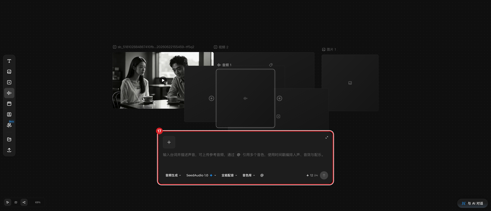
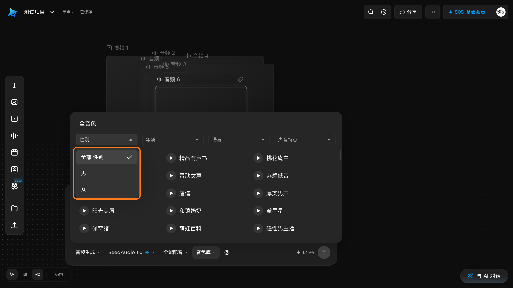
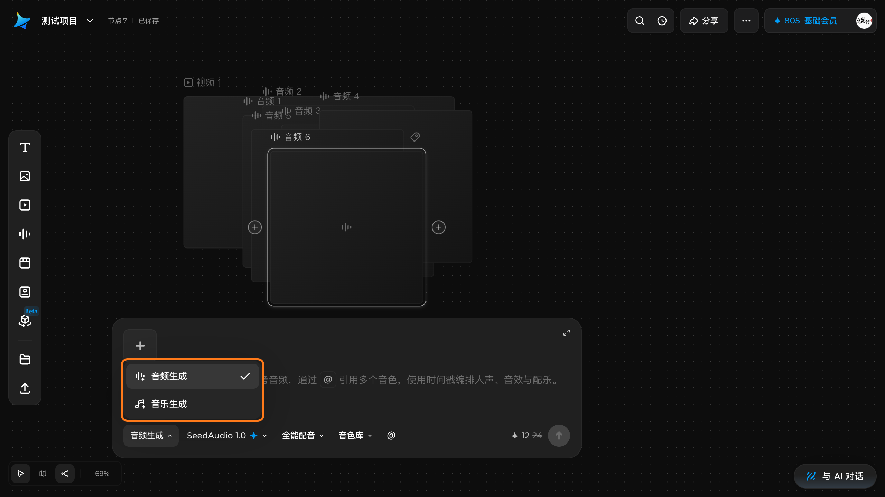
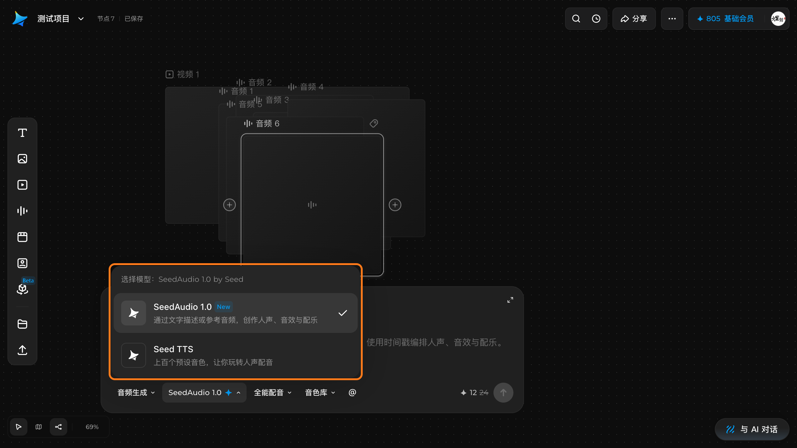
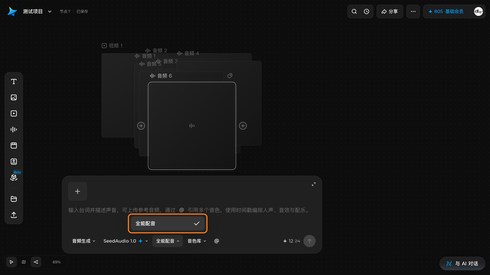

# 配置音频节点（配音、声音库与音乐模式）

## 适用角色

已登录的即梦画布创作者。

## 目标

创建音频节点，了解配音/音频生成的面板参数、音色库与价格显示，为台词配音做准备
（执行生成会消耗积分）。

## 前置条件

已打开画布；建议先想好台词文本。

## 入口

左栏 **音频**（点击即在画布中央新建「音频 N」空节点，自动选中并弹出音频生成面板）。

## 面板要素（2026-10-01 批次 29 全量复测，空节点 680×204）

面板 DOM 为 `data-testid="node-toolbar"`，实测 **680×204**，内含 **11 个 svg**。

- 说明文字：输入台词并描述声音，可上传参考音频，通过 引用多个音色，
  使用时间戳编排人声、音效与配乐。
- **创作类型**：音频生成
- **选择模型**：SeedAudio 1.0（带 New 标）
- **音频生成（模式）**：全能配音
- **音色**：音色库
- **价格**：Current price 12. Original price 24. Discount 12. 积分5折.
  （即 ✦12，原价 ✦24，当前积分 5 折）
- **生成**：空提示词时禁用

### 逐个控件（aria 逐字，2026-10-01 实测）

| 控件 | aria 逐字 | 尺寸 | 备注 |
|---|---|---|---|
| 折叠面板 | `展开音频生成器` | 40×40 | 面板左上角 |
| 加参考 | `添加参考` | 48×48 | |
| 提示词输入区 | `提示词` | 646×28 | `aria-disabled=false`，**可输入** |
| 提示词内引用 | `引用参考` | 24×24 | ⚠️ **与下面那个同名** |
| 创作类型 | `创作类型: 音频生成` | 80×32 | 下拉，`aria-expanded` 可判 |
| 选择模型 | `选择模型: SeedAudio 1.0, New` | 135×32 | ⚠️ **aria 里带 `, New`** |
| 音频生成模式 | `音频生成: 全能配音` | 80×32 | 下拉 |
| 音色 | `音色: 音色库` | 68×32 | 下拉，展开见下节 |
| 底部引用 | `引用参考` | 32×32 | ⚠️ **与提示词内那个同名，但尺寸不同** |
| 折扣详情 | `显示折扣详情` | 46×20 | 显示 `12` 与 `24` |
| 生成 | `生成` | 32×32 | **空提示词时 `aria-disabled=true`** + 逐字「请输入提示词」 |

> 💡 **aria 判据速记**：`创作类型: X` / `选择模型: X` / `音频生成: X` /
> `音色: X` —— **冒号后是当前值**，冒号前是控件名。改值后 aria 会跟着变。
> ⚠️ **别用 `innerText` 找这些控件**：它们的可见文字只有 `音频生成` 之类，
> **要按 `aria-label` 前缀找**。另外 `引用参考` **有两个同名控件**（24×24 与 32×32），
> 必须靠尺寸或位置区分。

### 三个下拉（2026-10-01 全部只读展开，未选任何一项）

**这三个下拉都渲染在 `node-toolbar` 内部**（不是外部浮层），
容器一律 `role="listbox"`，选项一律 `role="option"`，当前项 `aria-selected="true"`。

| 下拉 | 容器 aria / 尺寸 | 逐字选项 |
|---|---|---|
| **创作类型** | `创作类型 options` **200×84** | **音频生成**（当前，2 个 svg）｜**音乐生成**（1 个 svg） |
| **选择模型** | `选择模型 options` **400×180** | **SeedAudio 1.0, 通过文字描述或参考音频，创作人声、音效与配乐**（当前，文案含 **New**）｜**Seed TTS, 上百个预设音色，让你玩转人声配音**（**灰字，本节点不可选**） |
| **音频生成（模式）** | `音频生成 options` **200×44** | **只有「全能配音」一项**（当前）——即目前**没有第二种模式** |

- 💡 **禁用判据**：模型下拉里的 `Seed TTS` 是 `rgba(255,255,255,0.x)` 灰字，
  同样只能**看颜色**（它也没有 `aria-disabled`）。
- ⚠️ **Esc 的代价**：对这三个下拉按 **Esc**，**整个生成面板会一起消失**
  （实测 `node-toolbar` 可见数 1 → 0）。**想只关下拉，请点面板外空白处。**

## 音色库（全量枚举，2026-10-01 批次 29）

这是本页此前最大的空白 —— 旧记录只写「音色库内选音色未验证」。

- 点 `音色: 音色库` → 按钮 **`aria-expanded` 由 `false` 变 `true`**，
  面板上方浮出标题为「**全音色**」的浮层，区域实测 **608×260**。
  ⚠️ **面板本体尺寸不变**（仍 680×204）—— 音色库是**浮在面板上方**的，不是把面板撑高。
- 浮层里共有 **40 个新元素**：4 个筛选器 + 18 个音色 × 2 个按钮。

### 四个筛选器（各 153×28，文字色 `rgba(255,255,255,0.6)`）

aria 格式为 `分类: 当前值 分类名`，当前值初始都是「全部」：

| 筛选器 aria 逐字 | 选项逐字（首项为「全部 …」且 `aria-selected="true"`） |
|---|---|
| `性别: 全部 性别` | 全部 性别 ｜ **男** ｜ **女** |
| `年龄: 全部 年龄` | 全部 年龄 ｜ **幼儿** ｜ **少年** ｜ **青年** ｜ **中年** ｜ **老年** |
| `语言: 全部 语言` | 全部 语言 ｜ **普通话** ｜ **中文方言** ｜ **英文** |
| `声音特点: 全部 声音特点` | 全部 声音特点 ｜ **适合旁白** ｜ **情景演绎** ｜ **多情感** ｜ **适合口播** ｜ **知名 IP** |

- 各筛选器展开后容器均为 `role="listbox"`（aria 逐字 `性别 options` 等），
  宽 **161**、选项各 **153**。
- ⚠️ **对筛选器按 Esc 只关筛选器，面板还在**（实测可见 `node-toolbar` 仍为 1）——
  这与上面三个下拉**行为不同**，别混。

### 18 个音色（**三列网格**排列）

每个音色有两个按钮：

| 按钮 | aria 逐字 | 尺寸 | 作用 |
|---|---|---|---|
| 试听 | `Play <音色名>` | 24×24 | 播放样音 |
| 选用 | `Add <音色名>` | 173×40 | 加入本次配音 |

**逐字清单（18 个）**：生动解说、精品有声书、桃花庵主、猪猪侠、灵动女声、苏感低音、
乌萨七、唐僧、厚实男声、阳光美眉、和蔼奶奶、派星星、佩奇猪、萌娃百科、磁性男主播、
清醒语录、甜美软妹、小八酱。

> ⚠️ **本手册对全部 18 个音色与 4 个筛选器一律只读观察**：
> 没有点过任何 `Play`（试听）或 `Add`（选用），因此
> **「试听时长」「选用后提示词如何变化」「筛选后列表如何变化」均未验证**。
> 需要这些结论请自行在画布上试（`Add` 只是加入提示词、不扣积分）。

## 原子步骤

1. 点击左栏 **音频** → 新建音频节点并打开面板（实测节点 **240×240**，
   class `react-flow__node-audio`）。
2. 在提示词区输入台词/声音描述。
3. 按需切换 **创作类型**（音频生成 / 音乐生成）→ **选择模型** → **音频生成模式**。
4. 需要挑声音时，点 **音色库** → 用四个筛选器缩小范围 → 点 `Add <音色>` 选用。
5. 核对折扣后价格（示例 ✦12/原价 ✦24）。
6. **停在发送前**：是否点击 **生成** 由你决定（消耗积分）。

## 有内容的音频节点

生成/上传音频后，节点显示波形与播放控件（播放/时间/静音），交互与视频卡片
同类（见 [预览与播放](media-playback.md)）。
⚠️ **本条仍是 2026-09-23 的未验证记录** —— 造出带媒体的音频节点需要生成、
属扣费边界，本手册未执行。

## 取消 / 恢复

- 放弃：点击空白关闭面板；节点可 **⌫** 删除（注意先让焦点离开输入框）。
- ⚠️ **Esc 在这里是「重操作」**：关掉下拉会**连整个面板一起关掉**。
  只想去掉下拉，**点面板外的空白处**。

## 相关任务

[准备生成](prepare-generation.md) ｜ [创建节点](create-first-node.md) ｜
[节点工具条](use-node-toolbar.md)

## 已验证说明

**2026-10-01 批次 29 全面复测**（本页此前全部依赖 2026-09-23 旧记录）：
面板 680×204 与全部 11 个控件的 aria 逐字与尺寸、三个下拉的容器与逐字选项、
音色库的 4 个筛选器与 18 个音色、两组 Esc 行为的差异 ——
均为**当日实测**，全程**未点击任何 `Play` / `Add` / 选项 / 生成**。

**仍未验证**：音色试听与选用后的提示词变化、筛选后的列表变化、
有媒体音频节点的波形与播放控件、生成执行（**扣费边界**）。

## 步骤图

