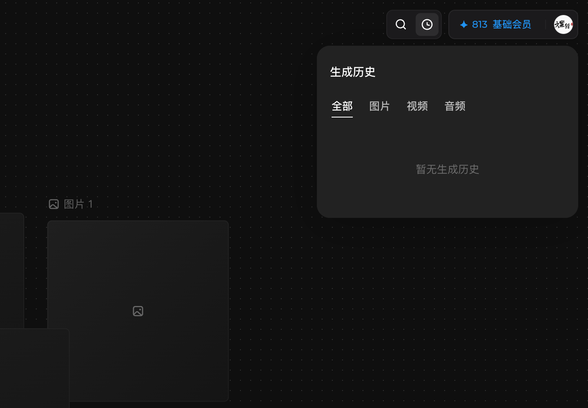
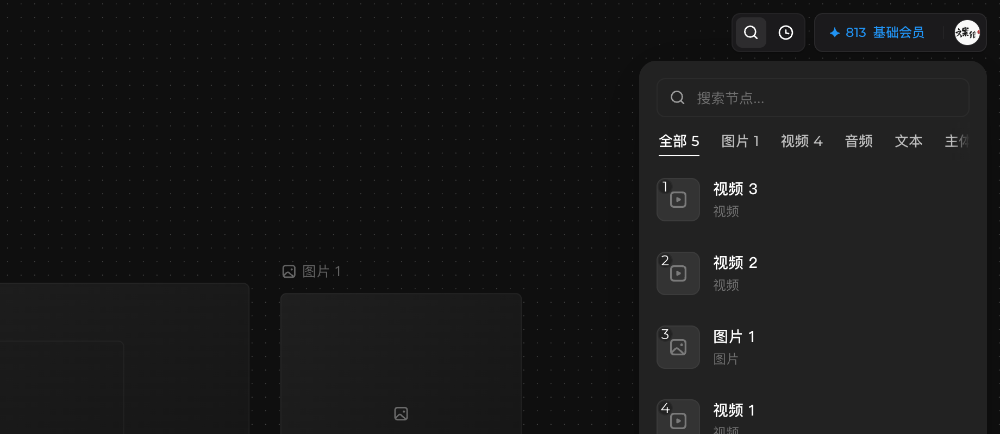

# 管理画布上下文（重命名、生成历史、搜索、保存）

## 适用角色

已登录的即梦画布创作者。

## 目标

识别顶栏各入口：重命名画布、查看生成历史、全局搜索节点、确认保存状态，
并理解「离线编辑」提示的处理方式。

## 前置条件

已打开画布。

## 顶栏一览（左→右）

返回首页 ｜ **画布标题**（单击重命名）｜ **项目** ｜ **节点 N**（计数）｜
**已保存** 状态 ｜ **搜索** ｜ **生成历史** ｜ 积分徽标（✦数字 · 会员等级）｜
**用户菜单**

## 原子步骤

### 重命名画布

1. 单击顶栏**画布标题** → 标题变输入框。
2. 输入新名 → **Enter** 提交；**Esc** 取消。
   （入口与按钮实测；改名动作未执行以保持画布原状。）

### 查看生成历史（实测）

1. 点击顶栏 **生成历史**。
2. 下拉面板：tabs **全部 / 图片 / 视频 / 音频**；无记录时显示「暂无生成历史」。
3. **Esc** 关闭。

### 搜索节点（实测）

1. 点击顶栏 **搜索**。
2. 浮层输入框占位「搜索节点...」，下方按类型筛选（全部/图片/视频/音频/文本/
   主体/时间线/组/其他，带数量），结果按编号列出。
3. **Esc** 关闭。

### 确认保存状态

- 顶栏 **已保存** 常驻显示保存状态；改动后自动保存。
- **内容跨刷新持久**（实测）：刷新页面后节点与连线完好。

### 「发现离线编辑」提示（处理原则）

断网期间做过修改、恢复联网后重开页面时，可能出现「发现离线编辑」对话框
（正文：你在离线状态下对当前画布做了修改，这些修改尚未同步到服务器。）：
- **保留并同步**：把本地修改同步上去（一般选这个）；
- **丢弃修改**：放弃离线期间的本地修改（不可恢复，慎点）。
（对话框文案来自真实观察记录；两种选择的后果以产品实际行为为准，慎用丢弃。）

## 常见错误与恢复

| 现象 | 处理 |
|---|---|
| 找不到某个节点 | 顶栏 **搜索** → 输入名称/类型筛选 |
| 怀疑改动没保存 | 看顶栏「已保存」；必要时刷新核对（内容会持久） |

## 相关任务

[平移缩放与视图](navigate-canvas.md) ｜ [帮助与快捷键](help-and-shortcuts.md)

## 已验证说明

生成历史与搜索浮层逐字、保存状态、内容跨刷新持久为 2026-09-23 实测；
标题重命名与「项目」面板未执行展开，离线对话框为历史观察 + 处理原则。

## 步骤图

