# 管理画布上下文（重命名、生成历史、搜索、保存）

## 适用角色

已登录的即梦画布创作者。

## 目标

识别顶栏各入口：重命名画布、查看生成历史、全局搜索节点、确认保存状态，
并理解「离线编辑」提示的处理方式。

## 前置条件

已打开画布。

## 顶栏一览（2026-10-02 批次 82/83 实测）

顶栏是一条 `HEADER`（`[data-testid="canvas-top-bar"]`，`aria="Canvas top bar"`，
**1256×40@12,10**），但**它不是一排连续的按钮，而是左右两段**，中间留着一大片空白：

| 段 | 容器 | 屏上 | 装了什么 |
|---|---|---|---|
| 左段 | `[data-testid="canvas-top-bar-left"]` | **871×40@12,10** | 返回首页 ｜ **画布标题** ｜ **项目** ｜ **节点 N** ｜ **已保存** |
| （空隙 **24px**） | — | x 883→907 | 什么都没有 |
| 右段 | `[data-testid="canvas-top-bar-actions"]` | **361×40@907,10** | **搜索** ｜ **生成历史** ｜ **分享** ｜ **更多**（⋯）｜ 积分徽标（✦数字 · 会员等级）｜ **用户菜单** |

> 🔴 **2026-10-02 批次 83 订正**：本页此前把「标记色」列为顶栏一项，**它已经不在顶栏了**。
> 证据不是「我没找到」，而是**穷举**：顶栏 `x ∈ [190, 911)` 这一整段里
> **只有 5 个有面积的元素**——标题后的分隔竖线 `[data-testid="canvas-title-separator"]`（8×12@194,24）、
> 一条 1×8 的装饰线、保存状态 `[data-testid="canvas-title-save-status"]`（`<OUTPUT>` 30×18@206,21，
> 内容「已保存」）、右段容器 `[data-testid="canvas-top-bar-actions"]`、以及
> `[data-testid="canvas-agent-history-surface"]`（68×36@907,12）。
> **一个都不像标记色，它确实不在了。**

### 顶栏 10 个可点元素逐字（批次 83 重测）

左→右，按文档序（`button` / `[role="button"]` / `a[href]` 一起收——
**返回首页是 `<a>` 不是 `<button>`**，只查 `button` 会漏掉它）：

| # | 标签 | `aria-label` | `data-testid` | 屏上 |
|---|---|---|---|---|
| 1 | 返回首页 | `返回首页` | `canvas-project-logo` | 40×40@12 |
| 2 | 画布标题 | `Canvas title: 测试项目` | `canvas-project-title-trigger` | 68×28@52 |
| 3 | 项目 | `项目` | `canvas-project-trigger` | 20×28@120 |
| 4 | 节点 N | `Canvas node summary: 节点 20` | `canvas-node-summary-trigger` | 34×28@156 |
| 5 | 搜索 | `搜索` | `canvas-panel-launcher` | 28×28@911 |
| 6 | 生成历史 | `生成历史` | `canvas-panel-launcher` | 28×28@943 |
| 7 | 分享 | `分享` | `canvas-share-trigger` | 60×28@988 |
| 8 | 更多 | `更多` | **无 testid** | 28×28@1065 |
| 9 | 积分徽标 | `Credits: 805 · 基础会员` | `canvas-commerce-entry` | 111×28@1109 |
| 10 | 用户菜单 | `用户菜单` | `canvas-user-menu-trigger` | 28×28@1236 |

> ⚠️ **「更多」是顶栏唯一没有 `data-testid` 的按钮**；「搜索」和「生成历史」
> **共用同一个** `canvas-panel-launcher`（靠 `aria-label` 区分）。
> **「已保存」不是按钮**——它是 `<OUTPUT>` 状态标签。
>
> 🔧 **批次 122（2026-10-03）补一句，免得下一个人把它当成矛盾**：
> 「更多」按钮**自己**确实 `data-testid="null"`（上面这句仍然成立），
> 但它**有一个 36×36 的外壳**：`DIV[data-testid="canvas-editor-menu"]` `36×36@1061,12`，
> `display:flex`、**只有一个孩子**，就是那个 `28×28` 的「更多」按钮。
> ⇒ **按 testid 找到的是外壳，不是按钮**；点它要落到里面的 `BUTTON[aria="更多"]` 上。
> 📌 顺带：外壳的父级是一个 `display:contents` 的 `DIV`（矩形 `0×0`）——
> 这就是为什么 `canvas-top-bar-actions` 的 `children.length` 只有 **4**，
> 而它视觉上装着 6 个东西。

## 原子步骤

### 「项目」：切换到别的画布项目（2026-10-01 首测 / 2026-10-02 重测）

顶栏标题右侧那个窄按钮（`aria="项目"`，20×28，`data-testid="canvas-project-trigger"`）
**不是装饰**，它是**项目切换器**。

1. 点击 **项目** → 左上角弹出面板
   （`[data-testid="canvas-project-panel-popover"]`，`SECTION`，aria 逐字 `Project panel`，
   实测 **240×280@12,52**；外面还包一层 `DIV.z-40`，同尺寸）。
   🔧 **2026-10-04 批次 157 订正「高度不是常量」**：八个项目时实测 **`240×400@18,52`**。
   ⇒ **`240×280` 是「五个项目时的读数」，不是面板的固定高度** ——
   面板高度**随项目数增长**（8 行 × 40 + 标题 36 + 底部「新建画布项目」36 ≈ 392，实测 400）。
   每行行尾的「更多」钮 aria 逐字是「<项目名>的更多操作」。
2. 面板分两块：
   - 标题行 **240×36**：`H2`「项目」`24×20@28,64`；
   - 内容 `<nav aria="项目">` **240×200@12,88**：逐行列出**该账号下的其他画布项目**。
     🔴 **批次 83 订正：这里的 `240×200` 是内层 `<nav>` 的高度、不是面板**，面板本体是 `240×280@12,52`。
3. 每行一个项目：
   - 项目名按钮 **`198×36`**，逐字随账号变化。**2026-10-02 实测到五项**：
     **测试项目**（当前所在）｜ **测试项目2** ｜ **测试项目1** ｜ **未命名项目** ｜ **视频创作**；
   - 行尾另有一个 **`28×28`** 的「更多」钮，**`data-testid` 里带着该项目的 UUID**：
     `project-more-ordinary-<项目 uuid>`（本批实测到 `project-more-ordinary-64b58cd5-…`）。
4. 底部 **新建画布项目** 一行，**`232×36`**。
5. 点任一项目名即**切换到那个项目的画布**。

> 🔴 **2026-10-02 批次 83 订正三处**（都是「量了不同的东西」）：
> ① 面板本体是 **`240×280`**，此前的 **`240×200` 是里面那个 `<nav>` 的高度**，不是面板；
> ② 项目行是 **`198×36`**，此前的 **`232×36` 是「新建画布项目」那一行**的宽度；
> ③ 项目数从三项变五项（多了「测试项目2」「测试项目1」——
>    那是别的会话在这块共享画布上新建的）。

> ⚠️ **切换项目会离开当前画布**。本手册**没有执行过任何项目切换**，
> 也没有点过 **新建画布项目** —— 两者都会离开或改变你当前的工作上下文。
> 正文只记录面板结构。

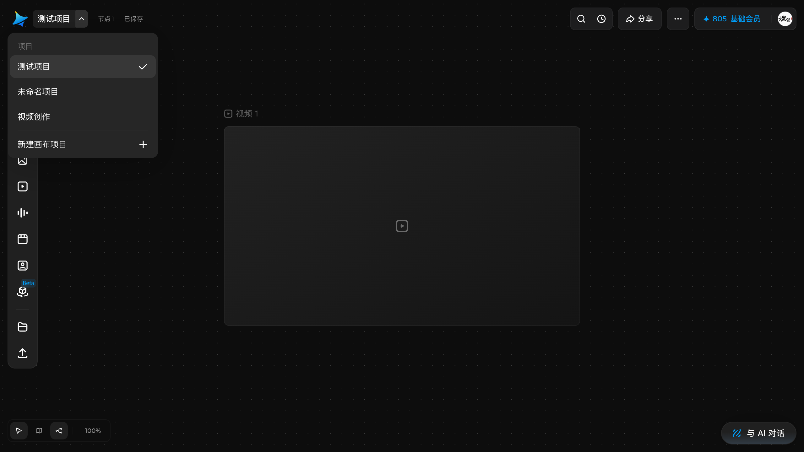

### 「节点 N」：看这个画布里各有多少节点（2026-10-01 首测 / 2026-10-02 重测）

1. 点击顶栏 **节点 N**（`aria` 逐字 **`Canvas node summary: 节点 20`**，
   `data-testid="canvas-node-summary-trigger"`，34×28）。
2. 弹出小结面板（`[data-testid="canvas-node-summary-popover"]`，**200×292@73,47**），
   自上而下每种节点类型一行（每行 **`192×36`**，行距 **40**），
   名称后跟一个数字，**2026-10-02 实测六种**：

   | 行 | 逐字 |
   |---|---|
   | 1 | 图片 **1** |
   | 2 | 视频 **1** |
   | 3 | 文本 **3** |
   | 4 | 音频 **13** |
   | 5 | 时间线 **1** |
   | 6 | **外部 1** |
   | 7 | **查看项目信息**（`BUTTON`，也是 192×36） |

3. **Esc** 关闭。

#### 🔑 计数为 0 的类型**不会出现**（2026-10-03 批次 124，A/B/A 三段实测）

面板只列**当前画布里真实存在**的类型。**某种类型一个节点都没有 ⇒ 这一行不出现**
（不是显示「主体 0」）。

📌 **行的顺序是固定的**，不是「按数量排」也不是「按新增顺序」：

```
图片 → 视频 → 文本 → 音频 → 主体 → 时间线 → 外部
```

⇒ 造一个主体节点时，「主体 1」会**插在「音频」和「时间线」之间**，**不是追加到末尾**。

**A/B/A 三段实测**（同一画布、唯一变量是「有没有那 1 个主体节点」）：

| 阶段 | 「节点 N」面板 | 高度 | 「项目信息 · 节点分布」里的主体 |
|---|---|---|---|
| **A**（0 个主体） | `图片 1 ｜ 视频 1 ｜ 文本 3 ｜ 音频 68 ｜ 时间线 2 ｜ 外部 1` | **`200×292`** | **`主体 0`**（列出来了） |
| **B**（造了 1 个） | `图片 1 ｜ 视频 1 ｜ 文本 3 ｜ 音频 68 ｜ **`主体 1**` ｜ 时间线 2 ｜ 外部 1` | **`200×332`** | **`主体 1`** |
| **A′**（删掉后） | 与 A **逐字相同**（无主体） | **`200×292`** | **`主体 0`** |

⇒ 面板高度随**非零类型数**变化（`292 ↔ 332`，**Δ 恰好 40**），
与上面那条高度公式一致 —— 本批是它的**第三个样本**。
⚠️ **别拿「面板里没有某类型」推断「画布上没这种节点」** ——
同一个画布同一时刻，「项目信息」面板**把「主体 0」明明白白列出来了**（见下文）。

> 🔑 **面板高度是条公式，不是两个孤立数字**（2026-10-02 实测推得并两样本验证）：
>
> ```
> 高度 = 4 + 40 × (类型行数) + 12 + 36
>        ↑上留白 ↑每行 40（行高 36 + 间隙 4） ↑「查看项目信息」前多 8 ↑末行 36（下留白 4）
> ```
>
> | 类型行数 | 算出来 | 实测 | 何时 |
> |---|---|---|---|
> | 1 | **92** | **92** | 2026-09-23，本页旧读数（画布只有 1 个节点） |
> | 6 | **292** | **292** | 2026-10-02，20 个节点 |
> | 7 | **332** | **332** | 2026-10-02 批次 89，**造 1 个主体节点后**（21 个节点） |
>
> ⇒ **宽度恒为 200，高度随类型数线性增长。** 想知道面板多高，数一下有几种节点类型就行。
> 🔑 **批次 89 补**：这个公式此前只有 **n=6 一个点** —— 一个点的公式不叫公式，叫巧合。
> 本批造了 1 个主体节点把 n 推到 **7**，实测 `200×332`、**Δ 恰好 40** ✅ ⇒ 公式成立。
> ⚠️ **n 是「类型数」不是「节点数」**：别的会话加了 **13 个音频节点**（仍属同一类），
> 面板高度**一点没变**。详见 [概念页](../30-concepts.md)。

> 🔴 **2026-10-02 新发现一个本页从未提过的类型：「外部」**。
> 本批实测「外部 1」——它与图片/视频/文本/音频/时间线**并列**在同一个列表里。
> ✅ **批次 89 已解**（此前如实记为「已观察到、未解释」）：面板**按节点的 aria 前缀分组**，
> 而**导演台节点的 aria 逐字是 `外部 node: 导演台`**（class 亦为 `react-flow__node-external`），
> 所以它被归进「外部」类，数量 1 = 导演台节点数。
> 本批逐字读到的面板文字（21 个节点时）：
> `图片 1 ｜ 视频 1 ｜ 文本 3 ｜ 音频 13 ｜ 主体 1 ｜ 时间线 1 ｜ 外部 1 ｜ 查看项目信息`，
> 各组数量与「按 aria 前缀分组」的计数**逐一对上**（合计 21）✅
> ⇒ **不是面板多算了一类，是导演台在可访问性树里就叫「外部」。**
> ⚠️ 一般形状：**产品里的「类型名」不一定等于用户看到的名字** ——
> `导演台` 是给用户看的，`外部` 是给分组用的。
> 要按类型统计节点，**用 aria 前缀分组、再用 class 里的 `react-flow__node-<type>` 交叉核对**，
> 只用其中任何一个都会数错。

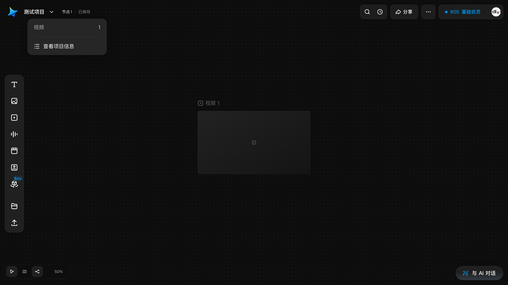

### 重命名画布（实测）

1. 单击顶栏**画布标题** → 标题原地变输入框（可编辑态）。
2. 输入新名 → **Enter** 提交；**Esc** 取消。
   - **2026-10-01 实测闭环**：改名 → Enter 提交成功，顶栏与画布标识同步更新
     （aria 由 `Canvas title: 测试项目` 变为新名）；再次点击进入编辑、
     改回原名 Enter 提交，**已成功还原为「测试项目」**。
   - 成功判据：顶栏标题文字变化 + 刷新后仍是新名。
   - 输入框里 `⌘A` 不能全选（会变成在光标处插入），改名前先手动清空。

### 查看生成历史（2026-10-03 批次 126 全面解剖）

这个面板此前**只被一句转述记录过**（原写「一级页签两个 + 二级页签五个 + 暂无生成历史」），
本批把它的 DOM 逐层拆开，发现**「一级页签」这个说法是错的**。

1. 点击顶栏 **生成历史**（`aria="生成历史"`，`BUTTON` `28×28@943,16`，
   `data-testid="canvas-panel-launcher"` —— **与「搜索」共用同一个 testid**，按 testid 找会拿到 2 个）。
   打开的判据是启动器的 **`aria-expanded` 由 `false` 变 `true`**
   ⚠️ 它的 `data-state` **恒为 `closed`**（面板开着也是 `closed`）—— 别拿 `data-state` 判开合。
2. 面板本体：`<ASIDE role="dialog" aria="生成历史" data-testid="canvas-feature-panel">`
   **`320×211@797,56`**、`position:absolute`、`z-index:30`。
   🔴 **有 4 个元素与它同矩形**（本体 + `canvas-feature-panel-surface`
   + `canvas-feature-panel-content` + `generation-history-panel`）⇒
   **按矩形数元素会多数三次**；它的直接父级是 `canvas-workbench-shell`（**没有 portal 到 `body`**）。
3. 标题行 `320×56@797,56` 里只有两样东西：
   - `H2`「生成历史」`56×36@813,72`（是**标题**，不是页签）；
   - `BUTTON`「积分明细」`68×36@1033,72`，**没有 `role`、没有 `href`、没有 `aria-label`**，
     只带一个 `12×12` 的右向箭头 `<svg>`。

   > 🔴 **批次 126 订正**：旧记录（批次 11/31）写「面板有**一级页签两个：生成历史 ｜ 积分明细**」——
   > **这两个不是页签**。全面板 `role="tab"` 的元素**只有下面 5 个类型页签**，
   > `role="tablist"` 也**只有 1 个**。标题行那两样是「标题 + 一个普通按钮」。

4. **二级页签才是真页签**：`role="tablist" aria-label="History categories"`
   `320×36@797,112`，其下 **5 个 `BUTTON role="tab"`，各 `42×36`**，
   x 依次 `807 / 853 / 899 / 945 / 991`，逐字 **全部 ｜ 图片 ｜ 视频 ｜ 音频 ｜ 文本**。
   - 选中态看 **`aria-selected`**；这 5 个的 **`data-state` 属性根本不存在**（`getAttribute` 返回 `null`）。
   - 5 个页签的 **`aria-controls` 全都指向同一个** `generation-history-items`
     ⇒ **五个页签共用同一个 tabpanel**，不是各自一个。
   - 对应的面板：`role="tabpanel" aria-label="History items"` `288×91@813,160`。
5. **五个页签逐个点过**：面板矩形、面板逐字、`tabpanel` 逐字**一个字都没有变**
   —— 五个页签的空态**共用同一句「暂无生成历史」**（不是按类型各说一句），
   面板高度也不变（始终 `320×211`）。
6. 面板内**没有输入框、没有表格**；内部 testid 只有 3 个
   （`canvas-feature-panel-surface` / `canvas-feature-panel-content` / `generation-history-panel`）。
7. **关闭有三种方式**：
   - **点面板外**（本批落点命中的是 `.react-flow__pane`）⇒ 面板关、启动器 `aria-expanded` 回 `false`；
   - 再次点启动器；
   - **Esc**：🔴 **在「积分明细」对话框开着的时候，Esc 是由内向外一层一层关的** ——
     第一次 Esc 只关掉 `workspace-project-info-dialog`（生成历史面板仍在、仍在 `797,56`），
     第二次才关掉生成历史面板（浮层清单变空）。**只按一次就以为没反应，是常见误解。**

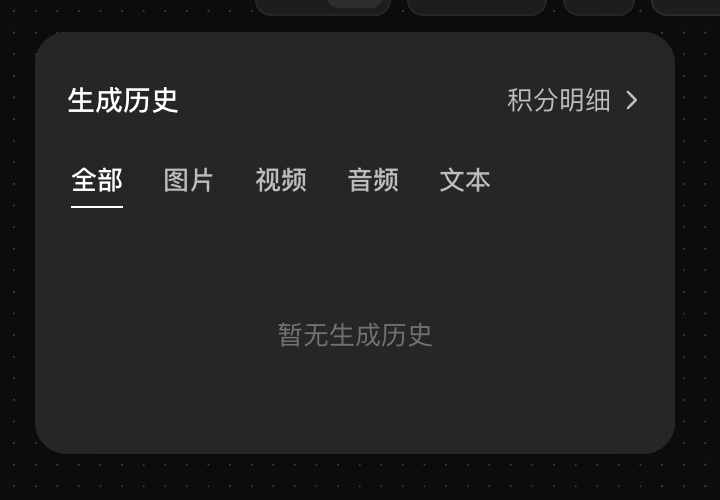

#### 「生成历史」面板的尺寸与**它不跟着窗口缩**（2026-10-05 批次 169 实测 13 档）

⚠️ **本手册此前只记了 `320×211` 这个数，没说它会不会跟着窗口变** ——
现在可以回答了：**它几乎不变**（和前面几批的模态正好相反）。
> 🔴 **订正**：原以为它会像模态那样随窗口缩 —— **不成立**；下列读数逐档为准。

| 窗口高 | 720 | 600 | 500 | 400 | 340 | 330 | **327** | 300 | 267 | 256 | 200 |
|---|---|---|---|---|---|---|---|---|---|---|---|
| 面板高 | 211 | 211 | 211 | 211 | 211 | 211 | **211** | 184 | 151 | 140 | 84 |

⇒ **面板高 = min(211, 窗口高 − 116)**，门槛在 **327**（327 恰好两条公式都给出 211）。
**宽度恒为 320**（900 / 700 窄窗口下也不缩）。

| 机制 | 逐字读数 |
|---|---|
| 面板本体 | **`[data-testid="generation-history-panel"]`**（`<SECTION>`，`320×211@801,56`）—— ⚠️ **此前全册没记过它有自己的 testid**（本节之前只记了外层 `ASIDE[canvas-feature-panel]`） |
| 计算样式 | `height: 211px`、`max-height: 100%`、`min-height: min(211px, 100%)` |
| 那个 116 | 面板顶边恒在 `y=56`，**下边另有 60 的空间留给底部 dock** ⇒ 可用高度 ＝ 窗口高 − 116 |

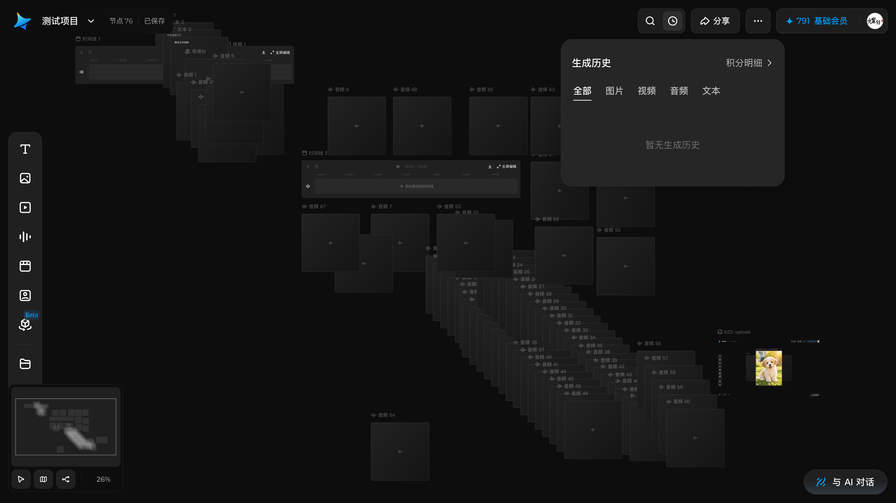

💡 **给用户的话**：窗口只要不低于 **327 高**，这个面板的大小**一动不动**；
真的把窗口压到 327 以下，它会**从底部往上收**（不是被裁掉），内容区跟着变矮。

📌 **和模态的差别要记牢**（批次 165–168 测的那几个）：
资产库 `min(801, 视口−32)`、项目信息 `min(546内容, 80vh)`、设置主体 `min(548, 视口−32)`、
帮助中心 `min(648, 视口−76)` —— **它们都随窗口缩**；
而**「生成历史」面板在 327 以上完全不动**。两类面板不要互相套用结论。

#### 🔴 「积分明细」按钮打开的是「项目信息」对话框

点那个 `68×36` 的**「积分明细」**按钮（落点现算 + `elementFromPoint` 自检命中该 `BUTTON` 自身）：

| 观测项 | 读数 |
|---|---|
| URL | **不变**（`.../ai-canvas/64b58cd5-…`）—— **不跳页** |
| 生成历史面板 | **仍然开着**，逐字一个字都没变 |
| 浮层数 | **1 → 2** |
| 新浮层 | `<DIV role="dialog" data-testid="workspace-project-info-dialog">` **`800×546@240,87`**（**1280×720 下的实测值**，原写的「契约尺寸」已推翻；规律见下方「窗口不够大时它会怎么变」——**546 不是常量**），`position:fixed`、`z-index:50`、**portal 到 `body`** |
| 新浮层逐字 | `项目信息 基础信息 积分消耗 总消耗积分 0 任务数 0 暂无数据 查看积分明细` |
| 落在哪个页签 | 直接停在 **`积分消耗`**（`基础信息` 的 `aria-selected` 是 `false`） |
| 与批次 125 的关系 | 内部 testid 仍是 **`project-consumption-summary`** —— **同一个组件、同一个 testid** |


> 🆕 **2026-10-04 批次 154 独立复现一次**（这条读数在 `SOURCE_OBSERVATIONS` §4.49
> 分诊表第 4 行挂了很久，一直标着「**需单独授权**」；本轮目标更新后授权解除，当场验成）：
> 从顶栏 `生成历史`（`data-testid="canvas-panel-launcher"`、`28×28`、点击前
> `aria-expanded="false"`）→ 面板 `320×211@797,56`、逐字「生成历史 积分明细 全部 图片 视频 音频 文本 暂无生成历史」、
> 5 个真页签各 `42×36`、判选中看 `aria-selected`（`data-state` 属性根本不存在）
> → 点标题行那个**普通 BUTTON**「积分明细」`68×36`（无 role、无 href、无 aria-label，
> 自动化只能靠 `innerText` 认）⇒ 对话框 `800×546@240,87`（**该尺寸的规律见下方「窗口不够大时它会怎么变」**）、`role="dialog"`、
> 逐字与上表**逐字相同**。**逐次按 Esc**：第 1 次关掉对话框、**生成历史面板仍在**；
> 第 2 次才关掉面板 ⇒ 「由内向外一层一层关」复现。积分 `805 → 805`。

⇒ **两个入口通向同一个对话框**：「更多」→**项目信息** 停在「基础信息」，
「生成历史」→**积分明细** 停在「积分消耗」。

### 窗口不够大时它会怎么变（2026-10-05 批次 166 实测 12 档）

🔴 **订正：本页此前把 `800×546` 当成这个对话框的「契约尺寸」记了三处 —— 那个记法过强**（原写「契约尺寸」已不成立）：
读它的 classList 会发现**它根本没有高度类名**，只有
`w-workspace-project-info`（`width: 800px`）、`max-h-[80vh]`、`max-w-[calc(100vw-32px)]`。
那个 546 是**三段固定 ＋ 一段被内容撑开**加起来的结果：

| 段 | 1280×720 实测高 | 被压缩时 |
|---|---|---|
| 标题行 `项目信息` ＋ ✕ | 68 | **不变** |
| 页签行 `基础信息 / 积分消耗` | 36 | **不变** |
| 中段滚动区（`flex: 1 1 0%`） | **382** | **先让步**（600 高时 → 316） |
| 页脚 `查看积分明细` | 60 | **不变** |
| 合计 | **546** | |

⇒ **规律**：宽 = min(800, 窗口宽 − 32)、高 = min(546, 窗口高 × 0.8)。

| 窗口 | 1280×720 | 1280×690 | 1280×680 | 1280×600 | 1280×500 | 1280×400 | 1280×300 |
|---|---|---|---|---|---|---|---|
| 对话框 | 800×546 | 800×546 | 800×544 | **800×480** | 800×400 | 800×320 | 800×240 |

| 窗口宽 | 1280 | 900 | 832 | 831 | 700 |
|---|---|---|---|---|---|
| 对话框宽 | 800 | 800 | 800 | **799** | **668** |

- 高度门槛在 **690 / 680 之间**（546 ÷ 0.8 = 682.5）：够高就是 546，再矮就按 0.8 缩。
- 宽度门槛在 **832 / 831**（800 + 32），和[资产库](assets-and-upload.md)那套 `−32` 是同一个余量。
- 💡 **给用户的话**：窗口矮的时候**先被压的是中间那段可滚动内容**，标题、页签、页脚始终留着 ——
  所以「内容看着被截断了」是正常的，往下滚就行，**不是界面坏了**。

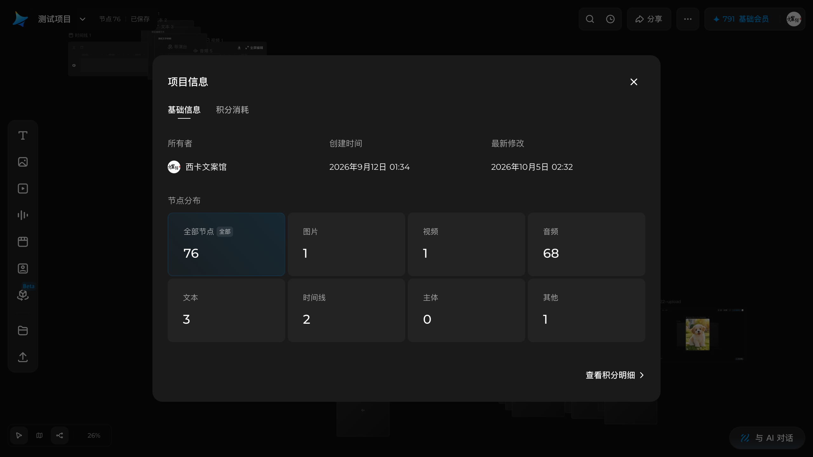

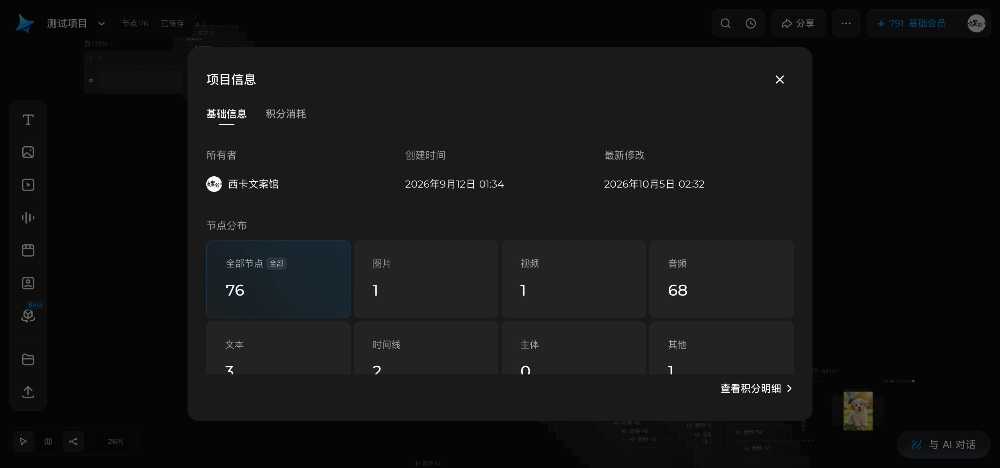

📌 **立规**：想知道「点这个按钮到底开了什么」，**读「浮层计数变了几个」比读「原面板内容变没变」可靠** ——
本例里面板内容一个字符都没动，真正的变化发生在浮层计数上。

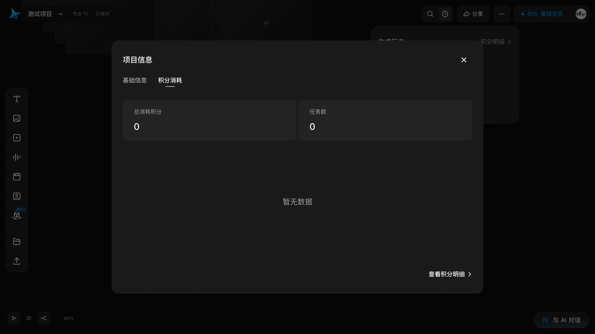

> ⚠️ **本手册点过「积分明细」，但没有点过「查看积分明细」**。
> 前者是**打开只读对话框**（实测 URL 不变、无扣费、积分读数前后都是 805）；
> 后者是 `BUTTON 94×36@922,573`、带右向箭头 ⇒ **跳走型**动作，
> 目的地很可能在积分/充值页，而**充值、订阅、积分购买不在本手册范围内**。


### 搜索节点（实测）

1. 点击顶栏 **搜索**。
2. 浮层输入框占位「搜索节点...」，下方按类型筛选（全部/图片/视频/音频/文本/
   主体/时间线/组/其他，带数量），结果按编号列出。
3. **Esc** 关闭。

> 📖 搜索的**完整操作与面板解剖**（2026-10-03 批次 127：`320×604@765,56`、
> 九个页签一行放不下、筛选不重置页签、分页条 4 个按钮、结果行 testid 带节点 id、
> 以及**它与「生成历史」是同一个面板组件**）见
> [平移、缩放与控制画布视图](navigate-canvas.md#搜索节点2026-10-01-首测--2026-10-03-批次-127-全面解剖)。

### 分享画布（2026-10-01 首测 / 2026-10-02 补尺寸）

1. 点击顶栏 **分享**（`aria="分享"`，60×28，`data-testid="canvas-share-trigger"`）
   → 右上弹出面板，标题 **分享画布**。
2. **2026-10-02 实测结构**（两层同尺寸容器）：
   - 外层 `DIV.fixed` `[data-testid="canvas-share-panel-surface"]` **400×251@868,56**；
   - 内层 `SECTION` `[data-testid="canvas-share-panel"]`，`aria` 逐字 `分享画布`，
     **400×251@868,56**；`H2` 标题 `56×22@884,75`。
3. 面板逐字（自上而下）：
   - 画布链接（**是一段文本，不是 `<input>`** —— 2026-10-02 实测面板内 `0` 个 `<input>`）
     ＋ **复制链接**（`BUTTON` **100×36@1150,122**）；
   - 🔒 **仅自己可访问 ∨**（`BUTTON` **106×26@928,172**），说明「只有你可以通过此链接访问画布」；
   - ✦ **创建团队，与成员在画布实时协作** ＋ 右侧 **创建团队**（`BUTTON` **80×36@1172,253**）。
4. ⚠️ **改权限 = 对外开放**。把「仅自己可访问」改成任何可分享的选项后，
   拿到链接的人就能打开并编辑你的画布。改之前想清楚。
5. **Esc** 或点面板外关闭。

> 🔴 **2026-10-02 批次 83 提醒**：这个面板里**有一行明文画布链接**
> （实测形如 `https://jimeng.jianying.com/…`）。
> ⇒ **本页不给分享面板配图**，否则会把你的画布链接截进图片里。
> 现有的 `../screenshots/36-share-panel.png` 是 2026-10-01 之前拍的，
> 拍摄时链接行**没有被截进去**；⚠️ **再拍时必须先裁掉链接行**。
>
> ✅ **2026-10-04 批次 157 验成「复制链接」**：点它**真的把链接写进剪贴板**
> （实测 `navigator.clipboard.readText()` 读到 **117 字**的画布 URL）。
> 反馈是**一个约 2 秒的 toast**，逐字**「已复制画布链接」**、`143×44@569,32`，
> ⚠️ **它没有 `data-testid`** —— 按 testid 找不到它；
> 另外页面上有一个**视觉隐藏的实时区** `SPAN[role=status]` `1×1@-1,719`，
> 逐字「Notifications 已复制画布链接」。
> 🔴 **点完分享面板会被关掉**（≤400ms，面板里 10 个元素同时消失）——
> 所以「反馈」不在面板里，而在另一个地方。画布本身（状态行 / 积分 / 节点数 / 浮层）**全都不变**。
>
> 🔴 **「创建团队」不是建团队，是买团队会员**（2026-10-04 批次 157 实测）：
> 点它打开的是**整屏团队会员付费页**（`1280×720`），逐字
> 「限时惊喜 积分加赠 超级年卡 …… 单年购买 4.2折 ／ 单月购买 ／
> 高级团队会员-12个月 ¥263 席位/月 ¥549 ／ 席位（可增减）／ 合计 ¥6312 ／
> **购买团队会员**」（按钮 `438×44@166,737`，**整层零 `data-testid`**）。
> ⇒ 本手册此前把这一项标成「未执行 · 属对外产出动作」，**理由是错的**：
> 它**不是对外产出，是扣费入口**。本手册**不点**「购买团队会员」、**不动**席位加减。
> 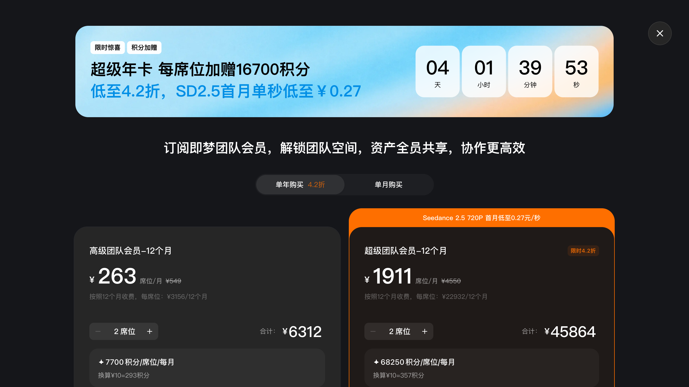
>
> ⚠️ **本手册仍不执行的两项**：
> - **改权限**（「仅自己可访问 ∨」）：这不是普通操作，是**把画布对拿到链接的人开放**。
>   画布是多人共用的；若在改回去之前会话中断，权限会**永久停在开放态**。
>   📌 **「可逆」的前置是「你一定还在场」** —— 这一条不满足，所以不碰。
> - **创建团队的提交**：理由已从「对外产出」更正为「**属扣费**」。

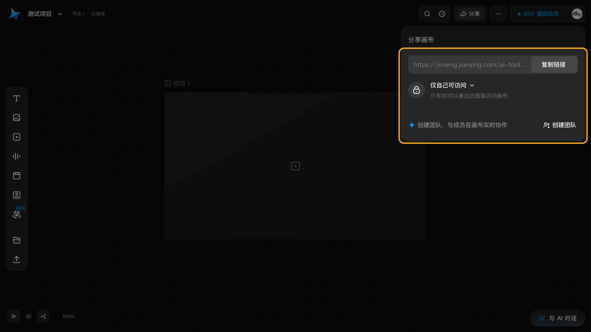

### 更多菜单（2026-10-01 实测 / 2026-10-02 复核）

1. 点击顶栏 **更多**（⋯，`aria="更多"`，28×28，**顶栏唯一没有 `data-testid` 的按钮**）
   → 弹出两项小菜单（`role="menu"`，实测 **200×84@980,56**）：
   **项目信息** ｜ **复制项目**。
2. **项目信息**：查看/编辑画布所属项目的信息。
   - 🆕 **2026-10-03 批次 124 首次把面板内容读全**（此前全册只记了「有这个菜单项」）：
     `role="dialog"` **`[data-testid="workspace-project-info-dialog"]`**、**`800×546@240,87`**（规律见下方小节），
     逐字结构：

     | 区块 | 逐字 |
     |---|---|
     | 标题 | `项目信息` |
     | 页签 | **`基础信息`** ｜ `积分消耗` |
     | ⬇️ 页签的实现 | 两个 `role="tab"` 的 **`BUTTON`**，各 **`76×36`**，在 `y=155`：`基础信息` `76×36@252,155`、`积分消耗` `76×36@328,155`。选中的那个 **`aria-selected="true"`**；两个都带 `aria-controls`（`:modern-js-r1tuj:-basic-panel` / `-credits-panel`） |
     | 基本信息 | `所有者` `西卡文案馆` ／ `创建时间` `2026年9月12日 01:34` ／ `最新修改` `2026年10月3日 09:09` |
     | **节点分布** | `全部节点` `全部 76` ｜ `图片 1` ｜ `视频 1` ｜ `音频 68` ｜ `文本 3` ｜ `时间线 2` ｜ **`主体 0`** ｜ `其他 1` |
     | 底部动作 | **`查看积分明细`**（＋ 关闭按钮，aria 逐字 `关闭项目信息`） |

   - 🆕 **2026-10-03 批次 125 补第二个页签的内容**：
     切到 **`积分消耗`** 后，`role="tabpanel"` **`800×442@240,191`**，逐字
     **`总消耗积分` `0`** ｜ **`任务数` `0`** ｜ **`暂无数据`**，
     面板内部 testid **`project-consumption-summary`**，**没有任何表格元素**
     （`table` / `[role=table]` / `[role=grid]` 计数 **0** —— 空态就是一段文字）。
     本画布没有生成记录，所以两项都是 0。
     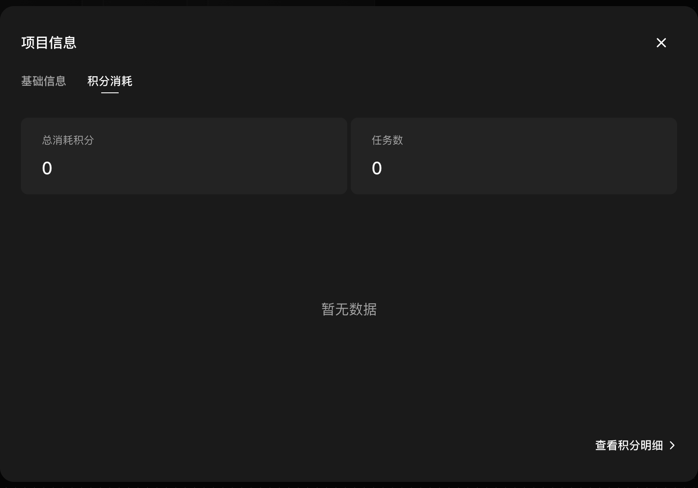
- ⛔ **`查看积分明细`**（`BUTTON` `94×36@922,573`，**无** `href` / `target` / `aria-label`）
     —— ✅ **2026-10-05 批次 161 结清：它是个**死按钮**，不是「跳走」型动作**。
     本手册此前写「界面右侧带一个**右向箭头** ⇒ 是「跳走」型动作」，
     🔴 **这条推断被实测推翻**：按下后 **14 帧 / 5.6 秒**里

     | 观测量 | 读数 |
     |---|---|
     | 是否禁用 | **否**（`disabled` 与 `aria-disabled` 均为空，按钮是可点的） |
     | URL | **全程不变** |
     | 新页签 | **没有**（始终 1 个） |
     | 「项目信息」对话框 | **一直在**（没被关掉） |
     | `[data-state=open]` 浮层 | 恒为 `workspace-project-info-dialog` ＋ 那层常驻遮罩 |
     | toast | **一个都没有** |
     | 画面 | **逐帧无变化** |

     ⇒ 📌 **「图标形状 ⇒ 动作类型」这条推断规律，第一次被实测证伪。**
     一个右向箭头**不构成**「会跳走」的证据 —— 按钮也可以只是**没接线**。
     ⇒ 也因此，「可能跳到充值页所以不点」这个理由**本来就不成立**：
     它压根不跳。**真正该记的是「它点了没用」**，而不是「它有风险」。
     探针：`scripts/jimeng-b161c.mjs`（3/3 断言通过）。

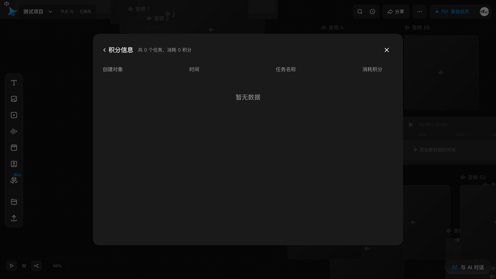


   - 🔑 **它和顶栏「节点 N」是同一份数据、两套过滤规则**：
     「节点 N」**不列 0**，「节点分布」**列 0**（今天的 `主体 0` 就是证据）。
   - 🔴 **同一个导演台节点，两处叫法不一样**：「节点 N」里叫 **`外部`**，
     「节点分布」里叫 **`其他`**。与本页已记的「导演台 aria 前缀是 `外部`」是同一条规律
     —— **产品里的分组名 ≠ 节点类型名**，两处 UI 还各叫各的。
3. **复制项目**：把整个画布复制成一份新项目。
   - ✅ **已关闭**（2026-10-04 批次 157 已实测执行）：本条此前长期挂着
     「⚠️ **未执行**：会新建一个项目副本，属对外产出动作」，**现已销账**：
     **没有确认框** —— 按下后浮层层数 **1 → 0**、页数不变、积分与节点数都不变，
     直接跳到新画布、**76 节点全拷**，副本名**递增加后缀**。
     ⚠️ 代价是它**撤不回来**（逐路排除见下一节「项目没有删除入口」）。
4. **Esc** 或点菜单外关闭。

#### 🔴 项目**没有删除入口**（2026-10-04 批次 157 逐路排除）

这是本手册实测过的**最该提前知道的一件事**，因为「复制项目」**没有确认框**：

| # | 试过的路径 | 结果 |
|---|---|---|
| ① | 项目切换器 → 行尾「更多」钮（`project-more-ordinary-<项目 uuid>`、`28×28`、aria 逐字「<项目名>的更多操作」） | 菜单**只有两项**：**「在新窗口打开」「复制项目」** —— **没有删除、没有重命名** |
| ② | 首页 `/ai-tool/home` 的「画布」区 | 逐字「全部 测试项目5 测试项目 …… 更多 积分商城」，**全页零个「删除 / 移除 / 管理 / 回收站」字样** |
| ③ | 悬停项目卡的 4 个位置（元素中心 / 卡片中心 / 卡片右上 / 元素右侧） | **新增元素数 4 次全为 0** ⇒ 没有悬停才出现的 ⋯ / ✕ |
| ④ | 点项目卡 | 不弹任何浮层 |

⇒ 📌 **在即梦画布里，复制出去的项目撤不回来。** 这不是本手册偷懒 —— 四条路都走过了。
👉 **所以：点「复制项目」之前先确认你真的要留这份副本。**

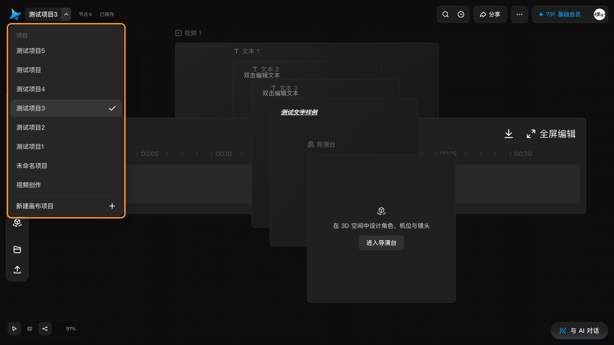

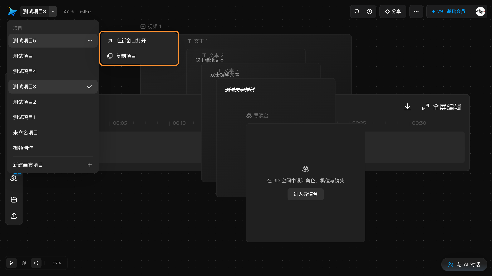

#### 🔑 怎么判断「更多菜单开没开」（批次 121/122 实测，两个坑）

| 判据 | 关闭时 | 打开时 | 能不能用 |
|---|---|---|---|
| 按钮的 `aria-expanded` | `false` | **`true`** | ✅ **可靠，就用这个** |
| 按钮的 `data-state` | `closed` | **`closed`（不变！）** | ❌ **陷阱** |
| 画布上有没有 `role="menu"` | 0 个 | 1 个 | ✅ 可用 |

- ⚠️ **`data-state` 恒为 `closed`**：菜单打开时它**一点没变**，只有 `aria-expanded`
  从 `false` 翻成 `true`。**只读 `data-state` 会永远判成「关着」。**
  按钮另有两个稳定属性可用来定位：`aria-haspopup="menu"`。
- 📌 **同一条规律的第二次印证（批次 125）**：「项目信息」面板的两个页签也是
  **只翻 `aria-selected`、没有 `data-state`** —— 实测两个 tab 的 `data-state` 是 **`null`
  （属性根本不存在）**。
  ⇒ **这一整套弹层的开关态，统一读 `aria-expanded` / `aria-selected`，别读 `data-state`。**

- ⚠️ **菜单没有 `data-testid`**，而且它由**两个同矩形的元素**组成：
  外层 portal 包装 `<DIV class="">` 与内层 `<DIV role="menu" class="z-[120] overflow-x-hidden…">`，
  **两者都是 `200×84@980,56`**。按 testid 找不到它；按矩形数元素会**多数一次**。
  ⇒ 判「菜单开没开、数它几项」都以**内层 `role="menu"`** 为准。

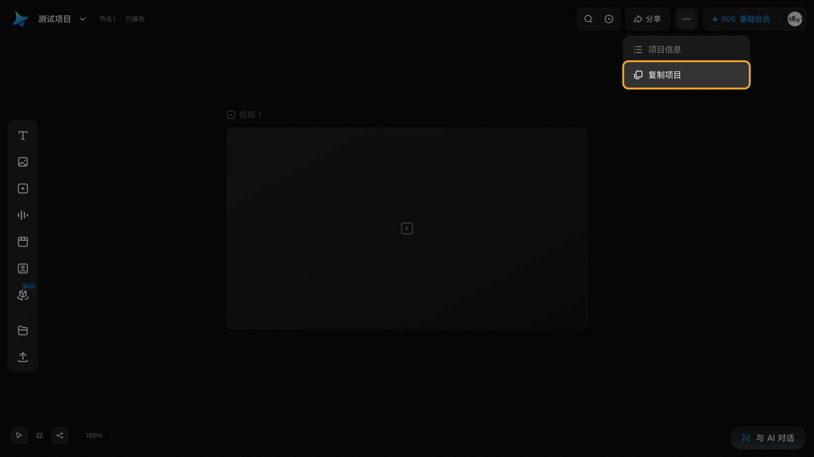

### 画布右键菜单：两种形态、四条机制（2026-10-05 批次 170 实测 30 余档）

在画布上**右键**（Mac 上是双指点击或「触控板辅助点按」）会弹出一个菜单。
它和顶栏那个「更多」菜单**不是同一个组件**（顶栏那个见上文，两层容器、无 testid）；
画布这个有 testid：**`[data-testid="canvas-context-menu"]`**，
`role="menu"`、`aria-label` 逐字 **`Canvas context menu`**、`tabindex="-1"`。

#### ① 右键到哪里，决定弹出哪一种（宽度差 40）

| 右键落点 | 尺寸 | 逐字条目 | 宽度来源 |
|---|---|---|---|
| **画布空白处** | **`240×172`** | 新建节点 · 粘贴 `⌘V` · 重做 `⌘⇧Z`（灰）· 撤销 `⌘Z` | **class 里的 `w-[240px]`** |
| **某个节点上** | **`200×292`** | 复制 `⌘C` · 复制副本 `⌘D` · 粘贴 `⌘V` · 下载 · 重做 `⌘⇧Z`（灰）· 撤销 `⌘Z` · 删除 `⌫` | **内联 style 的 `width: 200px`** |

🔴 **宽度是每种菜单各自定死的，不随文字长短变**（批次 55 已记的「200×292 七项」就是右边这一种）。
而且**两档宽度的写法不一样**：空白那种写在 class 里（`w-[240px]`，
另带 `data-context-menu-size="wide"`），节点那种**没有宽度类**，
宽度是 JS 写进**内联 style** 的（`data-context-menu-size="medium"`）。
⇒ **在源站样式表里搜不到 200** —— 本批 grep 全文，`octo-context-menu` 相关规则只有 3 条，**一条宽度都没有**。

📌 另有一个 `data-context-menu-scrollable` 属性：空白那种是 `false`，节点那种是 `true`
（就是「超高时可以滚动」的那个开关）。

#### ② 高度是**按条目累加**的，不是两个孤立数字

```
高度 = 8 ＋ Σ(每个直接子元素的高) ＋ 4 ×(直接子元素个数 − 1)
        ↑上下内边距各 4    ↑每条菜单项 36、每条分隔线 4   ↑条目之间的间隙
```

| 菜单 | 直接子元素 | 算出来 | 实测 |
|---|---|---|---|
| 空白处 | 4 项 + 1 分隔线 = 36×4 + 4 | `8 + 148 + 20` | **172** ✅ |
| 节点上 | 7 项 + 1 分隔线 = 36×7 + 4 | `8 + 256 + 28` | **292** ✅ |

机制逐字：菜单根 `padding: 4px`，内部一个 `class="flex w-full flex-col gap-[4px]"` 的列表，
每个条目 `class` 里含 **`h-9`**（＝36px）、`px-4 py-1`、`text-[13px] leading-[22px]`、`rounded-[8px]`。
👉 **想知道自己会拿到多高的菜单，数一下有几条、有几条分隔线就行。**

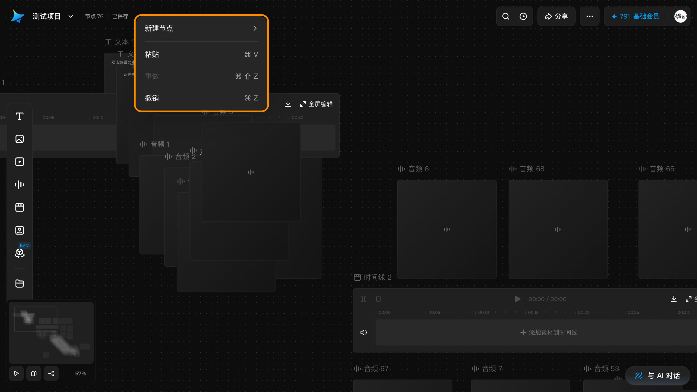

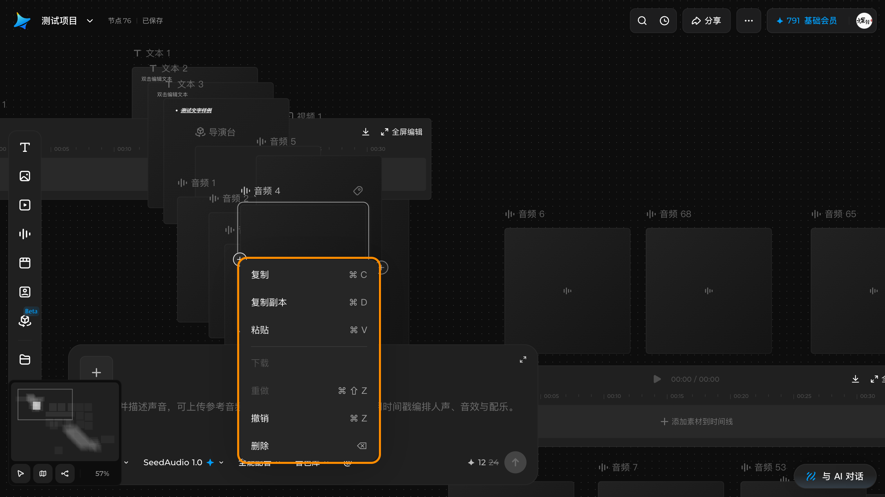

#### ③ 它总在鼠标右下角；贴到边就翻面，而且**离屏幕边永远留 8px**

不是「大致在鼠标附近」——是一条能算的规则（本批在 8 个锚点上逐一核对，**8/8 全中**）：

```
左边 = min(鼠标 x, 屏幕宽 − 8 − 菜单宽)
上边 = min(鼠标 y, 屏幕高 − 8 − 菜单高)
```

例：在 (1230, 640) 右键一个 200×292 的菜单 ⇒ 右边放不下 ⇒ 翻到
`left = 1280 − 8 − 200 = 1072`、`top = 720 − 8 − 292 = 420`。
👉 **所以菜单永远不会贴着屏幕边缘，也永远不会被切掉。**

#### ④ 屏幕太窄/太矮时，它会被压到「屏幕 − 16px」

菜单 class 里逐字写着 **`max-w-[calc(100vw_-_16px)] max-h-[calc(100vh_-_16px)]`**。
⇒ **210 宽的屏幕里，240 宽的菜单会被压成 194。** 实测：

| 屏幕宽 | 256 | 250 | 220 | 210 | 200 | 1280 |
|---|---|---|---|---|---|---|
| 空白菜单宽 | 240 | **234** | **204** | **194** | **184** | 240 |
| 屏幕−16 | 240 | 234 | 204 | 194 | 184 | 1264 |

⇒ **夹取门槛恰好是 `菜单宽 + 16 = 256`**：屏幕 ≥ 256 就不动，一像素窄就被夹。
高度同理（实测 200×200 的屏幕里菜单被压成 `184×184`）。
👉 **这一族浮层的「余量 16」和对话框那族的「余量 32」不是一回事**，详见 [参考页的余量普查](../20-reference.md#浮层尺寸的视口余量普查批次-170-静态-css-全文)。

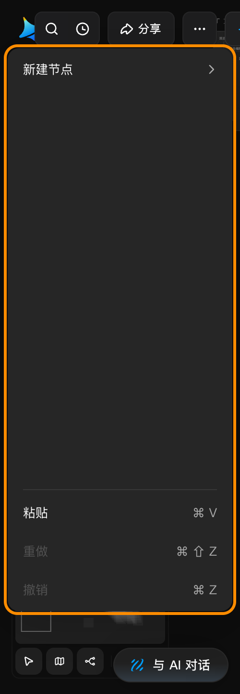

#### ⑤「新建节点」那一项带一个二级菜单，窗口窄了它会整个塌进主菜单里

空白处右键菜单的第一项 **新建节点** 还有一个二级列表，鼠标**停上去**才展开，
逐字是 **文本 / 图片 / 视频 / 音频 / 时间线 / 主体 / 导演台 / 从资产库添加 / 本地上传**（9 项），
展开后 **`212×404`**。

📌 **它的摆放规则是三选一**（本批在 6 个「屏幕宽 × 右键位置」的组合上逐一核对，**6/6 全对**）：

| 条件 | 二级菜单怎么放 |
|---|---|
| 菜单**右边**的空间 ≥ 212 | 从菜单**右侧**飞出（贴在菜单右边，顶部对齐） |
| 右边不够，但菜单**左边**的空间 ≥ 212 | 翻到菜单**左侧**飞出 |
| **两侧都不够** | ⚠️ **改成在主菜单里就地展开** |

⚠️ **最后一行是本批挖到的真问题**：两侧都放不下时（例如屏幕 640 像素宽、
在 x=200 处右键），二级菜单**不再飞出，而是整个塞进主菜单里** ——
主菜单因此从 `172` 高**涨到 584 高**，中间多出 **404 像素的一块空区**：
那一块**既看不见、也点不开**，「新建节点」就等于失效了。
📌 **这不是屏幕宽度的单一函数**：同一个 640 宽的屏幕，
在 x=120 处右键二级菜单**正常飞出**（右边有 280），在 x=200 处就**塌了**（两边各剩 200）。
👉 **同一块屏幕上，右键的位置不同会得到不同的结果。**

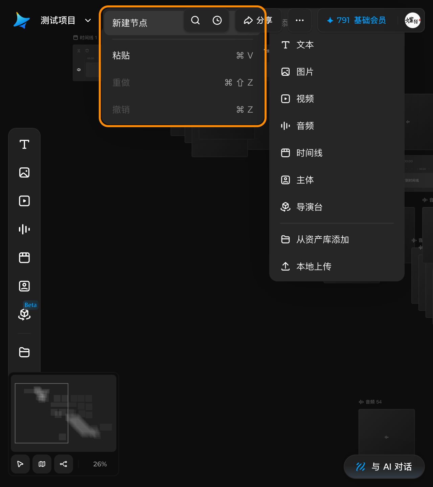

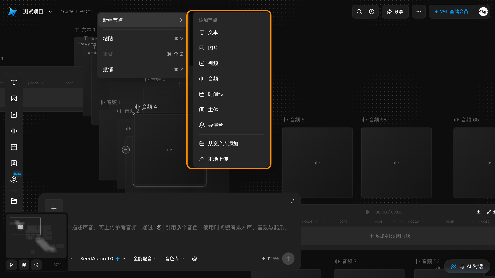

#### 🔑 怎么关掉它

| 做法 | 管不管用 |
|---|---|
| **点菜单以外的画布** | ✅ **管用**（本批实测：点空白后菜单消失） |
| 按 **Esc** | ✅ 管用 |
| **鼠标移开** | ❌ **不管用** —— 菜单**原地不动**（本批实测） |

⚠️ **注意它会挡路**：菜单开着时，它正下方那一整块画布**点不动**。
本批实测一个 `200×316` 的菜单盖住了一个 `182×182` 的节点，
`document.elementFromPoint` 在节点中心命中的是**菜单而不是节点** ——
连点三次，节点始终是「0 选中」。
👉 **菜单挡住的地方点不动是正常的，不是节点坏了**：先点别处（或按 Esc）把菜单关掉。

### 确认保存状态

- 顶栏 **已保存** 常驻显示保存状态；改动后自动保存。
- **内容跨刷新持久**（实测）：刷新页面后节点与连线完好。

> 🔴 **本节原先只有上面这两行。** 2026-10-05 批次 174 把下面这些补齐了 ——
> **「已保存」这三个字到底指什么、刷新到底会带走什么、断网时它靠不靠谱**，
> 原先一个字都没答，而这恰恰是「我的画布会不会丢」这个问题的全部。

#### 1. 「已保存」是什么：它是标签，不是按钮

| 项 | 实测值（1280×720，2026-10-05） |
|---|---|
| 元素 | `OUTPUT[data-testid="canvas-title-save-status"]` |
| 尺寸 | **`30×18@206,21`** |
| 文字 | 逐字 `已保存` |
| `aria-live` | **`polite`**（有变化时读屏软件会播报） |
| 可点吗 | ❌ 不是 `BUTTON`、无 `role=button`、`cursor: auto`、**点了没反应** |
| 左边挨着 | `canvas-title-separator`（`8×12@194,24`）与「节点 76」 |
| 右边 | 空白，一直到「项目」按钮才结束 |


> 📌 **所以别去点它**：它在「节点 76」右边、字号很浅，看着像按钮。
> 想知道画布里有多少东西，看它左边的「节点 N」；想知道存没存上，只能看这三个字。

#### 2. 「已保存」只有这一个态，没有「保存中」

批次 174 做过一次**高频采样**：把画布改名（`测试项目` → `测试项目t`），
从落笔前开始每 **30 ms** 读一次保存指示器，**6 秒内 197 个采样点，
逐字全部是「已保存」，一个中间态都没撞到**（见 [SOURCE_OBSERVATIONS §4.97.3](../SOURCE_OBSERVATIONS.md)）。

⇒ **不要等「已保存」变一变再刷新**：它不变。
⇒ 反过来说，**「它还显示已保存」并不能证明你刚才的改动存上了**（见下面第 4 条）。

#### 3. 刷新会带走什么：一张对账表

批次 174 造了一个受控前置态（缩放 50%、平移过、选中一个节点、开着「节点 76」浮层），
刷新一次，前后逐项对账。**结论分三类**：

| 类别 | 具体项 | 为什么 |
|---|---|---|
| ✅ **保住（服务端）** | 节点、连线、**每个节点的坐标**、节点标题、画布名、顶栏节点计数 | 43 个 `localStorage` 键里**没有任何一个装画布内容** ⇒ 内容只在服务端 |
| ✅ **保住（本机记忆）** | 小地图开关、连线显示 | 存在 `localStorage` 的 `canvas-display` 键里，刷新照读 |
| ❌ **被刷新带走** | **缩放与平移**、选中态、已打开的浮层 | 都是内存态，没有任何键存它们 |

三条要记住的：

- **你摆好的视角不会保留。** 刷新后画布会**自动缩放到「装得下全部节点」**：
  本次 76 个节点、1280×720 视口下稳定落在 **26%**，
  节点包围盒占视口 **83.2%（宽）× 91.1%（高）**，四边余量 `108 / 108 / 32 / 32`。
  **连做 3 次逐字相同**（每次刷新前都先把视口改乱成 `translate(400px,300px) scale(1.2)`），
  所以这是**内容决定的确定值**，不是碰巧。
- **刷新后没有「选中」**：节点还在，但不会被高亮选中，得重新点。
- **「撤销历史」同样不跨刷新**（另见 [duplicate-delete-history](duplicate-delete-history.md)）。

#### 4. 🔴 断网时：「已保存」是**假 reassurance**，改动**根本没进去**

批次 174 用 CDP 把浏览器**断网**（`navigator.onLine === false`）后改画布名：

| 项 | 实测 |
|---|---|
| 改名成不成立 | ❌ **不成立** —— 界面回弹成原名 `测试项目`，aria 也逐字回原名 |
| 顶栏保存指示器 | **一直是「已保存」**（断网期间 7.7 秒、63 次采样，**一字未变**） |
| 有没有「保存失败 / 重试 / 离线」提示 | **没有**。全页扫「失败 / 重试 / 离线 / 未保存 / 网络异常 / 稍后」**零命中** |
| 唯一变化的信号 | 画布状态行从 `Room connected` 变成 **`Reconnecting to room.`** |
| 这个信号看得见吗 | ❌ **看不见**。状态行是标准 **sr-only**：`1×1`、`position:absolute`、`clip:rect(0px,0px,0px,0px)`、`white-space:nowrap` —— **只有读屏软件读得到** |
| 恢复网络后 | 自动回到 `Room connected`，**不会补交**那次改名 |

👉 **能做的只有一件事：改完刷新一下，看名字是不是真的变了。**
视觉用户在断网期间**得不到任何提示** —— 这不是本手册没写，是页面上确实没有。

> 📌 同批还否掉了一个自己的推断：页面上有个 `canvas-save-failure-anchor`
> （保存失败锚点），看上去就是「保存失败提示」的宿主。
> 实测它是 **`0×0`、零子元素、零内文、`pointer-events:none` 的定位锚**，
> **在断网全程里它一次也没长出子元素** ⇒ **「存在保存失败提示」这个推断不成立**。
> （**看见 testid ≠ 那个功能存在** —— 见立规 47。）

### 「发现离线编辑」提示（处理原则）

断网期间做过修改、恢复联网后重开页面时，可能出现「发现离线编辑」对话框
（正文：你在离线状态下对当前画布做了修改，这些修改尚未同步到服务器。）：
- **保留并同步**：把本地修改同步上去（一般选这个）；
- **丢弃修改**：放弃离线期间的本地修改（不可恢复，慎点）。
（对话框文案来自真实观察记录；两种选择的后果以产品实际行为为准，慎用丢弃。）

> 🔴 **批次 174 的实测给这一节加了一条范围限定**：断网时改**画布名**，
> 改动**连本地都没进**（直接回弹），所以**这条路径上并没有「离线修改待同步」**。
> 哪些改动会进离线队列（拖节点？改文本？）、回网后弹不弹这个框，**本批没有测到**，
> 如实记为**未取证** —— 上面这段仍按原来的「可能」保留，不要当成必然。

## 常见错误与恢复

| 现象 | 处理 |
|---|---|
| 找不到某个节点 | 顶栏 **搜索** → 输入名称/类型筛选 |
| 怀疑改动没保存 | 看顶栏「已保存」；必要时刷新核对（内容会持久） |
| 不小心把画布分享出去了 | 顶栏 **分享** → 把权限改回 **仅自己可访问** |
| 想知道画布属于哪个项目 | 顶栏 **更多**（⋯）→ **项目信息** |
| 右键菜单开着，底下那块画布点不动 | 正常现象：菜单挡在前面。**点别处**或按 **Esc** 关掉它 |
| 鼠标移开了，菜单还在 | 正常：右键菜单**不随鼠标移开而消失**。**原写「只有 Esc 能关」已订正** —— 还能**点菜单以外的画布**关掉它 |
| 窄窗口里右键菜单里有一大块空白、「新建节点」点不开 | 见上文第 ⑤ 条：二级菜单在两侧都放不下时会**塌进主菜单**。**把窗口拉宽**即可 |

## 相关任务

[平移缩放与视图](navigate-canvas.md) ｜ [帮助与快捷键](help-and-shortcuts.md)

## 已验证说明

生成历史与搜索浮层逐字、保存状态、内容跨刷新持久为 2026-09-23 实测。
**2026-10-01 补测**：标题重命名完成完整闭环（改名 → 提交 → 改回 → 提交还原）；
**分享画布**面板逐字（复制链接 / 仅自己可访问 / 创建团队）与**更多**菜单
（项目信息 / 复制项目）均已打开取证——
🔴 **2026-10-05 批次 164 订正：下面那句「四项都没点」的清单已经过期**，
其中**三项**早已在批次 157 验过（还有第四项在批次 161 结清）：

| 项 | 原文写的状态 | 实际 |
|---|---|---|
| **复制链接** | 未点 | ✅ **已点**（批次 157）：剪贴板读到 **117 字** URL；toast 逐字「**已复制画布链接**」`143×44@569,32`、**无 `data-testid`**、约 **2 秒**；🔴 分享面板 **≤400ms** 被点掉；画布状态全不变 |
| **创建团队** | 未点，「属对外产出动作」 | ✅ **已点**（批次 157），🔴 **但理由是错的**：它不是建团队，是整屏**团队会员购买页**（逐字「高级团队会员-12个月 ¥263 席位/月 …… 合计 ¥6312」，「**购买团队会员**」`438×44@166,737`，**整层零 testid**）⇒ 应归「**属扣费**」 |
| **复制项目** | 未点 | ✅ **已点**（批次 157）：**没有确认框**，76 节点全拷、副本名递增加后缀；⚠️ 撤不回来 |
| **改权限** | 未点 | ⛔ **仍然不点，这条不销账**（原文那份「四项都没点」的清单已**作废**）—— 会把共享画布对外开放，且「可逆」的前置是「你一定还在场」，本项目**不满足**（立规 20） |

「项目信息」面板 ✅ **已展开**（批次 124 读全、批次 161 二次核）：
`role="dialog"` **`800×546@240,87`**（规律见下方小节）、`[data-testid="workspace-project-info-dialog"]`，
两个页签 `基础信息` ｜ `积分消耗`；后者 `role="tabpanel"` **`800×442@240,191`**，
逐字 `总消耗积分 0 ｜ 任务数 0 ｜ 暂无数据 ｜ 查看积分明细`
—— 🔴 而那个「查看积分明细」**是死按钮**，按下无跳转、无提示、无新页签（批次 161 实测）。
离线对话框仍为历史观察 + 处理原则。

**2026-10-01 批次 55：右键菜单「下载」的禁用条件做实（关闭长期疑问）**

🔴 **2026-10-05 批次 170 补一句范围限定**：上表两行都是**在节点上右键**的那一种菜单
（`200` 宽、内联定尺）。**在画布空白处右键弹的是另一种**：`240×172`、四项、
宽度来自 class `w-[240px]`，**根本不含「下载」**。
⇒ 🔴 **原写**只把「右键菜单 200 宽」记成一种，容易让人以为右键菜单宽度恒为 200。完整两态见上方「画布右键菜单」整节。

| 节点 | 菜单 | 项数 | 菜单里的「下载」 | 原因文案 |
|---|---|---|---|---|
| **空视频节点** | 200×292 | **7** | `aria-disabled="true"`、`cursor: not-allowed` | **「没有可用的就绪资源」** |
| **带内容的图片节点** | 200×372 | **9** | `aria-disabled` 无、`cursor: pointer` | **无** |

- 「下载」项的 DOM 逐字（空节点时）：
  `<span data-context-menu-label="true">下载</span>`
  `<span class="sr-only" id="context-menu-disabled-download">没有可用的就绪资源</span>`
  ⇒ 原因文案是 **`sr-only` 隐藏文本**（给读屏软件播报，**肉眼看不着**）。
- ✅ **判据就是「这个节点有没有已就绪的媒体资源」** —— 有内容可用、无内容禁用。
- ⚠️ **别和工具条上的「下载」搞混**：那是**另一个按钮**，
  批次 51 实测它**任何时候都不带** `aria-disabled`，也没有这句文案。

**2026-10-01 批次 11 补测（两个此前只列在顶栏、从未解释的入口）**：

- **「项目」= 项目切换器**：`canvas-project-panel-popover`（aria `Project panel`）
  实测 ~~**240×200**~~（🔴 批次 83 订正：那是内层 `<nav>`，面板本体是 `240×280@12,52`），
  列出本账号的其他画布项目（~~本次三项~~ **批次 83 订正：2026-10-02 实测为五项**，多出的两项是别的会话在这块共享画布上新建的），
  ~~各 232×36~~（🔴 批次 83 订正：`232×36` 是「新建画布项目」那一行，项目行是 `198×36`）＋「新建画布项目」。**未点任何项目、未点新建**，
  Esc 可关闭，关闭后 URL 未变。
- **「节点 N」= 类型汇总**：`canvas-node-summary-popover`（`role="dialog"`）
  实测 **200×92**，两行：类型行（名称 + 类型小标签，aria `Canvas node summary`）
  与 **查看项目信息**。Esc 可关闭。
- **订正生成历史页签**：原文只写「全部 / 图片 / 视频 / 音频」，
  实测**二级页签有五个**（多一个 **文本**），且面板~~还有**一级页签两个**：
  **生成历史 ｜ 积分明细**~~（🔴 **批次 126 订正：所谓「一级页签」并不存在**——
  那两样是标题行里的 `H2`「生成历史」和一个**没有 `role` 的普通按钮**「积分明细」；
  全面板 `role="tab"` 只有 5 个、`role="tablist"` 只有 1 个。
  那个「积分明细」按钮点开的是**「项目信息」对话框**并直接落在「积分消耗」页签）。
  空态逐字「暂无生成历史」。
  `data-testid="canvas-feature-panel"`。

**2026-10-02 批次 83：把这一页的六个面板全部按 20 节点的画布重测一遍**

起因：这一页停在**批次 55**，六个面板的尺寸全部测于 **2026-09-23**——
**当时画布上只有 1 个节点**。凡是「按节点类型逐行展开」的面板，尺寸必然已经变了。

| 面板 | 旧读数 | 2026-10-02 实测 | 判定 |
|---|---|---|---|
| 节点 N | `200×92` / 两行 | **`200×292@73,47`** / 七行 | 🔴 **已过时**，并推出高度公式 |
| 项目 | `240×200` / 三项 / 行 `232×36` | **`240×280@12,52`** / **五项** / 行 **`198×36`** | 🔴 **三处都过时或量错对象** |
| 分享 | 未记尺寸 | **`400×251@868,56`**（两层容器） | ✅ 补齐 |
| 生成历史 | `320×211` | `320×211@797,56` | ✅ **未变** |
| 更多 | `200×84` | `200×84@980,56` | ✅ **未变** |
| 顶栏 | 12 项连续 | **左右两段**（`871` + `24` 间隙 + `361`）/**10 个可点** | 🔴 **「标记色」已消失** |

- ✅ 逐字全部一致：节点汇总六行、项目五行、分享面板七行、生成历史~~两级页签~~更多两项。
  （🔴 批次 126 订正：「生成历史两级页签」这个说法已作废——只有**一层** `role="tablist"` 与 5 个 `role="tab"`。
  `320×211@797,56` 本批复测**仍然一致**。）

- 🔴 新钉下四条 testid：`canvas-top-bar-left`（871×40@12,10）、
  `canvas-top-bar-actions`（361×40@907,10）、`canvas-title-save-status`（`<OUTPUT>`，「已保存」不是按钮）、
  `canvas-agent-history-surface`（68×36@907,12）；
  另 `project-more-ordinary-<项目 uuid>`（每行 28×28，**testid 里带 UUID**）。
- ⛔ **未执行**：未点任何项目名、未点「新建画布项目」、未点「复制链接」、
  未改权限、未点「创建团队」、未点「复制项目」。六个面板**只打开看，一项都没执行**。
- ⚠️ 自伤：按 `aria-label` 用**子串包含**点顶栏按钮时，
  「项目」命中的是 `Canvas title: 测试项目`（画布标题）而不是项目切换器，
  面板压根没打开；**必须精确匹配 aria**。

## 步骤图

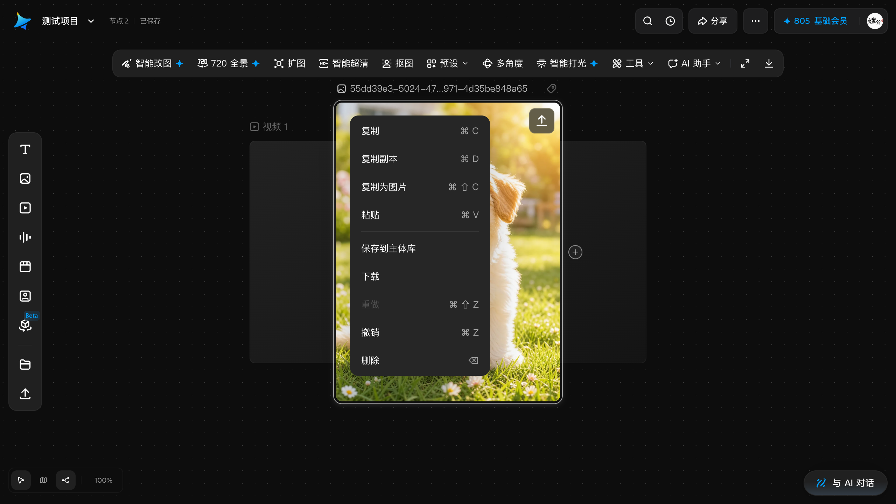
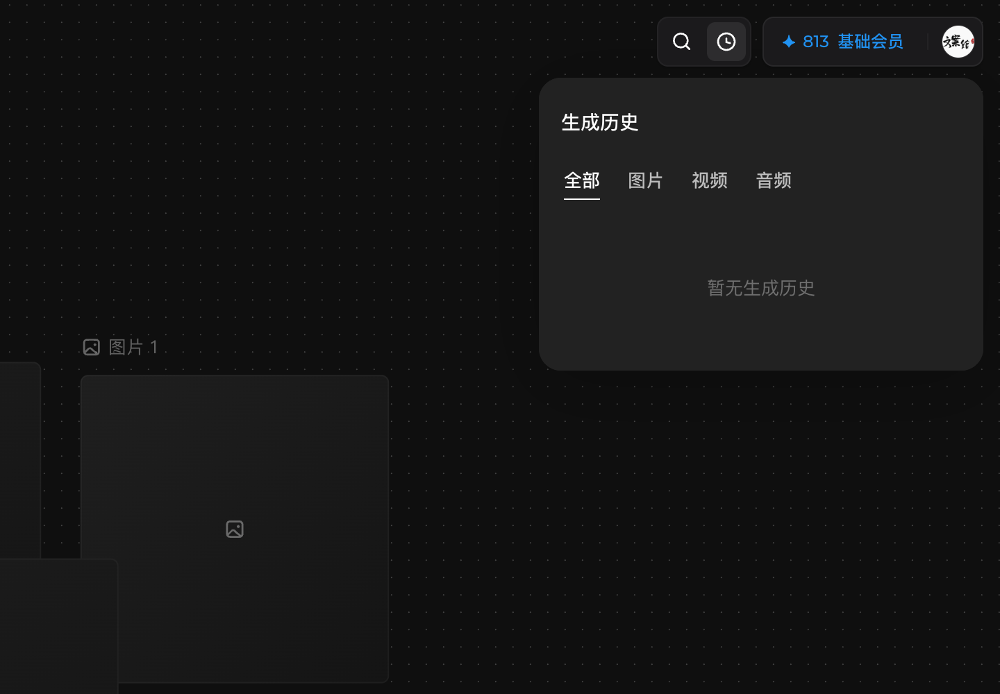

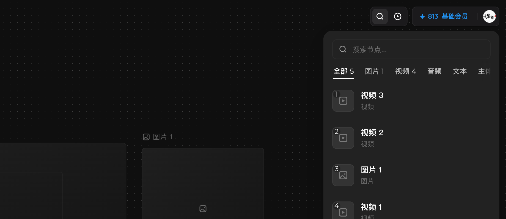
