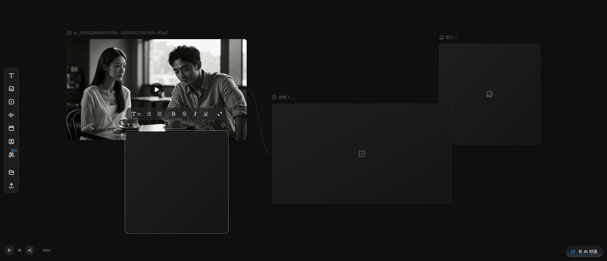

# 连接节点（参考连线）

## 适用角色

已登录的即梦画布创作者。

## 目标

把参考内容（如参考视频、参考图）连到生成节点上，建立「参考 → 生成」的创作关系。

## 前置条件

- 画布中至少有两个节点（如一个带内容的视频节点和一个空视频节点）。
- 目标节点类型允许被连接（见下方「连接规则」）。

## 入口

- 节点左右边缘的 **+**/连接热区（悬停节点时出现，约 60×120 热区）。

## 原子步骤

### 建立连线（实测）

1. 在源节点（参考内容方）边缘按下鼠标左键。
2. 拖到目标节点上松开。
3. 结果：两节点间出现一条连线；状态行由 `0 edges` 变为 `1 edge`。
   - 成功判据：状态行 edges 计数加一；目标节点生成面板出现参考 chip
     （显示参考名与时长，如「Reference material: …, duration 6s」）。
- **方向语义**：连线 = 参考 → 生成目标。从有内容的节点拖向空节点，空节点即把
  对方当作参考。
- **取消**：拖拽过程中在空白处松开即取消建线（未逐帧验证，以实测为准）。

### 连接规则（实测）

- 连接可行性按**源节点类型**在 + 菜单中标注：
  - 从视频节点出发：文本/图片/音频/导演台 标「无法连接这些节点」（禁用）；
    视频/时间线/主体可连。
  - 从图片节点出发：文本 标「无法连接这些节点」。
- 时间线项可能显示「素材信息仍在加载中，请稍后重试。」；主体可能显示
  「没有可用的就绪资源」——均为临时状态，稍后重试。

### 选中与删除（实测）

1. 直接点击连线本体 → 连线选中（无节点选中但状态行显示 `1 selected`）。
2. 按 **⌫** 删除 → 连线消失（`1 edge`→`0 edges`）。
3. **⌘Z** 恢复被删连线（实测生效）。
   - 成功判据：edges 计数按操作逐次变化。

### 参考的处理态

- 建线后，目标节点面板的参考 chip 先显示「正在处理上传内容…」，处理完成后变为
  就绪（Reference image ready），此后「生成」按钮才会可用（有参考即视为有效输入）。
- 移除参考：点击参考 chip 上的移除钮（aria `Remove …`）。

## 常见错误与恢复

| 现象 | 原因 | 处理 |
|---|---|---|
| + 菜单里目标类型是灰的 | 源类型与目标类型不可连 | 换允许的类型（如视频→视频）或换连接方向 |
| 连上了但「生成」不可用 | 参考仍在处理中 | 等待 chip 变为就绪 |

## 相关任务

[创建节点](create-first-node.md) ｜ [准备生成](prepare-generation.md) ｜
[复制、删除与撤销](duplicate-delete-history.md)

## 已验证说明

建线、连线选中、⌫ 删除、⌘Z 恢复、+ 菜单自动连线、连接可行性标注均为
2026-09-23 实测；连线在画布上以曲线绘制，同时存在可点击命中的边元素
（aria 为「Reference connection from … to …」）。

## 步骤图

