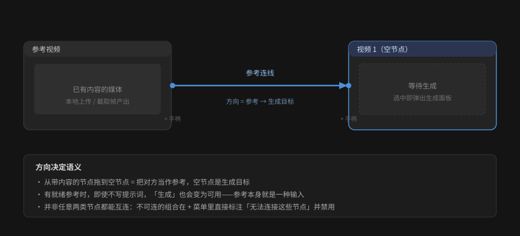
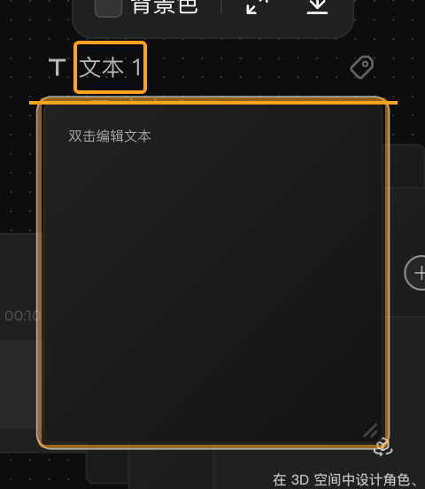
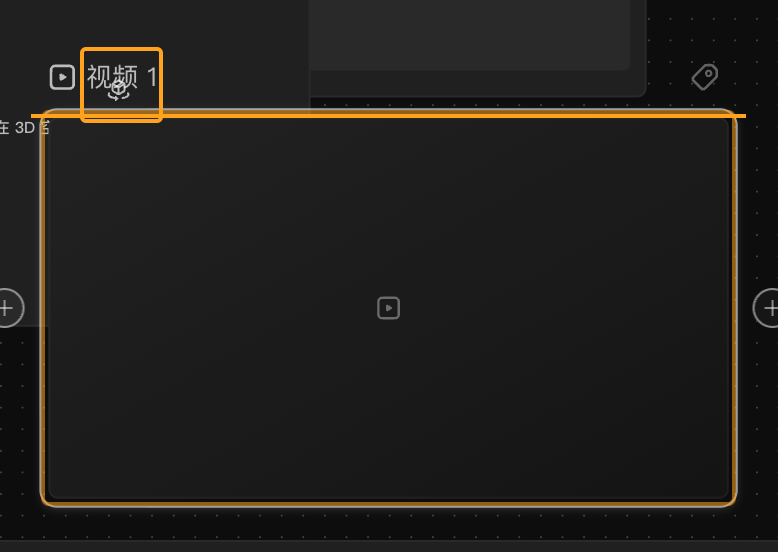
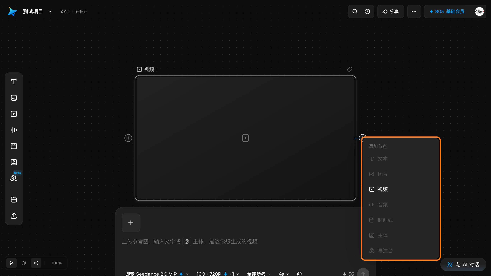
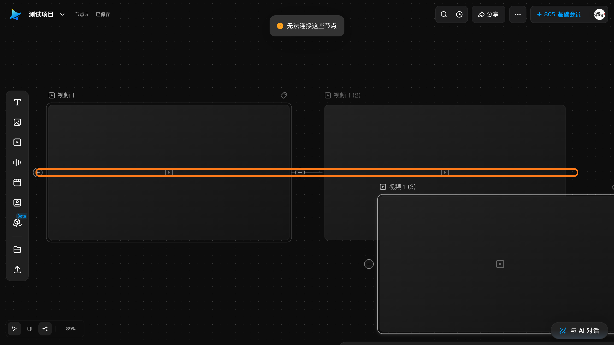
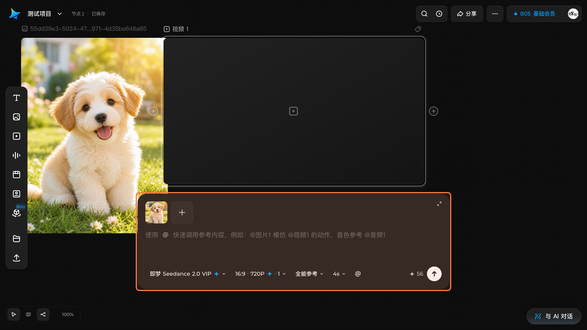
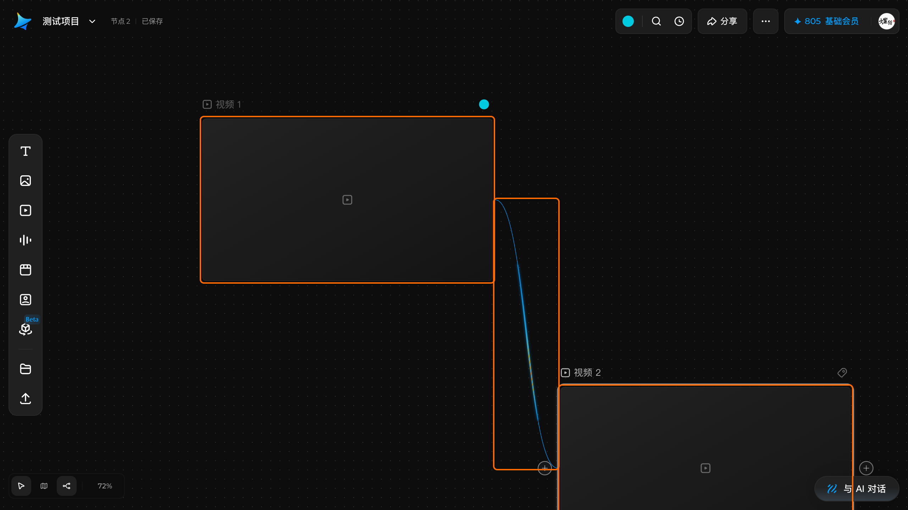
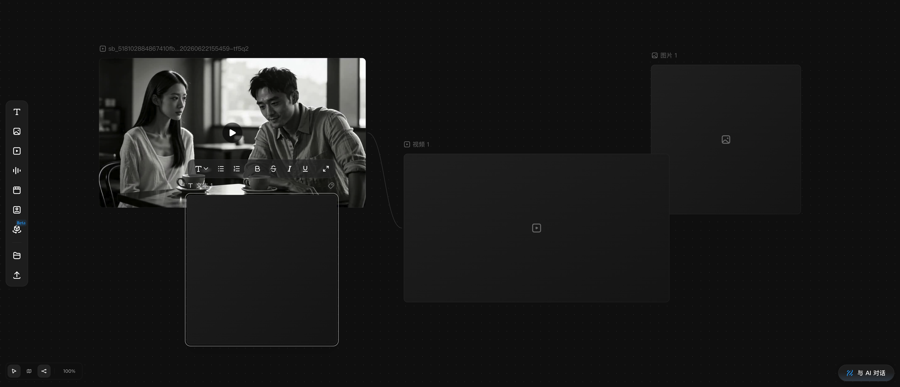

# 连接节点（参考连线）

## 适用角色

已登录的即梦画布创作者。

## 目标

把参考内容（如参考视频、参考图）连到生成节点上，建立「参考 → 生成」的创作关系。

## 前置条件

- 画布中至少有两个节点（如一个带内容的视频节点和一个空视频节点）。
- 目标节点类型允许被连接（见下方「连接规则」）。

## 入口

- 节点左右边缘的 **+**/连接热区（悬停节点时出现，约 60×120 热区）。

## 连线方向示意



## 原子步骤

### 建立连线（2026-10-01 用现有节点重测）

1. 源节点（参考内容方）**右缘**与目标节点**左缘**各有一个连接手柄
   （DOM `.react-flow__handle`）。它是**竖长热区**而非小圆点，实测约 **44×88**；
   该尺寸**随画布缩放变化**（72% 缩放下量得 43×87），不要把它当固定契约。
   手柄平时 `opacity-0`，**悬停或节点被选中时才显形**为圆形 **＋**。
2. 在源节点的右侧手柄上按下鼠标左键 → 拖到目标节点的左侧手柄上松开。
   - 判别左右的可靠依据是 class 里的整词 `react-flow__handle-left` /
     `react-flow__handle-right`，或角色词 `source`（右侧）/ `target`（左侧）——
     后者更稳，因为左右两侧手柄的 class 里还带着几十个 Tailwind 工具类。
3. 结果：两节点间出现一条**蓝色曲线**；状态行由 `0 edges` 变为 `1 edge`。
   - 成功判据：状态行 edges 计数加一；DOM 出现可点击命中的边元素，
     其 **aria 逐字**为
     `Reference connection from 视频 node: 视频 1 to 视频 node: 视频 2`
     —— 方向信息在 aria 里是明确写出来的。
- **方向语义**：连线 = 参考 → 生成目标。从有内容的节点拖向空节点，空节点即把
  对方当作参考。
- **取消（2026-10-01 已实测）**：从手柄按下后拖到**画布空白处**（`.react-flow__pane`）
  松开，即取消建线 —— 实测松开后 `.react-flow__edge` 元素数仍为 **0**，
  状态行保持 `0 edges`，不会出现「连到空气」的悬空线。
  ⚠️ 但这次拖拽会让**源节点变成选中态**（状态行末位出现 `1 selected`），
  这是拖拽的副作用，不代表连线成功。

### 打开「添加节点」菜单的入口（2026-10-01 批次 28 实测）

菜单有两个入口，**都会打开同一个菜单**（`data-testid="canvas-context-menu"`、
`role="menu"`，实测 **200×316**）：

1. **选中节点后，点它左右两侧的圆形 ⊕ 按钮**
   （左右各 **36×36**，aria 逐字
   **`Create connected node before 视频 1`** /
   **`Create connected node after 视频 1`**；
   testid `flow-node-target-connection-menu-button` /
   `flow-node-source-connection-menu-button`）。**这两个按钮只在选中时出现。**
2. 从节点手柄拖到空白处松手后再点 + 菜单（批次 22 的老路径）。

> ⚠️ **别在选中状态下去找连线手柄**：实测选中时
> `.react-flow__handle` 的 `pointer-events` 是 **`none`** ——
> 左右中点被这两个 36×36 的 ⊕ 按钮接管了。**要点 ⊕ 才有菜单。**
> 这也解释了「切到抓手工具、起点落在节点上却拖不动画布」的现象：
> 那个落点被 ⊕ 按钮吃掉了。

### 连接规则（2026-10-01 批次 28 逐项重测，**订正旧结论**）

菜单七项标题为「添加节点」，**每项下面都会附一句原因**。
判据用**文字颜色**即可（DOM 级）：可用 = `rgb(255, 255, 255)`，
禁用 = **`rgba(255, 255, 255, 0.2)`**。

**从视频节点出发**（实测 200×316 @ (945,360)）：

| 菜单项 | 状态 | 逐字原因 |
|---|---|---|
| 文本 | 🔘 禁用 | 无法连接这些节点 |
| 图片 | 🔘 禁用 | 无法连接这些节点 |
| **视频** | ✅ **可用** | —（无原因文案） |
| 音频 | 🔘 禁用 | 无法连接这些节点 |
| 时间线 | 🔘 禁用 | **素材信息仍在加载中，请稍后重试。** |
| 主体 | 🔘 禁用 | **没有可用的就绪资源** |
| 导演台 | 🔘 禁用 | 无法连接这些节点 |

🔴 **订正**：本手册此前写「从视频节点出发：**视频/时间线/主体可连**」——
**实测时间线和主体当前也是灰的**。它们和「无法连接」不同：
原因文案是**临时状态**（「素材信息仍在加载中」「没有可用的就绪资源」），
**过一会儿可能变可用**；「无法连接这些节点」才是**永久不可连**。
→ **看到灰项先读那行原因**：写「无法连接」就别试了，
写「加载中 / 没有就绪资源」可以过一会儿再试。

**从图片节点出发**（上传已授权 PNG 实测，同为 200×316）：

| 菜单项 | 状态 | 逐字原因 |
|---|---|---|
| 文本 | 🔘 禁用 | 无法连接这些节点 |
| **图片 / 视频 / 音频 / 时间线 / 主体** | ✅ **可用** | — |
| 导演台 | 🔘 禁用 | 无法连接这些节点 |

- 本手册此前只记了「从图片节点出发：文本 标『无法连接这些节点』」，
  **漏了导演台** —— 实测它同样标这句、同样禁用。
- ⚠️ 两张表里**可连项的差异很大**：视频源几乎只连视频，图片源却能连五类。
  **别把「能连」当成节点类型的固有属性，它取决于当前这个源节点。**

- 菜单可用 **Esc 关闭**（实测关闭后该菜单元素数归 0）。

### 节点卡片里到底有什么（2026-10-01 批次 28 首测，2026-10-01 批次 57 全类型复核）

此前各批次只按功能用到某个控件，**从未把一张节点卡片里的元素逐项列全**。
批次 28 盘的是**一个空视频节点**；批次 57 把它扩成**全部 7 种类型 × 静息/悬停/选中三态**，
发现原表有两处不能外推（见下方红字）。

**视频节点（批次 28 原表，仍然成立）**：

| 元素 | aria 逐字 | testid | 尺寸 | 何时可见 |
|---|---|---|---|---|
| 标记色（标签） | `Add tags` | `flow-node-selected-tag` | 24×24 | **始终** |
| 卡片内容区 | `暂无视频` | `video-node-empty` | 567×318 | 始终 |
| 标题（点它改名） | `Rename 视频 1` | — | 35.5×32 | 🔴 **仅选中时**（原写「始终」） |
| **左侧 ⊕ 按钮** | `Create connected node before 视频 1` | `flow-node-target-connection-menu-button` | 36×36 | **仅选中时** |
| **右侧 ⊕ 按钮** | `Create connected node after 视频 1` | `flow-node-source-connection-menu-button` | 36×36 | **仅选中时** |

- 💡 **悬停不会变、选中才会变**：实测悬停前后卡片内元素数恒为 **21**、
  逐项 aria 与尺寸**完全相同**；选中后变成 **25**（多出那两个 ⊕ 按钮与 `Rename`）。
  → **判据：数元素个数，或直接找那两个 testid。**
- 🔍 **卡片内容区铺满整个卡片**（`video-node-empty` 567×318，
  `pointer-events: all`），命中测试显示点标题行、左上角、下部命中的都是它。

#### 🔴 批次 57 订正之一：`Rename` 不是「始终可见」，是**仅选中时**才有

批次 28 那张表把 `Rename` 写在「**始终**」那一列。批次 57 在 7 种类型上逐态复测：

| 状态 | 全篇文档里 `^(Rename\|Edit)` 元素个数 |
|---|---|
| **静息**（无悬停、无选中） | **0** |
| **悬停** | **0** |
| **选中** | 1 |

不只是视频节点如此 —— 7 种类型**全部**是「选中才出现」。
**悬停不会唤出改名按钮**（悬停时卡片里只多 1 个 `data-testid`，`Rename` 仍不在 DOM 里）。
👉 所以「卡片里找不到改名入口」时，**先选中它**，别去悬停。

#### 📍 批次 57 订正之二：标题行**确实**在卡片上沿之外，但**底边关系因类型而异**

「标题行浮在卡片上方」这半句站得住 —— 7 种类型的 `Rename` **顶边相对卡片顶边都是 −32 屏幕 px**
（60% 缩放，折合 **−53.3 canvas px**），无一例外。
但批次 28 从视频节点外推出的「**所有节点都这样**」在**底边**上不成立：

| 类型 | `Rename` 尺寸 | 顶边−卡片顶 | 🔴 **底边−卡片顶** |
|---|---|---|---|
| 文本 | 35.5~38.1 × **24** | −32 | **−8（悬在上方，留 8px 空隙）** |
| 导演台 | 39 × 32 | −32 | **0（与卡片顶齐平）** |
| 图片 / 音频 / 主体 / 时间线 | 35.5~48.5 × 32 | −32 | **0（齐平）** |
| 视频 | 35.5 × 32 | −31.4 | **+0.6（底边压进卡片内）** |

- 批次 28 记的「`Rename` 占 y=169–201、卡片从 y=200 起」= 底边**压进卡片 1px**，
  这是**视频节点**的读数，不是通用值。
- **文本节点的 `Rename` 明显更矮（24 而非 32），而且整个浮在卡片上方 8px、不压线。**





#### 🔴 批次 57 订正之三：主体节点有**两个**标题元素，卡片内外各一个

主体节点是唯一一个**静息态就有标题**的类型，且它同时存在两处：

| 元素 | 何时存在 | 位置 |
|---|---|---|
| `Edit 主体 1`（48.4×19.9，**行内标题本体**） | **始终**（静息/悬停/选中都有） | **卡片内部**（顶边−卡片顶 **+6.6**） |
| `Edit subject description`（176.4×13.2，描述输入框） | **始终** | 卡片内部（+26.5 ~ +39.7） |
| `Rename 主体 1`（35.5×32，浮层改名按钮） | **仅选中时** | 卡片上方（−32 ~ 0） |

→ 主体节点上「点哪里改名」有**两个答案**：卡片**里面**那行字，和选中后浮在**外面**那个按钮。
详见 [主体节点](subject-node.md)。

#### 附带记录：连接 ⊕ 按钮也**不是**每种都有两个

批次 57 顺带读到：视频/图片/音频/主体是 `before` + `after` **两个**；
**文本只有 `after`**，**时间线只有 `before`**，**导演台两个都没有**。
选自动化脚本时不要默认「选中就有左右两个 ⊕」。



### 建线失败会怎样（三条规则，2026-10-01 批次 27 实测）

**下面三种拖拽都会被拒绝**，而且**拒绝时是有反馈的**（不是悄无声息）：

| 你拖了什么 | 结果 |
|---|---|
| **自己连自己**（自环 `A → A`） | ❌ 拒绝 |
| **连回去**（会成环，如已有 `A→B` 再拖 `B→A`） | ❌ 拒绝 |
| **重复拖同一对**（已有 `A→B` 再拖一次 `A→B`） | ❌ 拒绝 |

失败时同时出现**两个**可观察信号：

1. **顶部 toast 逐字「⚠ 无法连接这些节点」**
   （`DIV` **360×44 @ (460,32)**，固定在顶部居中，内含 1 个 ⚠ 图标；
   **无 `role`、无 `aria`、无 `data-testid`**）。
2. **一条橙色的临时连线**：`.react-flow__edge` 的 `data-id` 形如
   **`connection-failure:N`**（N 在会话内从 0 递增），描边
   **`rgb(255, 162, 30)`**，aria 逐字 `Edge from <源id> to <目标id>`
   （自环时两个 id 相同）。

> ⚠️ **橙色失败线不计入连线数**：实测状态行仍写 `1 edge`，
> 而 DOM 里有 2 个 `.react-flow__edge`。
> **要判断「有几条线」，一律看状态行的 `N edges`，不要数 DOM。**

### 连线的三种颜色（实测，DOM 级判据）

连线**没有 hover 高亮**（有效对照：悬停前后 `stroke` / `stroke-width` /
`opacity` / `filter` 逐字相同），但**颜色本身是状态指示器**：

| 颜色 | 逐字 | 含义 |
|---|---|---|
| **白** | `rgb(255, 255, 255)` | 普通参考线 |
| **蓝** | `rgb(0, 142, 229)` | **与当前选中节点直接相连**的参考线 |
| **橙** | `rgb(255, 162, 30)` | 建线失败（`connection-failure:N`） |

- 实测：选中某个节点后，**以它为端点的**那些线变蓝、其余保持白色。
- 💡 这是**判断「这条参考线有没有生效到当前节点」**最快的办法 ——
  比逐条读 aria 快，也不依赖状态行。

### 连线的 DOM 结构（实测）

```
.react-flow__edge.react-flow__edge-reference.nopan.selectable
  data-id     = edge_<hash>
  data-testid = rf__edge-<edgeId>          ← 可靠的 DOM 契约
  aria-label  = Reference connection from 视频 node: 视频 1 to 视频 node: 视频 1 (2)
  ├─ path.react-flow__edge-path          视觉线，stroke-width 1px
  └─ path.react-flow__edge-interaction   透明命中区，stroke-width 20px
```

- 🔍 **每条边是两层 path**：看得见的 1px 细线，外加一条
  **20px 宽的透明命中区**。所以**点线比看着准** —— 反过来说，
  想精确点中一条线并不容易，尤其是两节点挨得近时。
- **没有控制点/折点**（`.react-flow__edgeupdater` 实测数量为 **0**）——
  即梦的连线**不能拖弯**，形状由两端位置自动决定。

### 删节点会连带删掉它的连线（2026-10-01 批次 27 实测，7 次复现）

- 删一个带 2 条连线的节点 → `7 nodes, 4 edges` → **`6 nodes, 2 edges`**。
- 依次清空 7 个副本，边数随之阶梯下降
  `4 → 2 → 2 → 2 → 2 → 1 → 0` —— 每次都精确等于「被删节点身上的边数」。
- **⌘Z 可完整恢复**：删掉带 2 条边的节点后按 ⌘Z → `6 nodes, 2 edges`
  回到 `7 nodes, 4 edges`，**节点和它的两条连线都回来了**。
- 💡 所以「删错了」不用怕：**节点和连线是一起进撤销栈的**。

### 选中与删除（2026-10-01 全链路重测）

1. 直接点击连线本体 → 连线选中（无节点选中但状态行显示 `1 selected`）。
2. 按 **⌫（Backspace）** 删除 → 连线消失（`1 edge`→`0 edges`）。
   - ⚠️ 请按 **Backspace**，不是 `Delete` —— 与删除节点时的坑相同
     （见 [复制、删除与撤销](duplicate-delete-history.md)）。
3. **⌘Z** 恢复被删连线（实测生效，edges 计数回到 `1 edge`）。
   - 成功判据：edges 计数按操作逐次变化（`0 → 1 → 0 → 1`）。
   - 恢复后连线的 aria 与路径与删除前一致。

> **连线是独立可选中的对象**，不需要先选中任一端点节点。
> 但脚本化判断时要注意：边的 DOM 类名在选中前后**不一定变化**，
> 可靠判据是状态行的 `selected` 计数。

### 参考的处理态

**2026-10-01 批次 22 实测完整闭环**（用本地上传的 PNG 作参考源，空视频节点作目标）：

| 阶段 | 参考 chip 逐字 | 另一行 | 生成按钮 |
|---|---|---|---|
| 处理中 | `文件名: 正在处理上传内容…` | `正在上传参考图片…` | 无 `aria` |
| **就绪** | `文件名: Reference image ready` | 该行**消失** | `aria="生成"` |

- ⚠️ **就绪文案是英文的** `Reference image ready`，而处理中是中文「正在处理上传内容…」
  ——**同一个 chip 中英混用**，不是笔误。
- 实测耗时：连上后约 **2–3 秒**内从处理中转为就绪（连续 4 次轮询，第 1 次处理中、
  第 2 次起稳定为就绪）。
- 就绪后价格行照常显示（`Current price 56.` / 56），**有参考即视为有效输入**。
- 建线成功的判据：状态行 `N edges` 从 0 变 1，且连线 aria 逐字形如
  `Reference connection from 图片 node: 文件名 to 视频 node: 视频 1`。
  实测**重复拖拽同一对节点不会产生第二条边** ——
  ⚠️ 批次 27 补测：它不是「安静地被忽略」，而是**走统一的失败态**
  （橙色 `connection-failure:N` + 顶部「无法连接这些节点」），
  详见下方「建线失败会怎样」。
- 移除参考：点击参考 chip 上的移除钮（aria `Remove …`）。

## 常见错误与恢复

| 现象 | 原因 | 处理 |
|---|---|---|
| + 菜单里目标类型是灰的 | 源类型与目标类型不可连 | 换允许的类型（如视频→视频）或换连接方向 |
| 连上了但「生成」不可用 | 参考仍在处理中（chip 显示「正在处理上传内容…」，另有「正在上传参考图片…」一行） | 等约 2–3 秒，chip 变为 `Reference image ready`、「正在上传参考图片…」消失后即可 |
| 拖完出现**橙色线** + 顶部「**无法连接这些节点**」 | 触发了三条建线规则之一：**自环 / 连回去成环 / 重复拖同一对** | 改拖合法的一对；橙色线是**临时失败态**，不会留在画布上，也不计入连线数 |
| 数出来「有两条线」但状态行写 `1 edge` | 把**橙色失败线**也数进去了 | **以状态行的 `N edges` 为准**（橙色 `connection-failure:N` 不计数） |
| 想点中一条线却点不中 / 误点了别的节点 | 视觉线只有 **1px**，但真实命中区是 **20px** 的透明层；两节点靠得近时容易点偏 | 用 `data-testid="rf__edge-<id>"` 定位；或看**颜色**判断哪条线与当前节点相连 |
| 删了节点，连线也不见了 | **删节点会连带删掉它的所有连线** | 正常行为，按 **⌘Z** 可把**节点和连线一起**恢复（实测 7 次复现） |



## 相关任务

[创建节点](create-first-node.md) ｜ [准备生成](prepare-generation.md) ｜
[复制、删除与撤销](duplicate-delete-history.md)

## 已验证说明

建线、连线选中、⌫ 删除、⌘Z 恢复、+ 菜单自动连线、连接可行性标注均为
2026-09-23 实测；连线在画布上以曲线绘制，同时存在可点击命中的边元素
（aria 为「Reference connection from … to …」）。

**2026-10-01 全链路重测**（用画布上现存的「视频 1 / 视频 2」两个节点复现，
不依赖已丢失的旧素材）：4 个手柄逐个确认、拖拽建线成功、edge aria 逐字抓取、
点击选中、Backspace 删除、⌘Z 恢复，四步全部实测闭环；同日另测**拖拽到空白处
松开的取消行为**（`0 edges` 不变），至此建线路径无未测环节。

**本批订正**：早先记录的「手柄 43×87、class 为 `…handle-left nodrag nopan !top`」
是**截断值**——`!top` 实为 `!top-1/2`，`!to` 是 `!top-1/2` 被截断 3 个字符的产物。
手柄 class 实为一长串 Tailwind 工具类（`before:`/`after:` 热区与字形、
`opacity-0`、`source`/`target` 等）。尺寸 43×87 是在 72% 缩放下量得的，
不是稳定契约。

**已于 2026-10-01 批次 22 关闭**：目标节点参考 chip 的**处理中态与就绪态都已实测**
（需要带真实媒体的源节点这一前置条件，已用本地上传的 PNG 满足）。

## 步骤图






