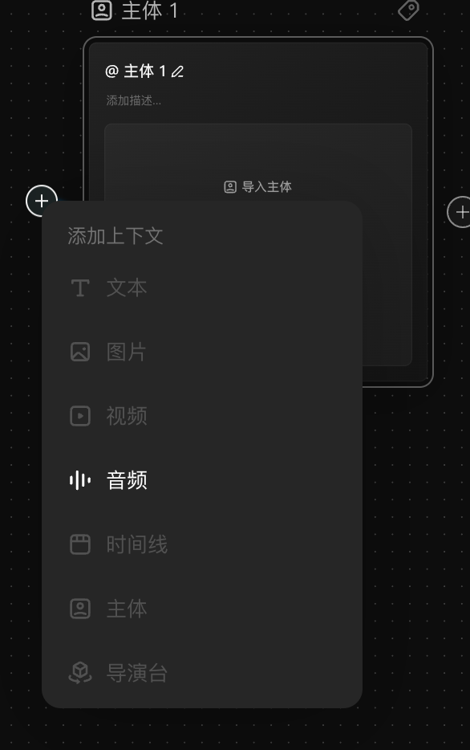
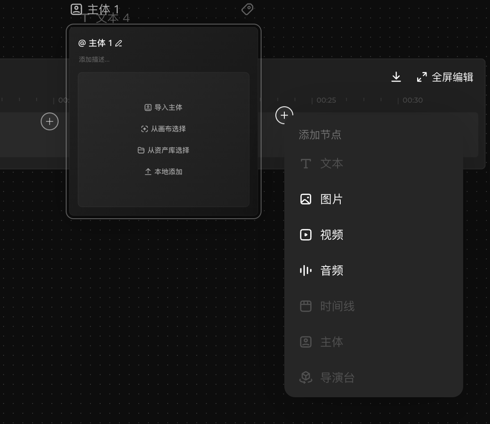
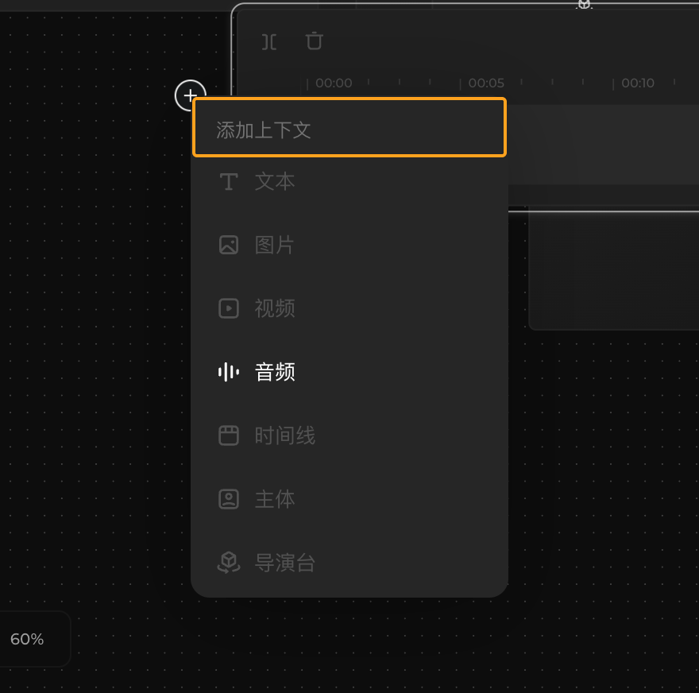
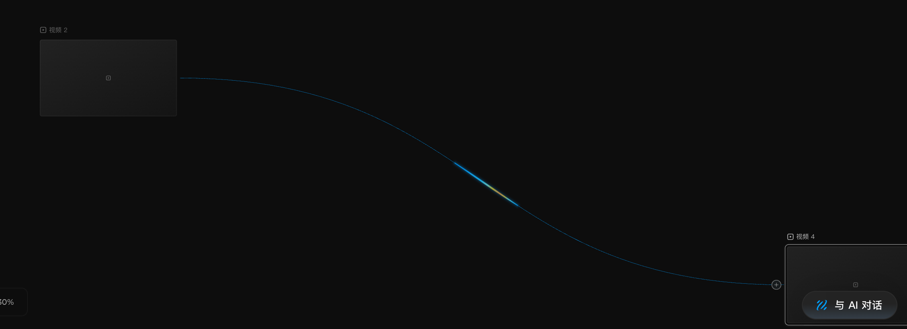
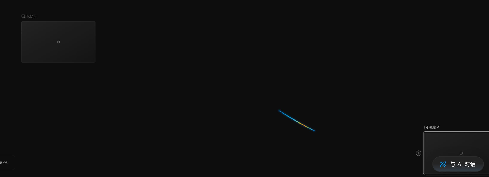

# 连接节点（参考连线）

## 适用角色

已登录的即梦画布创作者。

## 目标

把参考内容（如参考视频、参考图）连到生成节点上，建立「参考 → 生成」的创作关系。

## 前置条件

- 画布中至少有两个节点（如一个带内容的视频节点和一个空视频节点）。
- 目标节点类型允许被连接（见下方「连接规则」）。

## 入口

- 节点左右边缘的 **+**/连接热区（悬停节点时出现）。
  📌 **这里其实是两个不同的尺寸契约，批次 78 已定案**（批次 72 的一半结论被推翻）：

  | | 元素 | 契约 | 屏上读数 = | canvas 读数 = |
  |---|---|---|---|---|
  | **热区** | `flow-node-target-handle` / `flow-node-source-handle` | **canvas 恒为 `60×120`** | `60×当前缩放` | **恒定 `60×120`** |
  | **按钮** | `flow-node-*-connection-menu-button`（⊕） | ~~**屏上恒为 `36×36`**~~ 🔴 **批次 188 订正：屏上 = `min(72×缩放, 36)`，拐点在 50%** | 见下表 | `屏上 ÷ 缩放`，**在 50% 及以上恒为 `36`** |

  批次 78 在 **50% / 100% / 60% 三档**实测，据此写下「热区 canvas 恒定、**按钮屏上恒定**」。
  🔴 **批次 188 把它打到 9 档**（同一个图片节点 `b22-upload`，只改缩放，**每档都重新验了选中态**）：

  | 缩放 | `.react-flow__viewport` scale | 节点屏上（见证） | **⊕ 屏上** | `min(72×缩放, 36)` | 符合 |
  |---|---|---|---|---|---|
  | **22%** | `0.22` | `125.2` | **`15.8`** | `15.8` | ✅ |
  | **26%** | `0.26` | `147.9` | **`18.7`** | `18.7` | ✅ |
  | **40%** | `0.40` | `227.6` | **`28.8`** | `28.8` | ✅ |
  | **50%** | `0.50` | `284.4` | **`36`** | `36` | ✅ |
  | **60%** | `0.60` | `341.3` | **`36`** | `36` | ✅ |
  | **75%** | `0.75` | `426.7` | **`36`** | `36` | ✅ |
  | **100%** | `1.00` | `568.9` | **`36`** | `36` | ✅ |
  | **150%** | `1.50` | `853.3` | **`36`** | `36` | ✅ |
  | **200%** | `2.00` | `1137.8` | **`36`** | `36` | ✅ |
  | **26%（回读复核）** | `0.26` | `147.9` | **`18.7`** | `18.7` | ✅ |

  ⇒ **10/10 档命中 `屏上 = min(72×缩放, 36)`**；拐点**正好在 50%**。
  📌 「节点屏上」是**独立见证**：卡片 canvas 宽 `570`，`570×缩放` 与每档读数吻合到 0.2% 以内
  （`125.2/570=0.22`、`1137.8/570=1.996`），所以缩放本身没读错。

  🔴 **批次 78 的三档（50% / 60% / 100%）恰好全部落在 50% 以上的平台上** ——
  平台上读数**恒为 `36`**，从平台上看不出任何变量。
  ⇒ **它的读数一条都没错，错的是「三档读数相同」这个推断**：
  **测区间没有跨过拐点，「恒定」只是平台的假象。**
  ⇒ 实操：**`36` 不是一个可以到处套的常数**，
  50% 及以上它才是 `36`；**再放大它不会变大，再缩小它会跟着变小**
  （22% 时只有 `15.8`，不到 `36` 的一半）。

  ⚠️ **「⊕ 屏上恒为 `36×36`」与「多选工具条里那个连接菜单按钮 `36×36` 屏上恒定」是两回事**，
  数值相同、契约相反 —— 见下节「多选态那个 ⊕ 是另一个元素」。
  📌 **这条公式为什么这么稳**（批次 189 查明）：它成立的前提是
  **「这个元素跟着重渲染」**。⊕ **只在选中态出现**，而选中态的节点每次缩放都重渲染 ⇒ k 每档都刷新。
  同画布上那些**不需要选中就一直显示**的元素（节点标题 `flow-node-title`、
  `Add tags` 角标 `flow-node-selected-tag`）**不满足这个前提** ——
  同一个 80% 档，76 个节点的标题上能读到 **6 种不同的 k**（只有 13 个合公式）。
  机制与受控对照见 [20-reference 的「k 从哪来、又为什么不跟缩放走」](../20-reference.md#k-从哪来-又为什么不跟缩放走批次-189-首次结清)。

  🔑 **机制（批次 188 g 轮定位）**：⊕ 的**布局盒恒为 `36×36`**
  （`width: 36px`、`padding: 8px`、`box-sizing: border-box`，
  `offsetWidth` 在 22/26/50/100% 四档**逐档都是 `36`**），
  变的是它身上一个**独立的 `scale` 属性**：

  | 缩放 | 22% | 26% | 50% | 100% |
  |---|---|---|---|---|
  | **`scale` 属性读数** | **`2`** | **`2`** | **`2`** | **`1`** |
  | 屏上 = `36 × scale × 缩放` | `15.84` | `18.72` | `36` | `36` |

  ⇒ 规则是 **`scale = min(2, 1/缩放)`**：缩放 ≥ 50% 时它**完全抵消**画布缩放
  （所以屏上死死钉在 `36`），低于 50% 时补偿**封顶在 2 倍**（所以跟着缩放一起变小）。

  📌 **这个 `scale` 不出现在 `computedStyle.transform` 里** ——
  按钮自己的 `transform` 读出来是 `matrix(1, 0, 0, 1, 18, -18)`（纯位移、缩放分量 `1`），
  逐层往上也**只有 `.react-flow__viewport` 一处**带非 1 缩放。
  ⇒ **只读 `transform` 会把这一层缩放整个漏掉**，
  然后你会撞上「`offsetWidth` 是 36、屏上却是 71.8 canvas，像素说不通」的死胡同
  （188 f 轮就在这个死胡同里绕了一圈才被 g 轮解开）。
  📌 同理，**父级那条 `DIV[data-testid="connection-receiving"]` 的 `transform` 是 `none`**，
  它的屏上宽度严格等于 `offsetWidth × 缩放`（`569 → 125.2/147.9/284.4/568.9`）——
  **同一屏里两个元素，一个乘缩放一个抵消缩放**，只有逐层读全才对得上。

## 🔴 多选态那个 ⊕ 是**另一个元素**（批次 188 d/e/h 轮）

框选多个节点之后，界面上出现的那个 ⊕ **不是**上面那个 ⊕：

| | 单选节点的 ⊕ | 多选态的 ⊕ |
|---|---|---|
| testid | `flow-node-target-connection-menu-button` / `flow-node-source-connection-menu-button` | **`flow-node-multi-selection-source-connection-menu-button`** |
| aria 逐字 | `Create connected node before/after <节点名>` | **`Create connected node after selected nodes`** |
| 屏上尺寸 | **`min(72×缩放, 36)`**（50% 以下会变小） | **`36×36` 屏上真恒定**（22/26/50/100% 四档实测） |
| 挂载层 | 节点卡片内 → **在 `.react-flow__viewport` 里**（被 scale 乘） | `DIV.react-flow__node-toolbar[data-testid="flow-node-multi-selection-source-toolbar"]`（`offsetWidth = 0`）→ `.react-flow__renderer`，**不在 viewport 里**（不被乘） |
| `scale` 属性 | `min(2, 1/缩放)` | **`1`**（从不补偿） |

⚠️ **多选时每节点的 ⊕ 一个都不出现**：两轮实测
（188d 框选 **9** 个、188h 框选 **7** 个）都得到**全文档只剩 1 个**带
`aria-label^="Create connected node"` 的元素，且**所有节点内部的 ⊕ 总数为 `0`**。
⇒ **想用 before ⊕ 做方向对照，必须先取消多选** ——
多选态下那个 ⊕ 只有 after 一个方向，标题是「添加节点」。

📌 多选手柄 `flow-node-multi-selection-source-handle`（`60×120`）与多选 ⊕ 是**同一个挂载层**
（都在 `react-flow__node-toolbar` 下、都在 viewport 外），
所以它**屏上真恒定 `60×120`**，而每节点的 `flow-node-*-handle` 是 **canvas 恒定 `60×120`**
（60% 档屏上只有 `36×72`）—— 这是手册里**成对出现的第二组「同值不同契约」**。

## 连线方向示意


## 原子步骤

### 建立连线（2026-10-01 用现有节点重测）

1. 源节点（参考内容方）**右缘**与目标节点**左缘**各有一个连接手柄
   （DOM `.react-flow__handle`）。它是**竖长热区**而非小圆点。
   🔴 **2026-10-02 批次 91 订正这一句**：**不是每个节点都左右各有一个。**
   20 个节点的实测清点：`flow-node-target-handle` **20** 个（人人都有），
   `flow-node-source-handle` 只有 **19** 个 ——
   唯一缺出边手柄的是**时间线节点**（`react-flow__node-timeline`）。
   这与本页后面「时间线节点只有 before ⊕」是一致的：**时间线只能当终点，不能当起点**。
   ✅ **2026-10-03 批次 130 全量复现（76 个节点）**：`flow-node-target-handle` **76** 个、
   `flow-node-source-handle` **74** 个；**逐个节点查下来，缺 source 手柄的恰好 2 个，
   两个都是时间线节点**（`时间线 1` / `时间线 2`），**缺 target 手柄的 0 个**
   —— 缺的个数**恰好等于时间线节点数**。即上面 20 节点小样本的规律在全量上原样成立。
   （下方新增一节讲「有手柄 ≠ 能拖」，两件事不要混。）
   📌 **读它的尺寸必须先说清口径**（批次 72 澄清）：本手册正文曾并排写
   「canvas `60×120`」与「屏上约 `44×88`」，看着像矛盾，其实**是同一个量纲的两种写法**
   （`44÷0.72≈61`、`88÷0.72≈122`）。**可靠的换算依据**是视口祖先的 transform：
   `.react-flow__viewport` 的 inline style 逐字形如
   `translate(-1583.58px, -881.252px) scale(0.6)`，
   而**节点自己的 transform 里没有缩放**（`matrix(1, 0, 0, 1, …)` 只有平移）
   ⇒ `getBoundingClientRect()` 的读数**一律要除以 scale** 才能当契约。
   手柄平时 `opacity-0`，**悬停或节点被选中时才显形**为圆形 **＋**。
   🔴 **但除数不能写死成 `0.6`**（批次 78 推翻旧做法）：缩放标签是**真实 scale 四舍五入**的结果，
   而**新建一个节点会把画布自动缩小**把它纳入视野（实测 100% → **81%**、81% → **70%**、
   已在视野内则不再变）。所以「先测 A 类节点、再测 B 类节点」实际是在**两个不同缩放下**测的 ——
   批次 72 那个「视频 `56.8×113.6`、其余 `60×120`」就是这么来的：
   `34.1÷0.568085 = 60.00`、`68.2÷0.568085 = 120.00`，**除数不同而已，量的是同一个东西**。
   📌 **正确做法**：每次读数前当场读一次真实 scale（连读两次相同才算静止），
   再用它做除数。
2. 在源节点的右侧手柄上按下鼠标左键 → 拖到目标节点的左侧手柄上松开。
   - 判别左右的可靠依据是 class 里的整词 `react-flow__handle-left` /
     `react-flow__handle-right`，或角色词 `source`（右侧）/ `target`（左侧）——
     后者更稳，因为左右两侧手柄的 class 里还带着几十个 Tailwind 工具类。
3. 结果：两节点间出现一条**蓝色曲线**；状态行由 `0 edges` 变为 `1 edge`。
   - 成功判据：状态行 edges 计数加一；DOM 出现可点击命中的边元素，
     其 **aria 逐字**为
     `Reference connection from 视频 node: 视频 1 to 视频 node: 视频 2`
     —— 方向信息在 aria 里是明确写出来的。
- **方向语义**：连线 = 参考 → 生成目标。从有内容的节点拖向空节点，空节点即把
  对方当作参考。
- **取消（2026-10-01 已实测）**：从手柄按下后拖到**画布空白处**（`.react-flow__pane`）
  松开，即取消建线 —— 实测松开后 `.react-flow__edge` 元素数仍为 **0**，
  状态行保持 `0 edges`，不会出现「连到空气」的悬空线。
  🔴 **批次 146 订正**：~~但这次拖拽会让**源节点变成选中态**（状态行末位出现 `1 selected`）~~
  —— **这条不成立**。同一前置（拖前 0 选中、落点是空白 `.react-flow__pane`、非按钮）下
  **连续 5 次独立拖拽**（a/b/c 三轮），松手后状态行**恒为 `0 selected`**、
  `.react-flow__node.selected` **恒为空集**、源节点 canvas 位移**恒 `[0,0]`**。
  👉 也就是说：**拖到空白松手，除了弹出菜单之外，节点那边什么都不会发生。**
  当年那次读到 `1 selected`，极可能是拖拽**压根没起拖**、落点上的单击把**别的**节点选中了
  （历史三次里唯一那次 `1 selected` 就是这个形状）。详见下方「🔴 批次 146 定案」小节。

### 打开 ⊕ 菜单的入口（2026-10-01 批次 28 实测，**批次 71 订正入口的说法**）

菜单容器是 `data-testid="canvas-context-menu"`、`role="menu"`，实测 **200×316**、
七项各 **192×36**。入口有两个：

1. **选中节点后，点它左右两侧的圆形 ⊕ 按钮**
   （左右各 **36×36**，aria 逐字
   **`Create connected node before 视频 1`** /
   **`Create connected node after 视频 1`**；
   testid `flow-node-target-connection-menu-button` /
   `flow-node-source-connection-menu-button`）。**这两个按钮只在选中时出现。**
2. 🔴 **从节点手柄拖到空白处松手**（批次 22 的老路径）。**批次 72 补测，这一条有三条新事实**：
   - **菜单在松手瞬间就自动弹出**，**不需要**再去点 +（旧手册写「松手后再点 + 菜单」，
     实测松手后即已出现）；
   - 菜单出现在**你松手的那个点**上（实测松手于 `(140,150)` ⇒ 菜单 `200×316@140,150`）；
   - 🔴 **它属于 after 方向**（「添加节点」那一套），**不是** before。
     **硬证据**（不靠标题）：用**视频源**拖到空白，弹出的菜单七项里
     **只有「视频」可点**，其余六项 `aria-disabled="true"` + `cursor: not-allowed`
     （时间线「素材信息仍在加载中，请稍后重试。」、主体「没有可用的就绪资源」，
     其余四项「无法连接这些节点」）—— 与 after ⊕ 的读数**逐字一致**；
     若它是 before 方向，应该有**文本/图片/视频/音频四项**可点。
   - ✅ **批次 184 在「同一个视频节点实例」上把三格补齐了**（此前这里只有一批的孤证）：
     before ⊕ 与 after ⊕ 的可点集**确实不同**（有区分度），而拖手柄松手的那一格
     与 after ⊕ **逐字相同**。详见下方[三格对照](#入口-2-的方向批次-184-同一实例三格对照)。
   - 🔴 **批次 146 订正**：~~副作用（与既有记录一致）：拖完**源节点变成选中态**（状态行出现 `1 selected`）~~，
     但**节点自身没有被拖走**（canvas 坐标位移实测 `[0,0]`），也没有建出连线
     —— **「节点不会被拖走」「不会建出连线」两条逐字复现（5/5），
     但「会变成选中态」这一条被推翻**：状态行实测恒 `0 selected`。

⚠️ **要拖手柄就别先选中**：选中时 `.react-flow__handle` 的 `pointer-events` 是 `none`，
左右中点被两个 ⊕ 接管 —— 此时从那里起手是**点 ⊕**，不是拖手柄。
👉 只想看有哪些能连，**点 ⊕ 更省事**；拖手柄适合「松手即定位置」的场合。
🔴 **批次 91 订正这一行的读法**：**手柄元素本体的 `pointer-events` 永远是 `none`** ——
不只选中态。真正带 `pointer-events: auto` 的是它的 **`::before` 伪元素**
（`40×80`，即「热区」），`::after`（`20×20`，那个圆点字形）始终 `none`。
所以「读元素本体的 pe」这个判据**读什么都得不到想要的东西**。详见下方新增一节。

### 🔑 真正把线建出来的，是「拖到**节点**上松手」（2026-10-03 批次 136 首次验成）

⚠️ **下面第 2 步「拖到空白处松手」弹出来的是菜单，不是连线。**
本页此前只记了「拖到空白处 ⇒ 弹出 after 方向的七项菜单」，
**从未记录「要真的连上，拖拽的落点必须是节点本体」** —— 这是本页最大的一个操作缺口。

**完整四步**（本批 5 次独立复现：b/c/d/e/h 轮，每轮建线后都用撤销归位）：

| 步 | 动作 | 实测结果 |
|---|---|---|
| ① | **不要先选中**节点。鼠标移到它右缘的**竖长热区**（`flow-node-source-handle`，canvas 恒 `60×120`） | 悬停时会出现外描边 `flow-node-media-stroke` |
| ② | **按住左键拖动** | 立刻出现一条**预览连线**跟着鼠标走 |
| ③ | 移到**目标节点本体**上松手 | 边数 +1，状态行出现 `1 edge` |
| ④ | 连线建立后**节点选中数仍是 0** | 源节点与目标节点都不会被自动选中 |

🔑 **第 ② 步有没有起拖，肉眼可判**：预览连线是一个随鼠标移动而改变大小的
`<g>`（批次 136 实测同一个 `<g>` 依次是 `194.7×140.3@459,26` → `347.9×520@307,-54` → `687.7×189.9@(-4,470)`）。
**拖了半天什么都没有，就是没起拖** —— 最常见的原因是**你先选中了节点**（见上面那条 ⚠️）。

⚠️ **落点必须是「目标节点的可见部分」**：节点互相重叠时，被压在下面的那个节点
可能只露出一条几像素宽的边。**先让目标露出来再拖。**

📌 落点选**另一个音频节点**（图片节点 `b22-upload` → 音频节点）时，边的 aria 逐字是
**`Reference connection from 图片 node: b22-upload to 音频 node: 音频 54`**
—— 连线**自带方向与两端的完整描述**，边被悬停/聚焦时它就是 `document.activeElement`。
排查「我连的是哪两个节点」时可以直接用它。

⚠️ **在空白处松手会取消选中**（批次 136 g 轮实测）：
点 × 按钮以外的任何地方，边会从 `selected` 退回 `default`、**删除按钮随之消失**。
所以**「选中边 → 点 ×」必须一气呵成，中间不要点别处。**

> 📌 **在空白处松手时本批观测到的两件事**（批次 136 当时的原文，**现已由批次 146 定案**）：
> 本批的落点是 `(8,660)`（视口左下角边缘），松手后弹出的是 **`canvas-context-menu`**（右键菜单），
> **没有**观测到「源节点变成选中态（`1 selected`）」——
> 但**落点与当年那次不是同一个位置**，且当年记的菜单是 `200×316@140,150`。
> ⇒ 两者**不能互相推翻**；要定案得在同一个落点上重测（本批未做）。
> 可以确定的是：**无论落在空白还是节点上，节点自身都不会被拖走**
> （canvas 坐标位移实测 `[0,0]`，批次 136 五轮逐个一致）。
>
> ✅ **批次 146 已定案**（详见下一节）：当年那个落点 `(140,150)` **如今已被别人的节点占用**，
> 严格意义的「同落点重测」做不到；改按**同条件重测**（机制条件是「落点是空白 `.react-flow__pane`」），
> **5 次独立拖拽全部 `0 selected`** ⇒ **被推翻的是「源节点变选中」这一条**，
> 批次 136 这段并列记录**到此可以合并**。

### 🔴 批次 146 定案：「拖到空白松手」的完整后果 + 预览线的 DOM 真身（2026-10-04）

这一节结清两件事：① 上方那条「源节点变选中」到底成不成立；② **拖拽途中那条蓝色预览线是什么** ——
**全册此前只记了它的肉眼形态（一个跟着鼠标变大小的 `<g>`），从没记过它的 DOM 真身**。

#### 一、后果：5 次独立复现，**只有菜单会发生**

前置条件每次现算并断言（拖前 **0 选中**、落点命中 `DIV.react-flow__pane`、不在任何节点内、不是按钮）：

| 次数 | 落点 | 菜单弹在**松手点** | 菜单盒 / aria | 状态行 | 源节点被选中 | `.react-flow__edge` | 源节点 canvas 位移 |
|---|---|---|---|---|---|---|---|
| 1 | `(140,350)` | ✅ | `200×316` / `添加节点` | `… 0 selected` | ❌ | 0 | `[0,0]` |
| 2 | `(140,340)` | ✅ | `200×316` / `添加节点` | `… 0 selected` | ❌ | 0 | `[0,0]` |
| 3 | `(140,340)` | ✅ | `200×316` / `添加节点` | `… 0 selected` | ❌ | 0 | `[0,0]` |
| 4 | `(140,340)` | ✅ | `200×316` / `添加节点` | `… 0 selected` | ❌ | 0 | `[0,0]` |
| 5 | `(140,340)` | ✅ | `200×316` / `添加节点` | `… 0 selected` | ❌ | 0 | `[0,0]` |

菜单内容与批次 72 **逐字一致**（视频源：七项里**只有「视频」可点** ——
`cursor: pointer`、无 `aria-disabled`；其余六项 `aria-disabled="true"` + `cursor: not-allowed`，
逐字为「无法连接这些节点」×4、「素材信息仍在加载中，请稍后重试。」、「没有可用的就绪资源」）。

🔴 **判定：上方两处「源节点变成选中态」被推翻**（5/5 均为 `0 selected`）。
**当年那次 `1 selected` 的成因已经找到**：历史三次里唯一出现 `1 selected` 的那一轮，
**预览线压根没出现**（说明拖拽没起拖），被选中的还是**另一个节点** ——
那是「起手没按住、松手变成了一次落点单击」，不是「松手后源节点被选中」。
👉 **落点选空白、别先选中，拖完节点那边什么都不会变。**

#### 二、🔑 预览线的 DOM 真身：**它不是 `.react-flow__edge`**

| 时点 | `svg.react-flow__connectionline` | `path.react-flow__connection-path` | `.react-flow__edge` |
|---|---|---|---|
| 拖前 | 无 | 无 | 0 |
| 拖到 1/2 程 | ✅ 1 个 | ✅ 1 个，屏上 `304.5×18.1@481,327` | **0** |
| 拖到 3/4 程 | ✅ 1 个 | ✅ 1 个，屏上 `456.1×26.1@330,319` | **0** |
| 拖到终点（松手前） | ✅ 1 个 | ✅ 1 个，屏上 `608.3×35.1@179,310` | **0** |
| 松手 +150ms | ❌ 没了 | ⚠️ **换成一枚 `0.6×0.6` 的空 `svg`** | 0 |
| 松手 +2500ms | ❌ | ⚠️ **还在** | 0 |
| 关掉菜单后 | ❌ | ❌ 消失 | 0 |

- 结构：`svg`（class 链 `react-flow__connectionline react-flow__container`）里的
  `<path class="react-flow__connection-path">`；
  **描边 `rgb(0, 142, 229)`、宽 `1px`、`pointer-events: none`**。
- 🔴 **它从头到尾都不在 `.react-flow__edge` 里面**（`closest('.react-flow__edge')` 恒 `null`）。
  ⇒ **「边数 +1」只在你松手于节点、真的建出线时成立**；
  拖拽途中数 `.react-flow__edge` **永远是 0**，拿它判断「有没有起拖」必然误判成「没反应」。
- 🔑 **`d` 的起点是恒定的**：三次采样逐字都是 `M4075.888604181071,2687.695945273357`
  （源手柄的 canvas 坐标）；随鼠标变的只有控制点（`C4215.95…` → `C4248.89…` → `C4276.67…`）
  与终点。屏上盒随之**单调变大**（`304.5×18.1` → `456.1×26.1` → `608.3×35.1`）——
  这就是批次 136 目测到的「一个随鼠标移动而改变大小的 `<g>`」的机械成因。
- ⚠️ **松手后有一枚残留**：菜单未关期间，DOM 里留下一枚 `0.6×0.6` 的空 `svg`，
  class 链含 `react-flow__connection-path pointer-events-none absolute left-…`，
  **一直挂到菜单关闭才消失**。⇒ 拖完之后去数 `connection-path` 会读到 **1**，
  那是**残留不是连线**（此时状态行 `0 edges`、`.react-flow__edge` 0）。
- ⚠️ **别在 DOM 里 grep "connection" 就下结论**：全页 **230 个上下**元素的 class 里带 `connection`
  （同一轮里 7 个时点实测 **231 / 235 / 235 / 234 / 232 / 232 / 231** —— 预览线的出现与消失会改变这个数，**它不是一个固定值**；
  （绝大多数是节点的 `react-flow__handle`），另有一枚**常驻**的
  `div.z-canvas-connection-flow-surface`（`1280×720@0,0`、`pointer-events: none`）——
  **拖前、拖中、松手后它都在**，与拖拽无关。

### 🔑 怎么删掉一条连线（2026-10-03 批次 136 首次验成，**此前全册未记**）

单击一条连线即可选中它（`data-state` 从 `default` 变 `selected`，
**节点选中数不变** —— 边的选中态是独立的，不进 `.react-flow__node.selected`）。
选中后连线中点上会出现一个 **× 按钮**。

**四条路径的实测胜负**（每条都在「建线 → 试路径 → 归位」的完整循环里验过）：

| 路径 | 结果 | 备注 |
|---|---|---|
| **点 × 按钮** | ✅ **删掉** | `reference-edge-delete-control`，`<BUTTON 36×36>`，aria 逐字 **`Delete connection`** |
| **按 `Backspace`** | ✅ **删掉** | 前提是边已选中（此时焦点在边的 `<g>` 上） |
| **`⌘Z` 撤销** | ✅ 删掉 | 焦点守卫通过即可 |
| **按 `Delete`** | ❌ **无效** | 边数不变。同样是「边已选中」的状态下，**只有 `Backspace` 管用** |
| **右键连线** | ❌ **不弹任何菜单** | `[role=menu]` 为 `null`、`[role=menuitem]` **0** 个 —— **与节点不同，边没有右键菜单** |

👉 **推荐做法**：单击连线选中 → **直接点中点那个 ×**。
`Backspace` 适合「刚连错、想立刻反悔」；`⌘Z` 适合「不确定刚才那步做了什么」。


#### × 按钮的三层结构（`20-reference.md` 已建档）

| testid | 元素 | 屏上读数 | 说明 |
|---|---|---|---|
| `reference-edge-delete-positioner` | `<DIV>` | **`0×0`** | 定位锚点，`pointer-events: none`、`z-index: 10` |
| `reference-edge-delete-screen-space` | `<DIV>` | **`0×0`** | 再一层换算容器，`pointer-events: none` |
| `reference-edge-delete-control` | `<BUTTON>` | **`36×36`** | 真按钮，aria 逐字 `Delete connection`、`pointer-events: auto` |

🔑 **判「× 有没有被挡住」不能只看 `elementFromPoint` 返回了什么**（批次 136 f 轮）：
按钮中心 `elementFromPoint` 返回的是 `path`，
但它的祖先链是 `path → svg.relative → SPAN.contents → **BUTTON.inline-flex** → …`
—— **`path` 就是 × 图标本身**（按钮的子元素 `SPAN` 带 `display: contents`，盒子消失、子元素直接参与布局）。
⇒ **正确判据是走祖先链，看目标在不在这条链上**，
而不是「返回值是不是目标本身」，也不是「看返回值的 `pointer-events`」。

📌 按钮的几何框是 `36×36`，但 **2px 步长扫描 324 个采样点，命中按钮及其后代的只有 261 个**，
命中区包围盒是 **`35×35`** —— 差的就是最外一圈 1px。**点按钮正中即可，不必纠结边缘。**

🔴 **批次 28 写的是「两个入口都会打开同一个菜单」，这半句已被批次 71 推翻**：
入口 1 的**两个 ⊕ 打开的是两个不同的菜单** —— 菜单标题不同，
**七项里谁可点也不同**（详见下一节）。
✅ **入口 2 的方向也已有结论**（批次 72 首测、**批次 184 在同一实例上补齐三格复现**）：
它打开的是 **after 方向**（`添加节点` 那一套），**不是** before。
本手册此前在这里留的「未取证」是**漏改的残留**（同一页第 103 行早已写明），
现已按批次 184 的实测读数就地关闭。

> ⚠️ **别在选中状态下去找连线手柄**：实测选中时
> `.react-flow__handle` 的 `pointer-events` 是 **`none`** ——
> 左右中点被这两个 36×36 的 ⊕ 按钮接管了。**要点 ⊕ 才有菜单。**
> 这也解释了「切到抓手工具、起点落在节点上却拖不动画布」的现象：
> 那个落点被 ⊕ 按钮吃掉了。

### 连接规则（批次 28 逐项重测并订正，批次 59 补成 7×7，**批次 71 拆成两套**）

菜单七项**每项下面都会附一句原因**；但**七项里谁可点，取决于你点的是哪个 ⊕**。

📌 **测「菜单项」要认准元素**（批次 74）：菜单本体 `200×316`，
每个 `[role="menuitem"]` 是 **192×36**，里面套着一个 `SPAN.min-w-0.flex-1`
（**文字标签**）是 **144×22**，禁用原因则挂在 `SPAN.sr-only`（**1×1**，肉眼不可见）里。
⚠️ 早期台账里的「七项各 **144×22**」量的是**文字标签 span**，不是菜单项 ——
两个数字并不矛盾，但**口径不同**；按 `[role="menuitem"]` 取才是菜单项。

#### 🔴 先分清你点的是哪个 ⊕（2026-10-01 批次 71 实测，**同一节点实例内前后对照**）

| 你点的 ⊕ | aria 逐字 | testid | 菜单标题逐字 | 菜单弹出位置 | 哪些类型有这个 ⊕ |
|---|---|---|---|---|---|
| **左边（before）** | `Create connected node before <节点名>` | `flow-node-target-connection-menu-button` | **`添加上下文`** | 节点**左侧** | ~~图片~~ 视频 / 音频 / 时间线 / 主体（🔴 图片这格**已被批次 184 推翻**、**又被批次 188 收窄**：**带内容的**图片节点**没有** before ⊕，而**空的**图片节点**有**（⊕ 2 个、`::before` = `auto`）；逐类普查见下） |
| **右边（after）** | `Create connected node after <节点名>` | `flow-node-source-connection-menu-button` | **`添加节点`** | 节点**右侧** | 文本 / 图片 / 视频 / 音频 / 主体 |

🔑 **菜单标题跟的是按钮，不是源节点的类型。**
⇒ 「时间线源的菜单才叫『添加上下文』」是**错的**（本手册批次 59 写错过，见下方订正）；
真正决定标题的是你点了 before 还是 after。

#### 入口 2 的方向（批次 184 **同一实例三格对照**）

批次 72 已经用「视频源拖到空白 ⇒ 只有『视频』可点」判过方向，但那是**一批孤证**。
批次 184 在**同一个视频节点实例**上把三格补齐，逐格只换「怎么打开菜单」，
并且**不靠标题判方向**，靠**「七项里谁可点」这个指纹**：

| 格 | 怎么打开 | 菜单标题逐字 | **可点项** | 禁用项 |
|---|---|---|---|---|
| 格 1 | 点**左边** before ⊕ | `添加上下文` | **文本 / 图片 / 视频 / 音频** | 时间线 / 主体 / 导演台 |
| 格 2 | 点**右边** after ⊕ | `添加节点` | **只有 视频** | 其余六项 |
| 格 3 | **从 source 手柄拖到空白松手** | `添加节点` | **只有 视频** | 其余六项 |

⇒ **格 1 与格 2 的可点集确实不同** ⇒ 这个指纹**有区分度**（否则三格相等就说明不了方向）。
⇒ **格 3 与格 2 逐字相同** ⇒ 🔴 **入口 2（拖手柄松手）属 after 方向**，批次 72 复现。
📌 三个菜单本体都是 `200×316`；格 3 出现在**松手的那个点**上。
📌 拖完之后**节点数不变、选中态不变** —— 拖手柄到空白**不会建出连线**，
菜单关掉就等于什么也没发生（要真的连线得点菜单里的目标类型）。

> ⚠️ **想用「before ⊕」当对照，就别拿图片/文本/时间线当靶子** ——
> 这三种类型**只有一个 ⊕**（见下表），另一格根本构造不出来。
> 本批第一版就踩了这个：拿图片节点当靶子，before ⊕ 读到 `null`。

#### 🔴 哪些类型有几个 ⊕（批次 184 **六类逐个普查**，取代批次 71 的两行列表）

判据不是「点不点得中」，而是**选中后数 `aria-label^="Create connected node"` 的元素个数**，
并把 testid 逐字列出来。
📌 **本表所有 ⊕ 尺寸都不写死**：⊕ 是 **`min(72×缩放, 36)`** 的契约（见页首那张表与机制小节），
**26% 档读到 `19×19`、50% 档才读到 `36×36`**。本表读数统一在 **26%** 采集。

| 类型 | ⊕ 个数 | 有 before？ | 有 after？ | 手柄元素在不在 | 手柄**能不能拖**（`::before` 的 `pointer-events`） |
|---|---|---|---|---|---|
| `video` 视频 | **2** | ✅ target | ✅ source | 两个都在 | target ✅ / source ✅ |
| `audio` 音频 | **2** | ✅ target | ✅ source | 两个都在 | target ✅ / source ✅ |
| **`image` 图片（**带内容**）** | **1** | ❌ **没有** | ✅ source | 两个都在 | target ❌ **`none`** / source ✅ `auto` |
| 🔴 **`image` 图片（**空节点**）** | **2** | ✅ target | ✅ source | 两个都在 | target ✅ `auto` / source ✅ `auto` |
| `text` 文本 | **1** | ❌ 没有 | ✅ source | 两个都在 | target ❌ **`none`** / source ✅ `auto` |
| `timeline` 时间线 | **1** | ✅ target | ❌ 没有 | **只有 target** | target ✅ |
| `external` 导演台 | **0** | ❌ | ❌ | 两个都在 | 两个都 ❌ **`none`** |
| ✅ **`subject` 主体**（批次 187 补测，此前本行留白） | **2** | ✅ target | ✅ source | 两个都在 | target ✅ `auto` / source ✅ `auto` |

📌 **主体节点那一行是批次 187 补的**：此前它标着「未复测」，理由是「当前画布上没有主体节点」。
**建一个主体节点是纯 CRUD、零成本**（左栏「主体」按钮 `40×40`），
建完读数、**按 id 删掉**，就能把这一行补上 ⇒ **它两个 ⊕ 都有、两个手柄都能拖**，
与批次 71 的记载一致。
⚠️ 它的 ⊕ 屏上读数是 **`19×19`** —— 但 🔴 **那不是主体特有的**，
`19×19` 只是 **26% 缩放下** `72×0.26≈19` 的正常结果，任何类型在这个缩放下都是 `19×19`
（详见页首契约表与下面的批次 188 订正）。它真正特别的地方是**节点本身只有 `92×92`** ——
画布上最小的节点，两个 ⊕ 紧贴其左右两侧，**点的时候要按它自己的 `19×19` 去量，别套常数**。

🔴 **订正批次 71 的一处**：那张表把 **图片** 列为 before / after **两个 ⊕ 都有**。
普查在**一个带资源的图片节点**上读到 **`⊕ 个数 = 1`，只有 `source`（after）**，
且它的 `flow-node-target-handle` 元素**在 DOM 里、但 `::before` 的 `pointer-events` 是 `none`**
（另外两轮独立佐证：184 第一轮取 before ⊕ 坐标读到 `null`）。
⇒ **带内容的图片节点没有 before ⊕。** 原文保留并加订正标记。

🔴 **批次 188 收窄上面这条**：变量**不是类型，是「节点有没有内容」**。
同一轮同屏对照（都选中、都 26%）：

| 同一个图片类型 | 节点屏上 | ⊕ 个数 | 逐字 aria | target 手柄 `::before` |
|---|---|---|---|---|
| **空**（左栏新建，`图片 1`） | **`83×83`** | **2** | `Create connected node before 图片 1` / `… after 图片 1` | ✅ **`auto`** |
| **带内容**（`b22-upload`） | **`148×83`** | **1** | 只有 `… after b22-upload` | ❌ **`none`** |

⇒ **空图片节点是有 before ⊕ 的**（与视频/音频/主体同形），
批次 184 那句「图片节点没有 before ⊕」**只在带内容时成立**。
📌 空节点与带内容节点的屏上尺寸也不同（`83×83` vs `148×83`），
所以这两行**本来就是两种不同的界面状态**，把它们当同一种「图片节点」来普查必然对不上。
⚠️ 「有没有内容」这个变量**本批只在图片类型上打过**；`text` 那一行仍按**带内容**读（1 个 ⊕），
空文本节点未复测 ⇒ **不要外推成「所有空节点都有 before ⊕」**。

🔑 **本表最值得记住的一条**：**DOM 里有 handle 元素 ≠ 它能拖。**
图片（带内容）/ 文本节点的 `target-handle`、导演台的两个 handle **全都在 DOM 里**，
但只有 `::before` 的 `pointer-events` 是 `auto` 的那个才真的接指针。
⇒ 自动化里判「这个手柄能不能起手」，**必须读 `getComputedStyle(el, '::before').pointerEvents`**，
数元素个数会得到相反的结论。

**同实例对照**（一个主体节点，先点 before、再点 after，两次读数）：

| 同一个主体节点 | 菜单标题 | 可用项 | 禁用项逐字原因 |
|---|---|---|---|
| 点**左边** before ⊕ | 添加上下文 | **仅「音频」** | 文本/时间线/主体/导演台 → 无法连接这些节点；**图片/视频 → 没有可用的就绪资源** |
| 点**右边** after ⊕ | 添加节点 | **图片 / 视频 / 音频** | 文本/时间线/主体/导演台 → 无法连接这些节点 |





> 💡 **两张图是同一个源节点类型的两个方向**。对照它们就能看到：
> 换的只是「点了哪个 ⊕」，**可点项就从 1 项变成 3 项**。
> ⚠️ 上一张里图片/视频灰着的原因是「**没有可用的就绪资源**」（**临时**状态），
> 与「无法连接这些节点」（**永久**）不是一回事，别混。

🔴 **本手册此前的两处结论已被批次 71 推翻**（历史记录不改写，订正写在此处）：

- ~~「时间线源的菜单标题是『添加上下文』，其余六种源都是『添加节点』」~~ ——
  实测**同一批节点**上点 before 就是「添加上下文」、点 after 就是「添加节点」；
  标题**只由按钮决定**。
- ~~「两个入口都会打开同一个菜单」~~ —— 两个 ⊕ 的菜单**标题与可连项都不同**。

📌 **不是每个节点都有 ⊕**（2026-10-01 批次 69 实测，批次 71 复现）：**导演台节点没有** ——
选中后全文档 `aria-label^="Create connected node"` 命中数 **0**，
而同一轮的文本节点命中 **1**（对照）。
⇒ 「从导演台发起连线」**做不到**，不是「能发起但被禁用」。
见 [导演台节点](director-node.md)。

📌 **文本节点只有 after ⊕、时间线节点只有 before ⊕**，所以这两类源**不分方向**：
- **文本源**（点它唯一的 after ⊕）：七项里**只有「图片」和「视频」可用**；
  文本 / 音频 / 时间线 / 主体 / 导演台 五项都是
  `aria-disabled="true"` + `cursor: not-allowed` + 「无法连接这些节点」。
- **时间线源**（点它唯一的 before ⊕）：**只有「音频」可用**，
  图片 / 视频 报「没有可用的就绪资源」，其余四项「无法连接这些节点」。

判据用**文字颜色**即可（DOM 级）：可用 = `rgb(255, 255, 255)`，
禁用 = **`rgba(255, 255, 255, 0.2)`**。

#### 逐项可连性：**两张表**，不是一张（左栏新建的**空**节点作源）

**① 点 after ⊕（「添加节点」）—— 可用目标**

| 源 | 可用目标 | 不可用目标 |
|---|---|---|
| **文本** | 图片 / 视频 | 文本 / 音频 / 时间线 / 主体 / 导演台 |
| **图片** | 图片 / 视频 / 音频 | 文本 / 时间线 / 主体 / 导演台 |
| **图片（已上传素材）** | 图片 / 视频 / 音频 / **时间线 / 主体** | 文本 / 导演台 |
| **视频** | **仅 视频** | 文本 / 图片 / 音频 / 时间线 / 主体 / 导演台 |
| **音频** | 视频 / 音频 | 文本 / 图片 / 时间线 / 主体 / 导演台 |
| **主体** | 图片 / 视频 / 音频 | 文本 / 时间线 / 主体 / 导演台 |
| **时间线** | — 本类型**没有 after ⊕** | — |
| **导演台** | ⛔ 选中态**没有任何 ⊕ 按钮**，这一列整条走不通 | |

**② 点 before ⊕（「添加上下文」）—— 可用目标**

| 源 | 可用目标 | 不可用目标 |
|---|---|---|
| **图片** | **文本 / 图片** | 视频 / 音频 / 时间线 / 主体 / 导演台 |
| **视频** | **文本 / 图片 / 视频 / 音频** | 时间线 / 主体 / 导演台 |
| **音频** | 图片 / 音频 | 文本 / 视频 / 时间线 / 主体 / 导演台 |
| **时间线** | **仅 音频** | 文本 / 图片 / 视频 / 时间线 / 主体 / 导演台 |
| **主体** | **仅 音频** | 文本 / 图片 / 视频 / 时间线 / 主体 / 导演台 |
| **文本** | — 本类型**没有 before ⊕** | — |
| **导演台** | ⛔ 同上 | |

👉 每个格子的**逐字禁用原因**（含「素材信息仍在加载中」「没有可用的就绪资源」）
见 [参考页 · 「添加节点」/「添加上下文」逐项可连性](../20-reference.md)。

🔴 **两张表的重叠面很小，别拿一张去套另一张**：
**视频源** after 只能连 **1** 项（视频）、before 能连 **4** 项（文本/图片/视频/音频）；
**音频源** after 可连 视频/音频、before 可连 图片/音频 —— **两项几乎完全不相交**。

三条一眼可见的规律（**注意适用方向**）：

1. 🔴 **作为目标能连上什么，取决于方向。**
   after ⊕ 下只有 图片/视频/音频 能被连；**before ⊕ 下「文本」也能被连**
   （图片源与视频源都能连文本）。
   ⇒ 文本 / 时间线 / 主体 / 导演台 这四类目标，**在 before ⊕ 下也没有一个能被连**。
2. 🔴 **「可连」不是节点类型的固有属性**（批次 28 已写这句，现在有全表支撑）：
   同一个「图片」目标，**文本源能连、视频源却不能**；甚至
   **同一个视频节点**，点它左边能连 4 类、点它右边只连 1 类。
3. 🔴 **源侧的 ⊕ 按钮也因类型而异**：文本只有 after、时间线只有 before、
   导演台两个都没有 —— 自动化脚本**不能默认「选中就有左右两个 ⊕」**。



#### ⚠️ 源节点**有没有内容**，会改变可连性，**还会改变入口是否存在**

这是本批最容易踩的坑：**用空节点量出来的表，不能直接说手册写错了。**
把「图片」这一行的源换成**带内容**的图片节点（已授权 PNG 实测，批次 73）：

| 目标 | 带内容的图片源 | 空的图片源 |
|---|---|---|
| 文本 / 导演台 | 🔘 无法连接 | 🔘 无法连接 |
| 图片 / 视频 / 音频 | ✅ | ✅ |
| **时间线** | ✅ **可用** | 🔘 素材信息仍在加载中 |
| **主体** | ✅ **可用** | 🔘 没有可用的就绪资源 |

⇒ 上面那张「从图片节点出发」的表**是对的**，
它量的就是带内容的节点。差别来自**内容**，不是来自结论写错。

📌 **以上是 after ⊕ 的读数**（批次 59 与批次 73 **两次独立复现，逐格一致**）。

🔴 **批次 73 更进一步：带内容的图片节点，「左边的 ⊕」在 DOM 里根本不存在。**

| | 空图片节点 | **带内容**的图片节点 |
|---|---|---|
| after ⊕（`flow-node-source-…`，菜单「添加节点」） | 有 | **有** |
| before ⊕（`flow-node-target-…`，菜单「添加上下文」） | **有** | 🔴 **全文档计数 0** |

- DOM 级读数：带内容节点选中后，
  `document.querySelectorAll('[data-testid="flow-node-target-connection-menu-button"]').length`
  = **0**，而 `…-source-…` = **1**。
- ⇒ 这**不是**「按钮灰了」或「被挡住」，而是**这个入口不存在**。
- 与批次 69 的导演台属于同一类现象，但**原因不同**：导演台是**两种方向都没有**；
  带内容图片节点是**只剩 after 这一种**。
- ⚠️ **两次独立观测**（批次 59、批次 73）都是这样；**机制未验证**，按本手册惯例只陈述观测。
- 🔴 **批次 211 把「机制未验证」这条老账结清了** —— 同一个缩放下带阳性对照复现，
  并拿到了机制的直接证据，见下方小节「为什么带内容的图片节点没有 before ⊕」。

#### 🔴 批次 211：为什么带内容的图片节点没有 before ⊕（2026-10-05）

上面那条「**机制未验证**」挂了很久。本轮把它做掉了。**全程同一个缩放（`26%` 自适应档）**，
每次点击前都跑归属判据（`elementFromPoint` 必须落在目标节点子树内）、
点完**硬断言 `selected === 1` 且选中集里就是目标 id**（`26%` 档单击只展开变体不选中，批次 203）。

| 节点 | 类型 | 有没有资源 | **before ⊕** | **after ⊕** |
|---|---|---|---|---|
| `b22-upload` | 图片 | **有 ``** | 🔴 **0** | 1 |
| `视频 1` | 视频 | 空（`video-node-empty`、`0 ready, 0 processing, 0 failed`） | ✅ **1** | 1 |
| `音频 68` | 音频 | 空（`audio-node-empty`、`0 ready, 0 processing, 0 failed`） | ✅ **1** | 1 |

⇒ 批次 59 / 73 那条观测**复现成立**，而且 🔴 **顺手排掉了 `20-reference.md:309`
记的那个坑**（「两次都错在拿不同缩放的读数互比」）：
**`视频 1` 与 `音频 68` 是同缩放、同流程的阳性对照，两个都读到 `before ⊕ = 1`**
⇒ 不是缩放把入口压掉了，就是「带内容」这一条属性。
📌 顺带核对：`before ⊕` 屏上实测 **`19×19`**，与本页「`min(72×缩放, 36)`」一致
（`72 × 0.26 = 18.72`）。

#### 🔑 机制：**before ⊕ 是「喂素材」的入口；节点自己有素材后，它变成了「上下文提供者」**

before ⊕ 那个菜单的标题逐字是「**添加上下文**」—— 它的用途是**给这个节点投喂素材**。
本轮读了两个空节点的这个菜单，拿到了机制的直接证据：

| 菜单项 | 目标 = `视频 1` | 目标 = `音频 68` |
|---|---|---|
| 文本 | ✅ 可点 `rgb(255,255,255)` `cursor:pointer` | ⛔ **「无法连接这些节点」** |
| **图片** | ✅ **可点** | ✅ **可点** |
| 视频 | ✅ 可点 | ⛔ **「无法连接这些节点」** |
| 音频 | ✅ 可点 | ✅ 可点 |
| 时间线 / 主体 / 导演台 | ⛔ 「无法连接这些节点」 | ⛔ 「无法连接这些节点」 |

（两份菜单都是 `canvas-context-menu` / `role=menu` / 标题「添加上下文」/ **`200×316`** /
七项各 **`192×36`**；只读结构，**没有点任何一项**，Esc 一次即关、浮层归零。）

🔴 **关键一格是「图片」在两份菜单里都「可点」**：本画布上**只有一个图片节点**
（`b22-upload`），而它**有 ``** ⇒
**一个带素材的图片节点，本身就是一个可用的「上下文」**。

⇒ 📌 **机制**：节点空着的时候，它需要被投喂，所以给它「添加上下文」入口；
**一旦它自己有素材，它就从「等待投喂的容器」变成了「可以投喂别人的上下文提供者」**，
于是这个入口对它自己就不再必要 ⇒ **before ⊕ 消失不是 bug，是分类变化。**
这也解释了为什么**空图片节点反而有** before ⊕（它还在等着被投喂）。

#### 🆕 顺带解出一条**不对称**的类型兼容关系

上面那张表里，`文本` 与 `视频` **能给「视频」当上下文，却不能给「音频」当**
（理由都是结构性的「无法连接这些节点」，**不是**「没有可用的就绪资源」）
⇒ **能不能当上下文，是「源类型 × 目标类型」这一对的关系，而且不对称。**

📌 两种理由文案含义不同，**不要当成同一条**（本页上面已经这么记过一次，这里再确认一次）：
- 「**无法连接这些节点**」＝ **结构性不兼容**（这一类根本不进候选）；
- 「**没有可用的就绪资源**」＝ **类型在范围内，但当前没有已就绪的素材**。
本轮读到的 `aria-disabled` 与 `color: rgba(255,255,255,0.2)` / `cursor: not-allowed`
**与文案逐项一致**（`aria-disabled="true"`）。

⚠️ **本轮没排除的**：① `文本 1` 那一臂**无效**（24 个候选点全被别的节点盖住，按立规 82 标无效臂），
所以「文本只有 after ⊕」这条**本轮没有复测**；② 主体节点当前**不在画布上**，
所以「主体目标的那份菜单」本轮没读 —— 而截图清单里记着 2026-10-01 那次
主体菜单里「图片/视频＝没有可用的就绪资源」，与本轮「图片＝可点」**不冲突但成因未定**
（可能是那时 `b22-upload` 还没有就绪资源）。⇒ 这两条都**只记现象，不下结论**。

💡 **所以**：想让图片节点**前面**接一个参考节点，得**先上传素材**，
否则那个方向的入口根本不会出现；上传之后前接入口也仍然没有 —— 只能**后接**。

⚠️ **别用「节点里有没有 ``」判断它有没有内容**（批次 73 自伤）：
缩略图**不是 `` 元素**，实测上传成功的节点 `imgs: 0`。
可靠的判据是**看菜单** —— 时间线 / 主体从「加载中 / 没有可用的就绪资源」
变成可连，就说明素材已就绪。

#### 「无法连接」与「临时不可用」是两回事（批次 28 的订正，批次 71 按方向复核）

| 原因逐字 | 性质 | 该怎么做 |
|---|---|---|
| **无法连接这些节点** | **永久**不可连 | 别试了 |
| **素材信息仍在加载中，请稍后重试。** | **临时** | 过一会儿再试 |
| **没有可用的就绪资源** | **临时**（依赖源节点有没有资源） | 给源节点放上素材再试 |

🔑 **「没有可用的就绪资源」与「素材信息仍在加载中」各自出现在哪，批次 71 已测清**（空源）：

- **「素材信息仍在加载中，请稍后重试。」** 只出现在 **after ⊕ + 时间线目标**
  （源为图片 / 视频 / 音频）。
- **「没有可用的就绪资源」** 出现在两处：
  ① **after ⊕ + 主体目标**（源为图片 / 视频 / 音频）；
  ② **before ⊕ + 图片 或 视频目标**（源为时间线 / 主体）。
- 🔴 也就是说，**同一对节点换一个方向，报的原因文案就不同** ——
  「从时间线出发选图片」是「没有可用的就绪资源」，
  「从图片出发选时间线」是「素材信息仍在加载中」。

#### 原有两张表的出处（保留，均已复核）

**从视频节点出发**（空视频节点，200×316 @ (945,360)）—— 批次 59 复测**逐项一致**：

| 菜单项 | 状态 | 逐字原因 |
|---|---|---|
| 文本 / 图片 / 音频 / 导演台 | 🔘 禁用 | 无法连接这些节点 |
| **视频** | ✅ **可用** | —（无原因文案） |
| 时间线 | 🔘 禁用 | **素材信息仍在加载中，请稍后重试。** |
| 主体 | 🔘 禁用 | **没有可用的就绪资源** |

**从图片节点出发**（**带内容**的图片节点，同为 200×316）：

| 菜单项 | 状态 | 逐字原因 |
|---|---|---|
| 文本 | 🔘 禁用 | 无法连接这些节点 |
| **图片 / 视频 / 音频 / 时间线 / 主体** | ✅ **可用** | — |
| 导演台 | 🔘 禁用 | 无法连接这些节点 |

- 本手册此前只记了「从图片节点出发：文本 标『无法连接这些节点』」，
  **漏了导演台** —— 实测它同样标这句、同样禁用。
- ⚠️ 看到灰项**先读那行原因**：`aria-disabled` 对「永久不可连」和「临时不可用」
  **一视同仁**，只有那句话能区分。

- 菜单可用 **Esc 关闭**（实测关闭后该菜单元素数归 0）。

### 节点卡片里到底有什么（2026-10-01 批次 28 首测，2026-10-01 批次 57 全类型复核）

此前各批次只按功能用到某个控件，**从未把一张节点卡片里的元素逐项列全**。
批次 28 盘的是**一个空视频节点**；批次 57 把它扩成**全部 7 种类型 × 静息/悬停/选中三态**，
发现原表有两处不能外推（见下方红字）。

**视频节点（批次 28 原表，仍然成立）**：

| 元素 | aria 逐字 | testid | 尺寸 | 何时可见 |
|---|---|---|---|---|
| 标记色（标签） | `Add tags` | `flow-node-selected-tag` | 24×24 | **始终** |
| 卡片内容区 | `暂无视频` | `video-node-empty` | 567×318 | 始终 |
| 标题（点它改名） | `Rename 视频 1` | — | 35.5×32 | 🔴 **仅选中时**（原写「始终」） |
| **左侧 ⊕ 按钮** | `Create connected node before 视频 1` | `flow-node-target-connection-menu-button` | 36×36 | **仅选中时** |
| **右侧 ⊕ 按钮** | `Create connected node after 视频 1` | `flow-node-source-connection-menu-button` | 36×36 | **仅选中时** |

- 💡 **悬停不会变、选中才会变**：实测悬停前后卡片内元素数恒为 **21**、
  逐项 aria 与尺寸**完全相同**；选中后变成 **25**（多出那两个 ⊕ 按钮与 `Rename`）。
  → **判据：数元素个数，或直接找那两个 testid。**
- 🔍 **卡片内容区铺满整个卡片**（`video-node-empty` 567×318，
  `pointer-events: all`），命中测试显示点标题行、左上角、下部命中的都是它。

#### 🔴 批次 57 订正之一：`Rename` 不是「始终可见」，是**仅选中时**才有

批次 28 那张表把 `Rename` 写在「**始终**」那一列。批次 57 在 7 种类型上逐态复测：

| 状态 | 全篇文档里 `^(Rename\|Edit)` 元素个数 |
|---|---|
| **静息**（无悬停、无选中） | **0** |
| **悬停** | **0** |
| **选中** | 1 |

不只是视频节点如此 —— 7 种类型**全部**是「选中才出现」。
**悬停不会唤出改名按钮**（悬停时卡片里只多 1 个 `data-testid`，`Rename` 仍不在 DOM 里）。
👉 所以「卡片里找不到改名入口」时，**先选中它**，别去悬停。

#### 📍 批次 57 订正之二：标题行**确实**在卡片上沿之外，但**底边关系因类型而异**

「标题行浮在卡片上方」这半句站得住 —— 7 种类型的 `Rename` **顶边相对卡片顶边都是 −32 屏幕 px**
（60% 缩放，折合 **−53.3 canvas px**），无一例外。
但批次 28 从视频节点外推出的「**所有节点都这样**」在**底边**上不成立：

| 类型 | `Rename` 尺寸 | 顶边−卡片顶 | 🔴 **底边−卡片顶** |
|---|---|---|---|
| 文本 | 35.5~38.1 × **24** | −32 | **−8（悬在上方，留 8px 空隙）** |
| 导演台 | 39 × 32 | −32 | **0（与卡片顶齐平）** |
| 图片 / 音频 / 主体 / 时间线 | 35.5~48.5 × 32 | −32 | **0（齐平）** |
| 视频 | 35.5 × 32 | −31.4 | **+0.6（底边压进卡片内）** |

- 批次 28 记的「`Rename` 占 y=169–201、卡片从 y=200 起」= 底边**压进卡片 1px**，
  这是**视频节点**的读数，不是通用值。
- **文本节点的 `Rename` 明显更矮（24 而非 32），而且整个浮在卡片上方 8px、不压线。**


#### 🔴 批次 57 订正之三：主体节点有**两个**标题元素，卡片内外各一个

主体节点是唯一一个**静息态就有标题**的类型，且它同时存在两处：

| 元素 | 何时存在 | 位置 |
|---|---|---|
| `Edit 主体 1`（48.4×19.9，**行内标题本体**） | **始终**（静息/悬停/选中都有） | **卡片内部**（顶边−卡片顶 **+6.6**） |
| `Edit subject description`（176.4×13.2，描述输入框） | **始终** | 卡片内部（+26.5 ~ +39.7） |
| `Rename 主体 1`（35.5×32，浮层改名按钮） | **仅选中时** | 卡片上方（−32 ~ 0） |

→ 主体节点上「点哪里改名」有**两个答案**：卡片**里面**那行字，和选中后浮在**外面**那个按钮。
详见 [主体节点](subject-node.md)。

#### 附带记录：连接 ⊕ 按钮也**不是**每种都有两个

批次 57 顺带读到：视频/图片/音频/主体是 `before` + `after` **两个**；
**文本只有 `after`**，**时间线只有 `before`**，**导演台两个都没有**。
选自动化脚本时不要默认「选中就有左右两个 ⊕」。


#### 🔑 那个 ⊕ 按钮**自己接不到点击**（批次 121 实测，机制）

上面那张图里「点 ⊕ 弹出菜单」这句话，字面上**不成立**：

| 元素 | `pointer-events`（本体 / `::before` / `::after`） |
|---|---|
| `flow-node-source-connection-menu-button`（右 ⊕，`36×36`） | **`none` / `none` / `none`** |
| `flow-node-target-connection-menu-button`（左 ⊕，`36×36`） | **`none` / `none` / `none`** |
| `flow-node-source-handle`（右 handle，`30×60` @50%） | **`none`** / **`auto`** / `none` |
| `flow-node-target-handle`（左 handle） | **`none`** / **`auto`** / `none` |

两个 ⊕ 按钮与 handle 是 `video-flow-node-surface` 下的**兄弟**（`contains` 互为 `false`），
handle 的 `::before` 盒子是 **`40px × 80px`、`top:60px; left:30px`**（canvas 单位）。

⇒ **⊕ 按钮自己永远不可能成为命中目标**；你点到的其实是**它底下 handle 的 `::before`**。
这是本页末尾「🔑 有手柄 ≠ 能拖：热区在 `::before` 伪元素上」那一节的延伸：
**「元素在」不等于「交互在」，「按钮在」也不等于「按钮接事件」。**

📌 两条实用推论：

1. **自动化点 ⊕ 的正确判据**是 `elementFromPoint(点) === 对应的 handle`，
   **不是**「命中那个 ⊕ 按钮」——后者在 ⊕ 按钮的矩形里**逐点都取不到**。
2. 菜单会照常弹出：在 handle 热区里**单击**即可。批次 121 实测，
   菜单 `200×316`、七项各 `192×36`，**只有「视频」可点**，其余六项逐字为
   `文本/图片/音频/导演台 → 无法连接这些节点`、
   `时间线 → 素材信息仍在加载中，请稍后重试。`、`主体 → 没有可用的就绪资源`
   （与本页那张 7×7 表一致，本批再验一次）。点「视频」会**新建一个视频节点并连上**。

### 建线失败会怎样（三条规则，2026-10-01 批次 27 实测）

**下面三种拖拽都会被拒绝**，而且**拒绝时是有反馈的**（不是悄无声息）：

| 你拖了什么 | 结果 |
|---|---|
| **自己连自己**（自环 `A → A`） | ❌ 拒绝 |
| **连回去**（会成环，如已有 `A→B` 再拖 `B→A`） | ❌ 拒绝 |
| **重复拖同一对**（已有 `A→B` 再拖一次 `A→B`） | ❌ 拒绝 |

失败时同时出现**两个**可观察信号：

1. **顶部 toast 逐字「⚠ 无法连接这些节点」**
   （`DIV` **360×44 @ (460,32)**，固定在顶部居中，内含 1 个 ⚠ 图标；
   **无 `role`、无 `aria`、无 `data-testid`**）。
2. **一条橙色的临时连线**：`.react-flow__edge` 的 `data-id` 形如
   **`connection-failure:N`**（N 在会话内从 0 递增），描边
   **`rgb(255, 162, 30)`**，aria 逐字 `Edge from <源id> to <目标id>`
   （自环时两个 id 相同）。

> ⚠️ **橙色失败线不计入连线数**：实测状态行仍写 `1 edge`，
> 而 DOM 里有 2 个 `.react-flow__edge`。
> **要判断「有几条线」，一律看状态行的 `N edges`，不要数 DOM。**
> 🔴 **批次 120 订正**：`N edges` 属于读屏播报、**屏幕上没有这个计数**；
> 给用户的等价说法是「**看画布上有没有那条线**」。

### 连线的三种颜色（实测，DOM 级判据）

连线**没有 hover 高亮**（有效对照：悬停前后 `stroke` / `stroke-width` /
`opacity` / `filter` 逐字相同），但**颜色本身是状态指示器**：

| 颜色 | 逐字 | 含义 |
|---|---|---|
| **白** | `rgb(255, 255, 255)` | 普通参考线 |
| **蓝** | `rgb(0, 142, 229)` | **与当前选中节点直接相连**的参考线 |
| **橙** | `rgb(255, 162, 30)` | 建线失败（`connection-failure:N`） |

- 实测：选中某个节点后，**以它为端点的**那些线变蓝、其余保持白色。
- 💡 这是**判断「这条参考线有没有生效到当前节点」**最快的办法 ——
  比逐条读 aria 快，也不依赖状态行。

### 连线的 DOM 结构（实测）

```
<g class="react-flow__edge react-flow__edge-reference nopan selectable">   ← 是 <g>，不是 div
  data-id     = edge_<hash>
  data-testid = rf__edge-<edgeId>          ← 可靠的 DOM 契约
  aria-label  = Reference connection from 视频 node: 视频 1 to 视频 node: 视频 1 (2)
  └─ <g>（无 class）
       ├─ path.react-flow__edge-path          视觉线
       │     stroke: rgb(0, 142, 229)   stroke-width: 1px   fill: none
       └─ path.react-flow__edge-interaction   透明命中区
             stroke: none               stroke-width: 20px  fill: none
```

> 🔧 **批次 121（2026-10-03）补的三处**：① 最外层是 **`<g>`** 不是 `div`，
> 且 `path` 上面还套了一层**无 class 的 `<g>`**（共三层）；
> ② 视觉线的 `stroke` 逐字是 **`rgb(0, 142, 229)`**；
> ③ 命中区不是「半透明」，是 **`stroke: none`**（完全不画，只吃事件）。

- 🔍 **每条边是两层 path**：看得见的 1px 细线，外加一条
  **20px 宽的透明命中区**。所以**点线比看着准** —— 反过来说，
  想精确点中一条线并不容易，尤其是两节点挨得近时。
- **没有控制点/折点**（`.react-flow__edgeupdater` 实测数量为 **0**，批次 121 再验一次）
  —— 即梦的连线**不能拖弯**，形状由两端位置自动决定。

⚠️ **两节点贴得近时，SVG 边的读数会「退化」**：批次 121 实测，两个节点卡片边缘
只差约 2px 时，`.react-flow__edge` 的矩形缩成 **`12×17`**、里面的 `d` **是空字符串**。
把节点拉开到约 765px 后，同一条边变成 **`758×260`**、`d` 变成真实贝塞尔
`M2654.8,3189.4 C3902.8,3189.4 3902.8,4046.2 5150.8…`。
⇒ **别拿「边的 bbox 很小 / `d` 为空」判断这条边存不存在**，那是几何退化，不是没有边
（同一时刻 `N edges` 仍记着它）。



### 🔑 连线其实有**两层**在画：SVG 画线，canvas 画发光（批次 121 因果实验）

上一节的结论只说了 SVG。实测发现画布里**还有一整层专门画连线发光的 canvas**，
此前全册没有记过：

| 元素 | 屏上 | z-index | 说明 |
|---|---|---|---|
| `canvas-dot-grid` | `1280×720` | **-1** | 背景点阵 |
| `.react-flow__pane` | `1280×720` | 1 | 画布底板 |
| `canvas-connection-flow-layer-host` | `1280×720` | **3** | **连线 canvas 层** |
| `.react-flow__renderer`（节点） | — | 4 | 节点画在这层 |
| `.react-flow__selection` | — | 6（`display:none`） | 框选框 |

里面的 `canvas-connection-flow-layer` 是 **`<CANVAS>`**，`width=2560 height=1440`（dpr 2）、
CSS `100%×100%`、`pointer-events: none`。⇒ **连线画在节点下面**。

🔑 **它的位图页面侧读不到**：`canvas.getContext('2d')` 直接抛
`InvalidStateError: Cannot get context from a canvas that has transferred its control to offscreen.`
⇒ 这张画布是 **`OffscreenCanvas` 交给了 worker**，像素不在主线程上。

**因果实验**（同一画面、同一裁剪区，每次只改一个变量，改完立刻恢复）：

| 藏掉哪一层 | 那条线 | 那段发光 |
|---|---|---|
| 什么都不藏 | 在 | 在 |
| 藏 `canvas-connection-flow-layer-host` | **在**（只是变细） | **没了** |
| 藏 `.react-flow__edges`（SVG 层） | **没了** | **还在** |



⇒ **线本身是 SVG `path` 画的；canvas 层画的是沿曲线移动的那一小段发光高亮。**

> 🧪 **这个实验第一次做是无效的，记在这里当反面教材**：第一次两节点几乎贴在一起
> （卡片右缘 `x≈485`、左缘 `x≈483`），**连线净长度约 0，本来就看不见**，
> 于是「藏 canvas 层」前后两张截图逐像素没差别。
> ⇒ **立规：做因果实验前，先确认裁剪区里有「足够长、且能确认存在」的被测对象**；
> 被测对象本来就看不见时，实验无效 —— **先修实验，再下结论**。


### 删节点会连带删掉它的连线（2026-10-01 批次 27 实测，7 次复现）

- 删一个带 2 条连线的节点 → `7 nodes, 4 edges` → **`6 nodes, 2 edges`**。
- 依次清空 7 个副本，边数随之阶梯下降
  `4 → 2 → 2 → 2 → 2 → 1 → 0` —— 每次都精确等于「被删节点身上的边数」。
- **⌘Z 可完整恢复**：删掉带 2 条边的节点后按 ⌘Z → `6 nodes, 2 edges`
  回到 `7 nodes, 4 edges`，**节点和它的两条连线都回来了**。
- 💡 所以「删错了」不用怕：**节点和连线是一起进撤销栈的**。

### 选中与删除（2026-10-01 全链路重测）

1. 直接点击连线本体 → 连线选中（无节点选中但状态行显示 `1 selected`）。
2. 按 **⌫（Backspace）** 删除 → 连线消失（`1 edge`→`0 edges`）。
   - ⚠️ 请按 **Backspace**，不是 `Delete` —— 与删除节点时的坑相同
     （见 [复制、删除与撤销](duplicate-delete-history.md)）。
3. **⌘Z** 恢复被删连线（实测生效，edges 计数回到 `1 edge`）。
   - 成功判据：edges 计数按操作逐次变化（`0 → 1 → 0 → 1`）。
   - 恢复后连线的 aria 与路径与删除前一致。

> **连线是独立可选中的对象**，不需要先选中任一端点节点。
> 但脚本化判断时要注意：边的 DOM 类名在选中前后**不一定变化**，
> 可靠判据是状态行的 `selected` 计数。

### 参考的处理态

**2026-10-01 批次 22 实测完整闭环**（用本地上传的 PNG 作参考源，空视频节点作目标）：

| 阶段 | 参考 chip 逐字 | 另一行 | 生成按钮 |
|---|---|---|---|
| 处理中 | `文件名: 正在处理上传内容…` | `正在上传参考图片…` | 无 `aria` |
| **就绪** | `文件名: Reference image ready` | 该行**消失** | `aria="生成"` |

- ⚠️ **就绪文案是英文的** `Reference image ready`，而处理中是中文「正在处理上传内容…」
  ——**同一个 chip 中英混用**，不是笔误。
- 实测耗时：连上后约 **2–3 秒**内从处理中转为就绪（连续 4 次轮询，第 1 次处理中、
  第 2 次起稳定为就绪）。
- 就绪后价格行照常显示（`Current price 56.` / 56），**有参考即视为有效输入**。
- 建线成功的判据：状态行 `N edges` 从 0 变 1，且连线 aria 逐字形如
  `Reference connection from 图片 node: 文件名 to 视频 node: 视频 1`。
  实测**重复拖拽同一对节点不会产生第二条边** ——
  ⚠️ 批次 27 补测：它不是「安静地被忽略」，而是**走统一的失败态**
  （橙色 `connection-failure:N` + 顶部「无法连接这些节点」），
  详见下方「建线失败会怎样」。
- 移除参考：点击参考 chip 上的移除钮（aria `Remove …`）。

## 常见错误与恢复

| 现象 | 原因 | 处理 |
|---|---|---|
| + 菜单里目标类型是灰的 | 源类型与目标类型不可连 | 换允许的类型（如视频→视频）或换连接方向 |
| 连上了但「生成」不可用 | 参考仍在处理中（chip 显示「正在处理上传内容…」，另有「正在上传参考图片…」一行） | 等约 2–3 秒，chip 变为 `Reference image ready`、「正在上传参考图片…」消失后即可 |
| 拖完出现**橙色线** + 顶部「**无法连接这些节点**」 | 触发了三条建线规则之一：**自环 / 连回去成环 / 重复拖同一对** | 改拖合法的一对；橙色线是**临时失败态**，不会留在画布上，也不计入连线数 |
| 数出来「有两条线」但状态行写 `1 edge` | 把**橙色失败线**也数进去了 | **以状态行的 `N edges` 为准**（橙色 `connection-failure:N` 不计数） |
| 想点中一条线却点不中 / 误点了别的节点 | 视觉线只有 **1px**，但真实命中区是 **20px** 的透明层；两节点靠得近时容易点偏 | 用 `data-testid="rf__edge-<id>"` 定位；或看**颜色**判断哪条线与当前节点相连 |
| 删了节点，连线也不见了 | **删节点会连带删掉它的所有连线** | 正常行为，按 **⌘Z** 可把**节点和连线一起**恢复（实测 7 次复现） |


## 相关任务

[创建节点](create-first-node.md) ｜ [准备生成](prepare-generation.md) ｜
[复制、删除与撤销](duplicate-delete-history.md)

## 已验证说明

建线、连线选中、⌫ 删除、⌘Z 恢复、+ 菜单自动连线、连接可行性标注均为
2026-09-23 实测；连线在画布上以曲线绘制，同时存在可点击命中的边元素
（aria 为「Reference connection from … to …」）。

**2026-10-01 全链路重测**（用画布上现存的「视频 1 / 视频 2」两个节点复现，
不依赖已丢失的旧素材）：4 个手柄逐个确认、拖拽建线成功、edge aria 逐字抓取、
点击选中、Backspace 删除、⌘Z 恢复，四步全部实测闭环；同日另测**拖拽到空白处
松开的取消行为**（`0 edges` 不变），至此建线路径无未测环节。

**本批订正**：早先记录的「手柄 43×87、class 为 `…handle-left nodrag nopan !top`」
是**截断值**——`!top` 实为 `!top-1/2`，`!to` 是 `!top-1/2` 被截断 3 个字符的产物。
手柄 class 实为一长串 Tailwind 工具类（`before:`/`after:` 热区与字形、
`opacity-0`、`source`/`target` 等）。尺寸 43×87 是在 72% 缩放下量得的，
不是稳定契约。

**已于 2026-10-01 批次 22 关闭**：目标节点参考 chip 的**处理中态与就绪态都已实测**
（需要带真实媒体的源节点这一前置条件，已用本地上传的 PNG 满足）。

## 步骤图


## 🔑 有手柄 ≠ 能拖：热区在 `::before` 伪元素上（2026-10-02 批次 91 新增）

本节回答一个本页此前**只给了结论、没给机制**的问题：
批次 69 记的「**导演台节点没有 ⊕**，从导演台发起连线**做不到**」。

### 先看实测：21 个节点的手柄清点（2026-10-02 快照）

| 类型 | 节点数 | `flow-node-source-handle` | `flow-node-target-handle` |
|---|---|---|---|
| video | 1 | 1 | 1 |
| text | 3 | 3 | 3 |
| **timeline** | 1 | **0** | 1 |
| **external（导演台）** | 1 | **1** | **1** |
| audio | 14 | 14 | 14 |
| image | 1 | 1 | 1 |
| **合计** | **21** | **20** | **21** |

⇒ **时间线节点没有出边手柄**（只能当终点）；
⇒ **导演台**左右两个手柄**都在**，可是它**仍然发不起连线** ——
所以「有没有手柄」根本不是判据。

### 机制：手柄元素本体永远 `pointer-events: none`，热区在 `::before`

选中态实测（`⌘0` 24%，同一轮内对照）：

| 读数 | 导演台 | 音频 6（对照组） |
|---|---|---|
| 手柄元素 `pointer-events` | `none` | `none` ← **两边一样** |
| 手柄元素 `opacity` | **`0`** | **`1`** |
| **`::before` 的 `pointer-events`** | **`none`** | **`auto`** |
| `::after` 的 `pointer-events` | `none` | `none` |
| `::before` 尺寸 | `40px × 80px` | `40px × 80px` |
| ⊕ 菜单钮 | **0 个** | **2 个** |

🔑 **手柄 class 里那一长串 Tailwind `before:` / `after:` 就是这件事**
（本页第 515 行早就记下了它，但没往下追）：
`before:absolute before:top-1/2 before:h-20 before:w-10` ——
**`::before` 是 `40×80` 的热区，`::after` 是 `20×20` 的圆形字形**。

⚠️ **由此订正本页第 97 行**：
那句「选中时 `.react-flow__handle` 的 `pointer-events` 是 `none`」**不完整** ——
实测**元素本体在未选中态下也是 `none`**。变的是 `::before` 的 pe 和元素的 opacity。

### ⇒ 正确的判据

| 想判断 | **别读** | **改读** |
|---|---|---|
| 这个节点能不能从它发起连线 | 手柄元素存不存在 | **`getComputedStyle(handel, '::before').pointerEvents === 'auto'`** |
| 同上（人眼等价法） | — | 选中它，看左右**是否各亮起一个 ⊕ 钮**（导演台：0 个） |
| 手柄热区多大 | — | 元素盒 **canvas 恒 `60×120`**（本批 40/60/100% 三档复测） |

📌 **画布尺寸契约顺带第五次独立确认**：40% → 屏上 `24×48`、60% → `36×72`、100% → `60×120`，
三档**反推 canvas 全部是 `60×120`** ✅。
它与本页第 513 行那个「手柄 43×87（72% 缩放）」也自洽：`60×0.72=43.2`、`120×0.72=86.4≈87`。

### 💡 这一节真正想留下的

**「能不能做」和「有没有那个元素」是两件事。**
批次 69 用「`aria^="Create connected node"` 命中 0」下了「做不到」的结论 ——
**结论对，判据是另一回事**：导演台的手柄元素在、尺寸也对，
只是它的 `::before` 没接上事件。
⇒ 同样的坑在别处也会出现：**元素在 ≠ 交互在**。
判「能不能」要读**真正接收事件的那一层**（这里是伪元素，不是元素）。
