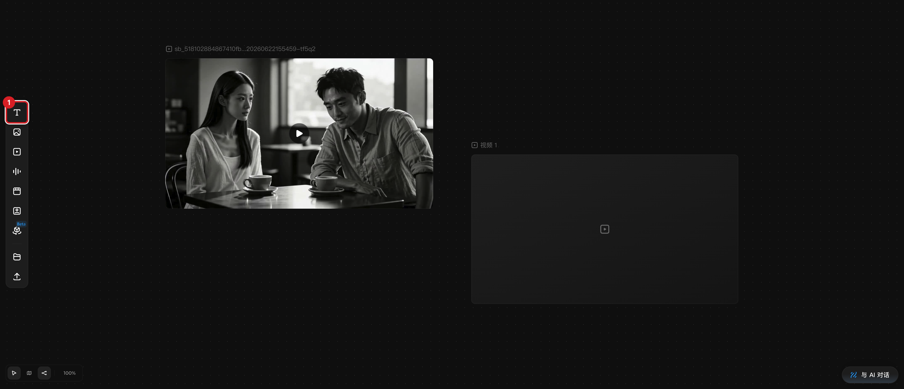
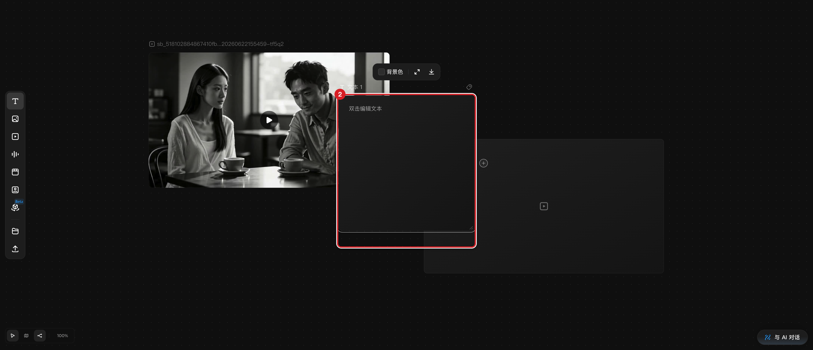
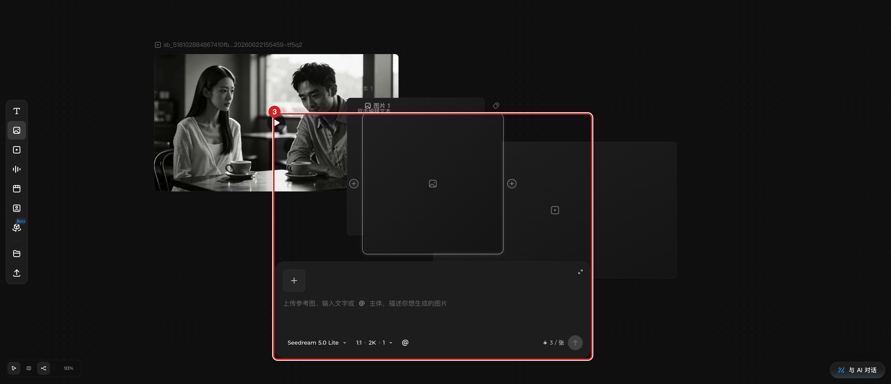
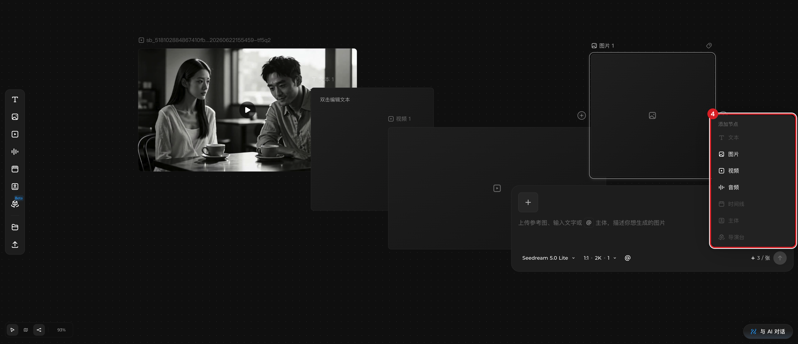
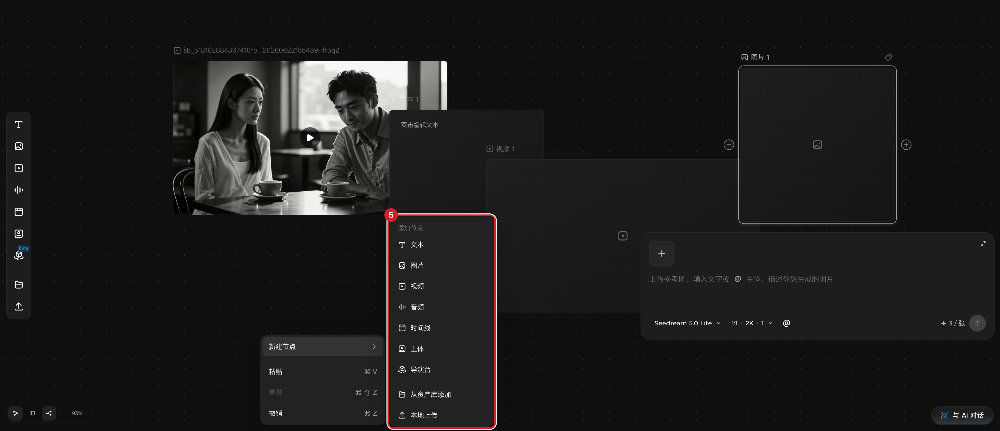
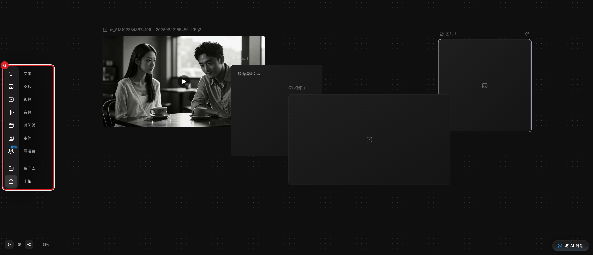

# 创建节点（含本地上传）

## 适用角色

已登录的即梦画布创作者（普通会员即可，创建节点本身不消耗积分）。

## 目标

在画布中创建文本、图片、视频、音频节点，或从本地上传媒体文件作为节点。

## 前置条件

- 已登录并打开一个画布（`/ai-tool/ai-canvas/:projectId`）。
- 本地上传只使用你自己有权使用的文件。

## 入口

- **左栏**：**文本**/**图片**/**视频**/**音频**（另有时间线/主体/导演台/资产库/上传）。
  鼠标悬停左栏时整栏展开为图标+文字标签，便于识别。
- **节点边缘 + 手柄**：悬停已有节点，左右边缘中点出现 **+** 圆钮。
- **空白处右键 → 新建节点**（子菜单，含 从资产库添加/本地上传）。

## 原子步骤

### 方式 A：左栏插入（实测）

1. 点击左栏 **文本**。
2. 画布中央立即出现新节点「文本 1」，自动选中，顶栏节点计数加一。
3. 结果：选中文本节点上方出现工具条（**背景色**/**全屏**/**下载**）。
   - 成功判据：画布状态行节点数加一，新节点带选中描边。
   - 每类节点建一个后，命名按「文本 1、文本 2…」递增。
4. **图片** 同法：创建「图片 1」并自动弹出图片生成面板（模型 Seedream 5.0 Lite、
   1:1 · 2K、价格 ✦3 / 张）。
5. **视频** 同法：创建空视频节点并弹出视频生成面板（默认 即梦 Seedance 2.0 VIP、
   16:9 · 720P、4s、✦56 起）。

### 方式 B：+ 手柄创建并连线（实测）

1. 悬停源节点，点击边缘 **+**（aria 为 `Create connected node after …`）。
2. 弹出「添加节点」菜单：文本/图片/视频/音频/时间线/主体/导演台。
3. 点击其中一项（如 **视频**）→ 新节点建在源节点旁，并**自动生成一条参考连线**。
   - 成功判据：节点数与连线数各加一（状态行 `…, 1 edge, …`）。
   - 注意：与源节点类型无法连接的项会标「无法连接这些节点」并禁用
     （例如从视频节点出发时，文本/图片/音频/导演台不可连）。

### 方式 C：空白右键（实测）

1. 在空白处点右键 → 菜单含 **新建节点**、**粘贴 ⌘V**、**重做 ⌘⇧Z**、**撤销 ⌘Z**。
2. 悬停 **新建节点** 展开子菜单：文本/图片/视频/音频/时间线/主体/导演台 +
   **从资产库添加** + **本地上传**。
3. 点击子菜单项即在右键位置创建。

### 方式 D：本地上传

1. 悬停左栏，点击 **上传**（左栏最后一个入口）。
2. 系统文件选择器打开（支持多选）。选择文件后生成对应媒体节点，节点标题为文件名。
   - 注意：上传本身免费；上传后节点工具条上的 **智能超清**/**补帧** 等是
     付费功能，见 [使用节点工具条](use-node-toolbar.md)。

## 取消 / 恢复

- 误建节点：选中按 **⌫**，或右键 → **删除 ⌫**；**⌘Z** 可撤销。
- 视图太乱：底部缩放按钮 → **适配画布 ⇧1**。

## 相关任务

[平移缩放与视图](navigate-canvas.md) ｜ [连接节点](connect-nodes.md) ｜
[准备生成](prepare-generation.md)

## 已验证说明

本文步骤来自 2026-09-23 在源站画布的实测（左栏插入、+ 菜单、右键菜单均逐项执行）。
方式 D 的文件选择与上传完成态在当前轮次未实际执行，正式标注为「入口已验证、
上传流程待验证」。

## 步骤图

