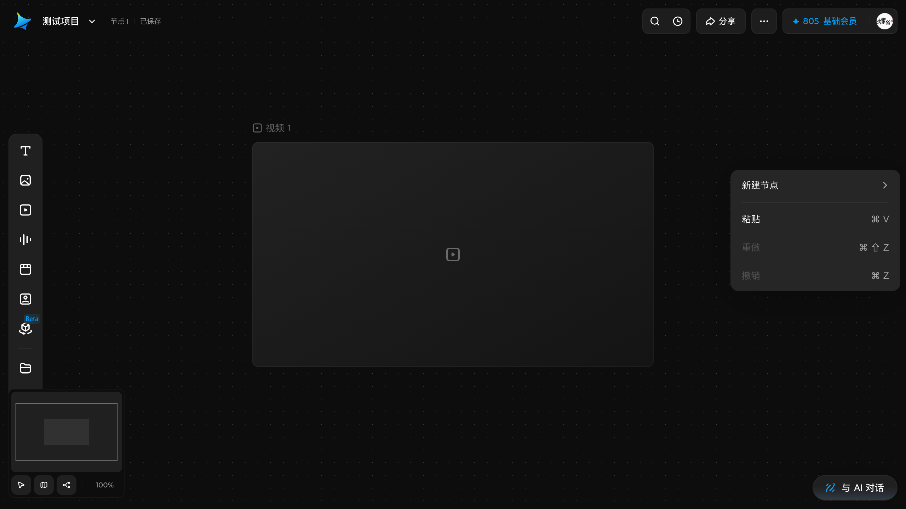
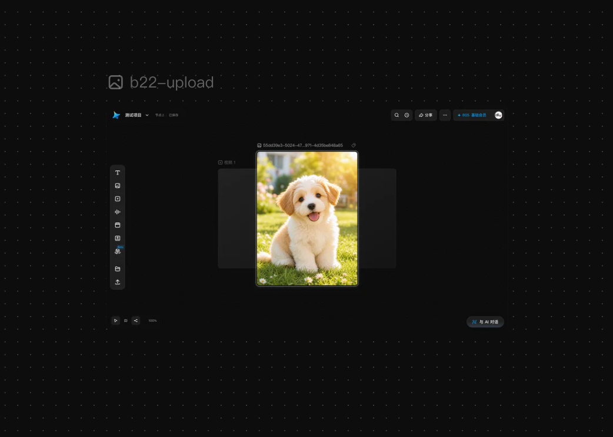
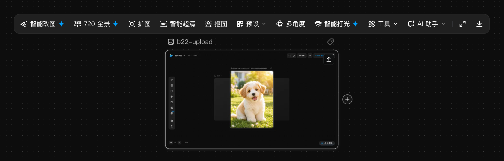
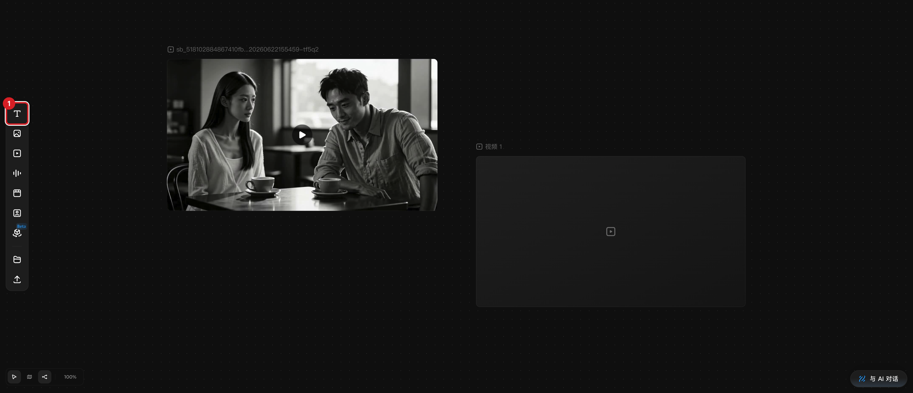
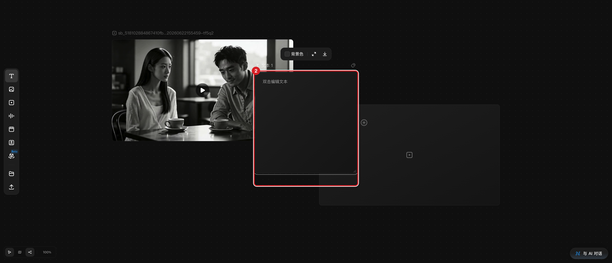
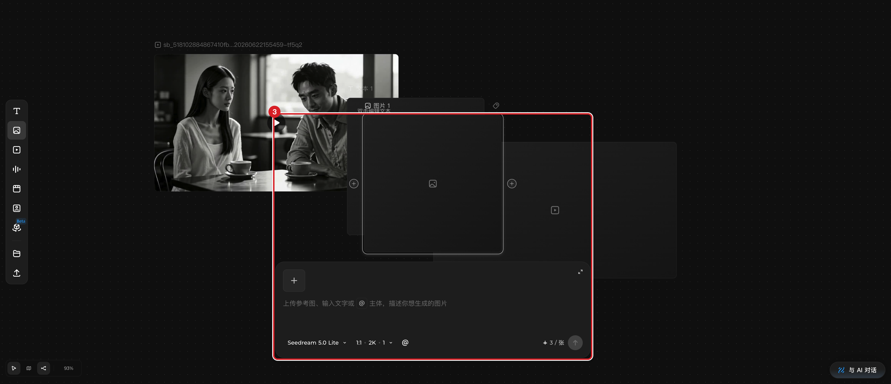
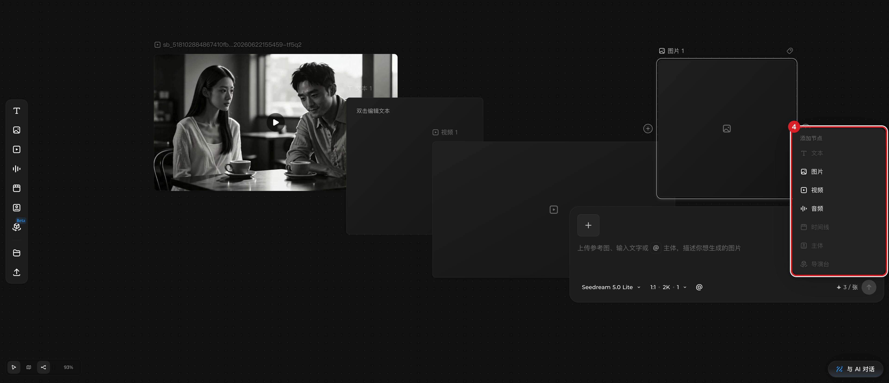
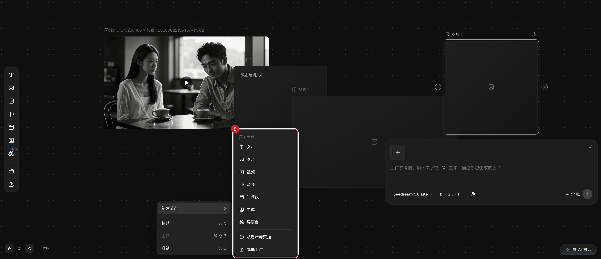
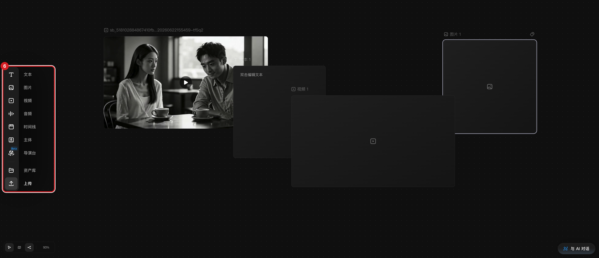

# 创建节点（含本地上传）

## 适用角色

已登录的即梦画布创作者（普通会员即可，创建节点本身不消耗积分）。

## 目标

在画布中创建文本、图片、视频、音频节点，或从本地上传媒体文件作为节点。

## 前置条件

- 已登录并打开一个画布（`/ai-tool/ai-canvas/:projectId`）。
- 本地上传只使用你自己有权使用的文件。

## 入口

- **左栏**：**文本**/**图片**/**视频**/**音频**（另有时间线/主体/导演台/资产库/上传）。
  鼠标悬停左栏时整栏展开为图标+文字标签，便于识别。
- **节点边缘 + 手柄**：悬停已有节点，左右边缘中点出现 **+** 圆钮。
- **空白处右键 → 新建节点**（子菜单，含 从资产库添加/本地上传）。

## 原子步骤

### 方式 A：左栏插入（实测）

1. 点击左栏 **文本**。
2. 画布中央立即出现新节点「文本 1」，自动选中，顶栏节点计数加一。
3. 结果：选中文本节点上方出现工具条（**背景色**/**全屏**/**下载**）。
   - 成功判据：画布状态行节点数加一，新节点带选中描边。
   - 每类节点建一个后，命名按「文本 1、文本 2…」递增。
4. **图片** 同法：创建「图片 1」并自动弹出图片生成面板（模型 Seedream 5.0 Lite、
   1:1 · 2K、价格 ✦3 / 张）。
5. **视频** 同法：创建空视频节点并弹出视频生成面板（默认 即梦 Seedance 2.0 VIP、
   16:9 · 720P、4s、✦56 起）。

### 方式 B：+ 手柄创建并连线（实测）

1. 悬停源节点，点击边缘 **+**（aria 为 `Create connected node after …`）。
2. 弹出「添加节点」菜单：文本/图片/视频/音频/时间线/主体/导演台。
3. 点击其中一项（如 **视频**）→ 新节点建在源节点旁，并**自动生成一条参考连线**。
   - 成功判据：节点数与连线数各加一（状态行 `…, 1 edge, …`）。
   - 注意：与源节点类型无法连接的项会标「无法连接这些节点」并禁用
     （例如从视频节点出发时，文本/图片/音频/导演台不可连）。

### 方式 C：空白右键（实测）

1. 在空白处点右键 → 菜单弹出（`role="menu"`，aria 逐字
   **`Canvas context menu`**，实测 **240×172**），四项各 232×36：

   | 逐字 | 快捷键 | 备注 |
   |---|---|---|
   | **新建节点** | — | 带子菜单 |
   | **粘贴** | ⌘V | aria 逐字 `粘贴` |
   | **重做** | ⌘⇧Z | 禁用时条目下方附「无需重做操作」 |
   | **撤销** | ⌘Z | 禁用时条目下方附「无需撤销操作」 |

2. 悬停 **新建节点** 展开子菜单：文本/图片/视频/音频/时间线/主体/导演台 +
   **从资产库添加** + **本地上传**。
3. 点击子菜单项即在右键位置创建。
4. **Esc** 可关闭右键菜单（实测关闭成功）。

### 方式 D：本地上传（2026-10-01 批次 64 全程实测，已关闭「上传流程待验证」）

1. 悬停左栏，点击 **上传**（左栏最后一个入口，`40×40`）。
2. **系统文件选择器打开**（实测触发 filechooser 事件，`isMultiple = true` ⇒ **支持多选**）。
3. 选好文件后**立刻**生成对应媒体节点，并**自动选中**它。

**实测细节**（传一张 PNG，全过程积分 805 → 805 **未变**）：

| 观察项 | 读数 |
|---|---|
| 节点类型 | `react-flow__node-image` |
| 节点 aria | 逐字 **`图片 node: b22-upload`** |
| 标题 | **`b22-upload`** —— 是**去掉扩展名**的文件名，不是完整文件名 |
| 卡片尺寸 | `341×192` |
| 状态行 | 上传完成即 `7 nodes, 0 edges, 1 selected.`（**自动选中**） |

🔑 **缩略图分两阶段换源**（密集采样 10 点，t=0…8000ms）：

| 时刻 | `img` 读数 |
|---|---|
| **t=0 … 2200ms** | `2560×1440`，`src=blob:…`（**本地 blob，原图**） |
| **t≈3200ms** | `360×203`，`src=https://p11-dreamina-sign.byteimg.com/…`（远程缩略图） |
| **t≈4500ms 起** | `720×405`，同上（换成大一号缩略图） |

⇒ **「节点出现了」不等于「上传处理完了」** ——
前 2 秒多显示的是本地原图，之后才换成服务端缩略图。想截「完成态」要等 5 秒以上。

**支持的文件类型**（画布上有一个**常驻的隐藏** `<input type="file">`，
`0×0`、`multiple=true`、`accept` 长 **1106 字符**）：

- **图片 17 种**：jpg / jpeg / png / webp / bmp / tiff / gif / heif / heic（含 `-sequence` 变体）
- **视频 20 种**：mp4 / m4v / webm / mov / flv / mkv / avi / wmv / asf / rm / rmvb / 3gp /
  mp2t / m2ts / mxf / mpg / mpeg / mpe 等
- **音频 15 种**：mp3 / mpa / wav / wave / m4a / flac / aac / ogg / oga / wma / amr / aiff / ac3 / ape / monkeys-audio
- **文本 2 种**：`text/markdown`、`.md` / `text/plain`、`.txt`

⚠️ **本批只传过 PNG**。视频 / 音频 / 文本节点的上传完成态
**仍未验证** —— 但**入口与选择器已实测**，不再是「入口都没试过」。

**上传免费**（实测 805→805）；上传后节点工具条上的
**智能超清 / 补帧 / 智能改图** 等才是**付费功能**，
见 [使用节点工具条](use-node-toolbar.md)。

**选中上传的图片节点后，工具条 12 项**（`959×40`，实测逐字）：
`智能改图` ｜ `720 全景` ｜ `扩图` ｜ `智能超清` ｜ `抠图` ｜ `预设` ｜
`多角度` ｜ `智能打光` ｜ `工具` ｜ `AI 助手` ｜ `全屏` ｜ `下载`
—— 与批次 22 独立记录的「实测 12 项」**逐项一致**（本批**第三次**独立复核通过）。

> 工具条上 `智能改图` / `720 全景` / `智能打光` 带 **✦**（会员权益），
> `预设` / `工具` / `AI 助手` 带 **∨**（有下拉子菜单）——
> **逐项、逐个标记都与[使用节点工具条](use-node-toolbar.md)里批次 22 的表格完全吻合**。
> 本批**第三次**独立复核通过（批次 22 → 批次 64 首轮 → 批次 64 重截）。

## 移动节点（2026-10-01 实测，此前未单独记录）

1. **选择工具**模式下，按住节点卡片拖动即可移动（实测节点屏幕坐标随鼠标
   同步变化，方向与幅度一致）。
   - 拖动时节点**保持选中**，状态行的 `selected` 计数不变。
   - 成功判据：松手后节点停在新位置，且顶栏「已保存」点亮。
2. **⌘Z** 可**精确还原**位置：实测拖动后按一次 ⌘Z，节点坐标与拖动前
   **完全一致**（`dx=0 dy=0`）。
   - 与删除一样，**刷新页面后 ⌘Z 不再有效**（见[复制、删除与撤销](duplicate-delete-history.md)）。
3. ⚠️ 拖动要**按住卡片主体**。节点四角与四边中点有按钮（`Create connected node
   before/after …`、`Rename …`、`Edit tags: …`）和缩放把手，按到它们会触发
   按钮而不是拖动。

### 双击节点（2026-10-01 实测：没有独立行为）

- 实测对视频节点**双击**与**单击**结果**完全相同**：只是选中节点并打开同一个
  节点工具条（`node-toolbar` 680×208），**不进入全屏、不弹出对话框、
  不进入编辑态**。
- 想要全屏预览，走节点工具条里的 **全屏** 按钮，不要指望双击。
  （文本节点有编辑态，媒体节点没有——见[编辑文本节点](edit-text-node.md)。）

## 取消 / 恢复

- 误建节点：选中按 **⌫**，或右键 → **删除 ⌫**；**⌘Z** 可撤销。
- 误移动节点：**⌘Z**（实测可精确还原位置）。
- 视图太乱：底部缩放按钮 → **适配画布 ⇧1**。

## 相关任务

[平移缩放与视图](navigate-canvas.md) ｜ [连接节点](connect-nodes.md) ｜
[准备生成](prepare-generation.md)

## 已验证说明

本文步骤来自 2026-09-23 在源站画布的实测（左栏插入、+ 菜单、右键菜单均逐项执行）。

**✅ 方式 D 的上传流程已于 2026-10-01 批次 64 关闭**（此前标「入口已验证、
上传流程待验证」，理由**早已过期** —— 批次 22 早已用同一个
`filechooser` 通道传通过一次）：入口触发、`isMultiple=true`、节点生成、
标题去扩展名、自动选中、缩略图两阶段换源、12 项工具条、积分 805→805 全部实测。
**仍未验证**：视频 / 音频 / 文本文件的上传完成态（只传过 PNG）。

⚠️ 本批的一个**自伤**记录：首轮截图用
`p.waitForEvent('filechooser', {timeout:8000})` 一直不触发，
改用全局 `p.on('filechooser')` 后**一次就中**。
⇒ 那是**我的监听方式**的问题，**不是产品的 filechooser 坏了**。
遇到「等不到事件」时，先怀疑自己的等待方式，再怀疑产品。

⚠️ 配图也返工过一次：首轮 `64-upload-node-selected.png` 的 clip 按
「节点 rect + padding」算，而工具条 `959` 比节点 `341` 宽得多，
**工具条两端被裁掉，图里只剩 8 项，正文却写 12 项**。
改按「工具条 ∪ 节点」并集算 clip 后重截，并加断言
「逐个按钮中心点必须落在 clip 内」（本批 `12 项 / 裁掉 0 项`）。
详见 [概念页 · 配图也会说谎](../30-concepts.md)。

## 步骤图

