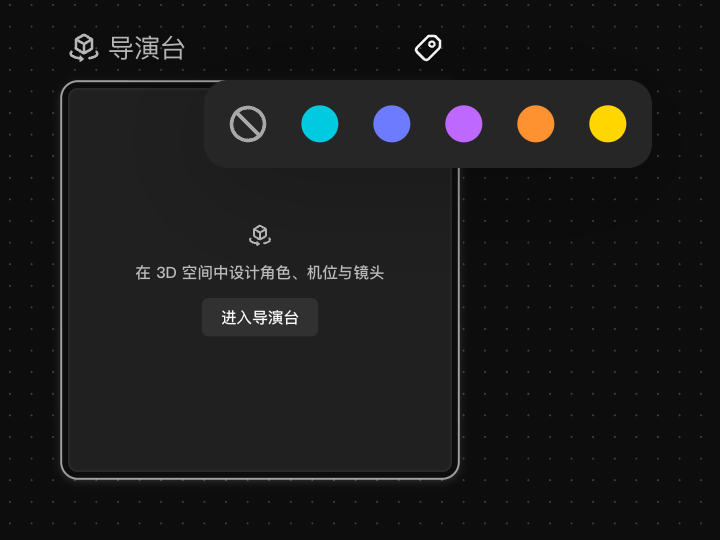
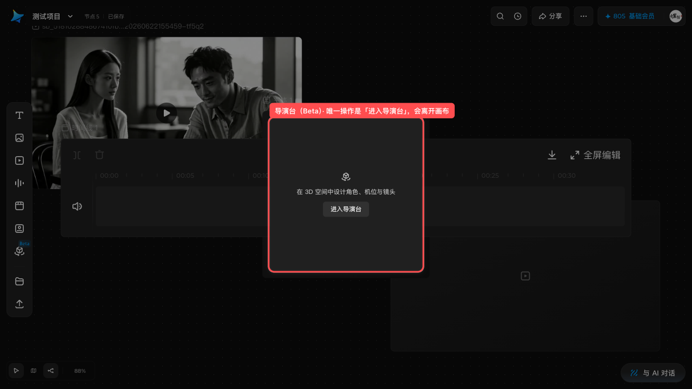

# 导演台节点（Beta）

## 适用角色

已登录的即梦画布创作者。

## 目标

知道左栏 **导演台** 是什么、它在画布里能做什么，以及它的边界在哪里——
它是画布上的一个**入口节点**，真正的工作台在画布之外。

## 前置条件

已打开一个画布。创建导演台节点本身**不消耗积分**。

## 入口

左栏 **导演台**（第 7 项，带 **Beta** 徽标）。点击即在画布上新建「导演台」节点。

## 节点长什么样（2026-10-01 实测）

- DOM class 为 **`react-flow__node-external`**——它不是专属类型，而是
  即梦的「外部工作台入口」通用节点形态。
- 📌 **尺寸要看 canvas 值，不要看屏上像素**（2026-10-01 批次 68 双缩放复量）：

  | 缩放 | 屏上尺寸 | 换算 canvas 尺寸 |
  |---|---|---|
  | 60% | `192×192` | **320×320** |
  | 100% | `320×320` | **320×320** |

  ⇒ **节点恒为 `320×320` canvas 像素**，屏上大小随缩放变。
  🔧 旧记「视口内约 **281×281**」自洽于 **87.8%** 缩放（`320 × 0.878 ≈ 281`），
  不是记错，而是**拿屏上像素当契约**——那类数字换个缩放就失效。已改为 canvas 口径。
- 节点内只有三样东西：
  1. 标题 **导演台**；
  2. 一句话说明：**在 3D 空间中设计角色、机位与镜头**；
  3. 唯一的操作按钮 **进入导演台**。
- **选中它没有浮动工具条**（与主体、时间线节点一致）。
- 有 **2 个**连接手柄，支持 **Rename 导演台** 与 **Add tags**。
  🔴 **`Rename 导演台` 仅选中时出现**（35.5~39×32，顶边在卡片顶边上方 32px、**与卡片顶齐平**）；
  静息态和悬停态下全篇页面里都数不到它。
- 🔴 **选中后「进入导演台」按钮会丢掉 `aria-label`，而且标签本身也会换**：
  静息态它是 **`SPAN`**`[aria-label="进入导演台"]`（`58×19`，`cursor: grab`，**不可点**）；
  **选中后同一位置同一尺寸变成 `BUTTON`**、`cursor: pointer`、可点，但 **`aria-label` 变成 `null`**。
  ⇒ **没有任何一个选择器能同时命中两态**：按 `aria-label` 查在选中后扑空，
  按 `button` 查在静息态扑空。
  👉 **唯一稳定的定位器是「位置」** —— `58×19`，两态分毫未变。
  （2026-10-01 批次 57 已记「选中后 aria 变 null」，批次 68 补上**标签 SPAN→BUTTON** 这一半。）
- 📌 **静息态与选中态的元素差分**（2026-10-01 批次 68 实测，`selected` 计数已断言为 0）：

  | | 静息态 | 选中态 |
  |---|---|---|
  | `Add tags` | ✅ `24×24` | ✅ `24×24` |
  | `Rename 导演台` | ❌ **不在 DOM 里** | ✅ `39×32` |
  | 「进入导演台」（可点） | ❌ 不可点 | ✅ 可点 |

  ⚠️ 注意 `Rename 导演台` **肉眼看不见**：它是**盖在标题上的透明命中区**
  （`39×32@564,232` 与 `flow-node-title` `59×32@544,232` **同一 y**），
  选中态的画面上**看不出它出现了**——别用「图上有没有」判断它存不存在。

## 原子步骤

### 1. 创建导演台节点（实测）

1. 点击左栏 **导演台** → 画布上出现「导演台」节点，自动选中。
2. 成功判据：节点数 +1。

### 2. 进入导演台

1. 点击节点内的 **进入导演台**。
2. 这会**离开当前画布**，进入独立的 3D 导演工作台（用于摆放角色、机位与镜头）。

> ⚠️ **本手册的范围到画布为止**。3D 导演台是画布之外的独立页面，
> 其界面、机位操作与渲染流程**不在本手册覆盖范围内**——请以进入后的实际界面为准。

### 3. 重命名节点（2026-10-01 批次 68 新增实测）

1. **双击节点标题**（标题行那行「导演台」）→ 标题变成输入框
   （`INPUT`，`aria-label="Node title"`）。
2. 全选后输入新名字，按 **Enter** 提交。
3. 再双击标题 → 改回原名 → Enter，即刻还原。

✅ **闭环实测**：改名为「导演台-测」后首行逐字变为 `导演台-测`，
再改回后逐字恢复 `导演台`。

⚠️ **点那个 `Rename 导演台` 按钮不会进编辑态** ——
实测点它之后 `document.activeElement` **仍是那个 `BUTTON`**，
没有出现输入框。**双击标题**才是入口。
（这也解释了为什么它是「盖在标题上的透明命中区」：
它标记的是「这里可以改名」，真正的交互是**双击**。）

### 4. 打标签（2026-10-01 批次 68 新增实测）

1. 点节点标题行右侧的 **`Add tags`**（`24×24`）→ 展开标签面板
   `canvas-node-tag-selector`，**`224×44`**。
2. 面板里是 **6 个 `28×28` 按钮**：

   | 逐字（aria） | `data-toolbar-value` |
   |---|---|
   | 全部清空 | `clear` |
   | 添加“青绿色” | `default-tag-1` |
   | 添加“靛蓝色” | `default-tag-2` |
   | 添加“紫色” | `default-tag-3` |
   | 添加“橙色” | `default-tag-4` |
   | 添加“黄色” | `default-tag-5` |

3. 五个预设标签的颜色与节点**背景色**色板一致（青绿 / 靛蓝 / 紫 / 橙 / 黄），
   只是**没有「无颜色」那一项**（清空单独由 `全部清空` 承担）。
4. ⚠️ **面板里没有任何输入框**（实测全文档可见 `input`/`contenteditable` 为 **0** 个）
   ⇒ **标签只能从这 5 个预设里挑，不能自定义文字。**

> ⚠️ **「全部清空」点了不生效**（2026-10-01 批次 69 两轮 + 批次 70 对照复测）：
> 打上标签后该按钮的 aria 会从 `Add tags` 变成 **`Edit tags: 青绿色`**（这是「已打标签」的判据）；
> 但点「全部清空」之后，**+600 / +1500 / +3000ms 三次复查都没变**，面板也**一直开着**。
> 批次 70 在**文本节点**上做了对照，**读数逐字相同**
> ⇒ **这是全局行为，不是导演台节点的怪癖**。
> 唯一可靠的清法是**删掉整个节点**（标签随节点一起消失）。
> 标签的完整契约见 [参考页 · 节点标签](../20-reference.md)。
>
> 📌 **标签会跟着节点一起删**：本批打上标签的节点最终按 id 精确删除，
> 画布恢复 `6 nodes`、**无遗留**，说明**在临时节点上试标签是安全的**
> （与「保存到主体库」不同 —— 那是写**共享**主体库，本批始终没碰）。

### 5. 连线规则（实测）

- 从**视频**或**图片**节点发起连接时，+ 菜单里的 **导演台** 会标注
  **「无法连接这些节点」**并处于禁用态。
- 也就是说，导演台节点目前**不能**像时间线那样被普通媒体节点直接连线引用。
  若确实需要引用，请先在画布内完成，再进入导演台。
- 🔴 **反方向也不行：导演台节点没有 ⊕ 按钮**（2026-10-01 批次 69 实测）。
  选中它之后，全文档 `aria-label^="Create connected node"` 命中数 **0**
  （同一轮里文本节点命中 **1**，构成对照），而它的两个连接手柄
  `flow-node-target/source-handle` 在选中态是 `opacity: 0` + **`pointer-events: none`**。
  ⇒ **导演台根本不能作为连线起点** —— 这比「能发起但被禁用」更彻底：
  你**找不到那个 ⊕**，不是「点它然后灰的」。
  ⚠️ 别把这条与上一条搞混：
  「媒体 → 导演台」是**菜单里有一项但是灰的**；「导演台 → 媒体」是**菜单压根不存在**。
- 📌 从**文本节点**出发时，`添加节点` 菜单里**只有「图片」和「视频」可用**，
  文本 / 音频 / 时间线 / 主体 / 导演台 五项都标「无法连接这些节点」
  （逐项 `aria-disabled="true"`、`cursor: not-allowed`）。见 [连接节点](connect-nodes.md)。

## 取消 / 恢复

- 删除导演台节点：选中按 **⌫**；误删用 **⌘Z** 恢复。
- 从导演台返回画布：使用其界面自带的返回入口（本手册未取证其具体形态）。

## 常见错误与恢复

| 现象 | 原因 | 处理 |
|---|---|---|
| + 菜单里「导演台」是灰的 | 视频/图片节点不能连导演台，会标「无法连接这些节点」 | 这是产品限制，不是故障 |
| 想**从**导演台节点拉线，却找不到 ⊕ | 导演台节点**没有 ⊕ 按钮**（实测命中数 0） | 无法作为连线起点，请从媒体/文本节点发起 |
| 点了标签面板里的「**全部清空**」，标签还在 | 实测点了**不生效**：+800 / +2000 / +4000ms 复查 `Edit tags: 青绿色` 都不变，面板也不关闭 | 唯一可靠的清法是**删掉节点**（标签随节点一起没了） |
| 选中导演台没有工具条 | 导演台本就没有浮动工具条 | 节点内只有「进入导演台」一个操作 |
| 点「进入导演台」后离开了画布 | 导演台是外部工作台入口 | 3D 导演台不在本手册范围；用其自带返回入口回到画布 |

## 相关任务

[创建节点](create-first-node.md) ｜ [连接节点](connect-nodes.md) ｜
[使用主体节点](subject-node.md) ｜ [使用时间线节点](timeline-node.md)

## 已验证说明

**2026-10-01 源站实测**：导演台节点创建、**DOM class 为 `react-flow__node-external`**
（外部工作台入口的通用形态）、**canvas 恒 320×320** 尺寸、**无浮动工具条**、节点内文案
「在 3D 空间中设计角色、机位与镜头」与唯一按钮 **进入导演台**、
2 个连接手柄、Rename / Add tags、以及从视频/图片节点连接时被禁用并标注
「无法连接这些节点」。

**2026-10-01 批次 68 补测**（不进入 3D 工作台也能测的部分）：
**双缩放尺寸复量**（60% `192×192` / 100% `320×320` ⇒ canvas 恒 `320×320`，
并据此判定旧记 `281×281` 是 87.8% 缩放下的屏上值、**不是**记错而是口径错）；
**静息/选中元素差分**；**`Rename` 按钮只标记不改名、真入口是双击标题**；
**重命名闭环**（改名 → 改回）；**标签面板结构**（`224×44`、6 个按钮、无输入框）。

**2026-10-01 批次 69 补测**：**反向连线**（导演台节点**没有 ⊕ 按钮**，
`Create connected node` 命中数 0，对照组文本节点为 1）；
**标签落地**（aria `Add tags` → `Edit tags: 青绿色`）；
**「全部清空」无效**（两轮复测、三次延时复查均不变，面板不关）。

**未执行 / 未验证**：**进入导演台** 之后的 3D 工作台（本手册范围止于画布）、
从导演台返回画布的具体入口、**标签是否在多个节点间共享**（本批只用了一个节点，
不构成证据）。

## 步骤图

