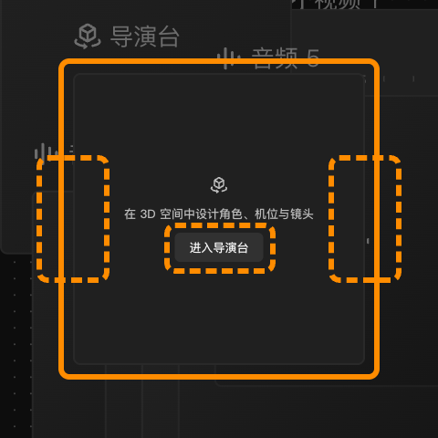
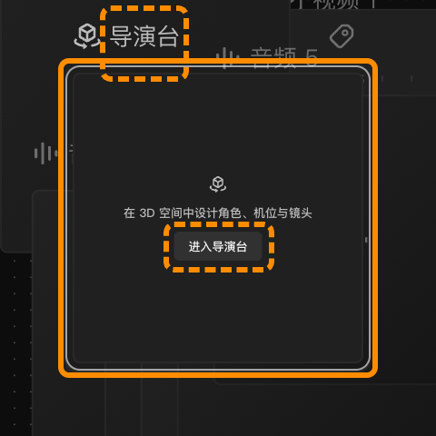
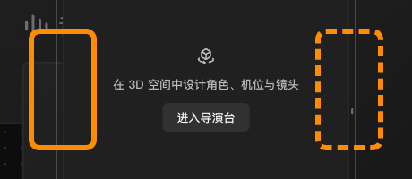
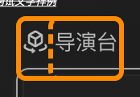

# 导演台节点（Beta）

## 适用角色

已登录的即梦画布创作者。

## 目标

知道左栏 **导演台** 是什么、它在画布里能做什么，以及它的边界在哪里——
它是画布上的一个**入口节点**，真正的工作台在画布之外。

## 前置条件

已打开一个画布。创建导演台节点本身**不消耗积分**。

## 入口

左栏 **导演台**（第 7 项，带 **Beta** 徽标）。点击即在画布上新建「导演台」节点。

## 节点长什么样（2026-10-01 实测）

- DOM class 为 **`react-flow__node-external`**——它不是专属类型，而是
  即梦的「外部工作台入口」通用节点形态。
- 📌 **尺寸要看 canvas 值，不要看屏上像素**（2026-10-01 批次 68 双缩放复量）：

  | 缩放 | 屏上尺寸 | 换算 canvas 尺寸 |
  |---|---|---|
  | 60% | `192×192` | **320×320** |
  | 100% | `320×320` | **320×320** |

  ⇒ **节点恒为 `320×320` canvas 像素**，屏上大小随缩放变。
  🔧 旧记「视口内约 **281×281**」自洽于 **87.8%** 缩放（`320 × 0.878 ≈ 281`），
  不是记错，而是**拿屏上像素当契约**——那类数字换个缩放就失效。已改为 canvas 口径。

- 节点内只有三样东西：
  1. 标题 **导演台**；
  2. 一句话说明：**在 3D 空间中设计角色、机位与镜头**；
  3. 唯一的操作按钮 **进入导演台**。
- **选中它没有浮动工具条**（与主体、时间线节点一致）。

- 有 **2 个**连接手柄（热区），支持 **Rename 导演台** 与 **Add tags**。
  - 🆕 **批次 193 复测（50% 档）**：两个热区是 `flow-node-target-handle`（左）与
    `flow-node-source-handle`（右），屏上各 **`30×60`**，换算 canvas **`60×120`**
    —— 与 `connect-nodes.md` 页首契约表的「canvas 恒为 `60×120`」逐字一致。
  - 🔴 **它们本体在「静息 / 选中 / 悬停」三态 `opacity` 都是 `0`**，
    `background` 逐字 `rgba(0, 0, 0, 0)`、`border` 逐字 `0px solid`。
    ⇒ **你在画面上看到的不是这两个元素。** 悬停时那个位置会浮出一块**很淡的灰底**，
    但**本轮没有隔离出它是哪个元素**（**机制未隔离，只记现象**）。
  - 📌 **与「⊕ 按钮」是两回事**：`connect-nodes.md` 已记 handle 是 `pointer-events: none` 的热区、
    真正可见的 ⊕ 是它的**兄弟** `*-connection-menu-button`。
    而**本节点内一个 `*connection-menu-button` 都没有**（逐字读 `节点内全部带 button 后缀的 testid` = `[]`）
    ⇒ **复现了 `connect-nodes.md:479`「导演台节点没有 ⊕」**（批次 69 首测、71 复现，本轮第三次）。

  🔴 **`Rename 导演台` 仅选中时出现**（35.5~39×32，顶边在卡片顶边上方 32px、**与卡片顶齐平**；
  ⚠️ **「上方 32px」已被批次 88 推翻**：40/60/100% 三档屏上 dy 是 −26/−32/−32，canvas dy 是 −64/−53/−32，**两个口径都不恒定**）；
  静息态和悬停态下全篇页面里都数不到它。
  - ✅ **2026-10-02 批次 88 复现成功**，且把定位方法补全了：
    它是 `BUTTON`（`class="gap-1 border-solid"`），**屏上 `39×32@564,232`**，
    `aria-label` 逐字 **`Rename 导演台`**，静息时 `cursor: grab`、选中时 `cursor: pointer`。
    - ⚠️🔴 **它的 `innerText` 逐字是「导演台」，`aria-label` 才是「Rename 导演台」** ——
      两处文案**不同**。按文字找它会拿到**永远存在的那个 `SPAN`（`39×24@564,232`）**，
      那才是静息态就在的元素。
      **只能按 `aria` 找**：`[aria-label="Rename 导演台"]`。
    - 🖼 **它真的是一块「什么都没有的透明区」**（批次 193 补图，50% 档）：
      把它和 `flow-node-title` 一起框出来叠在一张图上 —— 实线框是标题
      （`59×32`），虚线框是 `Rename 导演台` 那个 `BUTTON`（`39×32`），
      **两者顶边逐字同高**（`y` 都是 `248`），而虚线框里一个字都没有。
      它的 `background` 逐字是 **`rgba(0, 0, 0, 0)`**、`border` 逐字是 **`0px none rgba(255, 255, 255, 0.698)`**
      ⇒ 「透明」不是形容，是**计算值**。

    - 📌 **静息 → 选中，标题那一行的元素差集恰好只有 1 个**（批次 88 实测）：
      静息 `2` 个 = `flow-node-title`（`DIV 59×32@544,232`）+ 内层 `SPAN`（`39×24@564,232`）；
      选中 `3` 个 = 上面两个 **＋ `BUTTON 39×32@564,232`（`aria="Rename 导演台"`）**。
      其余一切不变。
- 🔴 **选中后「进入导演台」按钮会丢掉 `aria-label`，而且标签本身也会换**：
  静息态它是 **`SPAN`**`[aria-label="进入导演台"]`（`58×19`，`cursor: grab`，**不可点**）；
  **选中后同一位置同一尺寸变成 `BUTTON`**、`cursor: pointer`、可点，但 **`aria-label` 变成 `null`**。
  ⇒ **没有任何一个选择器能同时命中两态**：按 `aria-label` 查在选中后扑空，
  按 `button` 查在静息态扑空。
  👉 **唯一稳定的定位器是「位置」** —— `58×19`，两态分毫未变。
  （2026-10-01 批次 57 已记「选中后 aria 变 null」，批次 68 补上**标签 SPAN→BUTTON** 这一半。）
- 📌 **静息态与选中态的元素差分**（2026-10-01 批次 68 实测，`selected` 计数已断言为 0）：

  | | 静息态 | 选中态 |
  |---|---|---|
  | `Add tags` | ✅ `24×24`（🔴 批次 89 订正：**24×24 不是契约**，60% 下实测本节点是 `29×29`；真值见下方乘法式） | ✅ `24×24`（同上） |
  | `Rename 导演台` | ❌ **不在 DOM 里** | ✅ `39×32` |
  | 「进入导演台」（可点） | ❌ 不可点 | ✅ 可点 |

  ⚠️ 注意 `Rename 导演台` **肉眼看不见**：它是**盖在标题上的透明命中区**
  （`39×32@564,232` 与 `flow-node-title` `59×32@544,232` **同一 y**），
  选中态的画面上**看不出它出现了**——别用「图上有没有」判断它存不存在。

### 🔴 批次 88 订正：「上方 32px」**不是一条契约**

`flow-node-title` 相对**节点顶边**的偏移，2026-10-02 实测三档：

| 缩放 | scale | 节点屏上 | 标题屏上 | **屏上偏移 dy** | **canvas 偏移 dy** |
|---|---|---|---|---|---|
| 40% | 0.4 | `128×128` | `47×26` | **−26** | −64 |
| 60% | 0.6 | `192×192` | `59×32` | **−32** | −53 |
| 100% | 1.0 | `320×320` | `59×32` | **−32** | −32 |

🔴 **屏上不恒定（26 / 32 / 32），canvas 也不恒定（64 / 53 / 32）。**
⇒ 「标题行在节点上方 **32px**」**只在他那次测量的缩放下成立**，
**不能当契约用**，换个缩放就是 26。
⚠️ 同理，**标题自身的尺寸也不是任一口径的恒定值**：
屏上 `47×26` / `59×32` / `59×32`，canvas `118×64` / `98×53` / `59×32` —— **三档全不同**。

> 💡 **与批次 78 的关系**：批次 78 记的是「标题行在节点矩形**上方 31–33 canvas px**」，
> 本表在 60% 下 canvas dy 是 **53**、100% 下是 **32**。
> ⇒ **批次 78 那条也只在某个缩放下成立**，两处需要一起按本表重读。

### 🔑 「选中它没有浮动工具条」被证实，而且能给 `node-toolbar` 补一行

2026-10-02 实测：选中导演台节点时，页面上
`[data-testid="node-toolbar"]` 命中 **2 个**，但**两个都是占位**：

| 缩放 | 命中的两个 | 有真身吗 |
|---|---|---|
| 60% | `0×0` ＋ **`192×0`** | ❌ 无 |
| 100% | `0×0` ＋ **`320×0`** | ❌ 无 |

🔑 **占位的宽度正好等于节点的屏上宽、高度恒 0** ——
与批次 85 在**文本节点**上看到的占位**同型**（那里是「宽度 = 节点屏上宽、高度 0」）。

⇒ 批次 85 的 `node-toolbar` 类型表**补一行**：

| 选中什么 | `node-toolbar` 真身 |
|---|---|
| 空视频 / 图片 / 音频 | `680×208` / `680×204`（**不随缩放**） |
| 文本 | `192×40`@60%（**随缩放**，canvas 恒 `320×67`） |
| **导演台** | **无**（只有占位） |

### ✅ 2026-10-04 批次 149 复测本页（11/11 全绿，**本页此前最新只到批次 89**）

选题来自一次静态元审计：17 个任务页按「最新批次号」排序，**本页排第一**（第二名已是 109）。
复测的是本页**最反直觉、最可能随版本变**的几条，全部零风险
（**不点「进入导演台」**、不点任何生成/扣费按钮）。结果：

| 本页的结论 | 批次 149 实测 | 判定 |
|---|---|---|
| 「进入导演台」静息是 `SPAN`、**选中后同一位置变 `BUTTON`** | 静息 `SPAN` `58.2×19.2@610.9,369` `cursor:grab` `pe:none`；选中同位置 `BUTTON` `58.2×19.2@610.9,369` `cursor:pointer` `pe:all` | ✅ **逐字复现**（批次 68） |
| 🔴 选中后**按 `aria` 查必然扑空**（＝ `aria-label` 变 `null`），**盒分毫未变** | 按 aria 查扑空；按**位置**查到的是 `BUTTON` 且 `aria: null`、盒 `58.2×19.2` 与静息**逐字相同** | ✅ **逐字复现**（批次 57/68） |
| `Rename 导演台` 只在选中时出现 | 静息查不到；选中 `BUTTON 39×32@564,232` `cursor:pointer`，`innerText` 逐字是 **`导演台`**（不是 `Rename 导演台`） | ✅ 复现（批次 88） |
| 静息→选中元素差集 | 节点内元素 **25 → 26**，差集**恰好 1**（就是那个 `Rename` 按钮） | ✅ 复现（批次 88） |
| 导演台**没有 ⊕ 连接按钮** | 全页 `[aria-label^="Create connected node"]` 命中 **0** | ✅ 复现（批次 69） |
| 两个连接手柄在选中态不可用 | `flow-node-target-handle` / `-source-handle` 各 `36×72`，`opacity: 0`、**`pointer-events: none`** | ✅ 复现 |
| 标签面板 `224×44` + **6 个 `28×28`** 按钮 + **面板内 0 个输入框** | `224×44@612,260`、6 个按钮逐字 `全部清空` / `添加“青绿色”`…`添加“黄色”`、输入面 **0** | ✅ 逐字复现（批次 68） |
| 节点 class `react-flow__node-external`、canvas 恒 `320×320` | class 逐字 `react-flow react-flow__node-external nopan selectable draggable`；60% 下屏上 `192×192` | ✅ 复现 |
| 节点内只有「标题 / 说明 / 进入导演台」 | 逐字 `在 3D 空间中设计角色、机位与镜头` + `进入导演台` | ✅ 复现 |

🆕 **两条本批新记的**：

1. 🔑 **静息态 `node-toolbar` 实例数是 0，选中才变成 2 个** ——
   批次 85 与本页此前都只在**选中态**量过。
   选中后那两个仍**全是零高度**（`0×0@640,476` + **`192×0@544,228`**，各 0 按钮 0 svg），
   与批次 85 的读数**逐字吻合**。
   另有 `selection-context-toolbar-surface` **`192×0`**、`node-toolbar-feature-host` **`0×0`**。
2. 🆕 节点内 **5 个** testid：`flow-node-title`、`flow-node-selected-tag`、
   `flow-node-target-handle`、`flow-node-source-handle`、**`director-stage-flow-node-shell`**。

🔴 **本批订正本页一处**：「`Add tags` 在本导演台节点上是 `29×29`」**不成立** ——
批次 149 在**新建的导演台节点**上实测是 **`24×24`**（`[data-testid="flow-node-selected-tag"]`）。
批次 89 那条「`24×24` 不是契约」的**结论仍然成立**，错的是**把某一档写成本节点的定值**。
⚠️ 无法判定是**同一节点类型不同节点之间不同**、还是**那枚 counter-scale 变量后来变了** ——
画布上只有一个导演台节点，**没法做同型对照**，如实标注不下机制结论。
📌 **批次 150 补了对照（用的是别的四族，导演台族仍缺）**：音频 / 图片 / 视频 / 文本
**各建 3 个同族节点**实测，`--octo-canvas-node-chrome-counter-scale` **同族三节点逐字相同**（4/4），
变的是**族**（音频 `1.843…`、图片 `1.892…`、视频 `1.892…`、文本 `1.667…`）。
⇒ 「同型不同节点之间必然不同」**不成立**；但**导演台族本身仍没做过同型对照**，机制仍记为待查。

## 原子步骤

### 1. 创建导演台节点（实测）

1. 点击左栏 **导演台** → 画布上出现「导演台」节点，自动选中。
2. 成功判据：节点数 +1。

### 2. 进入导演台

1. 点击节点内的 **进入导演台**。
2. 这会**离开当前画布**，进入独立的 3D 导演工作台（用于摆放角色、机位与镜头）。

> ⚠️ **本手册的范围到画布为止**。3D 导演台是画布之外的独立页面，
> 其界面、机位操作与渲染流程**不在本手册覆盖范围内**——请以进入后的实际界面为准。

### 3. 重命名节点（2026-10-01 批次 68 新增实测）

1. **双击节点标题**（标题行那行「导演台」）→ 标题变成输入框
   （`INPUT`，`aria-label="Node title"`）。
2. 全选后输入新名字，按 **Enter** 提交。
3. 再双击标题 → 改回原名 → Enter，即刻还原。

✅ **闭环实测**：改名为「导演台-测」后首行逐字变为 `导演台-测`，
再改回后逐字恢复 `导演台`。

⚠️ **点那个 `Rename 导演台` 按钮不会进编辑态** ——
实测点它之后 `document.activeElement` **仍是那个 `BUTTON`**，
没有出现输入框。**双击标题**才是入口。
（这也解释了为什么它是「盖在标题上的透明命中区」：
它标记的是「这里可以改名」，真正的交互是**双击**。）

### 4. 打标签（2026-10-01 批次 68 新增实测）

1. 点节点标题行右侧的 **`Add tags`**（⚠️ **这个按钮的边长节点间不同，不是契约** ——
   屏上边长 = `24px × 视口 scale × 该节点自身的 --octo-canvas-node-chrome-counter-scale`，
   同一画布 60% 下就实测到过 `24×24` / `28×28` / `29×29` 三种；
   🔴 **批次 149 订正**：批次 89 当年在本导演台节点上读到 `29×29`，
   而 2026-10-04 在**新建的导演台节点**上实测是 **`24×24`**；
   🔴 **批次 150 再订正**：原文「**逐节点不同**」与「**同一节点类型、不同节点之间也不同**」
   是**未经同型对照就下的断言** —— 批次 150 建了音频/图片/视频/文本**各 3 个**同族节点实测，
   `--octo-canvas-node-chrome-counter-scale` 在**同族三节点上逐字相同**（4/4），
   真正在变的是**族**；而**新建节点上 `Add tags` 恒为 `24` 见方**（12/12，跨 3 档缩放）。
   ⚠️ 批次 88 那三档是**历史混合样本**的读数，与本批不同源，**机制仍记为待查**。
   **本页不再把这个按钮的边长写死成某一档**；要读就现场量）
   → 展开标签面板 `canvas-node-tag-selector`，**`224×44`**。
2. 面板里是 **6 个 `28×28` 按钮**：

   | 逐字（aria） | `data-toolbar-value` |
   |---|---|
   | 全部清空 | `clear` |
   | 添加“青绿色” | `default-tag-1` |
   | 添加“靛蓝色” | `default-tag-2` |
   | 添加“紫色” | `default-tag-3` |
   | 添加“橙色” | `default-tag-4` |
   | 添加“黄色” | `default-tag-5` |

3. 五个预设标签的颜色与节点**背景色**色板一致（青绿 / 靛蓝 / 紫 / 橙 / 黄），
   只是**没有「无颜色」那一项**（清空单独由 `全部清空` 承担）。
4. ⚠️ **面板里没有任何输入框**（实测全文档可见 `input`/`contenteditable` 为 **0** 个）
   ⇒ **标签只能从这 5 个预设里挑，不能自定义文字。**

> ⚠️ **「全部清空」点了不生效**（2026-10-01 批次 69 两轮 + 批次 70 对照复测）：
> 打上标签后该按钮的 aria 会从 `Add tags` 变成 **`Edit tags: 青绿色`**（这是「已打标签」的判据）；
> 但点「全部清空」之后，**+600 / +1500 / +3000ms 三次复查都没变**，面板也**一直开着**。
> 批次 70 在**文本节点**上做了对照，**读数逐字相同**
> ⇒ **这是全局行为，不是导演台节点的怪癖**。
> 唯一可靠的清法是**删掉整个节点**（标签随节点一起消失）。
> 标签的完整契约见 [参考页 · 节点标签](../20-reference.md)。
>
> 📌 **标签会跟着节点一起删**：本批打上标签的节点最终按 id 精确删除，
> 画布恢复 `6 nodes`、**无遗留**，说明**在临时节点上试标签是安全的**
> （与「保存到主体库」不同 —— 那是写**共享**主体库，本批始终没碰）。

### 5. 连线规则（实测）

- 从**视频**或**图片**节点发起连接时，⊕ 菜单里的 **导演台** 会标注
  **「无法连接这些节点」**并处于禁用态。
  📌 **批次 71 补测**：点 before ⊕ 与点 after ⊕，**两个方向都是这句禁用原因**
  —— 「导演台连不上」这件事**与方向无关**，与「可连项因方向而变」那条规律不冲突。
- 也就是说，导演台节点目前**不能**像时间线那样被普通媒体节点直接连线引用。
  若确实需要引用，请先在画布内完成，再进入导演台。
- 🔴 **反方向也不行：导演台节点没有 ⊕ 按钮**（2026-10-01 批次 69 实测）。
  选中它之后，全文档 `aria-label^="Create connected node"` 命中数 **0**
  （同一轮里文本节点命中 **1**，构成对照），而它的两个连接手柄
  `flow-node-target/source-handle` 在选中态是 `opacity: 0` + **`pointer-events: none`**。
  ⇒ **导演台根本不能作为连线起点** —— 这比「能发起但被禁用」更彻底：
  你**找不到那个 ⊕**，不是「点它然后灰的」。
  ⚠️ 别把这条与上一条搞混：
  「媒体 → 导演台」是**菜单里有一项但是灰的**；「导演台 → 媒体」是**菜单压根不存在**。
- 📌 从**文本节点**出发时，`添加节点` 菜单里**只有「图片」和「视频」可用**，
  文本 / 音频 / 时间线 / 主体 / 导演台 五项都标「无法连接这些节点」
  （逐项 `aria-disabled="true"`、`cursor: not-allowed`）。
  📌 **文本节点只有 after ⊕**（批次 71 实测）⇒ 这一行**不分方向**。
  见 [连接节点](connect-nodes.md)。

## 取消 / 恢复

- 删除导演台节点：选中按 **⌫**；误删用 **⌘Z** 恢复。
- 🔴 **从导演台返回画布（2026-10-05 批次 185 已取证）**：
  点导演台节点里的「**进入导演台**」后，界面会**盖满整个视口**，
  **右上角有一个白色的 ✕ 叉号按钮** —— 它的无障碍名逐字是 **`返回画布`**，
  屏上 `32×32`，就在标题栏最右端（拍摄与分屏预览图标的右边）。
  **点它就回到画布**，实测 `dialog 1 → 0`、浮层消失、节点数与选中态都不变。
  📌 另有一个 `aria="关闭"` 的 ✕（在机位预览小窗那一带），**别点错** ——
  认准 `aria-label` 是 **`返回画布`** 的那个，它在**视口最右上角**。

### 🔴 订正：「进入导演台」**并没有离开画布**（批次 185 实测）

本手册此前在下方常见错误表里写「点『进入导演台』后**离开了画布** ｜ 导演台是**外部工作台入口**」。
**这半句与读数不符**：

| 量 | 点之前 | 点之后 |
|---|---|---|
| `location.href` | 画布 URL | **完全没变** |
| 浏览器标签页数 | 1 | **仍是 1** |
| 画布节点数 | 76 | **仍是 76**（节点在底下，没被卸载） |
| `role="dialog"` 数 | **0** | **1** |
| 全屏固定遮罩数 | 0 | **2** |
| 页面 `data-testid` 种类数 | 177 | **227**（多出 50 种） |

⇒ 它是**在同一个画布页上开了一层全屏 `role="dialog"` 浮层**，不是跳转、不是新标签页。
浮层本体逐字是 `DIV[role=dialog][data-testid="director-stage-shell"][aria-label="导演台"]`，
屏上 **`1280×720@0,0`**、**421 个后代元素**；真正的 3D 场景是里面的
`CANVAS[aria-label="3D viewport"]`，`732×668@248,52`。
⇒ **实操影响**：进去之后**不用刷新、不用等加载、也不会丢画布**；
按浏览器后退键反而可能把整个画布页退掉。**认准右上角那个 ✕ 就行。**

### 导演台浮层里有什么（只列逐字读到的，不猜）

| 区域 | 逐字内容 |
|---|---|
| 顶栏左 | 标题 `3D导演台`；两个纯图标按钮 `aria="快捷键"`、`aria="保存"`（均 `32×32` / `24×24`） |
| 顶栏中 | 两个页签 **`静态预演`**（选中态）、**`动态预演`**，各 `72×28` |
| 顶栏右 | `aria="拍摄"`、`aria="镜头素材"`（各 `28×28`）、**`aria="返回画布"`（`32×32`，最右）** |
| 左栏 | 标题 `资产`；四个页签 `角色` / `物体` / `背景` / `机位`（各 `58×39`）；`搜索素材` 输入框；`预设` 卡片（`男性 · 标准`、`女性 · 标准`、`男性 · 少年`、`女性 · 少年`、`男性·儿童`、`女性·儿童`、`男性·纤瘦`、`女性·纤瘦`，各 `108×122`） |
| 视口左侧竖排 | 六个纯图标按钮，`aria` 逐字 `选择 · 0`、`移动 · 1`、`旋转 · 2`、`缩放 · 3`、`落到地面 · G`、`视图设置`（各 `32×32`） |
| 视口内浮窗 | `aria="机位 · 实时预览"`（`318×178@645,69`），内含 `机位`、`收起机位预览`、`分屏预览 ↗`（testid `director-stage-camera-monitor-*`） |
| 视口底部 | `导演视角` 下拉（`106×36@561,664`，testid `director-stage-camera-view-switcher`） |
| 右栏 | 标题 `对象`；`搜索对象` 输入框；树节点 `机位 1`；再下面是 `属性` 区：`环境预设`（当前 `影棚`）、`背景颜色`、`地面颜色`、`显示地面` 开关、`地面不透明度 50`、`曝光 1.05`、`显示网格` 开关 |

⚠️ **本手册不覆盖 3D 导演台的功能本身**（摆位、预演、拍摄都属外部工作台范围），
本页只负责两件事：**怎么进去**、**怎么出来**。上面这张表只是让你认得界面，不是操作指南。

## 常见错误与恢复

| 现象 | 原因 | 处理 |
|---|---|---|
| + 菜单里「导演台」是灰的 | 视频/图片节点不能连导演台，会标「无法连接这些节点」 | 这是产品限制，不是故障 |
| 想**从**导演台节点拉线，却找不到 ⊕ | 导演台节点**没有 ⊕ 按钮**（实测命中数 0；批次 184 六类普查 `external` 的 ⊕ 个数 = **0**） | 无法作为连线起点，请从媒体/文本节点发起 |
| 点了标签面板里的「**全部清空**」，标签还在 | 实测点了**不生效**：+800 / +2000 / +4000ms 复查 `Edit tags: 青绿色` 都不变，面板也不关闭 | 唯一可靠的清法是**删掉节点**（标签随节点一起没了） |
| 选中导演台没有工具条 | 导演台本就没有浮动工具条 | 节点内只有「进入导演台」一个操作 |
| ~~点「进入导演台」后离开了画布~~ 🔴 **批次 185 订正：并没有离开** | 导演台**不是**外部工作台跳转，而是**同页全屏 `role="dialog"` 浮层**（URL 不变、标签页仍是 1 个、76 个节点都还在底下） | 点**右上角那个白色 ✕**（无障碍名逐字 `返回画布`）即可回来；**别按浏览器后退键** |

## 相关任务

[创建节点](create-first-node.md) ｜ [连接节点](connect-nodes.md) ｜
[使用主体节点](subject-node.md) ｜ [使用时间线节点](timeline-node.md)

## 已验证说明

**2026-10-01 源站实测**：导演台节点创建、**DOM class 为 `react-flow__node-external`**
（外部工作台入口的通用形态）、**canvas 恒 320×320** 尺寸、**无浮动工具条**、节点内文案
「在 3D 空间中设计角色、机位与镜头」与唯一按钮 **进入导演台**、
2 个连接手柄、Rename / Add tags、以及从视频/图片节点连接时被禁用并标注
「无法连接这些节点」。

**2026-10-01 批次 68 补测**（不进入 3D 工作台也能测的部分）：
**双缩放尺寸复量**（60% `192×192` / 100% `320×320` ⇒ canvas 恒 `320×320`，
并据此判定旧记 `281×281` 是 87.8% 缩放下的屏上值、**不是**记错而是口径错）；
**静息/选中元素差分**；**`Rename` 按钮只标记不改名、真入口是双击标题**；
**重命名闭环**（改名 → 改回）；**标签面板结构**（`224×44`、6 个按钮、无输入框）。

**2026-10-01 批次 69 补测**：**反向连线**（导演台节点**没有 ⊕ 按钮**，
`Create connected node` 命中数 0，对照组文本节点为 1）；
**标签落地**（aria `Add tags` → `Edit tags: 青绿色`）；
**「全部清空」无效**（两轮复测、三次延时复查均不变，面板不关）。

**未执行 / 未验证**：**进入导演台** 之后的 3D 工作台（本手册范围止于画布）、
从导演台返回画布的具体入口、**标签是否在多个节点间共享**（本批只用了一个节点，
不构成证据）。

**2026-10-05 批次 160 补**：本节点上的 **F 键已测**（`scripts/jimeng-b160f.mjs`，5/5 断言通过）——
**完全静默**：URL 16 帧不变、节点逐字 16 帧不变、对话框 0、「此快捷键当前不可用」提示 0 次、
浮层恒 0、`body *` 元素总数恒 2368。⇒ **「进入导演台」只认那个按钮，键盘没有任何入口**，
按 F 不会把你带进 3D 工作台。详见
[快捷键与帮助](help-and-shortcuts.md)。

## 步骤图

